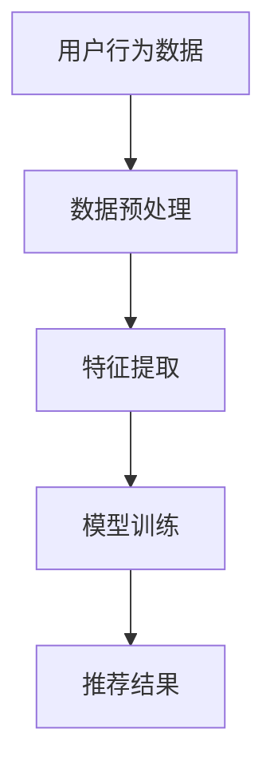
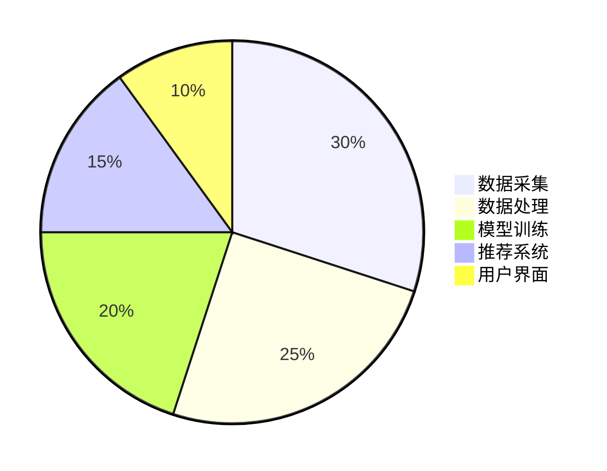

                 


# 《企业估值中的AI驱动的个性化营销平台评估》

> 关键词：企业估值、AI驱动、个性化营销、营销平台、评估框架、协同过滤、聚类分析

> 摘要：本文探讨了AI在企业估值中的应用，特别是个性化营销平台的评估。通过详细分析AI驱动的营销平台的核心优势，构建了一个系统的评估框架，结合协同过滤和聚类分析等算法，提供了具体的实现方法和项目案例。

## 第一部分: 企业估值与AI驱动营销平台的背景与概述

### 第1章: 企业估值的基本概念与挑战

#### 1.1 企业估值的定义与重要性

企业估值是指对企业的价值进行评估的过程，通常用于投资决策、收购、融资等场景。传统的企业估值方法主要依赖财务数据和市场分析，但存在数据局限性和人为主观性的问题。

#### 1.2 AI在企业估值中的应用前景

AI技术的引入为企业估值提供了新的可能性，通过分析更多的数据维度，提高了估值的准确性和效率。特别是在个性化营销平台的评估中，AI可以帮助企业更好地理解用户需求，优化营销策略。

#### 1.3 个性化营销的基本原理

个性化营销是通过分析用户行为和偏好，提供定制化的服务和产品。AI技术在其中起到了关键作用，能够实时分析数据，快速调整营销策略。

### 第2章: AI驱动的营销平台概述

#### 2.1 营销平台的基本概念

营销平台是帮助企业进行营销活动的工具，包括广告投放、用户管理、数据分析等功能。AI驱动的营销平台通过智能化的算法，提高营销活动的效果。

#### 2.2 个性化营销的基本原理

个性化营销的核心在于用户数据的分析和利用，通过AI算法，可以实现精准的用户画像和行为预测，从而制定个性化的营销策略。

#### 2.3 AI在个性化营销中的作用

AI技术在个性化营销中的作用主要体现在数据处理、模式识别和智能推荐等方面。通过AI算法，企业可以更高效地进行用户分群、内容推荐和效果评估。

## 第二部分: 核心概念与理论基础

### 第3章: 企业估值中的AI驱动个性化营销平台评估

#### 3.1 营销平台评估的核心目标

营销平台评估的核心目标是通过分析平台的性能和效果，确定其对企业价值的贡献。评估指标包括用户留存率、转化率、收益增长等。

#### 3.2 AI驱动个性化营销平台的核心优势

AI驱动的营销平台具有数据处理能力强、算法优化速度快、个性化推荐精准等特点。这些优势使得企业在市场竞争中更具竞争力。

#### 3.3 企业估值中的评估框架

评估框架包括数据采集、模型构建、效果评估等步骤。通过系统化的评估，可以全面了解营销平台的优缺点，为企业的决策提供支持。

### 第4章: 核心算法原理与实现

#### 4.1 协同过滤算法

协同过滤是一种基于用户相似性推荐算法。通过分析用户的行为数据，找到相似的用户群体，推荐相似的产品或服务。

#### 4.2 聚类分析算法

聚类分析是将用户分成不同的群体，根据群体特征进行个性化推荐。通过K-means等算法实现用户分群，提高推荐的精准度。

#### 4.3 算法流程图



## 第三部分: 系统架构与设计

### 第5章: 系统架构设计

#### 5.1 系统功能设计

系统功能包括数据采集、用户画像、个性化推荐、效果评估等模块。通过模块化设计，提高系统的可维护性和扩展性。

#### 5.2 系统架构图



### 第6章: 系统接口设计

#### 6.1 数据接口设计

系统需要与多种数据源对接，如用户行为数据、产品数据等。通过API接口实现数据的实时获取和处理。

#### 6.2 用户交互设计

用户界面设计要简洁直观，方便用户查看推荐结果和反馈信息。通过可视化展示，提高用户体验。

## 第四部分: 项目实战与案例分析

### 第7章: 项目实战

#### 7.1 环境安装

安装Python、numpy、pandas、scikit-learn等依赖库。配置开发环境，确保所有库版本兼容。

#### 7.2 核心代码实现

```python
import numpy as np
from sklearn.metrics.pairwise import cosine_similarity

# 示例协同过滤算法实现
def collaborative_filtering(user_matrix):
    similarities = cosine_similarity(user_matrix)
    return similarities
```

#### 7.3 代码解读

协同过滤算法通过计算用户之间的相似度，找到相似用户的商品评分，推荐给目标用户。代码中使用了余弦相似度计算用户相似性。

### 第8章: 案例分析

#### 8.1 案例背景

某电商平台希望通过AI驱动的个性化营销平台，提升用户购买率和留存率。通过协同过滤和聚类分析算法，实现精准推荐。

#### 8.2 实施过程

数据采集、清洗、建模、测试和优化。最终实现了用户分群和个性化推荐，提升了营销效果。

## 第五部分: 最佳实践与总结

### 第9章: 最佳实践

#### 9.1 实践总结

AI驱动的个性化营销平台评估需要结合具体业务需求，选择合适的算法和模型。同时，数据质量和实时性也是影响评估效果的重要因素。

#### 9.2 注意事项

在实际应用中，要注意数据隐私保护，确保用户数据的安全性。同时，要定期更新模型，适应市场变化和用户需求。

### 第10章: 拓展阅读

#### 10.1 相关领域

推荐读者阅读《机器学习实战》、《深度学习入门》等书籍，进一步了解AI技术在企业估值中的应用。

#### 10.2 学习资源

推荐学习平台和在线课程，如Coursera的《机器学习基础》课程，帮助读者深入掌握相关知识。

---

通过以上目录，您可以系统地了解和实施企业估值中的AI驱动的个性化营销平台评估工作。

