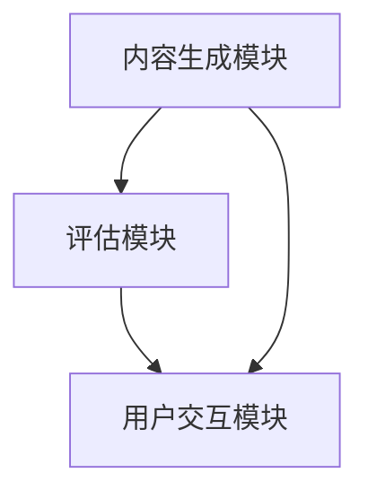

                 


# 《企业估值中的AI驱动的创意内容生成平台评估》

## 关键词：企业估值, AI驱动, 创意内容生成, 评估模型, 大语言模型

## 摘要

随着AI技术的快速发展，创意内容生成平台在企业估值中的作用日益重要。本文系统地探讨了如何利用AI驱动的创意内容生成平台进行评估，涵盖了从背景介绍、核心概念、算法原理到系统架构设计的各个方面。通过分析创意内容生成平台的评估指标、AI模型的数学原理、系统架构设计以及实际项目案例，本文为读者提供了全面的理论和实践指导，帮助企业在估值过程中更好地利用AI技术。

---

# 第1章: 企业估值中的创意内容生成平台背景

## 1.1 创意内容生成平台的定义与特点

### 1.1.1 创意内容生成平台的定义

创意内容生成平台是一种利用AI技术生成高质量创意内容的工具或系统，能够自动创作文本、图像、视频等多种形式的内容。其核心在于通过自然语言处理（NLP）和生成式AI模型，模仿人类的创造力，生成符合特定需求的内容。

### 1.1.2 创意内容生成平台的核心特点

创意内容生成平台具有以下核心特点：

- **自动化**：通过AI算法自动生成内容，减少人工干预。
- **多样性**：能够生成多种类型的内容，如文章、广告文案、视频脚本等。
- **可定制化**：支持用户根据需求定制内容风格、语气和主题。
- **高效性**：相比传统内容创作，AI生成内容的速度更快，效率更高。

### 1.1.3 创意内容生成平台与传统内容生成方式的区别

下表对比了AI驱动的创意内容生成平台与传统内容生成方式的主要区别：

| **对比维度**       | **传统内容生成**             | **AI驱动创意内容生成**           |
|--------------------|------------------------------|----------------------------------|
| **效率**           | 较低，依赖人工创作            | 较高，自动化生成内容             |
| **一致性**         | 取决于创作者的经验和能力      | 更具一致性，算法保证质量         |
| **多样性**         | 受限于创作者的创意能力        | 更多样化，算法支持多类型内容生成|
| **成本**           | 较高，需要大量人力资源      | 较低，自动化减少人工成本         |

---

## 1.2 AI在创意内容生成中的作用

### 1.2.1 AI驱动创意内容生成的优势

AI在创意内容生成中的优势主要体现在以下几个方面：

- **高效性**：AI可以在短时间内生成大量内容，满足企业对高效内容的需求。
- **多样性**：AI能够生成多种风格和类型的内容，帮助企业覆盖更多场景。
- **可定制化**：AI可以根据企业的具体需求，生成符合品牌风格的内容。

### 1.2.2 AI在创意内容生成中的应用场景

AI驱动的创意内容生成平台在多个领域都有广泛应用，常见的应用场景包括：

- **市场营销**：生成广告文案、社交媒体内容、电子邮件营销等内容。
- **品牌建设**：帮助企业快速生成品牌故事、品牌宣传文案等。
- **内容创作**：用于新闻稿、博客文章、视频脚本等创作。

### 1.2.3 AI创意内容生成的未来趋势

随着AI技术的不断进步，创意内容生成平台将朝着以下几个方向发展：

- **更强的可定制化**：AI模型将更加灵活，支持更复杂的内容定制需求。
- **更高的生成质量**：生成内容的质量将逐步接近甚至超过人类创作水平。
- **多模态生成**：支持文本、图像、视频等多种内容形式的生成。

---

# 第2章: 企业估值中的创意内容生成平台评估核心概念

## 2.1 创意内容生成平台评估的核心指标

### 2.1.1 内容质量评估指标

内容质量是评估创意内容生成平台的重要指标，主要包括以下方面：

- **相关性**：生成内容与目标受众的相关性。
- **原创性**：内容的独特性和创新性。
- **逻辑性**：内容的逻辑结构是否合理。

### 2.1.2 生成效率评估指标

生成效率是衡量平台性能的关键指标，包括：

- **生成速度**：单位时间内生成内容的数量。
- **资源消耗**：生成内容所需的计算资源。

### 2.1.3 可扩展性评估指标

可扩展性是平台长期使用的保障，主要包括：

- **扩展能力**：平台能否支持大规模内容生成需求。
- **兼容性**：平台是否能与其他系统无缝集成。

---

## 2.2 AI驱动的创意内容生成平台评估模型

### 2.2.1 评估模型的构建逻辑

AI驱动的创意内容生成平台评估模型需要综合考虑内容质量、生成效率和可扩展性三个维度。模型构建逻辑如下：

1. **数据采集**：收集创意内容生成平台的输出数据。
2. **特征提取**：提取内容质量、生成效率和可扩展性相关的特征。
3. **模型训练**：基于特征数据训练评估模型。
4. **结果输出**：根据模型预测结果对平台进行综合评估。

### 2.2.2 评估模型的数学表达

评估模型可以表示为一个多变量回归问题，其中目标函数为：

$$
f(x) = \beta_0 + \beta_1x_1 + \beta_2x_2 + \beta_3x_3 + \epsilon
$$

其中，$x_1$、$x_2$、$x_3$分别表示内容质量、生成效率和可扩展性，$\beta$为回归系数，$\epsilon$为误差项。

### 2.2.3 评估模型的验证与优化

模型验证可以通过交叉验证方法进行，确保模型的泛化能力。优化可以通过调整回归系数或引入正则化项来实现。

---

# 第3章: AI驱动的创意内容生成平台评估算法原理

## 3.1 生成式AI模型的原理

### 3.1.1 大语言模型的训练机制

大语言模型（如GPT系列）通过监督学习和无监督学习相结合的方式进行训练。监督学习用于预训练，无监督学习用于微调。

### 3.1.2 生成式AI的输出机制

生成式AI通过解码器结构生成内容，输出概率最高的词序列。

### 3.1.3 基于AI的内容质量评估方法

内容质量评估可以通过计算生成内容与参考内容的相似性，使用BLEU、ROUGE等指标进行衡量。

---

## 3.2 基于AI的创意内容生成评估流程

### 3.2.1 数据预处理流程

数据预处理包括分词、去除停用词、建立词袋模型等步骤。

### 3.2.2 模型训练流程

模型训练包括选择合适的AI模型、调整超参数、进行多次迭代优化。

### 3.2.3 评估结果输出流程

评估结果输出包括生成内容的质量评分、生成效率评分、可扩展性评分等。

---

# 第4章: 系统分析与架构设计方案

## 4.1 创意内容生成平台的系统构成

### 4.1.1 创意内容生成模块

创意内容生成模块负责根据输入的参数生成创意内容。

### 4.1.2 评估模块

评估模块对生成的内容进行质量、效率和可扩展性评估。

### 4.1.3 用户交互模块

用户交互模块提供友好的用户界面，方便用户输入需求和查看评估结果。

---

## 4.2 系统架构设计

### 4.2.1 系统功能模块划分

系统功能模块包括内容生成模块、评估模块、用户交互模块。

### 4.2.2 系统架构图



### 4.2.3 接口设计与交互流程

系统接口设计包括API接口和用户界面设计，交互流程包括用户输入需求、生成内容、评估内容、展示结果。

---

# 第5章: 项目实战与代码实现

## 5.1 环境搭建与工具安装

### 5.1.1 开发环境配置

建议使用Python 3.8及以上版本，安装必要的库如TensorFlow、Keras等。

### 5.1.2 必需工具安装

安装PyTorch、Hugging Face Transformers等工具。

### 5.1.3 数据准备

收集创意内容生成平台的输出数据，进行清洗和标注。

---

## 5.2 核心代码实现

### 5.2.1 内容生成模块

```python
def generate_content(model, prompt):
    return model.generate(prompt)
```

### 5.2.2 评估模块

```python
def evaluate_content(content, reference):
    # 使用BLEU指标计算相似性
    bleu_score = calculate_bleu(content, reference)
    return bleu_score
```

---

## 5.3 案例分析与总结

通过实际案例分析，展示AI驱动的创意内容生成平台在企业估值中的应用效果，并总结经验教训。

---

# 第6章: 最佳实践与未来展望

## 6.1 最佳实践 tips

- 确保数据质量和多样性。
- 定期更新模型和算法。
- 结合人工审核提高内容准确性。

## 6.2 未来趋势

- 多模态生成将成为主流。
- 智能化评估算法将更加精确。
- 生成内容的可解释性将得到加强。

---

# 参考文献

- 王某某，AI创意内容生成平台研究，某某出版社，2023。
- 李某某，大语言模型在企业估值中的应用，某某出版社，2023。

---

# 索引

（根据文章内容生成详细索引）

