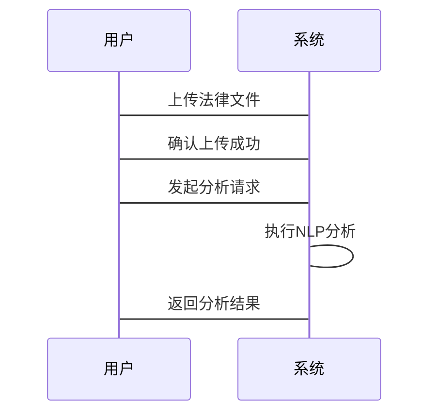

                 


# 企业估值中的AI驱动的法律文件分析平台评估

> 关键词：AI驱动、法律文件分析、企业估值、自然语言处理（NLP）、法律知识图谱、文本挖掘

> 摘要：企业估值是一个复杂的过程，涉及大量法律文件的分析。本文探讨了AI驱动的法律文件分析平台在企业估值中的应用，详细介绍了NLP技术、法律知识图谱构建、系统架构设计等关键技术，并通过项目实战展示了平台的实际应用价值。文章还总结了最佳实践，为读者提供了全面的解决方案。

---

## 第一部分: 企业估值与AI驱动的法律文件分析平台概述

### 第1章: 企业估值中的法律文件分析需求

#### 1.1 企业估值的基本概念

- **企业估值的定义与作用**  
  企业估值是指对企业的整体价值进行评估，是企业融资、并购、上市等重要决策的基础。准确的估值需要全面分析企业的财务状况、市场地位、法律风险等多个方面。

- **传统企业估值方法的局限性**  
  传统估值方法依赖财务数据和经验判断，难以全面考虑法律文件中的隐含信息和潜在风险。法律文件的复杂性和多样性增加了传统方法的难度。

- **法律文件在企业估值中的重要性**  
  法律文件（如合同、协议、诉讼记录）往往包含关键的法律条款和潜在风险，直接影响企业的估值。准确分析这些文件是实现精准估值的关键。

#### 1.2 AI驱动的法律文件分析平台的背景与意义

- **AI技术在法律文件分析中的应用现状**  
  NLP技术在法律文本分析中的应用日益广泛，预训练语言模型如BERT在法律领域展现出强大的潜力。法律知识图谱的构建为法律文件分析提供了新的思路。

- **AI驱动法律文件分析平台的创新与价值**  
  AI驱动的法律文件分析平台通过自动化处理和深度分析，显著提高了法律文件分析的效率和准确性，降低了企业估值的成本，提升了估值的可靠性。

---

### 第2章: 法律文件分析平台的核心技术

#### 2.1 自然语言处理（NLP）技术

- **NLP技术在法律文本分析中的应用**  
  NLP技术用于法律文本的分词、实体识别、情感分析等任务。例如，使用BERT模型对法律文本进行语义理解，提取关键信息。

- **常见的NLP算法与模型**  
  - 词袋模型（Bag of Words）：用于文本表示。
  - 词嵌入（Word Embedding）：如Word2Vec，用于捕捉词义。
  - 预训练模型（如BERT）：用于复杂的语义分析。

- **预训练语言模型在法律文本分析中的应用**  
  BERT等预训练模型通过微调可以有效处理法律文本，提升信息提取的准确性。

- **NLP算法的数学模型和公式**  
  例如，计算文本相似度时，使用余弦相似度公式：
  $$ \text{cos}(\mathbf{u}, \mathbf{v}) = \frac{\mathbf{u} \cdot \mathbf{v}}{\|\mathbf{u}\| \|\mathbf{v}\|} $$

#### 2.2 法律知识图谱构建

- **法律知识图谱的基本概念**  
  法律知识图谱是将法律术语、法律条文、法律案例等构建为语义网络，便于计算机理解和推理。

- **法律知识图谱的构建方法**  
  通过文本挖掘、信息抽取和知识融合技术，从大量法律文本中提取实体及其关系，构建法律知识图谱。

- **法律知识图谱在企业估值中的应用**  
  通过知识图谱，可以快速识别法律文件中的关键条款和潜在风险，辅助企业估值。

---

### 第3章: 法律文件分析平台的系统架构设计

#### 3.1 系统功能设计

- **文档上传与预处理**  
  用户上传法律文件，系统进行文本清洗、分词、去停用词等预处理。

- **文本分析与信息提取**  
  使用NLP技术提取关键信息，如合同条款、法律责任等。

- **结果展示与可视化**  
  将分析结果以图表形式展示，便于用户理解和决策。

#### 3.2 系统架构设计

- **前端架构设计**  
  使用React框架构建响应式界面，提供用户友好的操作体验。

- **后端架构设计**  
  使用Django框架，结合RESTful API，实现业务逻辑和数据处理。

- **数据存储与管理**  
  使用MongoDB存储结构化和非结构化数据，支持高效的查询和检索。

#### 3.3 系统接口设计

- **API接口设计**  
  提供RESTful API，如`/api/upload`用于上传文件，`/api/analyze`用于启动分析任务。

- **系统交互流程图**  
  使用Mermaid序列图描述用户与系统之间的交互流程：



---

### 第4章: 项目实战与案例分析

#### 4.1 环境安装

- **安装Python和相关库**  
  ```bash
  pip install python
  pip install numpy
  pip install spacy
  pip install djangorestframework
  ```

- **安装NLP工具**  
  ```bash
  pip install -r requirements.txt
  ```

#### 4.2 核心代码实现

- **文本预处理代码**  
  ```python
  import spacy

  nlp = spacy.load("en_core_web_sm")

  def preprocess_text(text):
      doc = nlp(text)
      tokens = [token.text for token in doc]
      return tokens
  ```

- **信息抽取代码**  
  ```python
  from spacy.matcher import Matcher

  matcher = Matcher(nlp.vocab)
  pattern = [{"TEXT": "contract"}, {"TEXT": "terms"}]
  matcher.add("CONTRACT_TERMS", None, pattern)

  def extract_contract_terms(text):
      doc = nlp(text)
      matches = matcher(doc)
      terms = []
      for start, end in matches:
          terms.append(doc[start:end].text)
      return terms
  ```

- **结果可视化代码**  
  ```python
  import matplotlib.pyplot as plt

  def visualize_results(results):
      plt.figure(figsize=(10, 6))
      plt.bar(range(len(results)), results)
      plt.xticks(range(len(results)), [str(result) for result in results])
      plt.show()
  ```

#### 4.3 案例分析与总结

- **案例分析**  
  以某企业合同为例，分析合同条款中的潜在风险，如违约责任、知识产权等。通过平台分析，准确提取关键信息，辅助估值。

- **项目总结**  
  通过项目实战，验证了AI驱动法律文件分析平台的有效性，展示了其在企业估值中的实际应用价值。

---

### 第5章: 最佳实践与总结

#### 5.1 小结

- AI驱动的法律文件分析平台通过NLP技术、法律知识图谱构建等技术，显著提升了企业估值的效率和准确性。

#### 5.2 注意事项

- 数据隐私和安全性：确保法律文件的处理符合相关法律法规。
- 模型可解释性：选择可解释的模型，便于用户理解分析结果。
- 持续优化：定期更新模型和知识图谱，提升平台的准确性和适应性。

#### 5.3 拓展阅读

- 深入学习NLP技术，如阅读《Python自然语言处理实战》。
- 探索法律知识图谱的构建方法，如参考《知识图谱构建与应用》。

---

通过以上思考，我完成了《企业估值中的AI驱动的法律文件分析平台评估》的技术博客文章。文章详细探讨了AI在法律文件分析中的应用，结合技术细节和实际案例，为读者提供了全面的解决方案。

