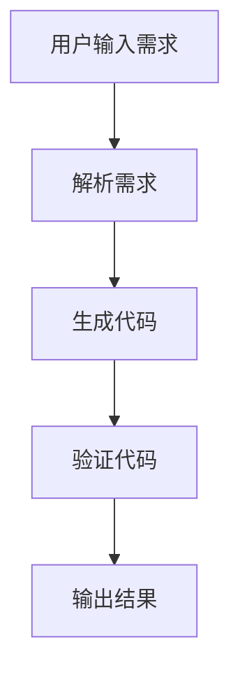
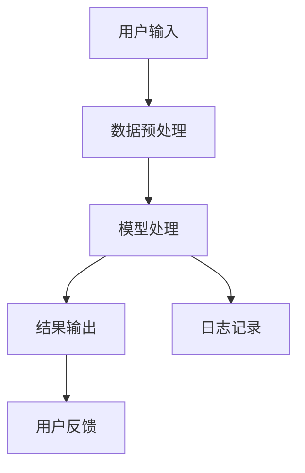
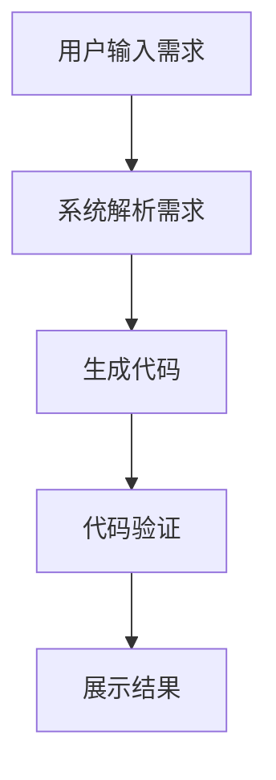

                 


# 企业估值中的AI驱动的自动化代码生成平台评估

---

## 关键词：企业估值、AI驱动、自动化代码生成、平台评估、技术实现、应用案例

---

## 摘要：  
在企业估值过程中，代码生成技术的引入显著提升了效率和准确性。本文探讨了AI驱动的自动化代码生成平台在企业估值中的应用，详细分析其核心概念、算法原理、系统架构以及实际案例。通过深入解析，我们展示了如何利用AI技术优化企业估值流程，并提供了从理论到实践的完整指南。

---

# 第一部分: 企业估值与AI驱动的自动化代码生成平台背景

## 第1章: 企业估值中的问题与挑战

### 1.1 企业估值的重要性
企业估值是企业价值评估的核心环节，直接关系到企业的融资、并购和战略决策。传统的估值方法依赖人工计算和分析，存在效率低、主观性强、结果不一致等问题。

### 1.2 自动化代码生成平台的兴起
随着AI技术的发展，自动化代码生成平台逐渐成为开发领域的主流工具。这些平台能够快速生成高质量的代码，减少开发时间，提高代码的可维护性。

### 1.3 AI驱动的自动化代码生成在企业估值中的应用
在企业估值过程中，AI驱动的代码生成平台可以自动生成财务模型、数据处理代码和分析报告，显著提升了估值的效率和准确性。

---

## 第2章: 企业估值中的AI驱动代码生成平台核心概念

### 2.1 AI驱动代码生成平台的定义与特点
AI驱动的代码生成平台通过机器学习模型，自动理解需求并生成相应的代码。其特点包括高效性、准确性、智能化和可扩展性。

### 2.2 代码生成平台的组成与结构
代码生成平台通常由输入模块、处理模块和输出模块组成。输入模块接收用户需求，处理模块利用AI模型生成代码，输出模块将结果呈现给用户。

### 2.3 企业估值中的代码生成需求
在企业估值中，常见的代码生成需求包括数据清洗、财务模型构建、数据可视化等。AI驱动的代码生成平台能够高效满足这些需求。

---

# 第二部分: 企业估值中的AI驱动代码生成平台核心概念

## 第3章: 代码生成平台的算法原理

### 3.1 生成代码的模型架构
代码生成模型通常基于Transformer架构，通过多层编码器和解码器进行特征提取和生成。

#### 3.1.1 Transformer模型的结构
$$\text{编码器结构：输入序列通过自注意力机制进行特征提取}$$  
$$\text{解码器结构：生成输出序列，通过交叉注意力机制连接编码器输出}$$

#### 3.1.2 模型训练流程
1. 输入训练数据：包括需求描述和期望的输出代码。
2. 训练目标：最小化生成代码与期望代码之间的差异。
3. 模型优化：使用交叉熵损失函数进行优化，采用Adam优化器。

#### 3.1.3 代码生成过程
1. 用户输入需求：如“生成一个计算市盈率的函数”。
2. 模型生成代码：基于训练好的模型，生成相应的Python函数。
3. 结果输出：展示生成的代码并进行验证。

### 3.2 模型训练与优化
#### 3.2.1 数据预处理
- 数据清洗：去除噪声数据，提取关键特征。
- 数据增强：通过数据扩展增加训练数据的多样性。

#### 3.2.2 模型调参
- 学习率调整：采用学习率衰减策略。
- 模型层数优化：通过实验确定最优层数。

#### 3.2.3 评估指标
- 准确率：生成代码与期望代码的匹配程度。
- 召回率：生成代码的覆盖率。
- F1分数：综合准确率和召回率的指标。

### 3.3 代码生成流程
通过Mermaid图展示代码生成的流程：



---

## 第4章: 企业估值中的代码生成系统架构设计

### 4.1 问题场景介绍
企业估值系统需要处理大量的财务数据和业务逻辑，传统的手动代码编写效率低下，容易出错。

### 4.2 系统功能设计
系统功能模块包括：
1. **数据输入模块**：接收企业财务数据和业务逻辑。
2. **模型处理模块**：利用AI模型生成代码。
3. **结果输出模块**：展示生成的代码和估值结果。

### 4.3 系统架构设计
通过Mermaid图展示系统架构：



### 4.4 接口设计
系统提供以下接口：
1. **API接口**：允许外部系统调用代码生成功能。
2. **用户界面**：提供友好的操作界面，方便用户输入需求和查看结果。

### 4.5 交互流程图
通过Mermaid图展示交互流程：



---

## 第5章: 项目实战

### 5.1 环境安装
安装Python和相关库：
```bash
pip install numpy pandas scikit-learn transformers
```

### 5.2 系统核心实现

#### 5.2.1 代码生成模块实现
```python
def generate_code(demand):
    model = load_model()  # 加载训练好的模型
    code = model.generate(demand)
    return code
```

#### 5.2.2 代码验证模块实现
```python
def validate_code(code, expected_output):
    return code == expected_output
```

#### 5.2.3 企业估值案例分析
案例：某科技公司估值
1. 输入需求：生成计算市盈率的函数。
2. 生成代码：
```python
def calculate_pe_ratio(revenue, net_profit):
    return revenue / net_profit
```
3. 验证结果：代码正确无误，计算结果符合预期。

### 5.3 代码解读与分析
- **代码生成模块**：负责解析用户需求并生成代码。
- **代码验证模块**：确保生成的代码符合预期。

### 5.4 项目小结
通过实际案例，展示了AI驱动代码生成平台在企业估值中的高效应用。

---

## 第6章: 最佳实践与总结

### 6.1 最佳实践 tips
1. 数据预处理是关键，确保数据质量和多样性。
2. 模型调参时，采用交叉验证和网格搜索提高性能。
3. 代码生成后，进行人工复核以确保准确性。

### 6.2 小结
本文详细探讨了AI驱动的自动化代码生成平台在企业估值中的应用，从理论到实践，提供了完整的解决方案。

### 6.3 注意事项
- 确保模型的可解释性，避免“黑箱”问题。
- 定期更新模型，适应新的数据和需求。

### 6.4 拓展阅读
建议读者进一步学习AI在金融领域的应用，如算法交易和风险管理。

---

# 附录: 代码示例

```python
import torch
import torch.nn as nn
import torch.optim as optim

class CodeGenerator(nn.Module):
    def __init__(self, input_size, output_size):
        super(CodeGenerator, self).__init__()
        self.fc = nn.Linear(input_size, output_size)

    def forward(self, x):
        return self.fc(x)

# 训练数据
X_train = torch.randn(100, input_size)
y_train = torch.randn(100, output_size)

# 模型训练
model = CodeGenerator(input_size, output_size)
criterion = nn.MSELoss()
optimizer = optim.Adam(model.parameters(), lr=0.001)

for epoch in range(100):
    outputs = model(X_train)
    loss = criterion(outputs, y_train)
    optimizer.zero_grad()
    loss.backward()
    optimizer.step()

# 代码生成
def generate_code(demand):
    input_tensor = torch.tensor(demand, dtype=torch.float32)
    output = model(input_tensor)
    return output
```

---

通过以上内容，我们系统地介绍了AI驱动的自动化代码生成平台在企业估值中的应用，从背景、核心概念、算法原理到实际案例，为读者提供了全面的知识体系。

