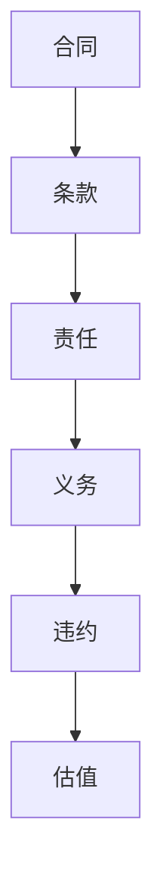
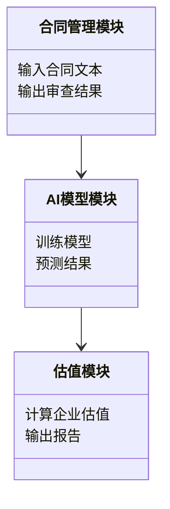

                 


# 《企业估值中的AI驱动的自动化合同审查平台评估》

> 关键词：企业估值、AI驱动、自动化合同审查、合同审查平台、法律科技

> 摘要：本文深入探讨了AI驱动的自动化合同审查平台在企业估值中的应用与评估。通过分析合同审查的关键环节，结合AI技术的优势，提出了一套基于自然语言处理和机器学习的自动化合同审查解决方案。本文从问题背景、核心概念、算法原理、系统架构、项目实现等多个维度展开，详细阐述了AI驱动的合同审查平台如何优化企业估值流程，降低审查成本，提高审查效率和准确性。

---

## 第一部分: 企业估值中的AI驱动的自动化合同审查平台概述

### 第1章: 背景介绍与核心概念

#### 1.1 问题背景与描述

企业估值是一个复杂的过程，其中合同审查是关键环节之一。传统的合同审查依赖人工操作，存在效率低、成本高、易出错等问题。合同审查的准确性直接影响企业的估值结果，而传统方法难以满足现代企业对高效率、高精度的需求。随着AI技术的快速发展，AI驱动的自动化合同审查平台逐渐成为解决这一问题的重要工具。

#### 1.2 核心概念与定义

- **自动化合同审查**：通过AI技术自动识别、分类和分析合同内容，生成审查结果的过程。
- **AI驱动**：利用自然语言处理（NLP）、机器学习等技术，实现合同审查的智能化。
- **企业估值**：对企业的价值进行评估的过程，合同审查是其中的重要环节。

#### 1.3 问题解决与边界

AI驱动的合同审查通过自动化处理合同文本，显著提高了审查效率，减少了人为错误。其边界包括合同文本的输入、审查结果的输出，以及与企业估值相关的数据处理。核心要素包括合同文本、审查规则、AI模型和估值指标。

### 第2章: 核心概念与联系

#### 2.1 AI驱动的合同审查原理

- **自然语言处理**：用于识别合同中的关键词、术语和条款。
- **机器学习**：用于训练模型，实现合同分类和条款识别。
- **知识图谱**：用于构建合同领域的知识体系，辅助模型理解合同内容。

#### 2.2 实体关系图



### 第3章: 算法原理与数学模型

#### 3.1 算法原理

- **合同分类**：使用预训练语言模型（如BERT）对合同进行分类，识别合同类型。
- **条款识别**：通过序列标注模型（如CRF）识别合同中的关键条款。

#### 3.2 数学模型与公式

- **词嵌入模型**：
  $$ \text{词向量} = \text{模型权重} \times \text{输入向量} $$
- **分类模型**：
  $$ P(y|x) = \frac{e^{score(y|x)}}{\sum_{y'} e^{score(y'|x)}} $$

### 第4章: 系统分析与架构设计

#### 4.1 系统分析

- **问题场景**：企业需要快速、准确地审查大量合同，以支持估值工作。
- **项目目标**：构建一个高效的AI驱动合同审查系统，优化企业估值流程。

#### 4.2 系统架构设计



---

## 第二部分: 项目实战与系统实现

### 第5章: 项目实战

#### 5.1 环境安装

- **工具安装**：安装Python、TensorFlow、Keras、NLTK等工具。
- **数据准备**：收集和标注合同文本数据集。

#### 5.2 核心实现

```python
import tensorflow as tf
from tensorflow.keras import layers

# 定义模型
model = tf.keras.Sequential([
    layers.Embedding(10000, 16),
    layers.Dropout(0.5),
    layers.Conv1D(64, 5, padding='same'),
    layers.MaxPooling1D(pool_size=4),
    layers.LSTM(64, return_sequences=False),
    layers.Dense(2, activation='softmax')
])

# 编译模型
model.compile(optimizer='adam', loss='sparse_categorical_crossentropy', metrics=['accuracy'])
```

#### 5.3 案例分析

- **案例背景**：某企业需要审查大量商业合同，评估其资产价值。
- **实施步骤**：数据预处理、模型训练、合同审查、估值计算。

---

## 第三部分: 总结与展望

### 第6章: 总结与展望

#### 6.1 本章小结

本文详细探讨了AI驱动的自动化合同审查平台在企业估值中的应用，通过算法和系统设计，展示了如何优化合同审查流程，提高企业估值的效率和准确性。

#### 6.2 未来展望

未来，随着AI技术的进一步发展，合同审查平台将更加智能化，支持更多复杂的合同类型和场景。同时，跨领域应用也将成为重要趋势。

---

### 附录

- **参考文献**：列出相关技术文献和工具文档。
- **代码仓库**：提供项目代码的GitHub链接。

---

通过本文的分析和实践，读者可以全面了解AI驱动的合同审查平台在企业估值中的重要作用，并掌握相关技术的实现方法。

