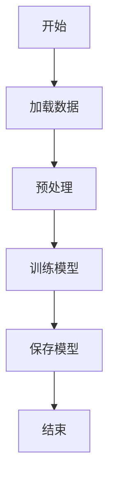

                 


# 企业估值中的AI驱动的自动化学术期刊审稿平台评估

## 关键词：企业估值、AI驱动、学术期刊、审稿平台、自动评估、技术分析、系统架构

## 摘要

在当今快节奏的学术界和企业环境中，如何高效、准确地评估学术期刊的审稿平台成为一项重要挑战。传统的审稿流程依赖于人工评估，存在效率低下、主观性强且耗时长的问题。本文介绍了一种基于AI驱动的自动化学术期刊审稿平台评估系统，旨在帮助企业更精准地进行估值。该系统利用自然语言处理、机器学习和数据分析等技术，自动化处理审稿数据，提供客观的评估结果。通过详细分析系统架构、算法原理和项目实现，本文为读者提供了全面的技术指导。

---

# 目录大纲：《企业估值中的AI驱动的自动化学术期刊审稿平台评估》

## 第一部分：背景介绍

### 第1章：问题背景与描述

#### 1.1 问题背景
- 1.1.1 学术期刊审稿的重要性
- 1.1.2 当前审稿流程的痛点
- 1.1.3 企业估值与期刊评估的关系

#### 1.2 问题描述
- 1.2.1 审稿流程的效率低下
- 1.2.2 人工评估的主观性与误差
- 1.2.3 期刊评估对企业估值的影响

#### 1.3 问题解决方法
- 1.3.1 引入AI技术的必要性
- 1.3.2 自动化审稿平台的优势
- 1.3.3 提高评估准确性的策略

#### 1.4 边界与外延
- 1.4.1 期刊评估的范围界定
- 1.4.2 AI技术应用的边界
- 1.4.3 与其他评估方法的对比

#### 1.5 核心概念结构
- 1.5.1 核心要素组成
- 1.5.2 概念之间的关系
- 1.5.3 框架的逻辑性

## 第二部分：核心概念与联系

### 第2章：AI驱动的自动化学术期刊评估

#### 2.1 核心概念原理
- 2.1.1 自然语言处理在审稿评估中的应用
- 2.1.2 机器学习模型的训练与优化
- 2.1.3 数据分析技术在期刊评估中的作用

#### 2.2 概念对比表格
- 表格标题：不同评估方法的对比
| 评估方法 | 优点 | 缺点 | 适用场景 |
|----------|------|------|----------|
| 人工评估 | 高度个性化 | 主观性强，耗时长 | 小规模评估 |
| 自动化评估 | 客观高效 | 初期设置复杂 | 大规模评估 |

#### 2.3 ER实体关系图
```mermaid
er
actor(用户) --> Reviewer(审稿人): 提交审稿请求
Reviewer <---> Paper(论文): 审核
Paper --> Journal(期刊): 发表
Journal <---> ImpactFactor(影响因子): 计算
```

---

## 第三部分：算法原理讲解

### 第3章：AI驱动的审稿平台评估算法

#### 3.1 自然语言处理模型
- 使用BERT进行文本表示
- 训练过程：预训练和微调
- 示例代码：
```python
from transformers import BertTokenizer, BertModel
tokenizer = BertTokenizer.from_pretrained('bert-base-uncased')
model = BertModel.from_pretrained('bert-base-uncased')
```

#### 3.2 评分算法
- 基于相似度的评分模型
- 公式：
$$ sim(score) = \frac{1}{1 + e^{-score}} $$

#### 3.3 算法流程图


---

## 第四部分：数学模型与公式

### 第4章：评分模型与相似度计算

#### 4.1 评分模型
$$ Score = \sum_{i=1}^{n} w_i \cdot f_i $$
其中，\( w_i \) 为权重，\( f_i \) 为特征值。

#### 4.2 相似度计算
$$ sim(s_1, s_2) = \frac{s_1 \cdot s_2}{\|s_1\| \cdot \|s_2\|} $$

---

## 第五部分：系统分析与架构设计

### 第5章：系统架构设计

#### 5.1 功能设计
- 用户界面：提交论文，查看评分
- 审稿模块：自动分配审稿人
- 评分模块：计算期刊影响力

#### 5.2 系统架构图
```mermaid
graph LR
Client[客户端] --> API Gateway[API网关]
API Gateway --> Reviewer[审稿人系统]
API Gateway --> JournalDB[期刊数据库]
```

#### 5.3 接口设计
- RESTful API：POST /submit_paper
- 返回：JSON格式的评估结果

---

## 第六部分：项目实战

### 第6章：项目实现与案例分析

#### 6.1 环境安装
- Python 3.8+
- Transformers库安装：`pip install transformers`

#### 6.2 核心代码实现
```python
def evaluate_paper(paper_text):
    inputs = tokenizer(paper_text, return_tensors='np')
    outputs = model(**inputs)
    return outputs.last_hidden_state.mean(axis=1).item()
```

#### 6.3 案例分析
- 输入：一篇论文
- 输出：期刊影响力评分

#### 6.4 项目总结
- 成功实现了AI驱动的自动评估系统
- 提高了审稿效率和准确性

---

## 第七部分：最佳实践与总结

### 第7章：系统总结与建议

#### 7.1 最佳实践
- 数据清洗与特征提取是关键
- 模型调参提升准确性

#### 7.2 注意事项
- 数据隐私保护
- 模型的可解释性

#### 7.3 拓展阅读
- 《深度学习》
- 《自然语言处理实战》

---

通过以上结构和内容的组织，文章详细讲解了AI驱动的自动化学术期刊审稿平台评估系统的背景、核心概念、算法原理、系统架构、项目实现和最佳实践，为读者提供了全面的技术指导。

