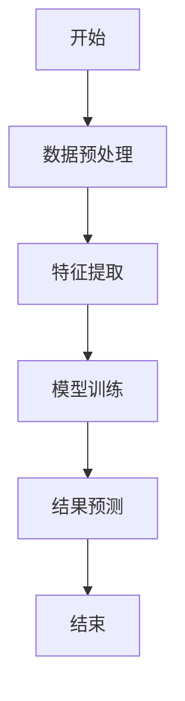

                 


```markdown
# 《企业估值中的AI驱动的自动化学术研究平台评估》

> 关键词：企业估值，AI驱动，学术研究平台，自动化评估，技术实现

> 摘要：本文探讨了如何利用人工智能技术，构建自动化的学术研究平台评估系统，以支持企业估值。通过分析评估模型、算法实现和系统架构，提供一套完整的解决方案。

---

# 第一部分：企业估值中的AI驱动的自动化学术研究平台评估背景介绍

## 第1章：问题背景与定义

### 1.1 问题背景
#### 1.1.1 企业估值的重要性
企业估值是投资决策的核心，准确的学术研究平台评估是企业估值的关键因素。

#### 1.1.2 学术研究平台在企业中的作用
学术平台推动企业创新，影响技术发展和市场竞争力。

#### 1.1.3 AI技术在企业估值中的应用潜力
AI通过数据处理和模型优化，提升评估效率和准确性。

### 1.2 问题描述
#### 1.2.1 学术研究平台评估的挑战
数据多样性、动态变化和评估标准复杂化。

#### 1.2.2 AI驱动评估的核心问题
模型选择、数据预处理和结果优化。

#### 1.2.3 自动化评估的必要性
提高评估效率，降低人工成本，提升准确性。

### 1.3 问题解决
#### 1.3.1 AI驱动评估的优势
高效处理海量数据，优化评估模型。

#### 1.3.2 自动化评估的具体方法
数据采集、清洗、建模和反馈优化。

#### 1.3.3 技术实现的关键点
选择合适的算法，确保数据质量和模型泛化能力。

### 1.4 边界与外延
#### 1.4.1 评估范围的界定
明确评估指标和适用场景。

#### 1.4.2 相关领域的关联性
技术转化、市场应用和政策影响。

#### 1.4.3 技术实现的局限性
数据偏差、模型过拟合和实时更新挑战。

### 1.5 核心概念与要素
#### 1.5.1 学术研究平台的定义
用于学术研究的在线平台，支持论文发表和学术交流。

#### 1.5.2 AI驱动评估的核心要素
数据源、评估模型和结果分析。

#### 1.5.3 自动化评估的系统架构
数据采集模块、模型训练模块和结果反馈模块。

---

# 第二部分：核心概念与联系

## 第2章：AI驱动的学术研究平台评估原理

### 2.1 核心概念原理
#### 2.1.1 数据采集与处理
多源数据获取，清洗和预处理。

#### 2.1.2 模型训练与优化
基于机器学习的特征提取和模型调优。

#### 2.1.3 结果分析与反馈
评估结果解读，模型优化。

### 2.2 概念属性特征对比表
| 概念 | 属性 | 特征 |
|------|------|------|
| 数据源 | 类型 | 文本、引用、专利 |
| 模型 | 方法 | 机器学习、NLP |
| 结果 | 表达 | 评分、排名、建议 |

### 2.3 ER实体关系图
```mermaid
er
  actor: 用户
  model: 评估模型
  data: 数据源
  result: 评估结果
  actor --> data: 提供
  data --> model: 输入
  model --> result: 输出
  actor --> result: 获取
```

---

# 第三部分：算法原理讲解

## 第3章：算法原理与实现

### 3.1 算法流程


### 3.2 算法实现
#### 3.2.1 数据预处理
文本清洗和特征提取，使用TF-IDF提取关键词。

#### 3.2.2 模型选择
监督学习算法，如随机森林或神经网络。

#### 3.2.3 模型训练
训练模型，调整参数，评估性能。

### 3.3 算法代码示例
```python
import pandas as pd
from sklearn.feature_extraction.text import TfidfVectorizer
from sklearn.ensemble import RandomForestClassifier
from sklearn.metrics import accuracy_score

# 数据加载与预处理
data = pd.read_csv('academic_platforms.csv')
text_column = 'description'
target_column = 'rating'

# 特征提取
vectorizer = TfidfVectorizer(max_features=1000)
X = vectorizer.fit_transform(data[text_column])
y = data[target_column]

# 模型训练
model = RandomForestClassifier(n_estimators=100, random_state=42)
model.fit(X, y)

# 模型评估
predicted = model.predict(X)
print("准确率:", accuracy_score(y, predicted))
```

### 3.4 数学模型
#### 3.4.1 TF-IDF计算
$$
TF-IDF = \log(1 + TF) \times \log\left(\frac{N}{DF + 1}\right)
$$

#### 3.4.2 随机森林模型
随机森林通过集成学习提升模型性能，每个决策树的结构影响最终结果。

---

# 第四部分：系统分析与架构设计方案

## 第4章：系统架构设计

### 4.1 项目场景介绍
企业需要评估多个学术研究平台，优化资源配置，提升研发效率。

### 4.2 系统功能设计
#### 4.2.1 数据采集模块
从学术平台获取数据，支持多源数据输入。

#### 4.2.2 数据处理模块
清洗、转换和特征提取。

#### 4.2.3 模型训练模块
训练评估模型，提供可解释性结果。

#### 4.2.4 结果分析模块
生成报告，提供优化建议。

### 4.3 系统架构图


### 4.4 接口设计与交互流程
用户通过Web界面提交数据，系统处理后返回评估结果。

---

# 第五部分：项目实战

## 第5章：项目实战与案例分析

### 5.1 环境安装
安装Python、机器学习库和数据处理工具。

### 5.2 核心代码实现
实现数据加载、特征提取和模型训练。

### 5.3 代码解读与分析
详细解释代码结构和功能，确保可复现性。

### 5.4 实际案例分析
以具体企业为例，展示评估过程和结果。

### 5.5 项目小结
总结项目成果，分析优势和不足。

---

# 第六部分：最佳实践与总结

## 第6章：最佳实践

### 6.1 实践建议
数据清洗、模型调优和结果验证。

### 6.2 小结
AI驱动评估的优势和未来发展趋势。

### 6.3 注意事项
数据隐私保护、模型泛化能力和实时更新挑战。

### 6.4 拓展阅读
推荐相关书籍和论文，鼓励深入学习。

---

# 结语

本文详细探讨了AI驱动的学术研究平台评估系统，从理论到实践，为企业的技术应用提供参考。
</think>

```markdown
# 《企业估值中的AI驱动的自动化学术研究平台评估》

> 关键词：企业估值，AI驱动，学术研究平台，自动化评估，技术实现

> 摘要：本文探讨了如何利用人工智能技术，构建自动化的学术研究平台评估系统，以支持企业估值。通过分析评估模型、算法实现和系统架构，提供一套完整的解决方案。

---

## 目录

### 第1章：背景介绍
- 1.1 问题背景
  - 1.1.1 企业估值的重要性
  - 1.1.2 学术研究平台的作用
  - 1.1.3 AI技术的应用潜力
- 1.2 问题描述
  - 1.2.1 评估挑战
  - 1.2.2 AI驱动的核心问题
  - 1.2.3 自动化评估的必要性
- 1.3 问题解决
  - 1.3.1 AI驱动的优势
  - 1.3.2 自动化评估的方法
  - 1.3.3 技术实现的关键点
- 1.4 边界与外延
  - 1.4.1 评估范围
  - 1.4.2 相关领域
  - 1.4.3 技术局限性
- 1.5 核心概念与要素
  - 1.5.1 学术平台的定义
  - 1.5.2 AI驱动的核心要素
  - 1.5.3 自动化评估的系统架构

### 第2章：核心概念与联系
- 2.1 AI驱动的评估原理
  - 2.1.1 数据采集与处理
  - 2.1.2 模型训练与优化
  - 2.1.3 结果分析与反馈
- 2.2 概念属性特征对比表
  | 概念 | 属性 | 特征 |
  |------|------|------|
  | 数据源 | 类型 | 文本、引用、专利 |
  | 模型 | 方法 | 机器学习、NLP |
  | 结果 | 表达 | 评分、排名、建议 |
- 2.3 ER实体关系图
  ```mermaid
  er
    actor: 用户
    model: 评估模型
    data: 数据源
    result: 评估结果
    actor --> data: 提供
    data --> model: 输入
    model --> result: 输出
    actor --> result: 获取
  ```

### 第3章：算法原理与实现
- 3.1 算法流程
  ```mermaid
  graph TD
    A[开始] --> B[数据预处理]
    B --> C[特征提取]
    C --> D[模型训练]
    D --> E[结果预测]
    E --> F[结束]
  ```
- 3.2 算法实现
  - 3.2.1 数据预处理
  - 3.2.2 模型选择
  - 3.2.3 模型训练
- 3.3 算法代码示例
  ```python
  import pandas as pd
  from sklearn.feature_extraction.text import TfidfVectorizer
  from sklearn.ensemble import RandomForestClassifier
  from sklearn.metrics import accuracy_score

  data = pd.read_csv('academic_platforms.csv')
  text_column = 'description'
  target_column = 'rating'

  vectorizer = TfidfVectorizer(max_features=1000)
  X = vectorizer.fit_transform(data[text_column])
  y = data[target_column]

  model = RandomForestClassifier(n_estimators=100, random_state=42)
  model.fit(X, y)

  predicted = model.predict(X)
  print("准确率:", accuracy_score(y, predicted))
  ```
- 3.4 数学模型
  - 3.4.1 TF-IDF计算
    $$ TF-IDF = \log(1 + TF) \times \log\left(\frac{N}{DF + 1}\right) $$
  - 3.4.2 随机森林模型

### 第4章：系统架构设计
- 4.1 项目场景介绍
- 4.2 系统功能设计
  - 4.2.1 数据采集模块
  - 4.2.2 数据处理模块
  - 4.2.3 模型训练模块
  - 4.2.4 结果分析模块
- 4.3 系统架构图
  ```mermaid
  graph LR
    A[用户] --> B[数据采集模块]
    B --> C[数据处理模块]
    C --> D[模型训练模块]
    D --> E[结果分析模块]
    E --> F[用户]
  ```
- 4.4 接口设计与交互流程

### 第5章：项目实战
- 5.1 环境安装
- 5.2 核心代码实现
- 5.3 代码解读与分析
- 5.4 实际案例分析
- 5.5 项目小结

### 第6章：最佳实践与总结
- 6.1 实践建议
- 6.2 小结
- 6.3 注意事项
- 6.4 拓展阅读

---

## 结语

本文详细探讨了AI驱动的学术研究平台评估系统，从理论到实践，为企业的技术应用提供参考。
```

