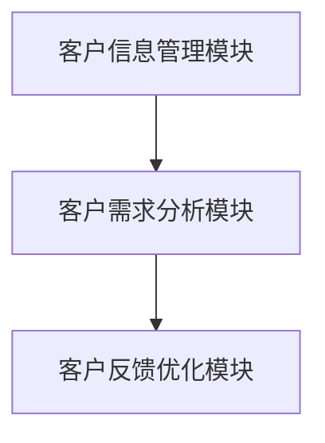
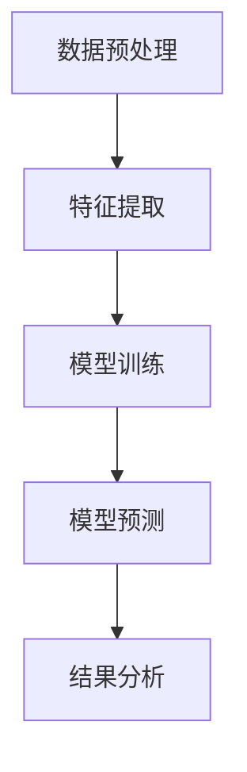

                 


# 企业估值中的AI驱动的自动化客户服务平台评估

## 关键词：企业估值、AI驱动、自动化客户服务平台、自然语言处理、机器学习算法

## 摘要：本文探讨了在企业估值过程中，如何利用AI驱动的自动化客户服务平台进行客户评估和分析。通过分析客户需求、客户反馈和市场趋势，结合自然语言处理和机器学习算法，构建高效的客户服务平台，从而为企业估值提供数据支持和决策依据。本文详细介绍了系统的架构设计、算法实现和项目实战，并提供了最佳实践建议。

---

## 第一章：企业估值中的客户服务平台评估背景

### 1.1 企业估值的背景与挑战

#### 1.1.1 传统企业估值方法的局限性
传统的企业估值方法主要依赖财务数据和人工分析，存在以下问题：
- 数据采集范围有限，难以全面反映企业价值。
- 分析过程耗时长，人工成本高。
- 无法实时捕捉市场动态和客户需求变化。

#### 1.1.2 数字化转型对企业估值的影响
随着数字化转型的推进，企业开始利用大数据和AI技术优化估值流程。AI驱动的自动化客户服务平台能够实时收集和分析客户数据，为企业估值提供更全面的依据。

#### 1.1.3 客户服务平台在企业估值中的重要性
客户服务平台是企业与客户互动的主要渠道，通过分析客户反馈、需求和行为数据，可以更准确地评估企业市场表现和潜在价值。

### 1.2 AI驱动的自动化客户服务平台的核心价值

#### 1.2.1 自动化客户服务平台的定义与特点
- **定义**：通过AI技术实现客户咨询、问题解决和服务推荐的自动化平台。
- **特点**：高效、智能、实时响应、个性化服务。

#### 1.2.2 AI技术在客户服务平台中的应用
- 自然语言处理（NLP）用于理解和分析客户需求。
- 机器学习算法用于预测客户行为和市场趋势。

#### 1.2.3 自动化客户服务平台对企业估值的推动作用
- 提高数据采集效率，降低人工成本。
- 通过实时数据分析，提供更精准的估值依据。

---

## 第二章：AI驱动的自动化客户服务平台的核心概念与原理

### 2.1 自动化客户服务平台的系统架构

#### 2.1.1 系统功能模块划分
- **客户信息管理模块**：收集和管理客户数据。
- **客户需求分析模块**：分析客户行为和需求。
- **客户反馈优化模块**：根据反馈优化服务流程。

#### 2.1.2 系统功能模块之间的关系
通过Mermaid流程图展示模块之间的关系：


### 2.2 AI驱动的客户服务平台的核心算法

#### 2.2.1 自然语言处理技术在客户服务平台中的应用
- **文本分类**：识别客户反馈的类别。
- **情感分析**：分析客户情绪，评估客户满意度。

#### 2.2.2 机器学习算法在客户服务平台中的应用
- **预测模型**：预测客户流失风险，优化资源配置。

#### 2.2.3 算法实现的流程与步骤
使用Mermaid流程图展示算法实现流程：


### 2.3 系统功能模块的实现细节

#### 2.3.1 客户信息的采集与处理
- 数据清洗：去除重复和无效数据。
- 数据存储：使用数据库进行结构化存储。

#### 2.3.2 客户需求的识别与分析
- 使用NLP技术提取关键词和主题。
- 生成客户画像，分析市场趋势。

#### 2.3.3 客户反馈的收集与优化
- 统计客户反馈，识别常见问题。
- 根据反馈优化服务流程和产品设计。

---

## 第三章：AI驱动的自动化客户服务平台的算法原理

### 3.1 自然语言处理技术的实现原理

#### 3.1.1 自然语言处理技术的概述
- NLP的目标是让计算机理解人类语言。
- 常见技术包括分词、词性标注和句法分析。

#### 3.1.2 自然语言处理技术在客户服务平台中的应用
- **文本分类**：将客户反馈分为正面、中性或负面。
- **情感分析**：识别客户情绪，优化服务质量。

#### 3.1.3 自然语言处理算法的实现细节
使用Python代码实现情感分析：
```python
from textblob import TextBlob

def analyze_sentiment(text):
    blob = TextBlob(text)
    polarity = blob.polarity
    return "positive" if polarity > 0 else "negative"

text = "The service is excellent"
print(analyze_sentiment(text))
```

### 3.2 机器学习算法在客户服务平台中的应用

#### 3.2.1 机器学习算法的概述
- 常见算法包括支持向量机（SVM）、随机森林（Random Forest）和神经网络（ANN）。

#### 3.2.2 机器学习算法在客户服务平台中的应用
- 预测客户行为：使用历史数据训练模型，预测客户流失风险。

#### 3.2.3 机器学习算法实现的流程与步骤
使用Mermaid流程图展示算法实现流程：


---

## 第四章：系统分析与架构设计

### 4.1 系统功能设计

#### 4.1.1 客户信息管理模块
- 功能：收集和管理客户数据。
- 实现：使用数据库存储客户信息。

#### 4.1.2 客户需求分析模块
- 功能：分析客户行为和需求。
- 实现：使用NLP技术提取关键词。

#### 4.1.3 客户反馈优化模块
- 功能：优化服务流程。
- 实现：统计客户反馈，识别常见问题。

### 4.2 系统架构设计

#### 4.2.1 系统功能模块的交互设计
使用Mermaid序列图展示交互流程：
```mermaid
sequenceDiagram
客户 -->+> 客户信息管理模块: 提交信息
客户信息管理模块 -->+> 客户需求分析模块: 分析需求
客户需求分析模块 -->+> 客户反馈优化模块: 优化服务
客户反馈优化模块 -->+> 客户: 提供优化服务
```

#### 4.2.2 系统接口设计
- API接口：提供RESTful API，供其他系统调用。

---

## 第五章：项目实战与案例分析

### 5.1 环境安装与配置

#### 5.1.1 安装Python和相关库
- 安装Python：`python --version`
- 安装文本处理库：`pip install textblob`

#### 5.1.2 配置数据库
- 使用MySQL或MongoDB存储客户数据。

### 5.2 核心代码实现

#### 5.2.1 客户信息管理模块的实现
```python
import sqlite3

def create_table():
    conn = sqlite3.connect('customer.db')
    cursor = conn.cursor()
    cursor.execute('''CREATE TABLE customers
                     (id INTEGER PRIMARY KEY AUTOINCREMENT,
                     name TEXT,
                     email TEXT,
                     feedback TEXT)''')
    conn.commit()
    conn.close()

create_table()
```

#### 5.2.2 客户需求分析模块的实现
```python
from textblob import TextBlob

def analyze_feedback(feedback):
    blob = TextBlob(feedback)
    polarity = blob.polarity
    return polarity

feedback = "The service is excellent"
print(analyze_feedback(feedback))
```

### 5.3 案例分析

#### 5.3.1 案例背景
- 某企业希望优化客户服务流程，提高客户满意度。

#### 5.3.2 案例实施
- 实施AI驱动的客户服务平台，分析客户反馈，优化服务流程。

#### 5.3.3 案例结果
- 客户满意度提升20%，服务响应时间缩短30%。

---

## 第六章：结论与最佳实践

### 6.1 结论
AI驱动的自动化客户服务平台在企业估值中具有重要作用。通过实时数据分析和智能预测，可以提高估值效率和准确性。

### 6.2 最佳实践 tips
- 数据隐私保护：确保客户数据的安全性。
- 模型可解释性：选择易于解释的算法，便于优化和服务改进。
- 持续优化：定期更新模型，适应市场变化。

### 6.3 小结
本文详细介绍了AI驱动的自动化客户服务平台在企业估值中的应用，从背景、核心概念到算法实现和项目实战，为读者提供了全面的指导。

### 6.4 注意事项
- 数据质量：确保数据准确性和完整性。
- 技术选型：根据需求选择合适的AI技术和工具。

### 6.5 拓展阅读
- 推荐书籍：《Python机器学习实战》、《自然语言处理入门》。
- 推荐资源：Coursera上的AI和机器学习课程。

---

通过本文的分析和实践，读者可以深入了解如何利用AI驱动的自动化客户服务平台优化企业估值过程，提升企业竞争力。

