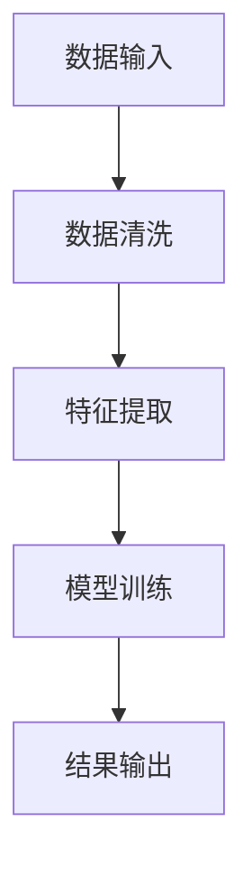
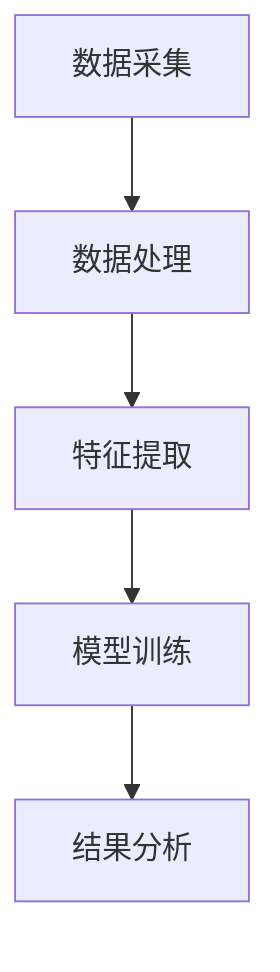
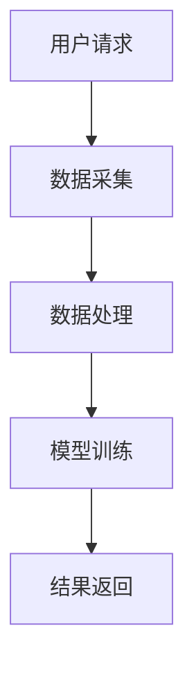

                 


# 《企业估值中的AI驱动的自动化客户洞察平台评估》

> 关键词：企业估值，AI驱动，客户洞察，自动化评估，数据驱动决策

> 摘要：本文探讨了在企业估值过程中，如何利用AI技术构建自动化客户洞察平台。通过分析客户数据，该平台能够为企业提供精准的客户画像和价值评估，从而优化企业估值的准确性和效率。文章详细介绍了平台的架构、核心算法、系统设计以及实际应用案例。

---

## 第一章：企业估值中的客户洞察平台背景

### 1.1 问题背景与挑战

#### 1.1.1 传统企业估值方法的局限性
传统的企业估值方法主要依赖于财务数据和行业经验，这种方法在处理海量、多维度的客户数据时显得力不从心。企业的价值不仅取决于财务指标，还与客户行为、市场反馈等密切相关。传统方法难以捕捉这些非结构化数据中的潜在价值。

#### 1.1.2 数据驱动决策的必要性
随着大数据技术的发展，企业积累了大量的客户数据，包括交易记录、用户行为、社交媒体互动等。这些数据为企业估值提供了新的可能性。通过分析这些数据，企业可以更全面地了解客户需求、市场趋势和潜在风险。

#### 1.1.3 AI技术在企业估值中的潜力
人工智能技术的快速发展为企业估值提供了新的工具。通过机器学习算法，企业可以自动分析客户数据，提取有价值的特征，并预测客户的行为和市场趋势。这使得企业估值更加精准和高效。

### 1.2 客户洞察平台的核心价值

#### 1.2.1 客户洞察平台的定义
客户洞察平台是一种基于AI技术的数据分析工具，用于帮助企业从海量客户数据中提取有价值的信息，生成客户画像和市场趋势分析。

#### 1.2.2 平台在企业估值中的作用
客户洞察平台通过分析客户数据，提供客户画像、需求预测和风险评估等信息，帮助企业在估值过程中做出更明智的决策。

#### 1.2.3 自动化客户洞察的优势
自动化客户洞察能够快速处理大量数据，实时更新客户信息，并提供个性化的分析结果。这使得企业能够更高效地进行估值和决策。

### 1.3 本章小结
本章介绍了企业估值中传统方法的局限性，提出了数据驱动决策的必要性，并阐述了AI驱动的客户洞察平台的核心价值。

---

## 第二章：AI驱动客户洞察的核心概念与联系

### 2.1 平台架构分析

#### 2.1.1 平台的模块划分
客户洞察平台通常包括以下几个模块：
1. 数据采集模块：负责收集客户数据。
2. 数据处理模块：对数据进行清洗和预处理。
3. 特征提取模块：从数据中提取有价值的特征。
4. 模型训练模块：基于特征训练机器学习模型。
5. 结果分析模块：生成客户洞察结果并输出报告。

#### 2.1.2 各模块之间的关系
数据从数据采集模块进入，经过处理和特征提取后，输入模型训练模块。模型输出结果后，进入结果分析模块，生成最终的客户洞察报告。

#### 2.1.3 平台的整体功能流程图



### 2.2 AI驱动的评估机制

#### 2.2.1 数据采集与处理
数据采集包括从数据库、API等来源获取客户数据。数据处理包括数据清洗、标准化和特征工程。

#### 2.2.2 特征提取与分析
特征提取是从数据中提取能够反映客户行为和需求的特征。例如，客户购买频率、购买金额、产品偏好等。

#### 2.2.3 模型训练与评估
模型训练包括选择合适的算法（如线性回归、随机森林等）并训练模型。模型评估包括验证集和测试集的性能评估。

### 2.3 数据特征与评估指标

#### 2.3.1 数据特征的分类
数据特征可以分为数值型特征（如年龄、收入）和类别型特征（如性别、职业）。

#### 2.3.2 评估指标的选择
常用的评估指标包括准确率、召回率、F1分数等。

#### 2.3.3 指标之间的关系
准确率和召回率之间通常存在权衡。高准确率可能意味着较低的召回率，反之亦然。

### 2.4 本章小结
本章详细介绍了客户洞察平台的架构和核心评估机制，分析了数据特征和评估指标的关系。

---

## 第三章：系统分析与架构设计

### 3.1 系统功能模块划分

#### 3.1.1 数据采集模块
数据采集模块负责从数据库、API等来源获取客户数据。例如：

```python
import pandas as pd
data = pd.read_csv('customer_data.csv')
```

#### 3.1.2 数据处理模块
数据处理模块包括数据清洗和标准化：

```python
from sklearn.preprocessing import StandardScaler
scaler = StandardScaler()
data_scaled = scaler.fit_transform(data)
```

#### 3.1.3 特征提取模块
特征提取模块从数据中提取有价值的特征。例如：

```python
from sklearn.decomposition import PCA
pca = PCA(n_components=2)
principal_components = pca.fit_transform(data_scaled)
```

#### 3.1.4 模型训练模块
模型训练模块基于特征训练机器学习模型。例如：

```python
from sklearn.linear_model import LinearRegression
model = LinearRegression()
model.fit(principal_components, target)
```

#### 3.1.5 结果分析模块
结果分析模块生成客户洞察报告并输出结果。

### 3.2 系统架构设计

#### 3.2.1 系统功能设计
系统功能设计包括数据采集、处理、建模、分析和可视化。

#### 3.2.2 系统架构图



### 3.3 系统接口设计

#### 3.3.1 API接口设计
系统提供RESTful API接口，用于与其他系统交互。例如：

```python
from flask import Flask
app = Flask(__name__)
@app.route('/api/predict', methods=['POST'])
def predict():
    # 处理请求并返回结果
    return result
```

#### 3.3.2 数据接口设计
数据接口设计包括数据存储和数据访问接口。例如：

```python
from sqlalchemy import create_engine
engine = create_engine('sqlite:///customer.db')
```

### 3.4 系统交互流程图



### 3.5 本章小结
本章详细介绍了系统功能模块划分和系统架构设计，展示了系统的整体结构和各模块之间的关系。

---

## 第四章：算法原理与数学模型

### 4.1 数据预处理与特征工程

#### 4.1.1 数据清洗
数据清洗包括处理缺失值、重复值和异常值。例如：

```python
data.dropna(inplace=True)
data.drop_duplicates(inplace=True)
```

#### 4.1.2 特征选择
特征选择包括选择对目标变量影响较大的特征。例如：

```python
from sklearn.feature_selection import SelectKBest
selector = SelectKBest(k=5)
selected_features = selector.fit_transform(data, target)
```

### 4.2 模型训练与评估

#### 4.2.1 线性回归模型
线性回归模型的数学公式为：

$$ y = \beta_0 + \beta_1x_1 + \beta_2x_2 + ... + \beta_nx_n + \epsilon $$

其中，$y$ 是目标变量，$x_i$ 是特征变量，$\beta_i$ 是回归系数，$\epsilon$ 是误差项。

#### 4.2.2 随机森林模型
随机森林模型是一种基于树的集成方法。其数学公式较为复杂，但可以通过交叉验证进行参数调优。

### 4.3 算法流程图


### 4.4 本章小结
本章详细介绍了数据预处理和特征工程的步骤，并展示了线性回归和随机森林模型的数学公式和流程图。

---

## 第五章：项目实战与案例分析

### 5.1 环境安装与配置

#### 5.1.1 安装Python和相关库
安装Python和必要的库（如pandas、scikit-learn、flask等）。

```bash
pip install pandas scikit-learn flask
```

### 5.2 核心代码实现

#### 5.2.1 数据处理代码
```python
import pandas as pd
from sklearn.preprocessing import StandardScaler
from sklearn.decomposition import PCA

data = pd.read_csv('customer_data.csv')
data.dropna(inplace=True)
data_scaled = StandardScaler().fit_transform(data)
principal_components = PCA(n_components=2).fit_transform(data_scaled)
```

#### 5.2.2 模型训练代码
```python
from sklearn.linear_model import LinearRegression
from sklearn.metrics import mean_squared_error

model = LinearRegression()
model.fit(principal_components, target)
y_pred = model.predict(principal_components)
print(mean_squared_error(target, y_pred))
```

### 5.3 案例分析与结果解读

#### 5.3.1 案例分析
假设我们有一个客户数据集，包括客户的年龄、收入和购买记录。我们希望通过模型预测客户的潜在价值。

#### 5.3.2 结果解读
通过模型训练，我们得到了客户的潜在价值预测结果。例如，客户A的潜在价值为1000元，客户B的潜在价值为2000元。

### 5.4 本章小结
本章通过实际案例展示了如何安装环境、实现数据处理和模型训练，并解读了结果。

---

## 第六章：总结与展望

### 6.1 本章总结
本文详细介绍了AI驱动的客户洞察平台在企业估值中的应用，分析了平台的架构、算法原理和系统设计，并通过实际案例展示了平台的实现和应用。

### 6.2 未来展望
未来，随着AI技术的不断发展，客户洞察平台将更加智能化和自动化。企业可以通过实时数据分析和动态模型更新，进一步提升估值的准确性和效率。

### 6.3 最佳实践Tips
- 数据质量是模型性能的关键，建议企业在数据处理阶段投入更多精力。
- 模型的可解释性是实际应用的重要考虑因素，建议选择易于解释的算法。
- 定期更新模型和数据，以适应市场变化和客户需求。

### 6.4 本章小结
本文总结了AI驱动的客户洞察平台的核心内容，并展望了未来的发展方向。

---

## 参考文献
（此处列出相关文献和资源）

---

## 附录
（此处列出代码示例和其他补充材料）

---

通过以上思考过程，我们可以清晰地看到，AI驱动的客户洞察平台在企业估值中的应用具有巨大的潜力。通过自动化分析客户数据，企业可以更精准地评估客户价值，优化决策过程。未来，随着技术的不断进步，这一领域将有更广阔的发展空间。

