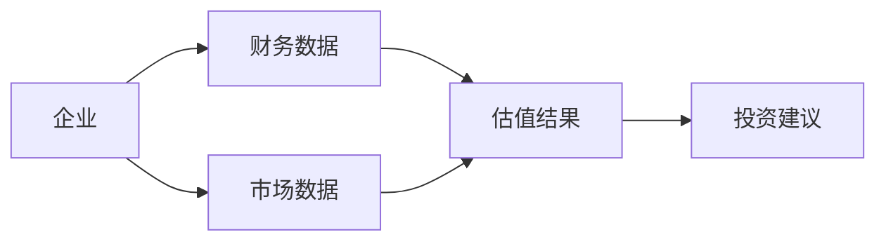
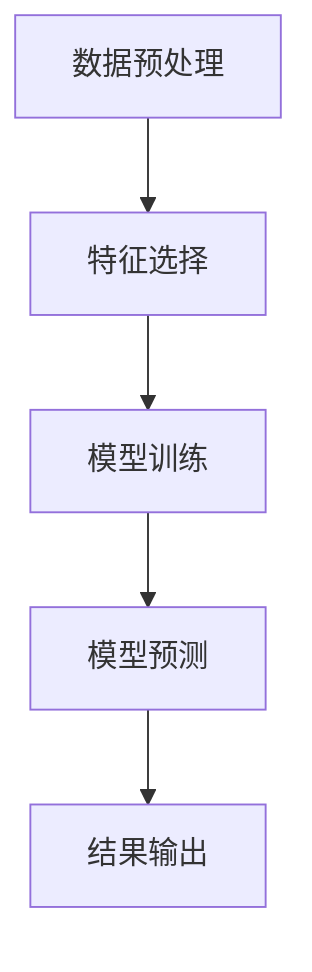
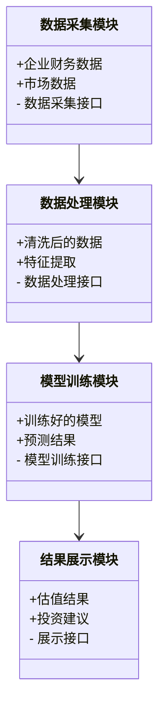
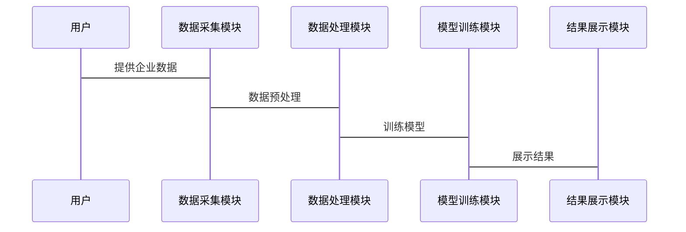

                 


# 企业估值中的AI驱动的自动化投资顾问平台评估

## 关键词：企业估值，AI驱动，自动化投资顾问，机器学习，金融数据分析

## 摘要：随着金融市场的复杂化和投资者需求的多样化，传统的企业估值方法逐渐暴露出效率低下、精度不足等问题。AI驱动的自动化投资顾问平台凭借其高效的数据处理能力、精准的预测模型和个性化的服务，正在成为企业估值领域的革新者。本文将从背景介绍、核心概念、算法原理、系统架构、项目实战等多个维度，深入剖析AI在企业估值中的应用，为企业和投资者提供新的视角和解决方案。

---

## 第一部分：企业估值中的AI驱动的自动化投资顾问平台背景介绍

### 第1章：问题背景与核心概念

#### 1.1 问题背景

##### 1.1.1 传统企业估值方法的局限性
传统的企业估值方法主要包括DCF（现金流折现法）、市盈率法、市净率法等。这些方法依赖于人工分析和经验判断，存在以下问题：
- 数据处理效率低：需要手动收集和整理大量财务数据和市场数据。
- 精度不足：受主观判断影响，难以捕捉数据中的微小波动。
- 适用性有限：难以应对复杂市场环境下的多变情况。

##### 1.1.2 AI技术在金融领域的应用潜力
AI技术的快速发展为金融行业带来了新的可能性。通过机器学习算法，AI可以快速处理海量数据，发现隐藏的模式，并做出实时预测。AI在金融领域的应用包括：
- 自动化交易：利用算法进行高频交易。
- 风险评估：通过AI模型预测信用风险。
- 个性化投资建议：根据用户需求提供定制化服务。

##### 1.1.3 自动化投资顾问平台的需求与痛点
随着投资者对实时、精准、个性化服务的需求增加，传统的人工投资顾问模式逐渐暴露出效率低、成本高的问题。自动化投资顾问平台应运而生，但其在实际应用中仍面临以下挑战：
- 数据质量：市场数据的实时性和准确性直接影响估值结果。
- 模型精度：AI模型的预测能力依赖于数据质量和算法选择。
- 用户信任：投资者对AI的依赖程度较高，信任问题亟待解决。

#### 1.2 核心概念与问题描述

##### 1.2.1 企业估值的核心要素
企业估值的核心要素包括：
- 财务数据：如收入、利润、现金流等。
- 市场数据：如行业趋势、宏观经济指标等。
- 公司治理：如管理层能力、企业战略等。

##### 1.2.2 自动化投资顾问平台的功能与目标
自动化投资顾问平台的功能包括：
- 数据收集与处理：实时获取企业财务数据和市场数据。
- 模型构建与估值：利用AI算法对企业进行估值。
- 投资建议：根据估值结果提供投资建议。
- 个性化服务：根据不同投资者的需求提供定制化服务。

##### 1.2.3 AI驱动的估值模型的优势与挑战
AI驱动的估值模型的优势包括：
- 高效性：能够快速处理海量数据。
- 精准性：通过机器学习算法提高估值精度。
- 实时性：能够实时更新估值结果。

AI驱动的估值模型的挑战包括：
- 数据质量问题：数据的准确性和完整性直接影响模型的性能。
- 模型解释性：复杂的AI模型往往难以解释其预测结果。
- 模型泛化能力：需要在不同市场环境下保持稳定性能。

#### 1.3 问题解决与边界

##### 1.3.1 AI在企业估值中的具体应用场景
AI在企业估值中的具体应用场景包括：
- 预测企业未来现金流。
- 识别财务数据中的异常值。
- 分析行业趋势对估值的影响。

##### 1.3.2 自动化投资顾问平台的边界与外延
自动化投资顾问平台的边界包括：
- 数据范围：仅处理与企业估值相关的数据。
- 服务范围：仅提供估值和投资建议，不涉及实际交易。
- 使用场景：仅适用于企业估值和投资决策。

自动化投资顾问平台的外延包括：
- 数据来源的扩展：引入更多数据源，如社交媒体数据、新闻数据等。
- 服务对象的扩展：从个人投资者扩展到机构投资者。
- 服务内容的扩展：从估值扩展到风险管理、投资组合优化等。

##### 1.3.3 核心概念的结构与组成要素
核心概念的结构包括：
- 数据层：包括财务数据、市场数据等。
- 模型层：包括AI算法、预测模型等。
- 服务层：包括估值结果、投资建议等。

核心概念的组成要素包括：
- 数据来源：财务数据、市场数据、行业数据等。
- 数据处理：数据清洗、特征提取等。
- 模型选择：回归模型、神经网络等。
- 估值结果：企业价值、投资建议等。

---

## 第二部分：AI驱动的自动化投资顾问平台的核心概念与联系

### 第2章：核心概念与联系

#### 2.1 核心概念原理

##### 2.1.1 AI在企业估值中的原理
AI在企业估值中的原理包括：
- 数据输入：输入企业的财务数据和市场数据。
- 特征提取：提取影响企业估值的关键特征。
- 模型训练：利用机器学习算法训练估值模型。
- 预测输出：根据模型预测企业价值。

##### 2.1.2 自动化投资顾问平台的系统架构
自动化投资顾问平台的系统架构包括：
- 数据层：负责数据的收集和存储。
- 计算层：负责数据的处理和模型的训练。
- 服务层：负责提供估值结果和投资建议。

##### 2.1.3 多元数据融合与分析机制
多元数据融合与分析机制包括：
- 数据融合：将多种数据源的数据进行融合。
- 数据分析：利用AI算法对数据进行分析。
- 结果输出：输出分析结果。

#### 2.2 核心概念属性对比

##### 2.2.1 传统估值方法与AI驱动方法的对比
| 对比维度 | 传统估值方法 | AI驱动方法 |
|----------|---------------|-------------|
| 数据处理 | 手动处理 | 自动化处理 |
| 精度 | 较低 | 较高 |
| 效率 | 低效 | 高效 |

##### 2.2.2 数据来源与处理方式的对比
| 对比维度 | 传统方法 | AI方法 |
|----------|-----------|--------|
| 数据来源 | 单一 | 多元 |
| 数据处理 | 简单 | 复杂 |

##### 2.2.3 模型精度与计算效率的对比
| 对比维度 | 传统方法 | AI方法 |
|----------|-----------|--------|
| 模型精度 | 较低 | 较高 |
| 计算效率 | 低 | 高 |

#### 2.3 实体关系图



---

## 第三部分：AI驱动的自动化投资顾问平台的算法原理

### 第3章：算法原理讲解

#### 3.1 算法原理概述

##### 3.1.1 算法选择与原理
选择线性回归模型作为AI驱动的估值模型。线性回归模型的原理是通过最小化预测值与实际值之间的平方差之和，找到最佳拟合直线。

##### 3.1.2 算法流程


##### 3.1.3 算法代码实现
```python
import numpy as np
import pandas as pd

# 数据预处理
data = pd.read_csv('企业数据.csv')
X = data[['收入', '利润', '现金流']]
y = data['企业价值']

# 特征选择
from sklearn.feature_selection import SelectKBest
selector = SelectKBest(k=2)
X_selected = selector.fit_transform(X, y)

# 模型训练
from sklearn.linear_model import LinearRegression
model = LinearRegression()
model.fit(X_selected, y)

# 模型预测
predicted_value = model.predict(X_selected)
```

##### 3.1.4 算法优缺点
线性回归模型的优点：
- 简单易懂，计算效率高。
- 适用于线性关系的数据。

线性回归模型的缺点：
- 无法处理非线性关系的数据。
- 对异常值敏感。

#### 3.2 数学模型

##### 3.2.1 线性回归模型公式
$$ y = \beta_0 + \beta_1x_1 + \beta_2x_2 + \ldots + \beta_nx_n + \epsilon $$

##### 3.2.2 损失函数
$$ L = \frac{1}{2m}\sum_{i=1}^{m}(y_i - \hat{y_i})^2 $$

##### 3.2.3 最优化算法
$$ \theta = \theta - \alpha \frac{\partial L}{\partial \theta} $$

---

## 第四部分：AI驱动的自动化投资顾问平台的系统分析与架构设计

### 第4章：系统分析与架构设计

#### 4.1 项目背景与问题场景

##### 4.1.1 项目背景
随着金融市场的发展，投资者对实时、精准、个性化的投资建议需求不断增加。传统的企业估值方法已经无法满足这些需求，因此需要开发一个基于AI的自动化投资顾问平台。

##### 4.1.2 问题场景
- 数据来源多样，数据量大。
- 需要实时更新估值结果。
- 需要提供个性化投资建议。

#### 4.2 系统功能设计

##### 4.2.1 功能模块划分
- 数据采集模块：负责收集企业财务数据和市场数据。
- 数据处理模块：负责数据的清洗和特征提取。
- 模型训练模块：负责训练AI模型。
- 结果展示模块：负责展示估值结果和投资建议。

##### 4.2.2 领域模型


#### 4.3 系统架构设计

##### 4.3.1 系统架构图


##### 4.3.2 系统接口设计
- 数据采集接口：提供企业财务数据和市场数据的接口。
- 数据处理接口：提供数据清洗和特征提取的接口。
- 模型训练接口：提供模型训练和预测的接口。
- 展示接口：提供估值结果和投资建议的展示接口。

#### 4.4 系统交互设计

##### 4.4.1 交互流程


---

## 第五部分：AI驱动的自动化投资顾问平台的项目实战

### 第5章：项目实战

#### 5.1 环境安装与配置

##### 5.1.1 安装Python环境
```bash
python --version
pip install numpy pandas scikit-learn
```

##### 5.1.2 安装Jupyter Notebook
```bash
pip install jupyter
jupyter notebook
```

#### 5.2 系统核心实现

##### 5.2.1 数据采集模块实现
```python
import requests
import pandas as pd

def get_market_data(ticker):
    url = f'https://api.example.com/{ticker}'
    response = requests.get(url)
    data = response.json()
    return pd.DataFrame(data)
```

##### 5.2.2 数据处理模块实现
```python
from sklearn.feature_selection import SelectKBest

def preprocess_data(data):
    selector = SelectKBest(k=2)
    X_selected = selector.fit_transform(data[['收入', '利润', '现金流']], data['企业价值'])
    return X_selected
```

##### 5.2.3 模型训练模块实现
```python
from sklearn.linear_model import LinearRegression

def train_model(X, y):
    model = LinearRegression()
    model.fit(X, y)
    return model
```

##### 5.2.4 结果展示模块实现
```python
def display_results(predicted_value, actual_value):
    print(f'预测值：{predicted_value}')
    print(f'实际值：{actual_value}')
```

#### 5.3 代码应用解读与分析

##### 5.3.1 数据采集模块解读
- 使用`requests`库从API获取市场数据。
- 将数据转换为DataFrame格式。

##### 5.3.2 数据处理模块解读
- 使用`SelectKBest`选择最重要的两个特征。
- 返回清洗后的数据。

##### 5.3.3 模型训练模块解读
- 使用`LinearRegression`训练模型。
- 返回训练好的模型。

##### 5.3.4 结果展示模块解读
- 打印预测值和实际值。

#### 5.4 实际案例分析

##### 5.4.1 数据准备
假设我们有一个包含以下列的企业数据：
- 收入
- 利润
- 现金流
- 企业价值

##### 5.4.2 数据预处理
```python
data = pd.read_csv('企业数据.csv')
X = data[['收入', '利润', '现金流']]
y = data['企业价值']
X_selected = preprocess_data(data)
```

##### 5.4.3 模型训练
```python
model = train_model(X_selected, y)
```

##### 5.4.4 模型预测
```python
predicted_value = model.predict(X_selected)
```

##### 5.4.5 结果展示
```python
display_results(predicted_value, y)
```

#### 5.5 项目小结

##### 5.5.1 项目总结
通过本项目，我们实现了一个基于AI的自动化投资顾问平台，能够对企业进行估值并提供投资建议。

##### 5.5.2 注意事项
- 数据质量直接影响模型的性能。
- 模型需要定期更新以适应市场变化。
- 需要确保系统的安全性和稳定性。

##### 5.5.3 拓展阅读
- 《机器学习实战》
- 《Python机器学习》
- 《金融数据分析入门》

---

## 第六部分：总结与展望

### 第6章：总结与展望

#### 6.1 总结
本文从背景介绍、核心概念、算法原理、系统架构、项目实战等多个维度，深入剖析了AI驱动的自动化投资顾问平台在企业估值中的应用。通过具体的案例分析和代码实现，展示了如何利用AI技术提高企业估值的效率和精度。

#### 6.2 展望
未来，随着AI技术的不断发展，自动化投资顾问平台将在金融领域发挥更大的作用。以下是未来的发展方向：
- 数据来源的扩展：引入更多数据源，如社交媒体数据、新闻数据等。
- 模型优化：开发更复杂的AI模型，如深度学习模型。
- 个性化服务：提供更加个性化的投资建议。

#### 6.3 最佳实践Tips
- 数据预处理是关键，确保数据的准确性和完整性。
- 模型选择要根据具体场景，选择合适的算法。
- 系统架构要合理，确保系统的可扩展性和可维护性。

---

以上就是《企业估值中的AI驱动的自动化投资顾问平台评估》的完整目录大纲，希望对您有所帮助！

