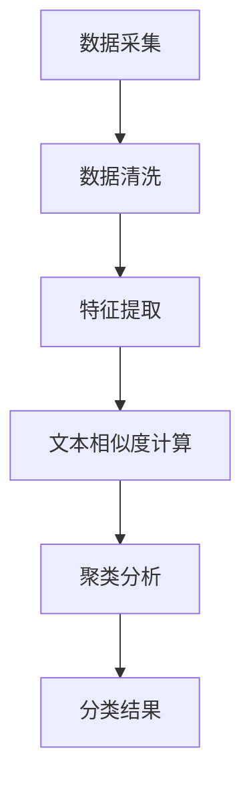

                 


# 企业估值中的AI驱动的自动化新闻聚合平台评估

## 关键词：企业估值，人工智能，新闻聚合，自动化，数据挖掘

## 摘要：  
本文探讨了在企业估值过程中，如何利用AI驱动的自动化新闻聚合平台来提高数据收集和分析的效率。通过自然语言处理和机器学习算法，平台能够自动聚合、分类和分析新闻数据，为估值提供更全面、实时的信息支持。文章详细介绍了算法原理、系统架构和实际案例，展示了AI在企业估值中的巨大潜力。

---

# 第一部分：企业估值与AI驱动的新闻聚合平台概述

## 第1章：企业估值中的新闻聚合需求

### 1.1 企业估值的基本概念  
企业估值是通过对企业的财务数据、市场表现和外部环境等多方面因素的综合分析，来确定其市场价值的过程。传统的估值方法依赖于财务报表和行业数据，但忽略了实时的新闻信息，这可能导致估值结果的片面性。

### 1.2 AI驱动的新闻聚合平台的优势  
新闻数据具有多样性和实时性，能够反映企业的市场动态和行业趋势。AI驱动的自动化新闻聚合平台可以实时采集、分类和分析新闻数据，为估值提供更全面的信息支持。

### 1.3 本章小结  
本章介绍了企业估值的基本概念，并强调了新闻数据在估值中的重要性，以及AI驱动的新闻聚合平台在提升估值效率和准确性中的作用。

---

## 第2章：AI驱动的新闻聚合平台核心概念

### 2.1 新闻聚合平台的基本原理  
新闻聚合平台通过数据采集、自然语言处理和数据分析等技术，将分散在不同来源的新闻数据进行整合和处理。核心步骤包括数据清洗、特征提取和分类聚类。

### 2.2 数据特征与分析  
新闻数据具有文本型、实时性和多样性等特征。通过对文本进行分词、实体识别和情感分析，可以提取有价值的信息，如企业财务状况、市场情绪等。

### 2.3 本章小结  
本章详细介绍了新闻聚合平台的基本原理，并分析了新闻数据的特征及其对估值的影响。

---

## 第3章：AI驱动的新闻聚合算法原理

### 3.1 自然语言处理模型  
使用BERT模型进行文本表示和相似度计算，可以实现新闻的自动分类和主题识别。例如，通过余弦相似度计算新闻之间的相似性，从而进行聚类分析。

### 3.2 聚类算法  
K-means算法常用于新闻聚类，通过计算文本的相似度矩阵，将相似的新闻归为一类。层次聚类则可以根据类别间的相似性构建树状结构，进一步优化聚类效果。

### 3.3 算法流程图  


### 3.4 本章小结  
本章详细讲解了自然语言处理模型和聚类算法在新闻聚合中的应用，并通过流程图展示了算法的整体流程。

---

## 第4章：企业估值中的新闻数据特征工程

### 4.1 数据预处理方法  
文本清洗、分词和实体识别是数据预处理的关键步骤。例如，使用spaCy库进行分词和命名实体识别，可以提取新闻中的公司名称和相关事件。

### 4.2 特征提取与表示  
TF-IDF和词嵌入模型（如Word2Vec）是常用的特征提取方法。通过将文本转换为向量表示，可以进行文本相似度计算和聚类分析。

### 4.3 数据增强与降维  
数据增强技术可以增加数据多样性，如文本同义替换。主成分分析（PCA）和线性判别分析（LDA）是常用的降维方法，可以减少特征维度并提高模型效率。

### 4.4 本章小结  
本章详细介绍了数据预处理、特征提取和降维方法，并展示了如何通过这些技术提高新闻数据的可用性。

---

## 第5章：系统架构与接口设计

### 5.1 系统功能模块划分  
系统主要包括数据采集模块、数据处理模块和分析模块。数据采集模块负责实时采集新闻数据，数据处理模块进行清洗和特征提取，分析模块基于聚类算法进行新闻分类。

### 5.2 系统架构设计  


### 5.3 系统接口设计  
系统提供RESTful API接口，用于接收用户请求并返回分析结果。例如，用户可以通过POST请求提交查询参数，系统返回相关新闻分类和主题分析结果。

### 5.4 本章小结  
本章详细讲解了系统的功能模块划分、架构设计和接口设计，展示了如何通过模块化设计实现高效的新闻聚合和分析。

---

## 第6章：项目实战

### 6.1 环境安装  
需要安装Python、TensorFlow、spaCy等库。以下是安装命令：
```bash
pip install python python-tensorflow spacy
```

### 6.2 核心实现代码  
以下是基于BERT的新闻分类代码示例：
```python
from transformers import BertTokenizer, BertModel
import torch

tokenizer = BertTokenizer.from_pretrained('bert-base-uncased')
model = BertModel.from_pretrained('bert-base-uncased')

def compute_embeddings(text):
    inputs = tokenizer(text, return_tensors='pt')
    with torch.no_grad():
        embeddings = model(**inputs)[0]
    return embeddings
```

### 6.3 案例分析  
以某企业为例，通过聚合新闻数据，分析其市场情绪和财务状况。使用K-means聚类算法将新闻分为几类，提取每类的关键词和主题，进而评估企业的市场表现。

### 6.4 本章小结  
本章通过实际案例展示了如何使用AI驱动的新闻聚合平台进行企业估值，并提供了详细的代码实现和分析过程。

---

## 第7章：最佳实践与未来展望

### 7.1 小结  
本文详细介绍了AI驱动的新闻聚合平台在企业估值中的应用，涵盖了算法原理、系统设计和项目实战等内容。

### 7.2 注意事项  
在实际应用中，需要注意数据质量和模型的可解释性，避免因数据偏差导致的估值错误。

### 7.3 未来展望  
未来可以研究更高效的算法和模型，如图神经网络和强化学习，进一步提升新闻聚合和估值的准确性。

### 7.4 拓展阅读  
推荐阅读相关领域的书籍和论文，如《Deep Learning》和《Natural Language Processing with PyTorch》。

---

## 附录：完整的代码实现  
以下是完整的新闻聚合平台代码实现，包括数据采集、处理和分析模块。

