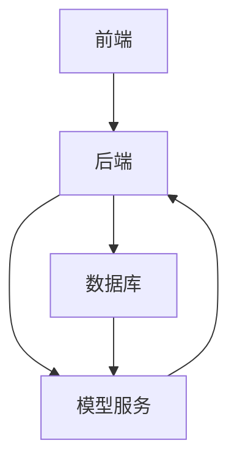

                 


# 企业估值中的AI驱动的自动化法律咨询平台评估

> 关键词：企业估值，AI驱动，自动化法律咨询平台，评估，技术实现，案例分析，最佳实践

> 摘要：本文探讨了AI技术在法律咨询平台中的应用，特别是其对企业估值的影响。文章详细分析了AI驱动法律咨询平台的核心概念、算法原理、系统架构，并通过实际案例展示了其在企业估值中的应用。通过对比传统方法的局限性，本文揭示了AI技术在提升法律咨询效率和准确性方面的优势，并提出了最佳实践建议。

---

# 正文

## 第一部分: 背景介绍

### 第1章: 企业估值的基本概念

#### 1.1 企业估值的定义与重要性
企业估值是通过对企业的财务状况、市场地位、法律风险等多个因素进行评估，确定其市场价值的过程。传统的企业估值方法依赖于人工分析，耗时且容易出错。

#### 1.2 传统企业估值方法的局限性
传统方法依赖经验丰富的分析师，但存在效率低、成本高、主观性强等问题，尤其是在处理大量法律文本时，容易遗漏关键信息。

#### 1.3 AI技术在企业估值中的潜力
AI技术，特别是自然语言处理（NLP）和机器学习，可以快速分析大量法律文本，提取关键信息，显著提高估值效率和准确性。

---

### 第2章: AI驱动的法律咨询平台背景

#### 2.1 法律咨询平台的现状与挑战
传统法律咨询平台依赖人工服务，响应速度慢，成本高，且难以覆盖所有企业需求。

#### 2.2 AI驱动法律咨询平台的优势
AI驱动的平台可以24/7提供服务，成本低，且能够快速处理大量法律文本，帮助企业更好地进行自我评估。

---

## 第二部分: 核心概念与联系

### 第3章: AI在法律咨询中的应用原理

#### 3.1 自然语言处理（NLP）在法律文本分析中的作用
NLP技术可以自动提取法律文本中的关键信息，如合同条款、法律责任等，帮助企业在估值中快速识别潜在风险。

#### 3.2 法律知识图谱的构建与应用
通过构建法律知识图谱，AI系统可以将分散的法律信息结构化，便于快速查询和分析。

#### 3.3 法律咨询的自动化流程
AI驱动的法律咨询平台可以自动分析企业的法律文档，生成风险评估报告，为估值提供数据支持。

---

### 第4章: 法律咨询与企业估值的关系

#### 4.1 法律风险对企业估值的影响
法律风险（如诉讼、合同纠纷）直接影响企业的市场价值，AI驱动的平台可以帮助企业及时发现并 mitigation 这类风险。

#### 4.2 AI驱动法律咨询如何优化企业估值
通过自动化分析法律文档，AI平台可以更快地识别潜在法律问题，帮助企业制定更合理的估值策略。

---

## 第三部分: 算法原理讲解

### 第5章: 基于NLP的企业法律文本分析

#### 5.1 NLP在法律文本分析中的基本流程
1. 文本预处理：分词、去停用词。
2. 特征提取：使用TF-IDF提取关键词。
3. 文本分类：判断合同类型或风险等级。

#### 5.2 实例分析：合同条款识别
- 使用预训练的BERT模型进行合同分类。
- 提取关键条款，如违约责任、知识产权归属。

#### 5.3 代码实现
```python
from transformers import BertTokenizer, BertModel
import torch

tokenizer = BertTokenizer.from_pretrained('bert-base-uncased')
model = BertModel.from_pretrained('bert-base-uncased')

def analyze_contract(text):
    inputs = tokenizer(text, return_tensors='np')
    outputs = model(**inputs)
    # 处理输出，提取关键信息
    return result
```

---

## 第四部分: 系统分析与架构设计方案

### 第6章: 系统架构设计

#### 6.1 问题场景介绍
企业需要快速评估其法律风险，以支持估值决策。传统方法效率低，AI驱动平台可以解决这一问题。

#### 6.2 系统功能设计
- 数据采集模块：接收法律文档。
- 模型调用模块：调用NLP模型进行分析。
- 结果分析模块：生成风险报告。

#### 6.3 系统架构设计（Mermaid图）


---

## 第五部分: 项目实战

### 第7章: 实际案例分析

#### 7.1 环境安装
- Python 3.8+
- 安装NLP库（如spaCy、BERT）

#### 7.2 核心代码实现
```python
import spacy

nlp = spacy.load("en_core_web_sm")

def extract_legal_terms(text):
    doc = nlp(text)
    terms = []
    for token in doc:
        if token.pos_ in ['NOUN', 'VERB']:
            terms.append(token.text)
    return terms
```

#### 7.3 案例分析
某科技公司使用AI平台分析其知识产权合同，识别出潜在的专利纠纷风险，及时调整估值策略。

---

## 第六部分: 最佳实践与总结

### 第8章: 最佳实践

#### 8.1 实践建议
- 数据质量：确保输入数据的准确性和完整性。
- 模型优化：定期更新模型，适应新的法律条款。

#### 8.2 小结
AI驱动的法律咨询平台通过自动化分析，显著提升了企业估值的效率和准确性，帮助企业更好地应对法律风险。

#### 8.3 注意事项
- 数据隐私：确保处理的数据符合相关隐私法规。
- 模型解释性：确保AI决策过程可解释，便于审计和调整。

---

### 结语
AI驱动的法律咨询平台正在改变企业估值的方式，通过自动化分析和实时反馈，帮助企业更高效地管理法律风险。未来，随着技术的进步，这类平台将更加智能化，为企业提供更精准的估值支持。

