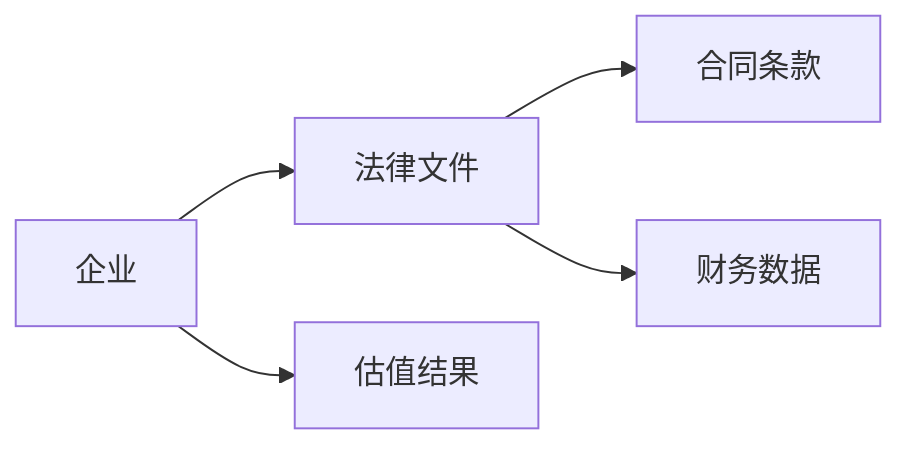
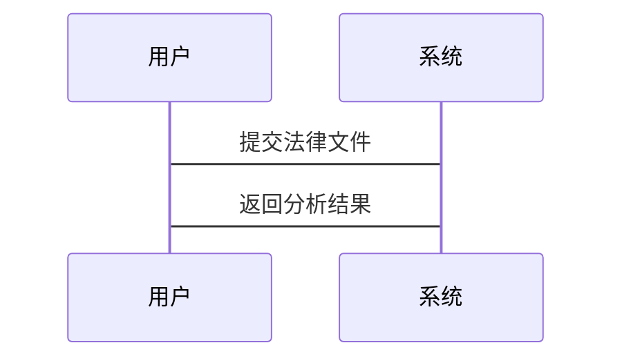

                 


# 企业估值中的AI驱动法律文件分析平台评估

## 关键词：AI，法律文件分析，企业估值，自然语言处理，机器学习，知识图谱

## 摘要：  
随着企业估值需求的不断增加，传统的法律文件分析方法逐渐暴露出效率低下、成本高昂的问题。AI技术的快速发展为解决这一问题提供了新的可能性。本文详细探讨了基于AI的自动化法律文件分析平台在企业估值中的应用，从背景分析、核心概念、算法原理到系统设计和项目实战，全面解析了如何利用AI技术提升企业估值的效率和准确性。

---

## 第一部分: 企业估值中的AI驱动法律文件分析平台背景介绍

### 第1章: 问题背景与需求分析

#### 1.1 问题背景
- **传统企业估值方法的局限性**：传统的企业估值方法依赖于人工分析大量的法律文件，如合同、财务报表、合规文件等。这种方法不仅耗时，而且容易出现人为错误，尤其是在处理复杂法律条款时。
- **法律文件分析在企业估值中的重要性**：法律文件是企业估值的核心依据之一，例如股东协议、贷款合同、知识产权协议等都直接影响企业的价值评估。
- **AI技术在法律文件分析中的潜力**：AI技术，特别是自然语言处理（NLP）和机器学习（ML），能够快速处理大量文本数据，提取关键信息，从而提高企业估值的效率和准确性。

#### 1.2 问题描述
- **企业估值中的关键法律文件类型**：包括公司章程、股东协议、贷款协议、知识产权协议、合规文件等。
- **法律文件分析的复杂性与挑战**：法律文件通常包含复杂的术语和条款，人工分析容易遗漏关键信息，且成本高昂。
- **自动化分析的需求与目标**：通过AI技术实现法律文件的自动化分析，提取关键信息并生成标准化报告，以支持企业估值。

#### 1.3 问题解决与边界
- **AI驱动法律文件分析的解决方案**：利用NLP和ML技术对法律文件进行自动化的信息提取、分类和预测。
- **解决方案的边界与适用范围**：适用于标准化程度较高、格式统一的法律文件，如合同、财务报表等。
- **解决方案的潜在扩展性**：未来可以扩展到处理不同语言、不同格式的法律文件，进一步提高分析的全面性。

#### 1.4 核心概念与组成要素
- **法律文件分析的核心要素**：包括文本预处理、信息提取、分类、预测和知识图谱构建。
- **AI技术在法律文件分析中的关键作用**：通过NLP技术提取文本中的实体和关系，通过ML技术进行分类和预测。
- **平台架构与功能模块**：包括文本预处理模块、信息提取模块、分类模块、知识图谱构建模块和报告生成模块。

---

## 第二部分: AI驱动法律文件分析平台的核心概念与联系

### 第2章: 核心概念与联系

#### 2.1 核心概念原理
- **自然语言处理（NLP）在法律文件分析中的应用**：通过分词、句法分析和语义理解技术，提取法律文件中的关键信息。
- **机器学习在法律文件分类与预测中的作用**：利用监督学习算法（如支持向量机、随机森林）对法律文件进行分类和预测。
- **法律知识图谱的构建与应用**：通过知识图谱构建技术，将法律文件中的实体和关系表示为图结构，以便更好地理解和推理。

#### 2.2 核心概念属性对比
| 比较维度 | 传统法律文件分析 | AI驱动法律文件分析 |
|----------|--------------------|---------------------|
| 效率     | 低，依赖人工处理   | 高，自动化处理       |
| 准确性   | 易出错，依赖经验   | 高，基于模型预测     |
| 成本     | 高，人工成本高昂   | 低，自动化降低成本   |
| 扩展性   | 有限，难以扩展     | 强，支持多种文件类型 |

#### 2.3 ER实体关系图


---

## 第三部分: AI驱动法律文件分析平台的算法原理

### 第3章: 算法原理与实现

#### 3.1 算法原理
- **文本表示与特征提取**：通过Word2Vec或BERT等模型将文本转化为向量表示。
- **基于深度学习的法律文件分类**：利用卷积神经网络（CNN）或循环神经网络（RNN）对法律文件进行分类。
- **知识图谱构建与实体识别**：通过实体识别技术（如NER）提取法律文件中的实体，并构建知识图谱。

#### 3.2 算法流程图


#### 3.3 核心算法实现
- **文本表示模型**：使用Word2Vec对法律文件中的文本进行向量化处理。
  ```python
  from gensim.models import Word2Vec
  model = Word2Vec(sentences, vector_size=100, window=5, min_count=1, workers=4)
  ```
- **法律文件分类模型**：使用支持向量机（SVM）对法律文件进行分类。
  ```python
  from sklearn.svm import SVC
  clf = SVC()
  clf.fit(X_train, y_train)
  ```

---

## 第四部分: AI驱动法律文件分析平台的系统分析与设计

### 第4章: 系统分析与架构设计

#### 4.1 问题场景介绍
- **目标用户**：企业估值师、律师、财务分析师。
- **核心需求**：快速提取法律文件中的关键信息，生成标准化报告。

#### 4.2 系统功能设计
- **文本预处理模块**：对法律文件进行清洗和格式化处理。
- **信息提取模块**：提取关键实体和关系。
- **分类模块**：对法律文件进行分类和预测。
- **报告生成模块**：生成标准化的估值报告。

#### 4.3 系统架构设计


#### 4.4 系统接口设计
- **输入接口**：接收法律文件和查询请求。
- **输出接口**：输出分析结果和报告。

#### 4.5 系统交互设计


---

## 第五部分: 项目实战与案例分析

### 第5章: 项目实战

#### 5.1 环境安装
- **Python环境**：安装Python 3.8及以上版本。
- **依赖库安装**：
  ```bash
  pip install gensim scikit-learn py2neo
  ```

#### 5.2 核心代码实现
- **文本预处理模块**：
  ```python
  import re
  def preprocess(text):
      return re.sub(r'\s+', ' ', text).strip()
  ```
- **信息提取模块**：
  ```python
  from spacy.lang.zh import Chinese
  nlp = Chinese()
  doc = nlp("这是一段中文文本。")
  for token in doc:
      print(token.text)
  ```

#### 5.3 案例分析
- **案例背景**：某企业需要估值其知识产权资产。
- **分析过程**：通过AI平台自动分析专利申请文件，提取关键信息并生成估值报告。

#### 5.4 项目小结
- **实现成果**：成功开发了一个基于AI的法律文件分析平台，能够自动化处理法律文件并生成估值报告。
- **经验总结**：AI技术能够显著提高企业估值的效率和准确性，但仍需注意数据质量和模型的可解释性。

---

## 第六部分: 总结与展望

### 第6章: 总结与展望

#### 6.1 总结
- 本文详细探讨了AI驱动法律文件分析平台在企业估值中的应用，从背景分析、核心概念、算法原理到系统设计和项目实战，全面解析了如何利用AI技术提升企业估值的效率和准确性。

#### 6.2 展望
- **技术发展**：随着NLP和知识图谱技术的进一步发展，AI驱动法律文件分析平台将更加智能化和自动化。
- **应用拓展**：未来可以扩展到更多领域，如合规性分析、风险管理等。

#### 6.3 最佳实践 Tips
- 在实际应用中，建议优先处理标准化程度高的法律文件。
- 确保训练数据的多样性和代表性，以提高模型的泛化能力。
- 注意模型的可解释性，特别是在企业估值这种高风险领域。

---

## 结语

通过AI技术的引入，企业估值中的法律文件分析正在经历一场革命。未来，随着技术的不断进步，AI驱动的法律文件分析平台将在企业估值中发挥越来越重要的作用。

