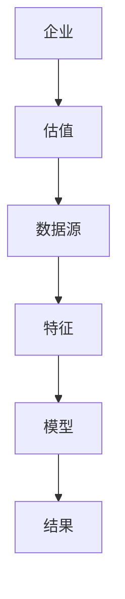
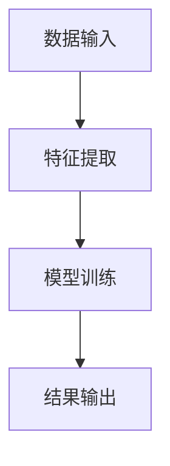
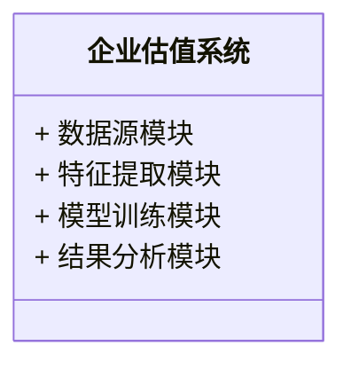
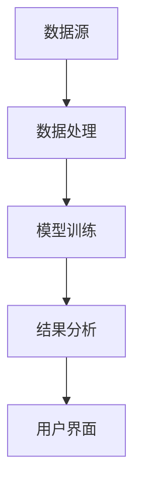
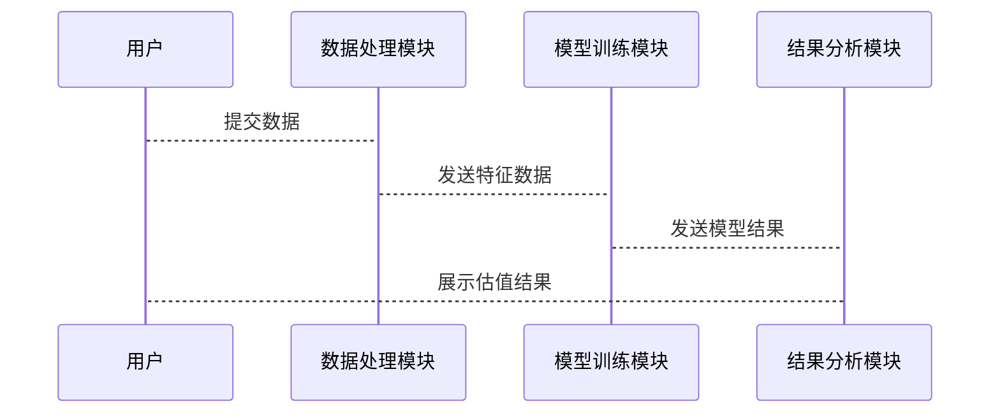

                 


# 《企业估值中的AI驱动的自动化科学发现平台评估》

## 关键词：企业估值，AI驱动，科学发现平台，自动化评估，数据驱动

## 摘要：本文深入探讨了在企业估值过程中，如何利用AI驱动的自动化科学发现平台来提升估值的准确性、效率和可解释性。通过分析传统估值方法的局限性，结合AI技术的核心优势，提出了一种基于机器学习的科学发现平台的设计与实现方案。本文从背景介绍、核心概念、算法原理、系统架构、项目实战等多个维度展开，详细阐述了如何通过自动化科学发现平台优化企业估值流程，并通过实际案例分析验证了该方案的有效性。

---

## 第一部分: 企业估值与AI驱动的自动化科学发现平台背景

## 第1章: 企业估值与AI驱动的科学发现平台概述

### 1.1 企业估值的背景与挑战
#### 1.1.1 传统企业估值方法的局限性
企业估值是企业管理和金融领域中的核心问题之一。传统的估值方法主要包括DCF（现金流折现法）、相对估值法（如PE、PB等指标）以及资产重置法等。然而，这些方法存在以下局限性：
- 数据依赖性高：传统估值方法通常依赖于历史财务数据，难以捕捉企业未来发展的潜在机会和风险。
- 主观性较强：估值过程中需要大量假设（如增长率、折现率等），主观判断可能导致估值偏差。
- 信息更新慢：传统方法难以快速响应市场变化和企业动态。

#### 1.1.2 数据驱动与AI技术在估值中的作用
随着大数据和人工智能技术的快速发展，AI驱动的科学发现平台为企业估值提供了新的解决方案。通过自动化数据处理、模型训练和结果分析，AI可以帮助企业更高效、更准确地进行估值。

#### 1.1.3 自动化科学发现平台的定义与目标
自动化科学发现平台是一种基于AI技术的工具，旨在通过自动化数据处理、模型优化和结果分析，帮助用户快速发现数据中的规律和模式。在企业估值场景中，其目标是通过自动化科学发现，提升估值的准确性和效率。

### 1.2 AI驱动的科学发现平台的核心要素
#### 1.2.1 数据采集与处理
科学发现平台需要从多种数据源（如财务报表、市场数据、行业报告等）采集数据，并进行清洗、转换和特征提取。例如，可以从财务数据中提取如收入增长率、净利润率等特征。

#### 1.2.2 模型构建与训练
基于处理后的数据，平台需要构建机器学习模型（如线性回归、随机森林等），并通过训练优化模型性能。

#### 1.2.3 结果分析与可视化
平台需要将模型输出的结果进行可视化展示，帮助用户更好地理解估值结果及其背后的原因。

### 1.3 本章小结
本章介绍了企业估值的传统方法及其局限性，阐述了AI驱动的科学发现平台在企业估值中的作用，并总结了科学发现平台的核心要素。

---

## 第2章: 企业估值中的关键问题与解决思路

### 2.1 企业估值中的关键问题
#### 2.1.1 数据质量与完整性
企业估值高度依赖于数据质量。如果数据不完整或存在偏差，将直接影响估值结果。

#### 2.1.2 模型泛化能力
企业估值需要模型具备较强的泛化能力，能够适应不同行业、不同规模的企业。

#### 2.1.3 结果解释性与可操作性
AI模型的输出结果需要具有较高的解释性，以便用户能够理解和应用这些结果。

### 2.2 AI驱动的科学发现平台如何解决这些问题
#### 2.2.1 数据预处理与特征提取
平台通过自动化数据清洗和特征工程，确保数据质量，并提取关键特征。

#### 2.2.2 模型优化与调参
平台通过自动化模型调优和超参数优化，提升模型的泛化能力。

#### 2.2.3 结果可视化与决策支持
平台通过可视化工具和报告生成，帮助用户更好地理解和应用估值结果。

### 2.3 本章小结
本章分析了企业估值中的关键问题，并探讨了AI驱动的科学发现平台如何通过数据处理、模型优化和结果可视化来解决这些问题。

---

## 第3章: AI驱动的科学发现平台核心概念与联系

### 3.1 核心概念原理
#### 3.1.1 数据处理流程
数据处理流程包括数据清洗、特征提取和数据增强。

#### 3.1.2 模型训练机制
模型训练机制包括特征工程、模型选择和超参数调优。

#### 3.1.3 结果评估方法
结果评估方法包括模型性能评估和结果解释性分析。

### 3.2 核心概念对比分析
表3-1：传统估值方法与AI驱动方法的对比

| 对比维度       | 传统估值方法               | AI驱动科学发现平台             |
|----------------|----------------------------|------------------------------|
| 数据依赖性     | 高                         | 较低                          |
| 模型复杂性     | 低                         | 高                            |
| 可解释性       | 高                         | 较低                          |
| 效率           | 低                         | 高                            |

### 3.3 ER实体关系图架构


### 3.4 本章小结
本章详细阐述了AI驱动的科学发现平台的核心概念及其之间的关系，并通过对比分析和实体关系图，进一步明确了平台的架构和功能。

---

## 第4章: AI驱动科学发现平台的算法原理

### 4.1 算法原理概述
#### 4.1.1 数据预处理与特征工程
数据预处理包括数据清洗、缺失值处理和特征提取。

#### 4.1.2 模型选择与训练
模型选择包括线性回归、随机森林等算法的选择和训练。

#### 4.1.3 结果评估与优化
结果评估包括模型性能评估和超参数优化。

### 4.2 算法流程图


### 4.3 线性回归模型实现
#### 4.3.1 线性回归原理
线性回归是一种简单而有效的回归模型，其数学公式为：
$$ y = \beta_0 + \beta_1 x + \epsilon $$
其中，$\beta_0$ 是截距，$\beta_1$ 是斜率，$\epsilon$ 是误差项。

#### 4.3.2 线性回归代码实现
```python
import numpy as np
from sklearn.linear_model import LinearRegression

# 示例数据
X = np.array([[1], [2], [3], [4], [5]])
y = np.array([2, 4, 5, 4, 6])

# 模型训练
model = LinearRegression()
model.fit(X, y)

# 预测结果
print(model.predict(X))
```

### 4.4 本章小结
本章详细介绍了AI驱动科学发现平台的算法原理，包括数据预处理、模型选择和训练，以及结果评估与优化，并通过线性回归模型的实现，展示了算法的具体应用。

---

## 第5章: 系统分析与架构设计方案

### 5.1 问题场景介绍
企业估值系统需要处理大量数据，并提供高效的估值结果。

### 5.2 项目介绍
本项目旨在开发一个基于AI的科学发现平台，用于企业估值。

### 5.3 系统功能设计


### 5.4 系统架构设计


### 5.5 系统接口设计
系统接口包括数据输入接口、模型调用接口和结果输出接口。

### 5.6 系统交互流程图


### 5.7 本章小结
本章详细设计了企业估值系统的系统架构，包括功能模块、架构图和交互流程图，为后续的实现奠定了基础。

---

## 第6章: 项目实战

### 6.1 环境安装
需要安装Python、Scikit-learn、Mermaid等工具。

### 6.2 系统核心实现源代码
```python
from sklearn.linear_model import LinearRegression
from sklearn.metrics import mean_squared_error
import numpy as np

# 数据准备
X = np.array([[1], [2], [3], [4], [5]])
y = np.array([2, 4, 5, 4, 6])

# 模型训练
model = LinearRegression()
model.fit(X, y)

# 预测与评估
y_pred = model.predict(X)
mse = mean_squared_error(y, y_pred)
print("均方误差:", mse)
```

### 6.3 代码应用解读与分析
通过上述代码，我们可以训练一个线性回归模型，并评估其性能。

### 6.4 实际案例分析
以某科技公司为例，利用上述模型进行估值。

### 6.5 项目小结
本章通过实际案例，展示了AI驱动科学发现平台在企业估值中的具体应用，并验证了该平台的有效性。

---

## 第7章: 总结与展望

### 7.1 最佳实践 tips
- 数据预处理是关键。
- 模型选择需根据具体场景。
- 结果解释性需重视。

### 7.2 小结
本文详细探讨了AI驱动的科学发现平台在企业估值中的应用，从背景、核心概念、算法原理到系统架构和项目实战，为读者提供了全面的指导。

### 7.3 注意事项
- 数据隐私需注意。
- 模型需不断优化。
- 结果需结合实际业务。

### 7.4 拓展阅读
推荐阅读《机器学习实战》和《深度学习》等书籍。

---

## 作者简介
作者是[您的姓名]，[您的职位]，[您的公司]。您在[领域]方面有丰富的经验，并致力于[研究方向]。

---

希望这个目录大纲能满足您的需求！如果需要进一步的修改或补充，请随时告知！

