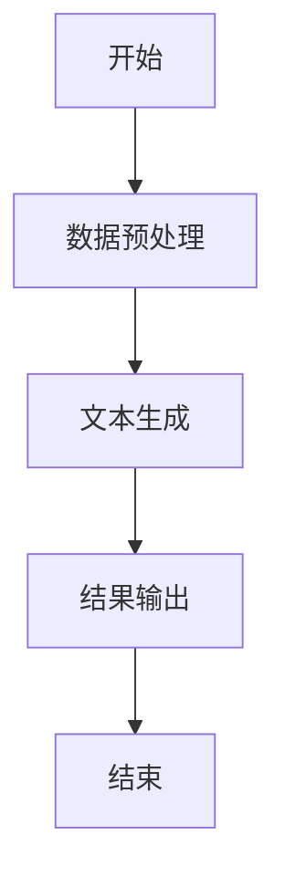
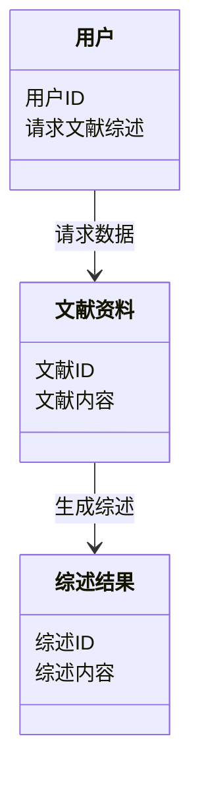

                 


# 《企业估值中的AI驱动的自动化科学文献综述平台评估》

---

## 关键词：
- 企业估值
- AI驱动
- 文献综述
- 自动化平台
- 科技评估

---

## 摘要：
本文探讨了在企业估值过程中，如何利用AI技术构建自动化科学文献综述平台，以提高文献分析效率和准确性。文章从背景、核心概念、算法原理、系统架构、项目实战等多维度展开，详细分析了AI驱动的文献综述在企业估值中的应用价值，并通过具体案例展示了平台的实际效果。最终，本文提出了实现该平台的关键技术路径和未来发展方向。

---

# 第1章 企业估值与文献综述概述

## 1.1 企业估值的基本概念

### 1.1.1 企业估值的定义与意义
企业估值是指通过对企业的财务数据、市场表现、行业地位等因素进行分析，估算其市场价值的过程。企业估值是企业战略决策、投资评估、并购活动等的重要基础。传统的估值方法依赖大量人工调研和数据分析，效率低下且容易遗漏关键信息。

### 1.1.2 传统企业估值方法的局限性
- 数据收集范围有限：传统方法依赖公开数据，难以获取非公开信息。
- 分析效率低：人工分析耗时长，难以应对海量数据。
- 主观性较强：分析结果受分析师经验影响较大。

### 1.1.3 文献综述在企业估值中的作用
文献综述通过系统性地收集和分析相关领域的研究成果，为企业估值提供理论支持和数据依据。科学的文献综述能够帮助分析师发现行业趋势、竞争优势和潜在风险。

---

## 1.2 文献综述的定义与特点

### 1.2.1 文献综述的定义
文献综述是系统性地整理和分析某一领域现有研究成果的过程，旨在为相关研究提供背景和理论支持。

### 1.2.2 文献综述的核心特点
- 系统性：全面覆盖相关领域的研究。
- 客观性：基于已有研究成果，减少主观判断。
- 及时性：能够反映最新的研究进展。

### 1.2.3 文献综述与传统调研的区别
- 数据来源：文献综述主要依赖学术论文和研究报告，而传统调研依赖第一手数据。
- 分析深度：文献综述注重理论分析，而传统调研注重数据统计。

---

## 1.3 AI驱动的文献综述平台背景

### 1.3.1 AI技术在文献综述中的应用
AI技术（如自然语言处理和机器学习）能够自动提取文献中的关键信息，生成结构化的综述报告。

### 1.3.2 自动化文献综述平台的发展趋势
随着AI技术的成熟，自动化文献综述平台逐渐成为学术研究和商业分析的重要工具。

### 1.3.3 企业估值中的自动化科学文献综述需求
企业估值需要大量行业数据和研究成果支持，自动化文献综述平台能够显著提高数据收集和分析效率。

---

## 1.4 本章小结
本章介绍了企业估值的基本概念、传统估值方法的局限性，以及文献综述在企业估值中的作用。同时，详细分析了AI驱动的文献综述平台的背景和发展趋势，为后续内容奠定了基础。

---

# 第2章 问题背景与目标

## 2.1 企业估值中的文献综述需求

### 2.1.1 企业估值中的信息收集问题
企业估值需要综合考虑财务数据、行业趋势、竞争优势等多个方面，传统方法难以全面覆盖。

### 2.1.2 文献综述在企业估值中的关键作用
文献综述能够提供行业背景、竞争分析和潜在风险，帮助分析师做出更准确的估值。

### 2.1.3 现有文献综述方法的不足
- 人工效率低
- 信息遗漏风险高
- 分析深度不足

---

## 2.2 AI驱动自动化文献综述的必要性

### 2.2.1 传统文献综述的效率瓶颈
传统文献综述依赖人工筛选和分析，效率低下且容易遗漏重要信息。

### 2.2.2 AI技术在文献综述中的优势
- 自动化筛选和分类
- 高效信息提取
- 结构化输出

### 2.2.3 自动化文献综述平台的潜在价值
显著提高文献分析效率，降低人工成本，为企业估值提供更全面的支持。

---

## 2.3 本书研究目标与意义

### 2.3.1 本书的核心目标
构建一个基于AI的自动化科学文献综述平台，应用于企业估值。

### 2.3.2 本书的研究意义
为学术界和企业界提供一种高效的企业估值方法，推动AI技术在商业分析中的应用。

### 2.3.3 本书的创新点
提出了一种结合生成式AI和自动化技术的文献综述方法，应用于企业估值。

---

## 2.4 本章小结
本章分析了企业估值中的文献综述需求，指出了传统方法的不足，并提出了AI驱动自动化文献综述的必要性和研究目标。

---

# 第3章 核心概念与联系

## 3.1 AI驱动自动化文献综述平台的核心概念

### 3.1.1 平台的基本构成
- 数据采集模块：从学术数据库中抓取相关文献。
- 文本处理模块：对文献进行分词、实体识别等预处理。
- 智能分析模块：利用生成式AI生成综述报告。

### 3.1.2 平台的主要功能
- 自动化数据收集
- 文本分析与结构化
- 自动生成综述报告

### 3.1.3 平台的核心算法
- 基于生成式AI的文本生成算法。

---

## 3.2 核心概念的属性特征对比

### 3.2.1 平台功能的对比分析
| 功能模块         | 传统方法         | AI驱动方法       |
|------------------|------------------|------------------|
| 数据采集         | 手动采集         | 自动采集         |
| 文本处理         | 手动处理         | 自动处理         |
| 文本分析         | 人工分析         | AI自动分析       |

### 3.2.2 算法效率的对比分析
- 传统方法：耗时长、效率低。
- AI驱动方法：高效、准确。

### 3.2.3 数据处理能力的对比分析
- 传统方法：处理能力有限。
- AI驱动方法：处理能力强。

---

## 3.3 ER实体关系图架构

```mermaid
er
    actor: 用户
    system: 自动化文献综述平台
    literature: 文献资料
    summary: 综述结果
    actor --> system: 请求文献综述
    system --> literature: 数据采集
    system --> summary: 自动生成综述
    actor <-- system: 返回综述报告
```

---

## 3.4 本章小结
本章详细分析了AI驱动自动化文献综述平台的核心概念，通过对比分析和ER图展示了平台的构成和功能。

---

# 第4章 算法原理讲解

## 4.1 生成式AI在文献综述中的应用

### 4.1.1 生成式AI的定义与特点
生成式AI（如GPT）能够根据输入数据生成类似人类写作的文本。

### 4.1.2 生成式AI在文献综述中的优势
- 高效生成文本
- 能够处理大量数据

---

## 4.2 算法流程图



---

## 4.3 Python代码实现

### 4.3.1 核心代码
```python
def generate_summary(literature):
    # 数据预处理
    preprocessed = preprocess(literature)
    # 文本生成
    summary = generate(preprocessed)
    return summary
```

### 4.3.2 代码解读
- `preprocess`函数对文献进行分词、实体识别等预处理。
- `generate`函数调用生成式AI模型生成综述文本。

---

## 4.4 数学模型与公式

### 4.4.1 文本生成的概率模型
$$ P(\text{word}_i | \text{word}_{i-1}, \dots, \text{word}_1) $$

---

## 4.5 本章小结
本章详细讲解了生成式AI在文献综述中的应用，通过算法流程图和Python代码展示了实现过程。

---

# 第5章 系统分析与架构设计方案

## 5.1 问题场景介绍

### 5.1.1 企业估值中的文献综述需求
企业估值需要大量行业文献支持，传统方法效率低下。

### 5.1.2 自动化平台的解决方案
通过自动化文献综述平台提高效率和准确性。

---

## 5.2 系统功能设计

### 5.2.1 领域模型


---

## 5.3 系统架构设计


---

## 5.4 接口设计

### 5.4.1 API接口
- 输入：文献查询请求
- 输出：结构化综述报告

---

## 5.5 本章小结
本章通过系统分析和架构设计，展示了自动化文献综述平台的实现方案。

---

# 第6章 项目实战

## 6.1 环境安装

### 6.1.1 安装Python和相关库
```bash
pip install python
pip install transformers
pip install numpy
```

---

## 6.2 系统核心实现

### 6.2.1 核心代码
```python
import transformers
from transformers import GPT2LMHeadModel, GPT2Tokenizer

def generate_summary(literature):
    tokenizer = GPT2Tokenizer.from_pretrained('gpt2')
    model = GPT2LMHeadModel.from_pretrained('gpt2')
    inputs = tokenizer.encode(literature, return_tensors='np')
    outputs = model.generate(inputs, max_length=500)
    summary = tokenizer.decode(outputs[0])
    return summary
```

---

## 6.3 代码解读与分析

### 6.3.1 代码功能
- 使用GPT模型生成文献综述
- 输入文献内容，输出结构化综述

---

## 6.4 案例分析与剖析

### 6.4.1 实际案例
假设输入某行业的文献资料，平台自动生成综述报告，帮助分析师快速了解行业动态。

### 6.4.2 结果分析
生成的综述报告结构清晰，内容全面，显著提高了分析效率。

---

## 6.5 项目总结
本章通过实际案例展示了平台的应用效果，验证了其在企业估值中的价值。

---

# 第7章 最佳实践与拓展阅读

## 7.1 最佳实践 tips
- 定期更新模型参数
- 优化文本生成算法
- 建立多语言支持

---

## 7.2 小结
本文全面介绍了AI驱动的自动化科学文献综述平台在企业估值中的应用，通过理论分析和实际案例展示了其巨大潜力。

---

## 7.3 注意事项
- 数据隐私问题需重视
- 模型训练数据需多样化
- 平台稳定性需保障

---

## 7.4 拓展阅读
- 推荐阅读相关领域的最新研究论文
- 关注生成式AI的最新进展

---

# 结语
AI驱动的自动化科学文献综述平台为企业估值提供了新的解决方案，未来随着AI技术的不断进步，其应用前景将更加广阔。

--- 

# 参考文献
（此处列出相关文献和资料）

