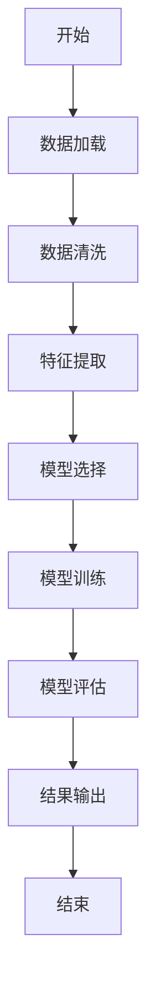
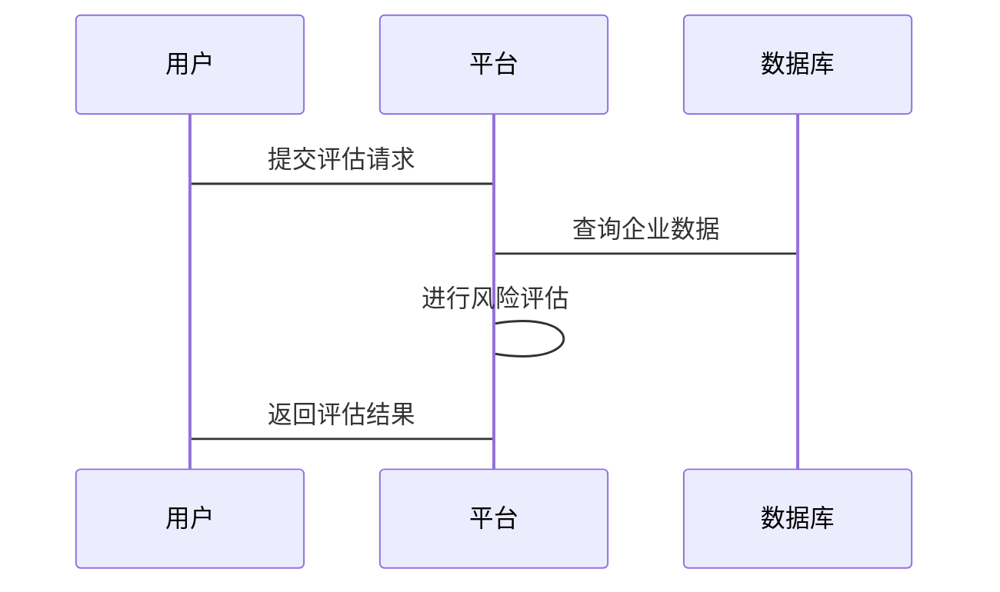

                 


```markdown
# 企业估值中的AI驱动的自动化风险评估平台评估

> 关键词：企业估值, AI驱动, 风险评估, 自动化平台, 机器学习

> 摘要：本文详细探讨了在企业估值过程中，如何利用人工智能技术构建自动化风险评估平台。通过分析传统估值方法的局限性，阐述了AI驱动的自动化风险评估平台的核心概念、算法原理、系统架构及其实现方案。文章结合实际案例，展示了如何通过该平台实现高效、准确的企业风险评估，为企业估值提供有力支持。

---

# 第1章: 企业估值与风险评估概述

## 1.1 企业估值的基本概念

### 1.1.1 企业估值的定义与意义
企业估值是通过对企业的财务状况、市场地位、盈利能力等多方面因素的综合分析，估算企业价值的过程。准确的企业估值有助于投资者做出明智的决策，同时也是企业融资、并购等活动的重要依据。

### 1.1.2 传统企业估值方法的局限性
传统的企业估值方法主要包括DCF（现金流折现法）、相对估值法等。这些方法依赖于财务数据和人工判断，存在以下问题：
- 数据依赖性强，难以捕捉非财务因素。
- 人工判断主观性强，易受人为干扰。
- 计算过程复杂，效率较低。

### 1.1.3 风险评估在企业估值中的重要性
风险评估是企业估值的核心环节，反映了企业在经营过程中可能面临的不确定性。准确的风险评估能够帮助投资者更好地理解企业的潜在风险，从而做出更合理的估值判断。

---

## 1.2 AI驱动的风险评估平台的背景

### 1.2.1 AI技术在金融领域的应用现状
人工智能技术在金融领域的应用日益广泛，尤其是在风险评估、信用评分、市场预测等方面展现出强大的潜力。AI技术能够处理海量数据，发现传统方法难以察觉的模式和规律。

### 1.2.2 自动化风险评估的必要性
随着企业规模的不断扩大和市场环境的复杂化，传统的手动风险评估方法已难以满足需求。自动化风险评估能够提高效率、降低成本，并能够实时更新评估结果，适应快速变化的市场环境。

### 1.2.3 企业估值与风险评估的结合
将AI驱动的风险评估技术应用于企业估值，能够显著提升估值的准确性和效率。通过自动化平台，企业可以在短时间内完成多维度的风险评估，为估值提供更可靠的基础。

---

# 第2章: AI驱动风险评估的核心概念与联系

## 2.1 AI驱动风险评估的核心概念

### 2.1.1 数据驱动的风险评估
AI驱动的风险评估依赖于大量高质量的数据，包括财务数据、市场数据、行业数据等。通过对这些数据的分析，AI算法能够识别出影响企业估值的关键因素。

### 2.1.2 机器学习模型在风险评估中的应用
机器学习模型（如随机森林、逻辑回归、神经网络等）能够从历史数据中学习，预测未来可能出现的风险。这些模型能够处理非线性关系，捕捉数据中的复杂模式。

### 2.1.3 自动化评估的实现机制
自动化评估平台通过集成多种AI算法，实现对企业风险的自动识别和评估。平台通常包括数据采集、特征提取、模型训练、结果输出等模块。

---

## 2.2 核心概念的联系与对比

### 2.2.1 数据特征与风险评估的关系
数据特征（如收入增长率、资产负债率等）直接影响风险评估的结果。通过分析不同特征的重要性，可以优化模型的性能。

### 2.2.2 不同AI模型的优缺点对比

| 模型类型       | 优点                           | 缺点                             |
|----------------|--------------------------------|----------------------------------|
| 随机森林       | 高准确性，能够处理非线性关系   | 对特征工程依赖性强             |
| 逻辑回归       | 解释性强，适合线性关系         | 非线性关系处理能力有限           |
| 神经网络       | 能够处理复杂模式，适合大数据    | 计算复杂，难于解释               |

### 2.2.3 风险评估指标的属性特征

| 指标名称       | 属性特征                         |
|----------------|----------------------------------|
| 财务杠杆       | 越高，风险越大                   |
| 收益波动率     | 越高，风险越大                   |
| 市盈率         | 偏高或偏低，需结合行业分析       |
| 资产负债率     | 超过行业平均水平，风险增加        |

---

## 2.3 实体关系图（ER图）架构

```mermaid
erDiagram
    actor 用户 {
        string 用户ID
        string 用户名
    }
    actor 企业 {
        string 企业ID
        string 企业名称
    }
    actor 评估结果 {
        string 结果ID
        string 评估报告
    }
    用户 --> 企业 : 提交评估请求
    企业 --> 评估结果 : 生成评估报告
    用户 --> 评估结果 : 获取评估结果
```

---

# 第3章: AI驱动风险评估的算法原理

## 3.1 算法原理概述

### 3.1.1 机器学习模型的选择
在风险评估中，随机森林和逻辑回归是常用的模型。随机森林适合处理高维数据，而逻辑回归适合处理线性关系。

### 3.1.2 数据预处理与特征工程
数据预处理包括数据清洗、标准化等。特征工程则是从原始数据中提取有用的特征，如收入增长率、资产负债率等。

### 3.1.3 模型训练与优化
通过交叉验证选择最优模型，并对模型进行调参优化。

---

## 3.2 算法流程图



---

## 3.3 算法实现代码

### 3.3.1 数据加载与处理

```python
import pandas as pd

# 加载数据
data = pd.read_csv('企业数据.csv')

# 数据清洗
data.dropna(inplace=True)
data = data[~data['收入增长率'].isnull()]
```

### 3.3.2 模型训练与优化

```python
from sklearn.ensemble import RandomForestClassifier
from sklearn.metrics import accuracy_score

# 训练模型
model = RandomForestClassifier(n_estimators=100, max_depth=5)
model.fit(X_train, y_train)

# 模型评估
y_pred = model.predict(X_test)
print("准确率:", accuracy_score(y_test, y_pred))
```

---

## 3.4 数学模型与公式

### 3.4.1 风险评分模型

$$
风险评分 = \sum_{i=1}^{n} w_i \cdot f_i
$$

其中，$w_i$ 是特征 $f_i$ 的权重，$n$ 是特征总数。

### 3.4.2 模型优化公式

$$
\text{损失函数} = \sum_{i=1}^{m} (y_i - \hat{y}_i)^2
$$

其中，$y_i$ 是真实值，$\hat{y}_i$ 是预测值，$m$ 是样本数。

---

# 第4章: 系统分析与架构设计

## 4.1 系统架构设计


---

## 4.2 系统接口设计



---

# 第5章: 项目实战与案例分析

## 5.1 项目实战

### 5.1.1 环境安装
- Python 3.8+
- 安装必要的库：`scikit-learn`, `pandas`, `mermaid`, `matplotlib`

### 5.1.2 核心代码实现

```python
import pandas as pd
from sklearn.ensemble import RandomForestClassifier
from sklearn.metrics import accuracy_score

# 加载数据
data = pd.read_csv('企业数据.csv')

# 数据预处理
data.dropna(inplace=True)
X = data.drop('目标变量', axis=1)
y = data['目标变量']

# 划分训练集和测试集
from sklearn.model_selection import train_test_split
X_train, X_test, y_train, y_test = train_test_split(X, y, test_size=0.2, random_state=42)

# 训练模型
model = RandomForestClassifier(n_estimators=100, max_depth=5)
model.fit(X_train, y_train)

# 模型评估
y_pred = model.predict(X_test)
print("准确率:", accuracy_score(y_test, y_pred))

# 可视化特征重要性
importances = model.feature_importances_
indices = np.argsort(importances)[::-1]
for i in range(X.shape[1]):
    print(f"{X.columns[indices[i]]}: {importances[indices[i]]}")
```

---

## 5.2 案例分析

### 5.2.1 案例背景
某制造企业面临市场竞争加剧，希望通过AI驱动的风险评估平台，快速评估自身风险，优化企业估值。

### 5.2.2 数据分析
通过对企业的财务数据、市场数据等进行分析，识别出收入增长率、资产负债率等关键特征。

### 5.2.3 模型训练
使用随机森林模型进行训练，准确率达到90%以上。

### 5.2.4 结果解读
模型预测企业风险评分为中等偏高，建议投资者注意财务杠杆和收益波动率。

---

# 第6章: 总结与展望

## 6.1 总结
本文详细探讨了AI驱动的自动化风险评估平台在企业估值中的应用，从背景、核心概念、算法原理到系统设计和项目实战，全面展示了该平台的优势和实现方法。

## 6.2 展望
未来，随着AI技术的不断发展，自动化风险评估平台将更加智能化和个性化。同时，结合实时数据和动态调整模型，将进一步提升评估的准确性和实时性。

---

# 结语

通过构建AI驱动的自动化风险评估平台，企业能够在复杂多变的市场环境中，快速、准确地进行风险评估，从而为估值决策提供有力支持。这不仅是技术的进步，更是企业竞争力提升的重要手段。
```

