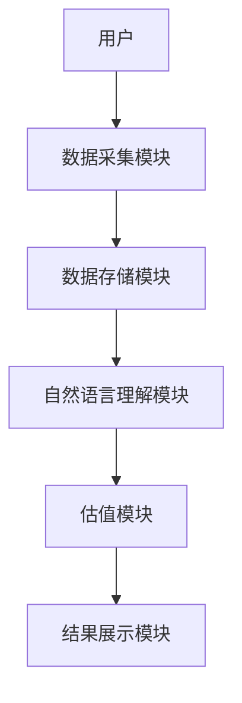

                 


# 《企业估值中的AI驱动的自然语言理解平台评估》

---

## 关键词：企业估值，自然语言理解，AI驱动，NLP，文本分析，机器学习

---

## 摘要

本文探讨了在企业估值过程中，如何利用AI驱动的自然语言理解（NLP）平台来提升估值的准确性和效率。通过对NLP技术的深入分析，结合实际案例，详细阐述了从数据预处理到模型构建的整个流程，展示了如何通过自然语言处理技术提取企业相关信息，从而优化估值过程。

---

# 第1章: 自然语言理解平台与企业估值的结合

## 1.1 企业估值的基本概念

### 1.1.1 企业估值的定义与重要性

企业估值是通过对企业的财务数据、市场表现、行业地位等多方面进行综合评估，确定其市场价值的过程。准确的企业估值对于投资决策、并购活动等具有重要意义。

### 1.1.2 传统企业估值方法的局限性

传统估值方法主要依赖财务报表分析、市场比较法等，但这些方法往往难以捕捉到企业隐含的价值信息，例如市场情绪、管理团队能力等。

### 1.1.3 自然语言理解在企业估值中的潜力

自然语言理解技术能够从企业财报、新闻报道、行业分析等文本数据中提取关键信息，为估值提供更全面的支持。

## 1.2 自然语言理解技术的简介

### 1.2.1 自然语言处理的核心技术

自然语言处理（NLP）技术包括分词、词性标注、句法分析、实体识别、关系抽取、情感分析等多个环节。

### 1.2.2 自然语言理解的定义与特点

自然语言理解（NLU）是NLP的一个子领域，旨在让计算机能够理解人类语言的深层含义。

### 1.2.3 自然语言理解与企业估值的结合点

NLU技术可以应用于企业财报分析、市场情绪分析、行业趋势预测等领域，为估值提供更丰富的数据支持。

## 1.3 AI驱动的自然语言理解平台的优势

### 1.3.1 提高估值效率

通过自动化处理大量文本数据，显著提高估值效率。

### 1.3.2 增强数据处理能力

能够从非结构化文本中提取关键信息，增强数据处理能力。

### 1.3.3 提供更精准的估值依据

结合文本数据和结构化数据，提供更精准的估值依据。

## 1.4 本章小结

通过本章的介绍，读者可以了解自然语言理解技术在企业估值中的重要性及其优势。

---

# 第2章: 自然语言理解平台的核心技术

## 2.1 分词技术

### 2.1.1 分词技术的定义

分词是将连续的文本分割成有意义的词汇或短语的过程。

### 2.1.2 常见的分词算法

- 基于统计的分词方法：如最大匹配法。
- 基于规则的分词方法：如词典匹配法。
- 基于深度学习的分词方法：如LSTM分词模型。

### 2.1.3 分词技术在企业估值中的应用

例如，从企业财报中提取关键词汇，分析企业财务状况。

## 2.2 词性标注与句法分析

### 2.2.1 词性标注的定义与作用

词性标注是对每个词汇赋予其词性标签的过程，有助于后续的句法分析。

### 2.2.2 句法分析的原理

通过分析句子的结构，确定词语之间的关系。

### 2.2.3 词性标注与句法分析在企业估值中的应用

例如，分析企业财报中的动词使用情况，了解企业的经营状况。

## 2.3 实体识别与关系抽取

### 2.3.1 实体识别的定义与技术

实体识别是从文本中识别出人名、地名、组织名等实体的过程。

### 2.3.2 关系抽取的原理

通过分析实体之间的关系，构建知识图谱。

### 2.3.3 实体识别与关系抽取在企业估值中的应用

例如，从新闻报道中提取企业的竞争对手信息，分析行业竞争格局。

## 2.4 本章小结

通过本章的介绍，读者可以了解自然语言理解平台的核心技术及其在企业估值中的应用。

---

# 第3章: 自然语言理解平台的评估方法

## 3.1 评估指标

### 3.1.1 准确率

准确率是模型预测正确的样本数与总样本数的比值。

$$\text{准确率} = \frac{\text{正确预测数}}{\text{总预测数}}$$

### 3.1.2 召回率

召回率是模型预测正确的正类样本数与实际正类样本数的比值。

$$\text{召回率} = \frac{\text{正确预测的正类数}}{\text{实际正类数}}$$

### 3.1.3 F1分数

F1分数是准确率和召回率的调和平均数。

$$F1 = 2 \times \frac{\text{准确率} \times \text{召回率}}{\text{准确率} + \text{召回率}}$$

## 3.2 评估方法

### 3.2.1 留出法

将数据集分为训练集和测试集，分别用于模型训练和性能评估。

### 3.2.2 K折交叉验证

将数据集分成K个子集，每次使用K-1个子集训练，剩余1个子集测试，重复K次。

### 3.2.3 网格搜索

通过网格搜索找到最佳模型参数。

## 3.3 本章小结

通过本章的介绍，读者可以了解自然语言理解平台的评估指标和方法。

---

# 第4章: AI驱动的自然语言理解模型

## 4.1 模型原理

### 4.1.1 基于TF-IDF的文本表示

TF-IDF是一种常用的文本表示方法，通过计算词项在文档中的重要性。

$$TF-IDF = \log(\text{TF}) \times \log(\text{N}/\text{DF}+1)$$

### 4.1.2 基于深度学习的模型

如BERT、GPT等预训练模型，具有强大的上下文理解能力。

## 4.2 模型实现

### 4.2.1 环境配置

安装必要的库，如TensorFlow、Keras等。

### 4.2.2 数据预处理

文本清洗、分词、向量化等步骤。

### 4.2.3 模型训练

基于预处理的数据，训练自然语言理解模型。

## 4.3 模型应用

### 4.3.1 文本分类

对企业新闻进行分类，如正面、负面、中性。

### 4.3.2 情感分析

分析企业财报发布后的市场情绪。

## 4.4 本章小结

通过本章的介绍，读者可以了解AI驱动的自然语言理解模型的实现与应用。

---

# 第5章: 系统架构与设计

## 5.1 系统架构图



## 5.2 功能设计

### 5.2.1 数据采集模块

从企业财报、新闻等来源采集文本数据。

### 5.2.2 自然语言理解模块

对采集到的文本进行分词、实体识别等处理。

### 5.2.3 估值模块

基于NLP处理结果，结合财务数据进行企业估值。

## 5.3 接口设计

### 5.3.1 数据接口

定义数据的输入格式和输出格式。

### 5.3.2 API接口

提供RESTful API，供其他系统调用。

## 5.4 本章小结

通过本章的介绍，读者可以了解系统的整体架构与功能设计。

---

# 第6章: 项目实战

## 6.1 环境安装

安装Python、Jupyter Notebook、nltk、transformers等库。

## 6.2 核心实现

### 6.2.1 分词实现

```python
from nltk.tokenize import word_tokenize

text = "This is a sample text."
tokens = word_tokenize(text)
print(tokens)
```

### 6.2.2 实体识别实现

```python
import spacy

nlp = spacy.load("en_core_web_sm")
doc = nlp(text)
for ent in doc.ents:
    print(ent.text, ent.label_)
```

## 6.3 案例分析

分析某企业财报文本，提取关键信息，计算企业估值。

## 6.4 本章小结

通过本章的实战，读者可以掌握如何在实际项目中应用自然语言理解技术。

---

# 第7章: 总结与展望

## 7.1 本章总结

总结本文的主要内容和结论。

## 7.2 未来展望

展望自然语言理解在企业估值中的未来发展。

---

# 附录

## 附录A: 参考文献

列出本文参考的文献资料。

## 附录B: 术语表

解释文中出现的术语。

---

通过本文的详细讲解，读者可以系统地了解AI驱动的自然语言理解平台在企业估值中的应用，并能够通过实际项目掌握相关技术。

