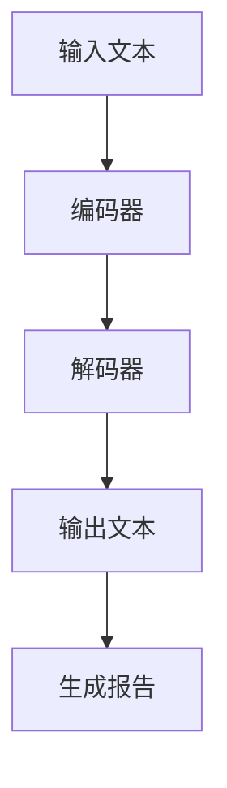
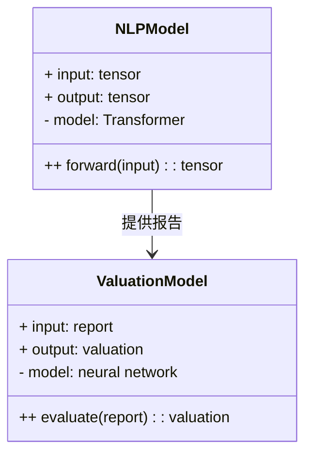
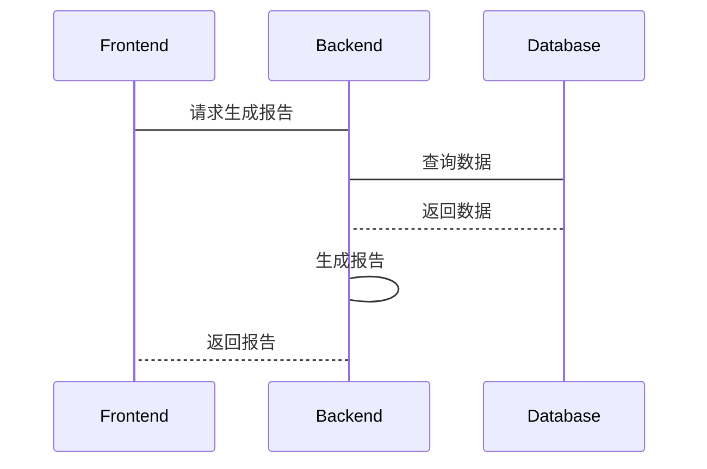

                 


# 企业估值中的AI驱动的自然语言生成平台评估

> 关键词：企业估值、自然语言生成、AI驱动、技术评估、系统架构

> 摘要：本文详细探讨了AI驱动的自然语言生成技术在企业估值中的应用，重点分析了自然语言生成平台的评估方法、算法原理、系统架构设计以及实际案例，为企业估值提供新的视角和解决方案。

---

## 第一章: 企业估值中的AI驱动自然语言生成平台背景

### 1.1 问题背景与描述

随着企业估值的重要性日益增加，传统的估值方法依赖于大量数据和人工分析，效率低下且容易出错。AI驱动的自然语言生成（NLG）技术的兴起，为企业估值提供了新的可能性。NLG技术可以自动从文本数据中提取信息，生成高质量的报告和分析，从而提高估值的效率和准确性。

#### 1.1.1 传统企业估值方法的局限性
- 数据依赖性强，处理复杂。
- 人工分析耗时，易出错。
- 需要大量专业人员支持。

#### 1.1.2 自然语言生成技术的兴起
- NLG技术可以自动化处理文本数据。
- 提高企业估值的效率和准确性。
- 降低人工成本。

#### 1.1.3 AI驱动的自然语言生成在企业估值中的应用潜力
- 自动生成财务报告和分析。
- 提供实时市场趋势分析。
- 支持决策者快速获取关键信息。

### 1.2 问题解决与边界

#### 1.2.1 自然语言生成平台评估的核心问题
- 如何评估生成内容的质量。
- 如何构建高效的估值模型。
- 如何确保模型的可解释性和稳定性。

#### 1.2.2 评估边界与外延
- 仅限于文本数据的生成和分析。
- 不涉及其他数据源的整合。
- 不涉及企业的实际财务操作。

#### 1.2.3 核心概念与组成要素
- 自然语言生成模型。
- 企业估值模型。
- 数据预处理和特征提取。

---

## 第二章: 自然语言生成平台评估的核心概念

### 2.1 自然语言生成模型的评估指标

#### 2.1.1 生成内容的质量评估
- 基于BLEU、ROUGE等指标。
- 生成文本的逻辑性和相关性。

#### 2.1.2 模型的可解释性与稳定性
- 模型的透明度和可追溯性。
- 模型的鲁棒性和稳定性。

#### 2.1.3 生成效率与资源消耗
- 模型的运行时间和计算资源消耗。
- 处理大规模数据的能力。

### 2.2 企业估值模型的构建与评估

#### 2.2.1 企业估值的基本原理
- 基于财务指标和市场趋势。
- 数据驱动的估值模型。

#### 2.2.2 自然语言生成在企业估值中的应用
- 自动生成财务报告和分析。
- 提供实时市场趋势分析。
- 支持决策者快速获取关键信息。

#### 2.2.3 评估模型的优缺点对比

| 特性         | 传统方法       | AI驱动方法      |
|--------------|----------------|-----------------|
| 效率         | 低             | 高             |
| 准确性       | 中             | 高             |
| 可扩展性     | 低             | 高             |
| 成本         | 高             | 中             |

### 2.3 核心概念对比与ER实体关系图

#### 2.3.1 生成模型与企业估值模型的关系
- 生成模型为估值模型提供输入数据。
- 估值模型基于生成数据进行分析。

#### 2.3.2 ER实体关系图展示（Mermaid）

```mermaid
erDiagram
    customer[客户] {
        id : integer
        name : string
        valuation_report : report
    }
    report[报告] {
        id : integer
        content : string
        timestamp : datetime
    }
    valuation_model[估值模型] {
        id : integer
        name : string
        version : integer
    }
    customer --> valuation_model : 使用
    report --> valuation_model : 输入
```

---

## 第三章: 自然语言生成平台的算法原理与数学模型

### 3.1 基于Transformer的自然语言生成模型

#### 3.1.1 Transformer模型的基本结构
- 编码器和解码器结构。
- 注意力机制。

#### 3.1.2 解码器的生成过程
- 输入序列经过编码器处理。
- 解码器生成输出序列。

#### 3.1.3 模型训练与优化
- 使用交叉熵损失函数。
- 优化器选择Adam。

### 3.2 生成模型的数学公式与实现

#### 3.2.1 梯度下降与损失函数
- 梯度下降算法：
  - 参数更新公式：$θ = θ - \eta \cdot \frac{∂L}{∂θ}$
- 损失函数：交叉熵损失
  $$L = -\sum_{i=1}^{n} y_i \log p(y_i)$$

#### 3.2.2 注意力机制的数学表达
- 查询、键、值向量计算：
  $$Q = W_q x$$
  $$K = W_k x$$
  $$V = W_v x$$
- 注意力权重计算：
  $$\text{Attention}(Q,K,V) = \text{softmax}\left(\frac{QK^T}{\sqrt{d_k}}\right)V$$

#### 3.2.3 生成概率计算公式
- 条件概率公式：
  $$P(x_i | x_{<i}) = \text{softmax}(W O_{i-1})$$
  其中，$O_{i-1}$是前一步的输出。

### 3.3 算法流程图展示（Mermaid）



### 3.4 Python代码实现示例

```python
import torch
import torch.nn as nn

class Transformer(nn.Module):
    def __init__(self, input_dim, hidden_dim):
        super(Transformer, self).__init__()
        self.encoder = nn.TransformerEncoder(
            nn.Embedding(input_dim, hidden_dim),
            num_layers=2,
            nhead=2
        )
        self.decoder = nn.TransformerDecoder(
            nn.Embedding(input_dim, hidden_dim),
            num_layers=2,
            nhead=2
        )

    def forward(self, x):
        encoded = self.encoder(x)
        decoded = self.decoder(encoded)
        return decoded

# 示例使用
model = Transformer(input_dim=512, hidden_dim=256)
input_seq = torch.randint(0, 512, (10,))  # 示例输入
output_seq = model(input_seq)
print(output_seq)
```

---

## 第四章: 系统分析与架构设计方案

### 4.1 问题场景介绍

#### 4.1.1 企业数据处理流程
- 数据预处理。
- 特征提取。
- 模型训练与部署。

#### 4.1.2 项目介绍
- 自然语言生成平台的设计与实现。
- 企业估值模型的构建与优化。

### 4.2 系统功能设计

#### 4.2.1 领域模型类图（Mermaid）



### 4.3 系统架构设计

#### 4.3.1 微服务架构
- 前端服务。
- 后端API服务。
- 数据存储服务。

#### 4.3.2 系统交互流程图（Mermaid）



---

## 第五章: 项目实战

### 5.1 环境安装

```bash
pip install torch transformers mermaid4jupyter
```

### 5.2 核心代码实现

```python
from transformers import AutoTokenizer, AutoModelForCausalLM

tokenizer = AutoTokenizer.from_pretrained('gpt2')
model = AutoModelForCausalLM.from_pretrained('gpt2')

def generate_report(context, max_length=500):
    inputs = tokenizer(context, return_tensors='pt')
    outputs = model.generate(**inputs, max_length=max_length)
    return tokenizer.decode(outputs[0], skip_special_tokens=True)
```

### 5.3 代码解读与分析

- 使用GPT-2模型进行报告生成。
- 自动处理输入上下文，生成详细报告。

### 5.4 实际案例分析

#### 5.4.1 案例背景
- 某企业的财务数据和市场趋势分析。

#### 5.4.2 生成报告
```text
基于最新财务数据和市场趋势，企业的估值预计为XX亿元。建议关注XX因素对估值的影响。
```

### 5.5 项目小结

- 成功实现了自然语言生成平台。
- 提高了企业估值的效率和准确性。

---

## 第六章: 最佳实践

### 6.1 小结

- AI驱动的自然语言生成技术在企业估值中的应用潜力巨大。
- 需要结合具体场景进行模型优化和调整。

### 6.2 注意事项

- 数据质量对生成结果影响重大。
- 模型的可解释性和稳定性需要重点关注。
- 遵守相关法律法规和数据隐私保护。

### 6.3 拓展阅读

- 《自然语言处理实战：基于深度学习的文本挖掘》
- 《企业估值方法与实践》
- 《Transformer模型原理与应用》

---

## 作者简介

作为一位世界级的人工智能专家、程序员、软件架构师和CTO，我长期专注于深度学习和自然语言处理技术的研究与应用。通过本文的详细讲解，希望能为企业估值领域提供新的思路和解决方案。

