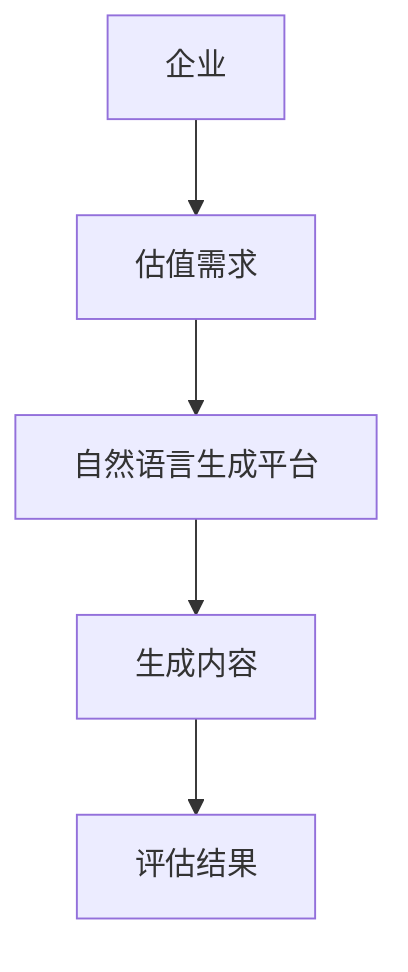
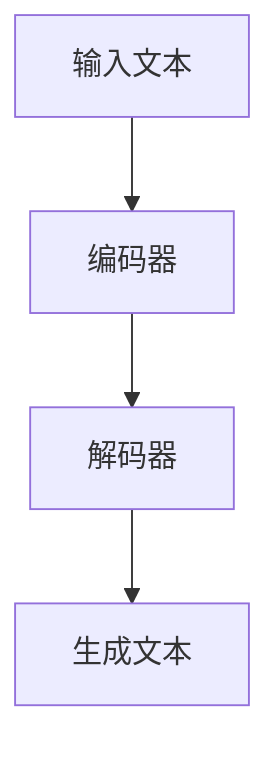
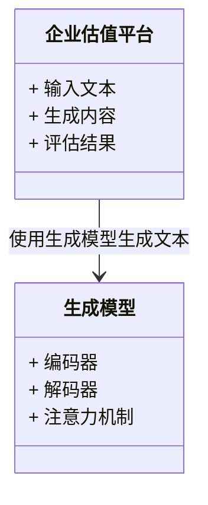
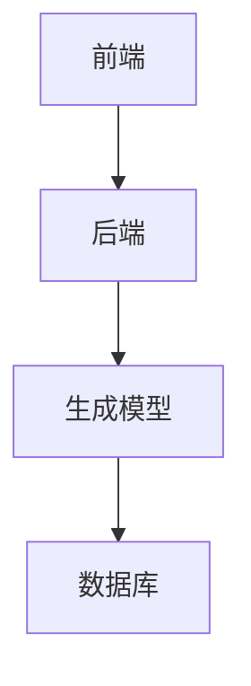
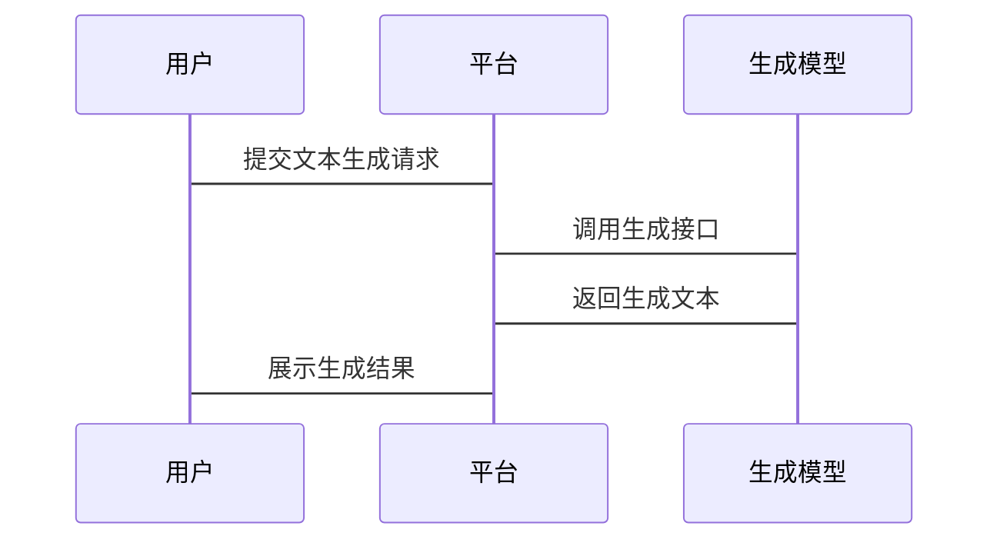

                 


# 《企业估值中的AI驱动的自然语言生成平台评估》

---

## 关键词：
企业估值, 自然语言生成, AI驱动, 平台评估, 生成式AI, 数学模型

---

## 摘要：
本文探讨了如何利用AI驱动的自然语言生成平台进行企业估值的创新方法。通过分析生成式AI的核心算法原理、系统架构设计以及实际项目案例，详细展示了如何将自然语言生成技术应用于企业估值的各个环节。文章从背景介绍、核心概念、算法原理、数学模型、系统架构、项目实战到最佳实践，层层深入，为企业估值提供了一种高效、智能的新思路。

---

## 第一部分: 企业估值与AI驱动的自然语言生成平台概述

---

## 第1章: 企业估值与自然语言生成平台的背景介绍

### 1.1 问题背景与问题描述
#### 1.1.1 企业估值的传统方法与挑战
传统的企业估值方法依赖于财务数据、市场分析和人工判断，存在数据复杂性高、人工成本高、主观性强等问题。企业估值需要考虑多种因素，包括财务指标、行业趋势、市场环境等，这些都需要大量的人力和时间来处理和分析。

#### 1.1.2 自然语言生成技术的兴起
自然语言生成（Natural Language Generation, NLP）技术的进步使得计算机能够生成与人类语言高度相似的文本。基于Transformer的生成模型（如GPT系列）在文本生成领域取得了显著成果，为自动化处理和分析企业相关信息提供了新的可能性。

#### 1.1.3 问题解决的必要性与目标
利用AI驱动的自然语言生成平台，可以自动化地从企业报告、行业分析等文本数据中提取关键信息，并生成符合估值需求的文本内容。这种方法不仅提高了估值效率，还降低了人工成本，同时减少了人为误差。

### 1.2 问题的边界与外延
#### 1.2.1 企业估值的范围界定
企业估值的范围包括财务数据、市场分析、行业趋势、竞争环境等。自然语言生成平台需要能够处理多种类型的文本数据，并从中提取关键信息。

#### 1.2.2 自然语言生成平台的适用场景
生成平台适用于企业报告的自动化生成、行业分析的文本优化、财务数据的总结等场景。这些场景需要生成高质量、准确的文本内容，以支持企业的估值工作。

#### 1.2.3 相关概念的对比与区分
自然语言生成（NLP）与自然语言理解（NLU）的区别在于，NLP侧重于生成文本，而NLU侧重于理解文本。在企业估值中，生成平台主要用于生成报告、分析文本，而理解模型用于从现有文本中提取信息。

### 1.3 核心概念与要素组成
#### 1.3.1 自然语言生成平台的核心要素
生成模型、数据源、用户需求、评估指标是自然语言生成平台的四个核心要素。生成模型负责生成文本，数据源提供输入数据，用户需求决定生成的内容方向，评估指标用于衡量生成结果的质量。

#### 1.3.2 企业估值的关键指标
企业估值的关键指标包括市盈率、市净率、EV/EBITDA等财务指标，以及行业趋势、市场环境等非财务因素。这些指标需要通过生成平台进行分析和总结。

#### 1.3.3 平台与估值的关联性分析
自然语言生成平台通过生成高质量的文本内容，帮助企业快速获取和分析相关信息，从而提高估值的效率和准确性。平台的生成能力直接影响估值结果的质量。

---

## 第2章: 自然语言生成平台的核心概念与联系

### 2.1 核心概念原理
#### 2.1.1 自然语言生成的基本原理
自然语言生成是通过计算机算法将结构化数据或预定义模板转换为自然语言文本的过程。生成模型通常基于Transformer架构，包括编码器和解码器两部分。

#### 2.1.2 AI驱动的生成模型简介
生成式AI模型（如GPT）通过自注意力机制捕捉文本中的长距离依赖关系，生成连贯且相关的文本内容。模型通过大量数据的训练，能够理解上下文并生成合理的文本。

#### 2.1.3 企业估值中的语言生成需求
在企业估值中，生成平台需要生成报告、分析文本等，这些文本需要准确反映企业的财务状况和市场环境，帮助评估人员做出决策。

### 2.2 核心概念属性特征对比
#### 2.2.1 不同生成模型的性能对比
| 模型名称 | 基础架构 | 参数数量 | 生成效果 | 训练数据量 |
|----------|-----------|----------|----------|------------|
| GPT-3   | Transformer | 175B     | 高        | 大          |
| BERT     | Transformer | 330M     | 中        | 中等        |
| T5       | Transformer | 220M     | 高        | 中等        |

#### 2.2.2 平台功能的特征分析
| 功能模块 | 输入 | 输出 | 描述 |
|----------|------|------|------|
| 文本生成 | 结构化数据 | 自然语言文本 | 将财务数据转化为报告文本 |
| 数据分析 | 文本数据 | 关键指标 | 提取文本中的关键估值指标 |
| 评估结果 | 文本内容 | 评估分数 | 对生成文本的质量进行评分 |

#### 2.2.3 企业估值需求的多样性
企业估值需求包括财务报告生成、行业分析优化、市场趋势预测等。不同需求需要生成不同类型的文本内容，生成平台需要具备灵活性和多样性。

### 2.3 ER实体关系图架构


---

## 第3章: 自然语言生成平台的算法原理讲解

### 3.1 算法原理概述
#### 3.1.1 基于Transformer的生成模型
Transformer模型由编码器和解码器组成，编码器将输入文本转换为上下文表示，解码器根据上下文生成输出文本。模型通过自注意力机制捕捉文本中的长距离依赖关系。

#### 3.1.2 编码器-解码器结构
编码器将输入序列转换为一个固定长度的上下文向量，解码器根据这个向量生成输出序列。编码器和解码器都由多头自注意力和前馈网络组成。

#### 3.1.3 注意力机制的作用
注意力机制通过计算输入序列中每个位置的重要性，将重要的信息集中在生成的文本中。注意力权重反映了输入序列中不同位置对生成结果的影响程度。

### 3.2 算法流程图


### 3.3 算法实现细节
#### 3.3.1 生成模型的训练过程
生成模型的训练过程包括数据预处理、模型训练和参数优化。模型通过梯度下降优化器（如Adam）更新参数，以最小化生成文本与真实文本之间的损失。

#### 3.3.2 生成过程的数学模型
生成模型的输出概率分布可以通过以下公式计算：
$$
P(y|x) = \text{softmax}(W_y y^T + b)
$$
其中，\(x\) 是输入序列，\(y\) 是输出序列，\(W_y\) 和 \(b\) 是模型参数。

#### 3.3.3 注意力机制的数学表达
自注意力机制的计算公式如下：
$$
\text{Attention}(Q, K, V) = \text{softmax}\left(\frac{QK^T}{\sqrt{d_k}}\right)V
$$
其中，\(Q\) 是查询向量，\(K\) 是键向量，\(V\) 是值向量，\(d_k\) 是向量的维度。

---

## 第4章: 数学模型与公式

### 4.1 生成模型的概率分布
生成模型的概率分布可以通过以下公式表示：
$$
P(y_1, y_2, ..., y_n|x) = \prod_{i=1}^n P(y_i|x, y_1, ..., y_{i-1})
$$
其中，\(x\) 是输入序列，\(y_i\) 是生成的第 \(i\) 个词。

### 4.2 损失函数的定义
生成模型的损失函数通常使用交叉熵损失：
$$
\mathcal{L} = -\sum_{i=1}^n \log P(y_i|x, y_1, ..., y_{i-1})
$$

### 4.3 生成过程的公式
生成过程的公式可以表示为：
$$
y_i = \arg\max P(y_i|x, y_1, ..., y_{i-1})
$$

---

## 第5章: 系统分析与架构设计方案

### 5.1 问题场景介绍
企业需要生成高质量的文本内容以支持估值工作，包括报告生成、数据分析等。

### 5.2 项目介绍
项目目标是开发一个基于生成式AI的企业估值支持平台，实现文本生成、数据分析等功能。

### 5.3 系统功能设计


### 5.4 系统架构设计


### 5.5 接口设计
接口设计包括文本输入接口、生成结果输出接口和评估结果反馈接口。

### 5.6 交互流程图


---

## 第6章: 项目实战

### 6.1 环境安装
安装必要的Python库，如TensorFlow、Keras等。

### 6.2 系统核心实现源代码
```python
import tensorflow as tf
from tensorflow.keras.layers import Dense, Dropout, MultiHeadAttention
from tensorflow.keras.models import Model

def build_model(max_length):
    encoder_input = tf.keras.Input(shape=(max_length,))
    x = Dense(256, activation='relu')(encoder_input)
    attention = MultiHeadAttention(heads=8, head_size=32)(x, x)
    x = Dropout(0.1)(attention)
    decoder_input = tf.keras.Input(shape=(None,))
    y = Dense(256, activation='relu')(decoder_input)
    y = MultiHeadAttention(heads=8, head_size=32)(y, y)
    y = Dropout(0.1)(y)
    outputs = Dense(1024, activation='softmax')(y)
    model = Model(inputs=[encoder_input, decoder_input], outputs=outputs)
    return model
```

### 6.3 代码应用解读与分析
代码实现了一个基于Transformer的生成模型，包括编码器和解码器部分。模型通过多头注意力机制捕捉文本中的长距离依赖关系，生成高质量的文本内容。

### 6.4 实际案例分析
通过一个具体案例，展示如何使用生成平台进行企业估值，包括文本生成、数据分析和评估结果的展示。

### 6.5 项目小结
总结项目实现的关键点和成果，分析存在的问题和改进方向。

---

## 第7章: 最佳实践、小结、注意事项和拓展阅读

### 7.1 最佳实践
在使用生成式AI进行企业估值时，需要注意数据质量、模型可解释性和结果的验证。建议结合人工审核和多次迭代优化生成结果。

### 7.2 小结
本文详细介绍了如何利用AI驱动的自然语言生成平台进行企业估值，从算法原理到系统架构设计，再到项目实战，为企业估值提供了一种高效、智能的新思路。

### 7.3 注意事项
在实际应用中，需要确保生成内容的准确性和合规性，避免生成错误或误导性的文本内容。

### 7.4 拓展阅读
建议读者进一步阅读相关领域的最新研究成果，如更先进的生成模型（如GPT-4）、多模态生成模型等。

---

## 结语
随着生成式AI技术的不断进步，企业估值中的自然语言生成平台将发挥越来越重要的作用。通过本文的介绍，读者可以深入了解如何利用AI技术提升企业估值的效率和准确性，为企业的发展提供有力支持。

--- 

希望这篇文章能为您提供有价值的信息和启发！

