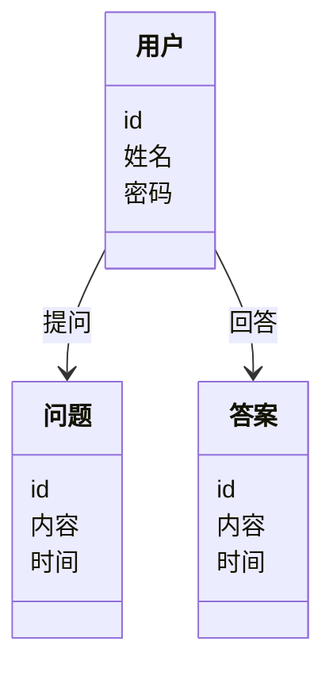
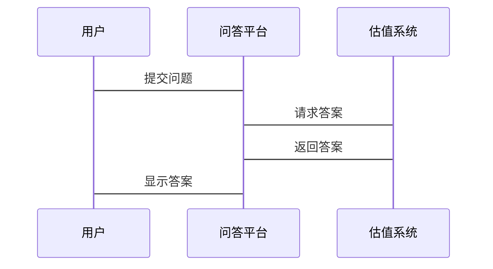
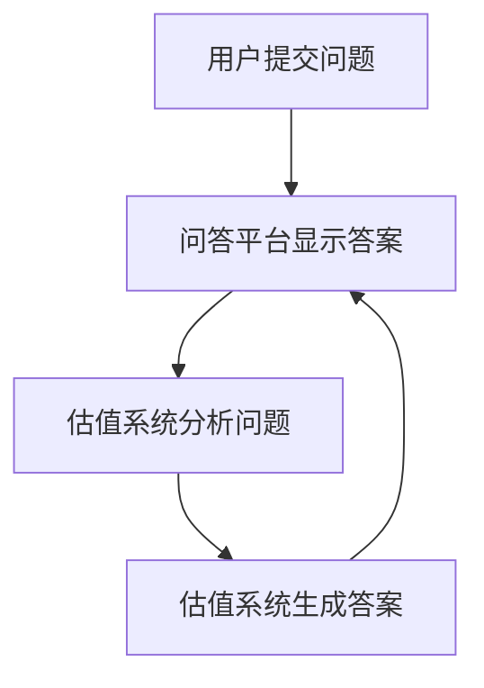

                 


# 《企业估值中的AI驱动的自然语言问答平台评估》

## 关键词：企业估值, AI驱动, 自然语言处理, 问答平台, 情感分析

## 摘要：本文探讨了如何利用AI驱动的自然语言处理技术，特别是问答平台中的自然语言问答，来对企业进行估值分析。通过详细分析自然语言处理的核心概念、问答平台评估的核心算法以及系统架构设计，本文旨在为企业估值提供一种创新的、基于AI的解决方案。

---

## 第1章: 引言

### 1.1 企业估值的重要性

#### 1.1.1 企业估值的基本概念

企业估值是通过对企业财务状况、市场地位、发展前景等多方面进行分析，确定企业价值的过程。传统的企业估值方法包括财务指标法、市盈率法和现金流折现法等。

#### 1.1.2 企业估值的传统方法与挑战

- **财务指标法**：基于企业的财务数据，如收入、利润等进行估值，但忽略了市场情绪和企业声誉的影响。
- **市盈率法**：通过市盈率与行业平均值进行比较，但受市场波动影响较大。
- **现金流折现法**：基于未来现金流的现值进行估值，计算复杂且依赖于假设条件。

### 1.2 AI驱动的问答平台在企业估值中的作用

#### 1.2.1 问答平台的定义与特点

问答平台是用户可以提出问题并获得答案的在线平台，具有实时性、互动性和信息丰富的特点。问答平台中的信息可以反映市场对企业的看法和情绪。

#### 1.2.2 AI技术在问答平台中的应用

AI技术可以通过自然语言处理（NLP）对问答平台中的文本进行分析，提取有用的信息，如用户对企业的产品、服务、管理等方面的评价，从而辅助企业估值。

### 1.3 本书的背景与目标

#### 1.3.1 本书的背景

随着AI技术的发展，自然语言处理技术在问答平台中的应用越来越广泛。通过分析问答平台中的文本信息，可以为企业估值提供新的视角。

#### 1.3.2 本书的目标

本文旨在探讨如何利用AI驱动的自然语言问答平台，对企业进行估值分析，提出一种创新的企业估值方法。

---

## 第2章: 企业估值与AI驱动问答平台的背景

### 2.1 企业估值的传统方法与挑战

#### 2.1.1 财务指标法

财务指标法通过分析企业的财务数据，如收入、利润等，进行估值。但这种方法忽略了市场情绪和企业声誉的影响。

#### 2.1.2 市盈率法

市盈率法通过比较企业的市盈率与行业平均值，进行估值。但这种方法受市场波动影响较大。

#### 2.1.3 现金流折现法

现金流折现法通过预测企业的未来现金流，计算其现值进行估值。但这种方法计算复杂，依赖于假设条件。

### 2.2 自然语言处理在企业估值中的应用

#### 2.2.1 NLP技术的基本概念

自然语言处理（NLP）是计算机科学领域中的一个分支，旨在让计算机能够理解、分析和生成人类语言。

#### 2.2.2 NLP在企业新闻分析中的应用

通过NLP技术，可以对企业新闻中的关键词进行分析，提取有用的信息，辅助企业估值。

### 2.3 AI驱动的问答平台现状

#### 2.3.1 问答平台的类型

问答平台可以分为通用问答平台和垂直问答平台。通用问答平台如知乎、Quora，垂直问答平台如医疗问答平台。

#### 2.3.2 AI在问答平台中的应用现状

AI技术在问答平台中的应用主要包括自动问答生成、情感分析、意图识别等。

---

## 第3章: 自然语言处理基础

### 3.1 自然语言处理的核心概念

#### 3.1.1 什么是自然语言处理

自然语言处理（NLP）是计算机科学领域中的一个分支，旨在让计算机能够理解、分析和生成人类语言。

#### 3.1.2 NLP的主要任务

NLP的主要任务包括文本分词、实体识别、情感分析、意图识别等。

### 3.2 常见的NLP模型与工具

#### 3.2.1 BERT模型

BERT模型是一种基于Transformer的预训练模型，广泛应用于文本分类、问答匹配等任务。

#### 3.2.2 GPT模型

GPT模型是一种生成式模型，可以生成连贯的文本。

#### 3.2.3 spaCy框架

spaCy是一个用于NLP任务的开源框架，支持文本分词、实体识别等功能。

### 3.3 NLP在问答平台中的应用

#### 3.3.1 文本分词

文本分词是将连续的文本分割成词语的过程，是NLP任务的基础。

#### 3.3.2 实体识别

实体识别是识别文本中的实体，如人名、地名、组织名等。

#### 3.3.3 情感分析

情感分析是判断文本中表达的情感是正面、负面还是中性。

---

## 第4章: 问答平台评估的核心算法

### 4.1 情感分析算法

#### 4.1.1 情感分析的基本概念

情感分析是判断文本中表达的情感是正面、负面还是中性。

#### 4.1.2 情感分析的实现步骤

1. **文本预处理**：包括分词、去停用词等。
2. **特征提取**：提取文本中的关键词。
3. **模型训练**：使用机器学习或深度学习模型进行训练。
4. **情感预测**：对新的文本进行情感预测。

#### 4.1.3 情感分析的数学模型

$$ P(y|x) = \frac{P(x|y)}{P(x)} $$

其中，$P(y|x)$ 是条件概率，表示在给定文本$x$的情况下，情感$y$的概率。

### 4.2 意图识别算法

#### 4.2.1 意图识别的基本概念

意图识别是识别用户在文本中表达的意图，如查询、投诉、建议等。

#### 4.2.2 意图识别的实现步骤

1. **文本预处理**：包括分词、去停用词等。
2. **特征提取**：提取文本中的关键词。
3. **模型训练**：使用机器学习或深度学习模型进行训练。
4. **意图预测**：对新的文本进行意图预测。

### 4.3 问答匹配算法

#### 4.3.1 问答匹配的基本概念

问答匹配是将用户的问题与预存的答案进行匹配，找到最相关的答案。

#### 4.3.2 问答匹配的实现步骤

1. **文本预处理**：包括分词、去停用词等。
2. **特征提取**：提取文本中的关键词。
3. **模型训练**：使用机器学习或深度学习模型进行训练。
4. **问答匹配**：对新的问题进行匹配，找到最相关的答案。

---

## 第5章: 系统架构与设计

### 5.1 系统功能设计

#### 5.1.1 领域模型



#### 5.1.2 系统架构


#### 5.1.3 接口设计



#### 5.1.4 交互流程



---

## 第6章: 项目实战

### 6.1 环境搭建

#### 6.1.1 安装Python

```bash
pip install python
```

#### 6.1.2 安装NLP库

```bash
pip install spacy
```

### 6.2 系统核心实现

#### 6.2.1 代码实现

```python
import spacy

nlp = spacy.load("zh_core_web_sm")
doc = nlp("这个公司发展前景很好。")
for token in doc:
    print(token.text)
```

#### 6.2.2 代码解读

上述代码加载了一个中文NLP模型，并对文本进行分词处理，输出每个词的文本内容。

### 6.3 实际案例分析

#### 6.3.1 案例分析

假设我们有一个问答平台，用户提交了以下问题：

“这家公司的财务状况如何？”

通过NLP技术，我们可以分析用户的意图是查询公司财务状况，然后从预存的答案中找到最相关的答案，如“公司财务状况良好，收入增长稳定。”

### 6.4 项目小结

通过上述步骤，我们可以利用NLP技术，实现问答平台的自动化问答功能，辅助企业估值。

---

## 第7章: 最佳实践与总结

### 7.1 小结

本文详细探讨了如何利用AI驱动的自然语言问答平台，对企业进行估值分析。通过分析自然语言处理的核心概念、问答平台评估的核心算法以及系统架构设计，提出了一个创新的企业估值方法。

### 7.2 注意事项

在实际应用中，需要注意数据质量、模型选择以及结果解释等问题。

### 7.3 未来趋势

随着AI技术的不断发展，自然语言处理在企业估值中的应用将更加广泛和深入。

### 7.4 拓展阅读

建议读者进一步阅读相关领域的书籍和论文，深入理解自然语言处理和企业估值的相关知识。

---

## 结语

通过本文的探讨，我们希望能够为企业估值提供一种创新的、基于AI的解决方案，帮助读者更好地理解和应用AI驱动的自然语言问答平台在企业估值中的作用。

