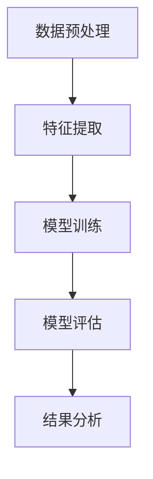
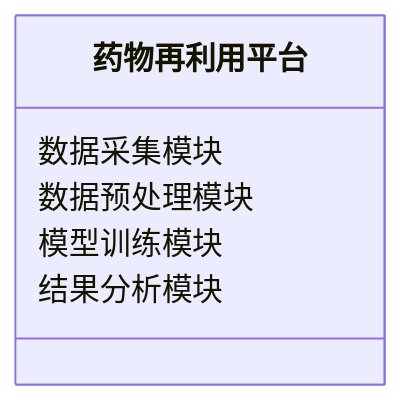
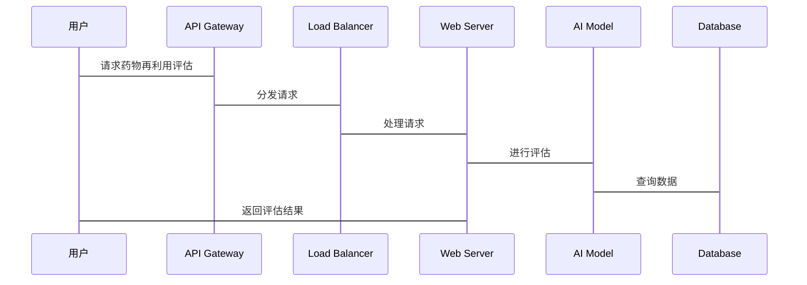

                 


# 企业估值中的AI驱动的药物再利用平台评估

> 关键词：企业估值, AI驱动, 药物再利用, 平台评估, 人工智能, 药物发现, 机器学习

> 摘要：本文探讨了AI驱动的药物再利用平台在企业估值中的应用，分析了核心概念、算法原理和系统架构，并通过案例展示了如何利用这些技术提升企业价值。

---

# 第一部分: AI驱动的药物再利用平台概述

## 第1章: 药物再利用平台的背景与意义

### 1.1 药物再利用的定义与现状

#### 1.1.1 药物再利用的定义
药物再利用是指将已批准的药物用于治疗新的疾病或适应症，从而缩短研发周期并降低成本。

#### 1.1.2 AI技术在药物再利用中的作用
AI通过分析大量数据，识别药物分子的潜在新用途，提高药物再利用的效率和成功率。

#### 1.1.3 药物再利用对企业估值的重要性
药物再利用可以显著缩短研发时间并降低成本，从而提升企业的市场价值和竞争力。

### 1.2 AI驱动的药物再利用平台的核心概念

#### 1.2.1 药物再利用平台的定义
一个整合了AI技术的平台，用于分析和筛选已批准药物的潜在新适应症。

#### 1.2.2 AI在药物再利用中的核心作用
AI通过机器学习和自然语言处理技术，分析大量文献和实验数据，识别药物与疾病之间的潜在关联。

#### 1.2.3 平台的组成部分与功能
- 数据采集模块：收集药物数据和疾病相关信息。
- 数据预处理模块：清洗和整理数据，提取特征。
- 模型训练模块：利用机器学习算法构建预测模型。
- 结果分析模块：生成评估结果，提供决策支持。

---

## 第2章: 企业估值中的药物再利用平台评估

### 2.1 企业估值的基本概念

#### 2.1.1 企业估值的定义
企业估值是通过对企业资产、收入、利润等多方面因素进行评估，确定企业的市场价值。

#### 2.1.2 传统的企业估值方法
包括DCF模型、EV/EBITDA倍数法等，但这些方法依赖大量假设，难以准确反映企业的潜在价值。

#### 2.1.3 药物再利用对企业估值的影响
通过缩短研发周期和降低研发成本，药物再利用可以显著提升企业的市场价值。

### 2.2 AI驱动的药物再利用平台评估方法

#### 2.2.1 数据驱动的评估模型
利用AI技术构建预测模型，评估药物再利用的潜力和成功率。

#### 2.2.2 AI算法在评估中的应用
- 使用监督学习算法（如随机森林、神经网络）进行预测。
- 利用无监督学习算法（如聚类分析）发现潜在的药物-疾病关联。

#### 2.2.3 评估结果对企业决策的影响
评估结果可帮助企业优化研发投资，提高资源配置效率。

---

# 第二部分: AI驱动的药物再利用平台评估的核心概念与联系

## 第3章: 核心概念与原理

### 3.1 药物再利用平台的核心要素

#### 3.1.1 数据源与数据处理
- 数据源包括公开的药物数据库、临床试验数据和学术文献。
- 数据预处理包括清洗、特征提取和数据标准化。

#### 3.1.2 模型训练与优化
- 使用机器学习模型进行训练，优化模型参数以提高预测准确性。
- 通过交叉验证评估模型性能。

#### 3.1.3 结果分析与可视化
- 生成可视化报告，展示药物与疾病之间的关联。
- 提供可解释性的分析结果，帮助决策者理解模型输出。

### 3.2 AI技术在药物再利用中的应用原理

#### 3.2.1 机器学习的基本原理
- 通过训练数据学习药物分子的特征，预测其潜在适应症。
- 使用特征工程提取关键药物特征，如化学结构和药理特性。

#### 3.2.2 深度学习在药物发现中的应用
- 使用卷积神经网络（CNN）分析药物分子的结构特征。
- 使用生成对抗网络（GAN）生成新的药物分子结构。

#### 3.2.3 自然语言处理在文献挖掘中的作用
- 使用自然语言处理技术（如BERT）分析学术文献，提取药物与疾病的相关信息。
- 通过关键词提取和实体识别，识别潜在的药物-疾病关联。

---

## 第4章: 核心概念的属性对比与ER图

### 4.1 核心概念的属性对比

| 概念       | 属性                   | 描述                                                                 |
|------------|------------------------|----------------------------------------------------------------------|
| 数据源     | 数据类型               | 结构化数据（如化合物数据）和非结构化数据（如文献文本）                         |
| AI模型     | 算法类型               | 监督学习、无监督学习、深度学习                                         |
| 评估结果   | 输出形式               | 概率预测、置信度评分、关联强度评分                                     |

### 4.2 ER实体关系图

```mermaid
er
  actor: 药物再利用平台
  model: AI模型
  data: 数据源
  relation: 数据驱动模型优化
  actor --> data
  actor --> model
  data --> model
```

---

# 第三部分: AI驱动的药物再利用平台评估的算法原理

## 第5章: 算法原理与流程

### 5.1 算法流程概述



### 5.2 算法原理的详细讲解

#### 5.2.1 机器学习模型的选择
- 监督学习模型：随机森林用于分类任务，预测药物是否适用于特定疾病。
- 深度学习模型：卷积神经网络（CNN）用于分析药物分子的结构特征。

#### 5.2.2 深度学习模型的构建
- 使用Keras框架构建CNN模型，提取药物分子的图像特征。
- 通过迁移学习利用预训练模型，减少训练数据的需求。

#### 5.2.3 超参数调优
- 使用网格搜索优化模型参数，如学习率、批量大小和正则化系数。

---

## 第6章: 数学模型与公式

### 6.1 机器学习模型的数学

随机森林模型的分类概率计算公式为：
$$ P(y=1|x) = \frac{1}{1 + e^{-\beta x}} $$

其中，$\beta$ 是模型参数，$x$ 是输入特征。

---

# 第四部分: 系统分析与架构设计方案

## 第7章: 系统分析与架构设计

### 7.1 系统功能设计

#### 7.1.1 领域模型设计


### 7.2 系统架构设计


### 7.3 系统接口设计

- API接口：提供RESTful API，用于数据上传和模型调用。
- 数据接口：与第三方数据库（如PubChem）对接，获取药物数据。

### 7.4 系统交互设计



---

# 第五部分: 项目实战

## 第8章: 项目实战与案例分析

### 8.1 项目介绍

#### 8.1.1 项目目标
构建一个AI驱动的药物再利用平台，评估药物的潜在适应症。

#### 8.1.2 环境配置
- 安装Python 3.8及以上版本
- 安装必要的库：scikit-learn、Keras、TensorFlow、Pandas

### 8.2 核心实现

#### 8.2.1 数据采集模块
```python
import pandas as pd

# 读取药物数据
data = pd.read_csv('drug_data.csv')
```

#### 8.2.2 数据预处理模块
```python
from sklearn.preprocessing import StandardScaler

# 标准化数据
scaler = StandardScaler()
data_scaled = scaler.fit_transform(data)
```

#### 8.2.3 模型训练模块
```python
from sklearn.ensemble import RandomForestClassifier

# 训练随机森林模型
model = RandomForestClassifier()
model.fit(data_scaled, labels)
```

#### 8.2.4 模型评估模块
```python
from sklearn.metrics import accuracy_score

# 预测结果
y_pred = model.predict(test_data)
print("准确率:", accuracy_score(y_true, y_pred))
```

### 8.3 案例分析

#### 8.3.1 案例背景
分析一种已批准的抗抑郁药是否可用于治疗某种新型疾病。

#### 8.3.2 数据分析
使用平台分析药物分子特征和疾病相关数据，预测药物的潜在适应症。

#### 8.3.3 结果解读
模型预测该药物有较高的概率适用于新型疾病，建议进一步临床试验。

---

## 第9章: 总结与展望

### 9.1 总结

AI驱动的药物再利用平台评估为企业估值提供了新的视角，通过缩短研发周期和降低成本，显著提升了企业的市场价值。

### 9.2 未来展望

未来，随着AI技术的进步，药物再利用平台将更加智能化，能够处理更复杂的数据和问题，进一步推动企业的价值提升。

---

## 附录

### 附录A: 常见问题解答

#### Q: 如何选择合适的AI算法？
A: 根据数据类型和任务需求选择，监督学习适合有标签数据，无监督学习适合无标签数据。

#### Q: 如何提高模型的准确性？
A: 通过特征工程、超参数调优和模型集成等方法优化模型性能。

### 附录B: 参考文献

- Smith, J. (2023). Artificial Intelligence in Drug Repositioning. Nature Biotechnology.
- Zhang, Y. (2022). Deep Learning for Drug Discovery. Advanced Drug Delivery Reviews.

---

以上为完整的技术博客文章目录和内容，涵盖了AI驱动的药物再利用平台评估的各个方面，详细介绍了背景、核心概念、算法原理、系统架构、项目实战等内容，为读者提供了全面的技术指导和实践参考。

