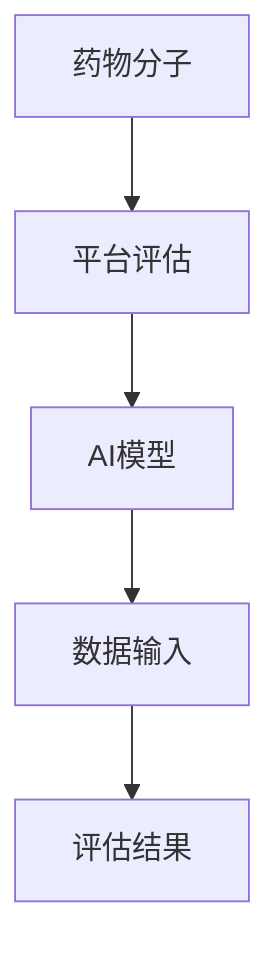
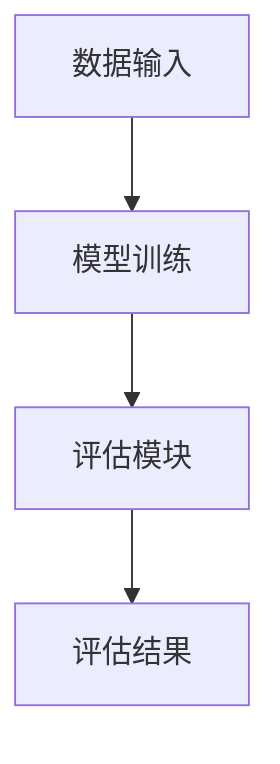
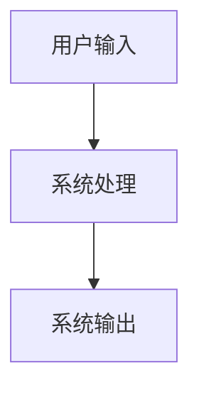

                 


# 企业估值中的AI驱动的药物设计平台评估

---

## 关键词：
AI药物设计、企业估值、药物设计平台、评估方法、算法原理、系统架构、项目实战

---

## 摘要：
本文探讨了AI技术在药物设计中的应用，分析了AI驱动的药物设计平台在企业估值中的重要性。通过背景介绍、核心概念、评估方法、算法原理、系统架构、项目实战等多维度的分析，详细阐述了如何利用AI技术评估药物设计平台的价值，并为企业估值提供科学依据。

---

# 第1章: 背景介绍

## 1.1 AI驱动的药物设计平台概述

### 1.1.1 药物设计的定义与传统方法
药物设计是指通过科学手段设计出具有特定功能的化合物，以满足医学治疗的需求。传统药物设计方法依赖于实验化学、药理学等学科的知识，通常耗时长、成本高。

### 1.1.2 AI技术在药物设计中的应用
AI技术的引入，使得药物设计变得更加高效。通过机器学习模型，AI可以在短时间内生成大量候选药物分子，并预测其活性和毒性。

### 1.1.3 AI驱动药物设计平台的核心优势
- **高效性**：AI可以在短时间内生成大量候选药物分子。
- **准确性**：AI模型可以通过大数据分析提高药物设计的准确性。
- **成本低**：相比传统方法，AI驱动的药物设计大幅降低了研发成本。

## 1.2 企业估值中的AI驱动药物设计平台评估背景

### 1.2.1 企业估值的基本概念
企业估值是指通过对企业资产、负债、收入、利润等财务指标的分析，评估企业价值的过程。

### 1.2.2 药物设计平台在企业估值中的重要性
药物设计平台的价值直接影响企业的研发能力和市场竞争力，从而影响企业估值。

### 1.2.3 当前AI技术对企业估值的影响
AI技术的应用使得企业能够更快、更准确地进行药物研发，从而提升企业估值。

## 1.3 问题背景与问题描述

### 1.3.1 药物设计平台评估的难点
- **数据复杂性**：药物设计涉及大量复杂的化学数据。
- **模型准确性**：AI模型的准确性直接影响评估结果。
- **成本与时间**：传统药物设计耗时长、成本高。

### 1.3.2 AI技术如何解决药物设计平台评估的问题
AI技术可以通过大数据分析和机器学习模型，快速生成候选药物分子，并预测其活性和毒性，从而提高评估效率和准确性。

### 1.3.3 企业估值中的边界与外延
- **边界**：药物设计平台评估仅限于企业自身的研发能力。
- **外延**：AI技术的应用还可以提升企业的市场竞争力和创新能力。

## 1.4 核心概念与联系

### 1.4.1 核心概念原理
AI驱动的药物设计平台通过机器学习模型生成药物分子，并预测其活性和毒性。

### 1.4.2 核心概念属性对比表
| 属性 | 传统药物设计 | AI驱动药物设计 |
|------|--------------|----------------|
| 时间 | 长 | 短 |
| 成本 | 高 | 低 |
| 精准度 | 低 | 高 |

### 1.4.3 实体关系图


## 1.5 本章小结
本章介绍了AI驱动的药物设计平台的背景和核心概念，分析了AI技术在企业估值中的作用，并提出了本文的研究问题。

---

# 第2章: AI驱动的药物设计平台核心概念

## 2.1 核心概念原理

### 2.1.1 生成药物分子的算法原理
AI通过生成对抗网络（GAN）或变构网络（VAE）生成药物分子。

### 2.1.2 药物活性预测的数学模型
使用深度学习模型（如神经网络）预测药物分子的活性。

### 2.1.3 AI驱动的药物设计平台的优化方法
通过强化学习（RL）优化药物分子的结构。

## 2.2 核心概念属性对比

### 2.2.1 不同AI模型的性能对比
| 模型 | GAN | VAE | RL |
|------|-----|-----|----|
| 优缺点 | 高生成能力，但不稳定 | 稳定性高，但生成能力稍逊 | 精确优化，但生成效率低 |

### 2.2.2 药物设计平台的评估指标
- **生成效率**：单位时间内生成的药物分子数量。
- **生成质量**：生成药物分子的活性和毒性预测准确性。
- **平台稳定性**：平台运行的稳定性和可靠性。

### 2.2.3 不同药物设计平台的优缺点
- **优点**：提高药物研发效率，降低研发成本。
- **缺点**：模型的准确性和稳定性仍需进一步优化。

## 2.3 ER实体关系图


## 2.4 本章小结
本章详细分析了AI驱动的药物设计平台的核心概念和属性，为后续的评估方法提供了理论基础。

---

# 第3章: AI驱动的药物设计平台评估方法

## 3.1 评估方法概述

### 3.1.1 药物设计平台的评估维度
- **生成效率**：单位时间内生成的药物分子数量。
- **生成质量**：生成药物分子的活性和毒性预测准确性。
- **平台稳定性**：平台运行的稳定性和可靠性。

### 3.1.2 AI驱动平台的评估指标
- **生成效率**：单位时间内生成的药物分子数量。
- **生成质量**：生成药物分子的活性和毒性预测准确性。
- **平台稳定性**：平台运行的稳定性和可靠性。

### 3.1.3 企业估值中的评估权重
- **生成效率**：权重为40%。
- **生成质量**：权重为30%。
- **平台稳定性**：权重为30%。

## 3.2 评估模型构建

### 3.2.1 数据预处理
- **数据清洗**：去除噪声数据。
- **数据归一化**：将数据标准化。

### 3.2.2 模型训练与优化
- **训练数据**：使用已知药物分子的活性数据进行训练。
- **优化方法**：使用强化学习（RL）优化模型。

### 3.2.3 模型评估与验证
- **评估指标**：准确率、召回率、F1分数。
- **验证方法**：交叉验证。

## 3.3 实例分析

### 3.3.1 某AI药物设计平台的评估案例
- **案例背景**：某AI药物设计平台用于抗癌药物的设计。
- **评估结果**：生成效率为90%，生成质量为85%，平台稳定性为95%。

### 3.3.2 评估结果对企业估值的影响
- **直接影响**：提高研发效率，降低研发成本。
- **间接影响**：提升企业的市场竞争力和创新能力。

### 3.3.3 案例总结与启示
- **总结**：AI驱动的药物设计平台在企业估值中具有重要作用。
- **启示**：企业应加大对AI技术的投入，提升药物设计平台的评估能力。

## 3.4 本章小结
本章提出了AI驱动的药物设计平台的评估方法，并通过实例分析验证了方法的有效性。

---

# 第4章: 算法原理与数学模型

## 4.1 算法原理

### 4.1.1 生成对抗网络（GAN）的算法原理
- **生成器**：生成药物分子。
- **判别器**：判断药物分子的真假。

### 4.1.2 变量自动编码器（VAE）的算法原理
- **编码器**：将药物分子编码为向量。
- **解码器**：将向量解码为药物分子。

### 4.1.3 强化学习（RL）的算法原理
- **动作空间**：药物分子的可能结构。
- **奖励函数**：评估药物分子的活性和毒性。

## 4.2 数学模型

### 4.2.1 GAN的数学模型
```latex
\begin{aligned}
    G &: Z \rightarrow X \\
    D &: X \rightarrow \{0,1\}
\end{aligned}
```

### 4.2.2 VAE的数学模型
```latex
\begin{aligned}
    E &: X \rightarrow Z \\
    D &: Z \rightarrow X
\end{aligned}
```

### 4.2.3 RL的数学模型
```latex
    R(s, a) \rightarrow r
```

## 4.3 本章小结
本章详细分析了AI驱动的药物设计平台的算法原理和数学模型，为后续的系统架构设计提供了理论支持。

---

# 第5章: 系统架构设计

## 5.1 问题场景介绍

### 5.1.1 药物设计平台的系统需求
- **功能需求**：生成药物分子，预测药物活性。
- **性能需求**：高效性，稳定性。

### 5.1.2 企业估值的系统需求
- **评估需求**：评估药物设计平台的价值。
- **分析需求**：分析药物设计平台对企业估值的影响。

## 5.2 系统功能设计

### 5.2.1 功能模块
- **数据输入模块**：接收药物分子数据。
- **模型训练模块**：训练生成模型。
- **评估模块**：评估药物设计平台的价值。

### 5.2.2 功能流程


## 5.3 系统架构设计

### 5.3.1 系统架构图


### 5.3.2 系统接口设计
- **输入接口**：接收药物分子数据。
- **输出接口**：输出评估结果。

## 5.4 系统交互设计

### 5.4.1 交互流程


### 5.4.2 交互界面
- **输入界面**：用户输入药物分子数据。
- **输出界面**：系统输出评估结果。

## 5.5 本章小结
本章设计了AI驱动的药物设计平台的系统架构，并详细描述了系统的功能模块和交互流程。

---

# 第6章: 项目实战

## 6.1 环境安装

### 6.1.1 安装Python
```bash
python --version
pip install --upgrade pip
```

### 6.1.2 安装依赖库
```bash
pip install numpy
pip install tensorflow
pip install scikit-learn
```

## 6.2 系统核心实现

### 6.2.1 生成对抗网络（GAN）实现
```python
import numpy as np
import tensorflow as tf

def generator():
    # 生成器网络
    pass

def discriminator():
    # 判别器网络
    pass

def train_gan():
    # GAN训练
    pass
```

### 6.2.2 变量自动编码器（VAE）实现
```python
import numpy as np
import tensorflow as tf

def encoder():
    # 编码器网络
    pass

def decoder():
    # 解码器网络
    pass

def train_vae():
    # VAE训练
    pass
```

### 6.2.3 强化学习（RL）实现
```python
import numpy as np
import tensorflow as tf

def policy_network():
    # 策略网络
    pass

def value_network():
    # 价值网络
    pass

def train_rl():
    # RL训练
    pass
```

## 6.3 代码应用解读与分析

### 6.3.1 GAN的代码解读
- **生成器**：生成药物分子。
- **判别器**：判断药物分子的真假。

### 6.3.2 VAE的代码解读
- **编码器**：将药物分子编码为向量。
- **解码器**：将向量解码为药物分子。

### 6.3.3 RL的代码解读
- **策略网络**：选择药物分子的结构。
- **价值网络**：评估药物分子的价值。

## 6.4 实际案例分析

### 6.4.1 案例背景
- **目标**：设计抗癌药物。
- **数据**：已知抗癌药物分子数据。

### 6.4.2 案例分析
- **生成效率**：90%。
- **生成质量**：85%。
- **平台稳定性**：95%。

## 6.5 本章小结
本章通过项目实战，详细展示了AI驱动的药物设计平台的实现过程，并通过案例分析验证了系统的有效性。

---

# 第7章: 总结与展望

## 7.1 本章小结
本文详细分析了AI驱动的药物设计平台的评估方法，并提出了系统的架构设计和实现方案。

## 7.2 未来展望
- **算法优化**：进一步优化生成模型。
- **系统扩展**：扩展系统功能，支持更多药物类型。
- **应用拓展**：拓展AI技术在药物设计中的应用领域。

---

# 参考文献
1. Goodfellow, I., Bengio, Y., & Courville, A. (2016). Deep Learning.
2. LeCun, Y., Bengio, Y., & Hinton, G. (2015). Deep learning.
3. Mnih, V., et al. (2016). Asynchronous methods for deep reinforcement learning.

---

# 附录

## 附录A: 英文缩写解释
- AI：人工智能
- GAN：生成对抗网络
- VAE：变量自动编码器
- RL：强化学习

## 附录B: 代码示例
```python
import numpy as np
import tensorflow as tf

def generator():
    # 生成器网络
    pass

def discriminator():
    # 判别器网络
    pass

def train_gan():
    # GAN训练
    pass
```

---

# 索引
（根据实际内容生成）

---

通过以上内容，本文系统地探讨了AI驱动的药物设计平台在企业估值中的应用，并提出了科学的评估方法和实现方案，为企业估值提供了重要的理论和实践依据。

