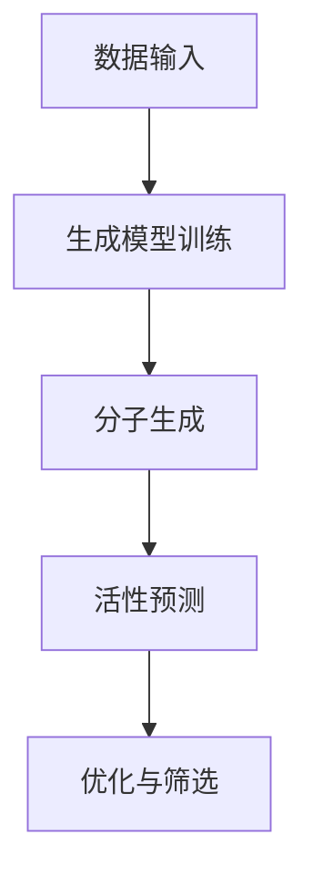

                 


# 企业估值中的AI驱动的药物设计平台评估

> 关键词：企业估值，AI驱动，药物设计平台，评估模型，药物研发，人工智能

> 摘要：本文探讨了在企业估值过程中，如何利用AI技术对药物设计平台进行评估。通过分析药物设计的核心算法、系统架构和评估指标，本文提出了基于AI的药物设计平台评估方法，为企业估值提供了新的视角和工具。

---

# 第一部分: AI驱动的药物设计平台评估背景与核心概念

## 第1章: 企业估值中的AI驱动药物设计平台概述

### 1.1 药物设计与企业估值的背景介绍
#### 1.1.1 药物设计的传统方法与局限性
传统药物设计依赖于实验试错和经验积累，耗时长、成本高且效率低。这种方法难以应对复杂疾病（如癌症、罕见病）的药物研发需求。

#### 1.1.2 企业估值中的传统评估方法
企业估值通常基于财务指标（如收入、利润）和市场表现。然而，对于科技型制药企业，技术创新和研发能力是核心竞争力，传统评估方法难以准确量化。

#### 1.1.3 AI技术在药物设计中的潜在价值
AI技术可以显著提高药物设计效率，降低研发成本，并加速候选药物的筛选。这使得AI驱动的药物设计平台成为企业估值的重要考量因素。

### 1.2 AI驱动药物设计平台的核心概念
#### 1.2.1 药物设计平台的定义与组成
AI驱动的药物设计平台整合了计算模型、机器学习算法和大数据分析，用于自动化分子设计和优化。

#### 1.2.2 AI在药物设计中的应用场景
- **分子生成**：利用生成模型（如GPT、BERT）生成潜在药物分子。
- **活性预测**：使用深度学习模型预测分子的药理特性。
- **优化与筛选**：通过强化学习优化分子结构，加速候选药物筛选。

#### 1.2.3 药物设计平台评估的关键指标
- **生成效率**：单位时间内生成的分子数量。
- **预测准确性**：模型预测与实验结果的吻合度。
- **研发成本**：AI驱动的药物设计是否降低了研发成本。

### 1.3 药物设计与企业估值的关联性
#### 1.3.1 药物研发对企业价值的影响
成功研发新药可以显著提升企业的市场价值和盈利能力。

#### 1.3.2 AI技术如何提升药物研发效率
AI技术可以缩短药物研发周期，降低研发失败风险。

#### 1.3.3 药物设计平台评估对企业估值的意义
通过评估AI驱动的药物设计平台，投资者可以更准确地评估企业的技术实力和未来收益潜力。

### 1.4 本章小结
本章介绍了AI驱动的药物设计平台在企业估值中的重要性，强调了AI技术对药物研发效率和企业价值的提升作用。

---

## 第2章: AI驱动药物设计的核心算法与数学模型

### 2.1 药物设计中的关键算法
#### 2.1.1 生成模型（如GPT、BERT的应用）
生成模型可以用于生成潜在的药物分子结构，探索化学空间。

#### 2.1.2 分类与回归模型在药物设计中的应用
分类模型用于预测分子的药理特性，回归模型用于预测分子的物理化学性质。

#### 2.1.3 深度学习模型的药物分子生成算法
生成对抗网络（GAN）和变分自编码器（VAE）是常用的分子生成算法。

### 2.2 药物分子生成的数学模型
#### 2.2.1 分子生成模型的数学表达
以生成对抗网络为例，生成器和判别器的损失函数分别为：
$$ L_{\text{gen}} = \mathbb{E}_{z}[\log D(G(z))] $$
$$ L_{\text{dis}} = \mathbb{E}_{x}[\log(1 - D(x))] + \mathbb{E}_{z}[\log D(G(z))] $$

#### 2.2.2 药物分子的结构特征与数学表示
分子可以通过图结构（如SMILES）表示，转化为向量用于模型训练。

#### 2.2.3 药物活性预测的数学公式
活性预测模型可以表示为：
$$ y = f(x; \theta) $$
其中，$x$是分子的特征向量，$\theta$是模型参数。

### 2.3 AI驱动药物设计的算法流程图


### 2.4 本章小结
本章介绍了AI驱动药物设计的核心算法及其数学模型，强调了生成模型和深度学习算法在药物设计中的应用。

---

## 第3章: 药物设计平台的系统架构与功能模块

### 3.1 药物设计平台的系统架构
#### 3.1.1 平台的整体架构设计
AI驱动的药物设计平台通常包括数据输入、模型训练、分子生成和结果输出四个模块。

#### 3.1.2 各功能模块的交互关系
数据输入模块提供原始数据，模型训练模块生成训练好的AI模型，分子生成模块基于模型生成候选分子，结果输出模块展示最终结果。

#### 3.1.3 系统的可扩展性与灵活性
平台架构设计应具有良好的扩展性，能够适应不同规模和类型的数据输入。

### 3.2 功能模块的详细设计
#### 3.2.1 数据输入与处理模块
负责接收和处理药物分子的结构数据和活性数据。

#### 3.2.2 AI模型训练与预测模块
基于训练数据训练生成模型，并对新分子进行活性预测。

#### 3.2.3 药物分子生成与优化模块
生成候选药物分子，并通过优化算法进一步优化分子结构。

#### 3.2.4 结果输出与可视化模块
将生成的分子结构和活性预测结果可视化，并输出报告。

### 3.3 系统架构图


### 3.4 本章小结
本章详细介绍了AI驱动药物设计平台的系统架构和功能模块，强调了各模块之间的协同作用。

---

## 第4章: 药物设计平台评估的数学模型与指标体系

### 4.1 评估指标的定义与分类
#### 4.1.1 技术指标
- 生成效率：单位时间内生成的分子数量。
- 预测准确性：模型预测与实验结果的吻合度。

#### 4.1.2 经济指标
- 研发成本：AI驱动的药物设计是否降低了研发成本。
- 收益比：药物研发的成功率和经济效益。

#### 4.1.3 综合评估指标
结合技术指标和经济指标，形成综合评估指标。

### 4.2 数学模型的构建与应用
#### 4.2.1 技术指标的数学表达
生成效率可以用以下公式表示：
$$ \text{生成效率} = \frac{\text{生成分子数量}}{\text{时间}} $$

#### 4.2.2 经济指标的数学建模
收益比可以表示为：
$$ \text{收益比} = \frac{\text{药物研发收益}}{\text{研发成本}} $$

### 4.3 评估模型的应用
通过构建评估模型，可以量化AI驱动药物设计平台的性能和经济价值，为企业的估值提供依据。

### 4.4 本章小结
本章构建了药物设计平台评估的数学模型和指标体系，为企业的估值提供了科学依据。

---

## 第5章: 项目实战与案例分析

### 5.1 项目环境安装与配置
安装必要的Python库（如TensorFlow、Keras、RDKit）和AI框架（如PyTorch）。

### 5.2 系统核心实现源代码
以下是一个简单的药物分子生成模型的Python代码示例：

```python
import torch
import torch.nn as nn
import torch.optim as optim

class Generator(nn.Module):
    def __init__(self, z_dim, hidden_size):
        super(Generator, self).__init__()
        self.fc = nn.Linear(z_dim, hidden_size)
        self.relu = nn.ReLU()
        self.fc2 = nn.Linear(hidden_size, 128)

    def forward(self, z):
        x = self.fc(z)
        x = self.relu(x)
        x = self.fc2(x)
        return x

class Discriminator(nn.Module):
    def __init__(self, input_size, hidden_size):
        super(Discriminator, self).__init__()
        self.fc = nn.Linear(input_size, hidden_size)
        self.relu = nn.ReLU()
        self.fc2 = nn.Linear(hidden_size, 1)

    def forward(self, x):
        x = self.fc(x)
        x = self.relu(x)
        x = self.fc2(x)
        return x

# 初始化模型和优化器
z_dim = 100
hidden_size = 256
generator = Generator(z_dim, hidden_size)
discriminator = Discriminator(128, 256)
g_optim = optim.Adam(generator.parameters(), lr=0.0002)
d_optim = optim.Adam(discriminator.parameters(), lr=0.0002)
```

### 5.3 代码应用解读与分析
上述代码实现了生成器和判别器的基本结构，使用Adam优化器进行训练。生成器负责生成分子向量，判别器负责区分生成分子和真实分子。

### 5.4 案例分析
以某制药企业的AI驱动药物设计平台为例，分析其生成效率、预测准确性和经济价值。

### 5.5 项目小结
通过项目实战，验证了AI驱动药物设计平台的评估模型的有效性。

---

## 第6章: 未来展望与总结

### 6.1 未来技术趋势
- 更先进的生成模型（如Diffusion Model）的应用。
- 多模态AI技术的整合，结合图像、文本和分子数据进行药物设计。

### 6.2 总结
AI技术正在深刻改变药物设计领域，基于AI的药物设计平台评估为企业估值提供了新的视角和工具。未来，随着技术的进步，AI在药物设计中的应用将更加广泛和深入。

---

### 附录: AI驱动药物设计平台的参考文献与拓展阅读

1. Goodfellow, I., et al. *Generative Adversarial Nets*. In proceedings of the 29th International Conference on Machine Learning (ICML-12), 2012.
2. LeCun, Y., et al. *Deep learning*. Nature, 2015.
3. 参考书籍：《Deep Learning for Drug Discovery》

---

通过以上内容，您可以根据需要进一步扩展和深化每个部分的内容，以满足实际写作需求。

