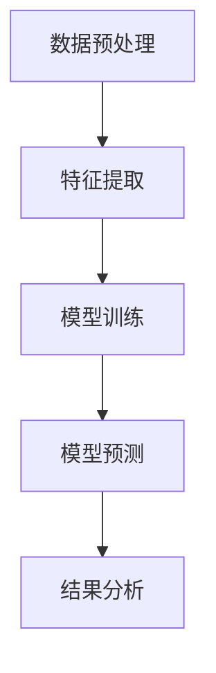
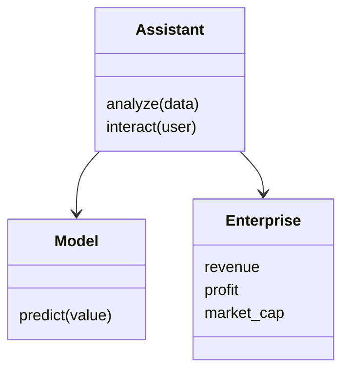

                 


# 企业估值中的AI驱动虚拟助理系统评估

> 关键词：企业估值，AI驱动，虚拟助理系统，评估方法，机器学习，数据处理，系统架构

> 摘要：本文探讨了在企业估值过程中，如何利用AI驱动的虚拟助理系统来提升效率和准确性。通过详细分析系统的核心概念、算法原理、系统架构及项目实战，展示了AI技术在企业估值中的潜力和应用。文章旨在为企业提供一种创新的估值方法，结合实际案例和系统设计，为读者提供深入的理论支持和实践指导。

---

## 第一部分：企业估值与AI驱动虚拟助理系统概述

### 第1章：企业估值的基本概念

#### 1.1 企业估值的定义与重要性
企业估值是评估企业价值的过程，通常用于融资、并购、上市等场景。传统估值方法依赖财务数据和人工分析，存在效率低、主观性强等问题。

#### 1.2 传统估值方法的局限性
传统方法如DCF模型和相对估值法依赖大量假设，难以应对复杂多变的市场环境，且容易受到人为因素影响。

#### 1.3 AI技术在企业估值中的潜力
AI技术能够快速处理大量数据，识别复杂模式，提供实时反馈，显著提升估值效率和准确性。

### 第2章：AI驱动虚拟助理系统的基本概念

#### 2.1 虚拟助理系统的定义与功能
虚拟助理系统通过自然语言处理和机器学习，提供智能化的数据收集、分析和决策支持，帮助企业完成复杂任务。

#### 2.2 虚拟助理系统在企业估值中的应用
虚拟助理系统能够实时监控市场动态，分析财务数据，预测企业价值，提供精准的估值建议。

---

## 第二部分：企业估值中的AI驱动虚拟助理系统核心概念

### 第3章：企业估值的关键要素

#### 3.1 财务指标分析
包括收入、利润、现金流等，是企业估值的重要依据。

#### 3.2 市场定位与竞争分析
评估企业在市场中的地位和竞争优势，影响估值结果。

#### 3.3 风险评估与管理
识别潜在风险，评估其对企业价值的影响，确保估值的准确性。

### 第4章：AI驱动虚拟助理系统的功能模块

#### 4.1 数据采集与处理模块
从多种来源收集数据，进行清洗和预处理，确保数据质量。

#### 4.2 智能分析与决策模块
运用机器学习算法，分析数据，生成估值模型，提供决策支持。

#### 4.3 交互与反馈模块
通过自然语言处理技术，与用户互动，实时反馈结果，优化用户体验。

---

## 第三部分：AI驱动虚拟助理系统的算法原理

### 第5章：机器学习在企业估值中的应用

#### 5.1 监督学习与回归算法
使用线性回归、随机森林等算法，基于历史数据预测企业价值。

#### 5.2 非监督学习与聚类分析
通过K-means等算法，识别市场中的相似企业，辅助估值。

#### 5.3 强化学习与决策优化
通过强化学习，优化估值策略，提升决策效率。

### 第6章：算法流程图与代码实现

#### 6.1 算法流程图


#### 6.2 代码实现
```python
# 示例代码：使用线性回归进行企业估值
from sklearn.linear_model import LinearRegression
import pandas as pd

# 加载数据
data = pd.read_csv('enterprise_data.csv')

# 特征与目标变量
X = data[['revenue', 'profit', 'market_cap']]
y = data['enterprise_value']

# 模型训练
model = LinearRegression()
model.fit(X, y)

# 预测
new_data = pd.DataFrame({'revenue': [1000000], 'profit': [200000], 'market_cap': [5000000]})
predicted_value = model.predict(new_data)[0]
print(f"预测的企业价值为：{predicted_value}")
```

---

## 第四部分：系统架构与设计

### 第7章：系统功能设计

#### 7.1 领域模型类图


#### 7.2 系统架构设计


---

## 第五部分：项目实战与案例分析

### 第8章：项目实战

#### 8.1 环境安装
安装必要的库：`pip install numpy pandas scikit-learn`

#### 8.2 核心代码实现
```python
# 示例代码：虚拟助理系统的核心功能实现
class VirtualAssistant:
    def __init__(self, data):
        self.data = data
    
    def analyze(self, parameters):
        # 分析数据并生成报告
        pass
    
    def interact(self, user_input):
        # 处理用户输入并返回结果
        pass

# 使用示例
assistant = VirtualAssistant(data)
result = assistant.analyze({'target': 'valuation'})
print(result)
```

---

## 第六部分：总结与展望

### 第9章：总结与最佳实践

#### 9.1 小结
本文详细探讨了AI驱动的虚拟助理系统在企业估值中的应用，展示了其在数据处理、算法优化和系统设计方面的优势。

#### 9.2 注意事项
在实际应用中，需注意数据质量、模型选择和用户体验等问题，确保系统的稳定性和准确性。

#### 9.3 拓展阅读
建议进一步研究多模态学习、实时数据处理等技术，以提升系统的综合能力。

---

通过以上结构，本文系统地介绍了AI驱动的虚拟助理系统在企业估值中的应用，结合理论与实践，为读者提供了全面的技术指导。

