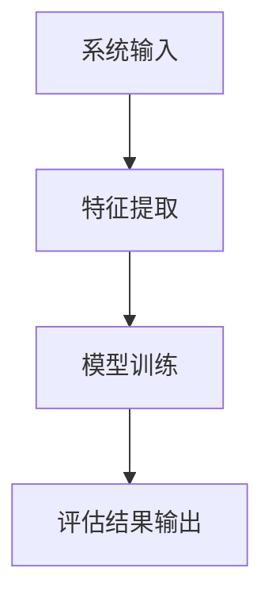
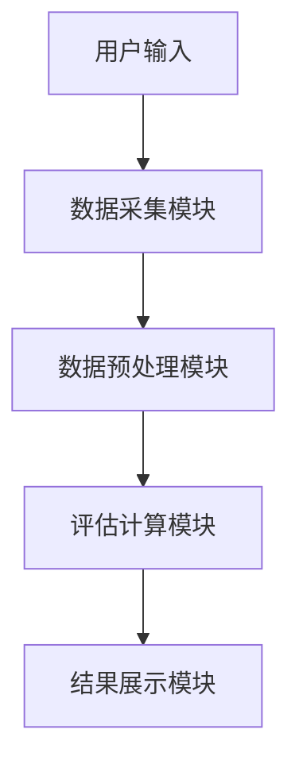

                 


# 企业估值中的AI驱动的虚拟员工系统评估

> 关键词：企业估值、AI驱动、虚拟员工系统、系统评估、算法原理、系统架构、项目实战

> 摘要：本文探讨了AI技术在企业估值中的应用，特别是虚拟员工系统评估方面。通过分析虚拟员工系统的核心概念、算法原理、系统架构设计以及实际案例，展示了如何利用AI驱动的方法提升企业估值的准确性和效率。文章内容涵盖从理论到实践的各个方面，旨在为企业管理人员和技术人员提供有价值的参考。

---

## 第一部分: 企业估值与AI驱动的虚拟员工系统概述

### 第1章: 企业估值的背景与挑战

#### 1.1 企业估值的基本概念
企业估值是通过对企业的财务状况、市场表现、管理团队、技术创新等多个维度进行综合评估，以确定企业价值的过程。传统的企业估值方法主要依赖财务数据和人工分析，存在数据量有限、分析效率低、难以捕捉动态变化等问题。

#### 1.2 虚拟员工系统在企业中的作用
虚拟员工是通过AI技术模拟人类员工工作能力的系统，能够在企业中承担多种任务，如数据处理、客户服务、决策支持等。虚拟员工系统能够显著提高企业的运营效率，降低人工成本，同时具备24/7工作的优势。

---

### 第2章: AI驱动的虚拟员工系统评估的核心概念

#### 2.1 虚拟员工系统评估的基本原理
虚拟员工系统评估是通过对系统性能、效率、准确性等指标进行量化分析，以判断系统是否达到预期目标的过程。评估指标包括响应时间、处理准确性、任务完成率等。

#### 2.2 虚拟员工系统评估的关键技术
AI驱动的虚拟员工系统评估依赖于自然语言处理、机器学习等技术。通过分析系统输入和输出的数据，利用大模型进行特征提取和模型训练，最终生成评估结果。

---

## 第二部分: 算法原理与系统架构设计

### 第3章: 虚拟员工系统评估的算法原理

#### 3.1 基于大模型的评估框架
大模型在系统评估中的作用包括特征提取和模型训练。通过自然语言处理技术，系统能够从非结构化数据中提取关键特征，并利用机器学习算法进行模型训练。

#### 3.2 评估算法的流程图
以下是系统评估的流程图：



#### 3.3 算法实现的Python代码
以下是一个简单的系统评估算法实现示例：

```python
def evaluate_system(input_data):
    features = extract_features(input_data)
    model = train_model(features)
    result = model.predict(features)
    return result
```

---

### 第4章: 虚拟员工系统评估的系统架构设计

#### 4.1 系统架构概述
以下是系统架构的流程图：



#### 4.2 系统功能模块
- 数据采集模块：负责采集系统输入数据。
- 数据预处理模块：对数据进行清洗和转换。
- 评估计算模块：利用算法对系统进行评估。
- 结果展示模块：将评估结果以可视化形式呈现。

---

## 第三部分: 项目实战

### 第5章: 项目实战——虚拟员工系统评估案例分析

#### 5.1 项目背景与目标
以一家电商企业为例，我们希望通过AI驱动的虚拟员工系统评估，优化其客户服务流程，提高客户满意度和工作效率。

#### 5.2 系统实现
- 环境配置：安装Python、机器学习库等。
- 核心代码实现：基于自然语言处理技术的特征提取和模型训练。
- 代码解读与分析：详细解释代码的功能和实现逻辑。

#### 5.3 实际案例分析
通过对电商企业客户服务数据的分析，利用AI驱动的虚拟员工系统评估，识别系统瓶颈并提出改进建议。

---

## 第四部分: 总结与展望

### 第6章: 总结与展望
本文详细探讨了AI驱动的虚拟员工系统评估的核心概念、算法原理和系统架构设计，并通过实际案例展示了其在企业估值中的应用。未来，随着AI技术的不断发展，虚拟员工系统评估将更加智能化和精准化，为企业带来更大的价值。

---

### 最佳实践 Tips
- 在进行系统评估时，建议结合企业的实际需求，选择合适的算法和技术方案。
- 定期对系统进行性能监控和优化，确保评估结果的准确性和可靠性。
- 关注AI技术的最新发展，及时更新系统评估方法和工具。

---

### 小结
通过本文的分析，我们可以看到，AI驱动的虚拟员工系统评估为企业估值提供了全新的思路和方法。无论是从理论还是实践层面，这种结合AI技术的评估方式都展现了巨大的潜力和优势。希望本文能够为相关领域的研究和实践提供有价值的参考。

