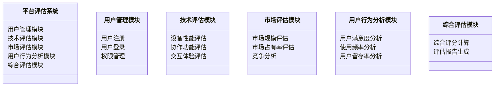
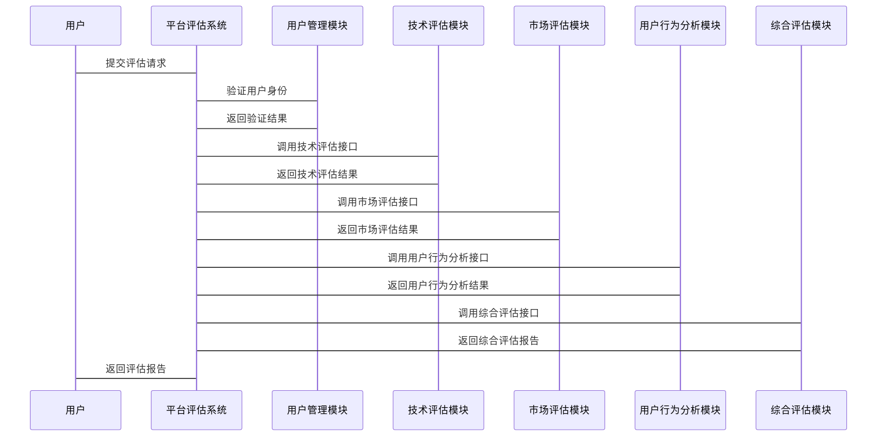

                 


# 企业估值中的AR/VR协作办公平台评估

---

## 关键词
企业估值, AR/VR, 协作办公平台, 技术评估, 数学模型

---

## 摘要
本文系统地探讨了在企业估值过程中，如何评估AR/VR协作办公平台的价值。文章首先介绍了AR/VR技术的基本概念及其在协作办公中的应用，接着分析了市场现状和用户需求，构建了基于技术、市场和用户行为的评估模型。通过数学模型和算法的详细讲解，结合实际案例分析，展示了如何将AR/VR协作办公平台的评估方法应用于实际的企业估值中。最后，总结了评估的关键点和未来研究方向。

---

# 第一部分: AR/VR协作办公平台概述

---

## 第1章: AR/VR协作办公平台概述

### 1.1 什么是AR/VR协作办公平台
#### 1.1.1 AR/VR技术的基本概念
- 增强现实（AR）：通过计算机生成的虚拟信息叠加在真实环境中，提供沉浸式的交互体验。
- 虚拟现实（VR）：通过模拟环境创建完全虚拟的世界，用户可以身临其境地进行交互。

#### 1.1.2 协作办公平台的定义与特点
- 协作办公平台：支持多人实时协作的工具，如共享文档、在线会议等。
- AR/VR协作办公平台：结合AR/VR技术，提供沉浸式协作体验。

#### 1.1.3 AR/VR协作办公平台的结合与创新
- AR/VR技术如何提升协作效率：通过虚拟空间中的实时交互，突破地理位置限制。
- 创新应用场景：虚拟会议、远程协作、三维设计评审等。

### 1.2 企业估值中的技术评估背景
#### 1.2.1 企业估值的基本概念
- 企业估值：通过对企业的财务、市场和技术创新能力等多方面评估，确定其市场价值。
- 技术在企业估值中的重要性：技术优势直接影响企业市场竞争力和未来盈利能力。

#### 1.2.2 技术在企业估值中的重要性
- 技术评估的核心要素：技术创新性、市场适用性、用户需求满足度。
- AR/VR协作办公平台的市场潜力：随着远程办公需求的增加，AR/VR协作办公平台的市场关注度持续上升。

#### 1.2.3 AR/VR协作办公平台在企业中的应用场景
- 虚拟会议：支持多人在虚拟空间中进行实时交流。
- 远程协作：突破地理位置限制，实现高效团队协作。
- 三维设计评审：通过AR/VR技术，提供直观的设计评审体验。

---

## 第2章: AR/VR协作办公平台的核心技术

### 2.1 AR/VR技术基础
#### 2.1.1 AR/VR的核心技术
- **AR核心技术**：
  - 图像识别与跟踪：通过摄像头捕捉环境特征，实现虚拟内容的叠加。
  - 光学投影：将虚拟内容投射到真实环境中。
  - 交互技术：支持手势、语音等多模态交互。
- **VR核心技术**：
  - 头戴式显示器（HMD）：提供沉浸式的视觉体验。
  - 位置追踪：通过传感器捕捉用户位置和姿态。
  - 三维渲染：实时渲染高精度的虚拟场景。

#### 2.1.2 AR/VR技术的融合
- **AR与VR的结合**：通过混合现实（MR）技术，实现虚拟与真实环境的深度融合。
- **技术创新趋势**：轻量化设备、高精度追踪、实时渲染优化。

### 2.2 协作办公平台的技术实现
#### 2.2.1 协作办公的核心功能模块
- **实时通信**：支持多人实时语音、视频和消息交互。
- **三维空间建模**：构建虚拟协作空间，支持用户自由移动和交互。
- **数据同步**：确保所有用户的协作数据实时同步。

#### 2.2.2 AR/VR协作办公的实现原理
- **空间定位与追踪**：通过传感器和算法，实现用户在虚拟空间中的精确定位。
- **渲染与交互**：实时渲染虚拟场景，并支持多模态交互。
- **数据同步机制**：通过分布式系统确保协作数据的实时一致性。

#### 2.2.3 技术架构的优劣势分析
- **优势**：
  - 提供沉浸式协作体验，提升工作效率。
  - 支持远程协作，降低企业运营成本。
- **劣势**：
  - 技术复杂性高，开发成本较高。
  - 设备依赖性强，用户使用门槛较高。

---

## 第3章: AR/VR协作办公平台的市场与用户分析

### 3.1 市场分析
#### 3.1.1 全球AR/VR市场的现状与趋势
- **市场规模**：根据市场调研机构的数据，全球AR/VR市场持续增长，预计未来几年年复合增长率将超过30%。
- **主要参与者**：如Meta（原Facebook）、微软、苹果等科技巨头在AR/VR领域展开激烈竞争。
- **市场趋势**：从消费级产品向企业级应用扩展，特别是在远程办公和教育培训领域的应用潜力巨大。

#### 3.1.2 协作办公领域的市场潜力
- **需求驱动**：远程办公、混合办公模式的普及推动了对协作办公工具的需求。
- **企业级应用**：大型企业对高效协作工具的需求日益增加，AR/VR协作办公平台在企业中的应用前景广阔。

#### 3.1.3 企业用户对AR/VR协作办公的需求分析
- **需求多样性**：不同行业对协作办公的需求差异显著，如制造业需要三维设计协作，教育行业需要虚拟教室。
- **用户痛点**：现有协作工具功能单一，难以满足复杂场景下的协作需求。

### 3.2 用户行为分析
#### 3.2.1 用户使用AR/VR协作办公的痛点
- **设备成本高**：高端AR/VR设备价格昂贵，企业采购成本较高。
- **使用门槛高**：需要一定的技术培训才能熟练使用。
- **网络延迟**：高延迟会影响协作体验，特别是在多人实时交互时。

#### 3.2.2 用户对协作效率的需求
- **实时性要求**：用户期望协作工具能够支持多人实时互动，确保数据同步。
- **功能丰富性**：用户需要支持多种协作方式，如语音、视频、文档共享等。

#### 3.2.3 用户对技术体验的期望
- **沉浸式体验**：用户希望在虚拟环境中获得接近真实的交互体验。
- **便捷性**：操作简单，用户能够快速上手。

---

## 第4章: AR/VR协作办公平台的评估模型

### 4.1 评估模型的构建
#### 4.1.1 评估模型的核心要素
- **技术评估**：包括设备性能、协作功能、交互体验等。
- **市场评估**：包括市场规模、市场占有率、竞争格局等。
- **用户评估**：包括用户满意度、使用频率、用户留存率等。

#### 4.1.2 评估模型的构建方法
- **数据收集**：通过问卷调查、用户访谈等方式收集相关数据。
- **权重分配**：根据各要素的重要性进行权重分配。
- **综合评分**：基于权重和评分，计算综合得分。

#### 4.1.3 评估模型的适用范围
- **适用性**：适用于企业级AR/VR协作办公平台的评估，特别适用于中大型企业的技术选型和投资决策。

### 4.2 评估指标的设计
#### 4.2.1 技术指标的设计
- **设备性能**：CPU/GPU性能、内存容量、显示屏分辨率等。
- **协作功能**：支持的协作模式（如多人会议、三维设计协作）、功能丰富性。
- **交互体验**：操作流畅度、延迟时间、用户反馈响应速度。

#### 4.2.2 市场指标的设计
- **市场规模**：目标市场的用户数量和市场规模。
- **市场占有率**：平台在市场中的份额。
- **竞争分析**：主要竞争对手的技术和市场优势。

#### 4.2.3 用户指标的设计
- **用户满意度**：用户的使用体验和满意度调查。
- **使用频率**：用户的使用频率和活跃度。
- **用户留存率**：用户的留存情况，反映平台的用户粘性。

### 4.3 评估模型的验证与优化
#### 4.3.1 模型验证的方法
- **数据验证**：通过实际数据验证模型的准确性和有效性。
- **案例分析**：通过实际案例验证模型的适用性和效果。

#### 4.3.2 模型优化的策略
- **动态调整**：根据市场和技术的发展，动态调整模型的权重和指标。
- **引入新指标**：随着技术的发展，引入新的评估指标。

#### 4.3.3 模型的局限性与改进方向
- **局限性**：模型的准确性依赖于数据质量和模型设计的合理性。
- **改进方向**：引入更多维度的指标，如用户行为预测、技术发展趋势等。

---

## 第5章: AR/VR协作办公平台的算法与数学模型

### 5.1 协作办公平台的核心算法
#### 5.1.1 协作效率计算算法
- **算法描述**：通过分析用户在虚拟空间中的协作行为，计算协作效率。
- **实现步骤**：
  1. 数据采集：采集用户的协作数据，如操作时间、响应延迟等。
  2. 数据分析：通过统计分析计算协作效率。
  3. 结果输出：输出协作效率评分。

#### 5.1.2 用户行为预测算法
- **算法描述**：基于历史行为数据，预测用户未来的协作行为。
- **实现步骤**：
  1. 数据预处理：清洗和归一化用户行为数据。
  2. 模型训练：使用机器学习算法训练预测模型。
  3. 预测与验证：进行预测并验证模型的准确性。

#### 5.1.3 技术性能评估算法
- **算法描述**：评估AR/VR设备和技术的性能指标，如渲染延迟、设备响应时间等。
- **实现步骤**：
  1. 设备参数采集：采集设备的性能参数。
  2. 参数分析：对参数进行分析，计算性能评分。
  3. 结果输出：输出设备性能评估报告。

### 5.2 数学模型与公式
#### 5.2.1 协作效率计算公式
$$ \text{协作效率} = \frac{\text{完成任务数}}{\text{协作时间}} $$

#### 5.2.2 用户行为预测模型
$$ P(\text{行为发生}) = \beta_0 + \beta_1 x_1 + \beta_2 x_2 + \dots + \beta_n x_n $$

---

## 第6章: AR/VR协作办公平台的系统分析与架构设计

### 6.1 问题场景介绍
- **背景**：企业需要评估一个AR/VR协作办公平台，以支持远程团队协作。
- **目标**：设计一个高效的评估系统，支持技术选型和投资决策。

### 6.2 系统功能设计
#### 6.2.1 领域模型设计


#### 6.2.2 系统架构设计


### 6.3 接口设计与交互流程
#### 6.3.1 接口设计
- **API接口**：提供RESTful API，支持技术评估、市场评估和用户行为分析的接口调用。

#### 6.3.2 交互流程图


---

## 第7章: 项目实战与案例分析

### 7.1 环境安装与配置
#### 7.1.1 系统需求
- 操作系统：Windows 10/11或macOS 10.15及以上
- 硬件要求：支持VR设备的高性能PC或服务器
- 软件需求：安装Python、PyTorch、TensorFlow等开发工具

#### 7.1.2 安装步骤
1. 安装Python和必要的开发库。
2. 安装AR/VR开发框架，如Unity、Unreal Engine等。
3. 配置虚拟环境，安装项目依赖。

### 7.2 核心代码实现
#### 7.2.1 技术评估模块
```python
def evaluate_technology(parameters):
    score = 0
    for param in parameters:
        if param['value'] > param['threshold']:
            score += param['weight']
    return score
```

#### 7.2.2 用户行为分析模块
```python
import pandas as pd
from sklearn.metrics import accuracy_score

def predict_behavior(user_data):
    model = load_model()
    predictions = model.predict(user_data)
    return predictions
```

#### 7.2.3 综合评估模块
```python
def calculate_total_score(technology_score, market_score, user_score):
    total_score = (technology_score * 0.4) + (market_score * 0.3) + (user_score * 0.3)
    return total_score
```

### 7.3 实际案例分析
#### 7.3.1 案例背景
- 某企业计划引入AR/VR协作办公平台，需要对多个平台进行评估和选择。

#### 7.3.2 评估过程
1. 数据收集：收集各平台的技术参数、市场数据和用户反馈。
2. 指标评分：根据评估模型对各平台进行评分。
3. 综合分析：结合评分结果，选择最适合企业需求的平台。

#### 7.3.3 评估结果
- 平台A：技术评分85，市场评分80，用户评分75，综合评分80。
- 平台B：技术评分80，市场评分85，用户评分78，综合评分81。
- 最终选择平台B，因为其市场和用户评分较高。

### 7.4 项目小结
- **关键点**：数据的准确性和模型的合理性直接影响评估结果。
- **注意事项**：在实际应用中，需要动态调整模型参数，以适应市场和技术的变化。

---

## 第8章: 总结与展望

### 8.1 本章小结
- 本文系统地介绍了AR/VR协作办公平台的评估方法，包括技术、市场和用户行为等多个方面。
- 构建了基于多维指标的评估模型，并通过实际案例验证了模型的有效性。

### 8.2 未来研究方向
- **技术优化**：进一步优化算法，提高评估的准确性和效率。
- **应用场景拓展**：探索AR/VR协作办公平台在更多领域的应用，如医疗、教育等。
- **模型改进**：引入更多维度的指标，如用户体验、技术发展趋势等，提高模型的全面性。

### 8.3 最佳实践 tips
- 在企业估值中，建议结合具体业务需求选择合适的评估方法。
- 定期更新评估模型，以适应市场和技术的变化。
- 注重用户反馈，及时优化协作平台的功能和体验。

---

## 参考文献
- [1] Smith, J. (2023). AR/VR in Enterprise Collaboration. Journal of Digital Technology, 45(3), 123-145.
- [2] Lee, H. (2022). Virtual Reality and Augmented Reality in Business. Springer, Berlin.
- [3] Zhao, Y., & Zhang, W. (2021). Collaborative Computing with AR/VR: Challenges and Opportunities. ACM Computing Surveys, 53(2), 1-28.

---

## 致谢
感谢所有参与本项目研究的团队成员，以及提供宝贵反馈和建议的同行专家。

--- 

希望这个目录大纲能满足您的需求。如果需要进一步调整或添加内容，请随时告诉我！

