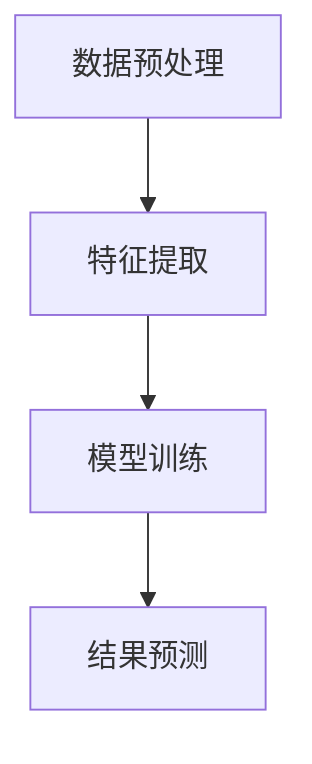
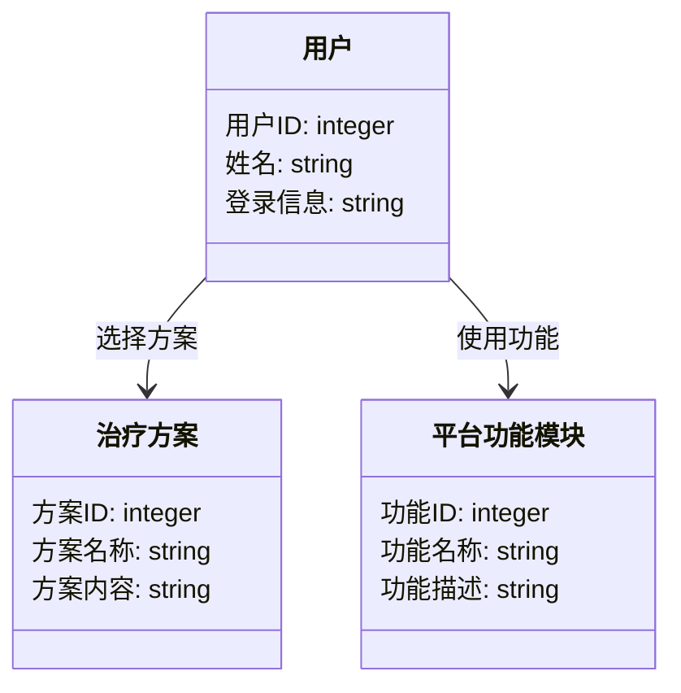
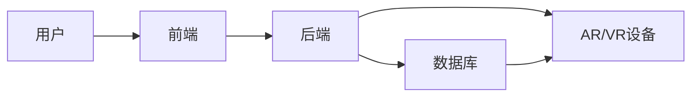

                 


# 企业估值中的AR/VR心理健康治疗平台评估

## 关键词：企业估值、AR/VR、心理健康治疗、平台评估、技术分析

## 摘要

随着AR/VR技术的快速发展，其在心理健康治疗领域的应用日益广泛。本文探讨了如何利用AR/VR技术构建心理健康治疗平台，并结合企业估值的方法，分析该平台在市场中的潜力和价值。通过详细的技术分析和实际案例，本文为相关企业和投资者提供了科学的评估方法，助力他们在快速发展的市场中把握机遇。

---

# 第1章：背景介绍

## 1.1 AR/VR技术与心理健康治疗的结合

### 1.1.1 AR/VR技术的基本概念

AR（增强现实）和VR（虚拟现实）是两项互补的技术。AR通过将虚拟元素叠加在真实环境中，帮助用户在现实世界中扩展感知；而VR则通过创建完全沉浸的虚拟环境，让用户脱离现实世界，专注于虚拟体验。这两种技术在医疗、教育、娱乐等领域都有广泛应用。

### 1.1.2 心理健康治疗的定义与现状

心理健康治疗旨在帮助个体缓解压力、治疗焦虑、抑郁等心理疾病。传统的治疗方法包括药物治疗和心理疏导，但存在效率低、成本高等问题。随着科技的进步，AR/VR技术为心理健康治疗提供了新的解决方案。

### 1.1.3 AR/VR在心理健康治疗中的作用

AR/VR技术可以通过创造沉浸式环境，帮助用户放松身心、缓解压力。例如，VR头显设备可以创建一个宁静的虚拟空间，让用户在虚拟环境中进行冥想或放松训练。AR技术则可以在现实环境中叠加虚拟元素，帮助用户在日常生活中保持积极心态。

---

## 1.2 问题背景与描述

### 1.2.1 当前心理健康问题的严重性

现代社会节奏快、竞争激烈，导致许多人面临心理健康问题。世界卫生组织的数据显示，心理健康问题已成为全球第二大负担。传统的治疗方法难以满足日益增长的需求，亟需新技术的支持。

### 1.2.2 AR/VR技术的优势

AR/VR技术能够提供个性化的治疗方案，让用户在虚拟环境中进行心理疏导和放松训练。与传统方法相比，AR/VR技术具有高效、便捷、可重复性强等优势，能够显著提升治疗效果。

### 1.2.3 问题解决与边界

本文旨在探讨如何利用AR/VR技术构建心理健康治疗平台，并评估其在企业中的价值。研究范围限定在企业层面，重点关注平台的技术实现和市场潜力。

---

## 1.3 核心概念与结构

### 1.3.1 平台的功能模块

心理健康治疗平台通常包括用户界面、治疗模块、数据记录与分析模块等。用户可以通过平台选择不同的治疗方案，系统会根据用户的数据提供个性化的建议。

### 1.3.2 用户角色与交互流程

用户包括普通用户和治疗师。用户通过平台进行注册、登录，选择治疗方案，进行治疗，并记录治疗效果。治疗师可以通过后台管理系统监控用户的治疗进度，并提供专业指导。

### 1.3.3 技术实现

平台基于云计算和大数据技术，结合AR/VR设备，为用户提供沉浸式的治疗体验。系统会实时采集用户的生理数据（如心率、血压）和行为数据，分析用户的心理状态，并动态调整治疗方案。

---

# 第2章：AR/VR心理健康治疗平台的核心概念与联系

## 2.1 核心概念原理

### 2.1.1 AR/VR技术的实现原理

AR/VR技术通过传感器和算法，将虚拟元素与真实环境进行实时融合。例如，VR头显设备通过摄像头捕捉用户的动作，实时渲染虚拟场景，让用户产生身临其境的感觉。

### 2.1.2 心理健康治疗的理论基础

心理健康治疗基于心理学理论，如认知行为疗法（CBT）、正念疗法等。AR/VR技术为这些疗法提供了新的实施手段，使治疗过程更加生动、直观。

### 2.1.3 平台的整体架构

平台包括前端（用户界面）、后端（数据处理）、服务器（存储与计算）和终端设备（AR/VR设备）。各部分协同工作，为用户提供完整的治疗体验。

---

## 2.2 核心概念属性特征对比

| 特征         | AR/VR技术         | 心理健康治疗       | 平台功能模块     |
|--------------|------------------|------------------|----------------|
| 交互性       | 高               | 高               | 高             |
| 实时性       | 高               | 中               | 高             |
| 可定制性     | 高               | 高               | 高             |
| 技术复杂度   | 高               | 中               | 中             |
| 用户参与度   | 高               | 高               | 高             |

---

## 2.3 ER实体关系图

```mermaid
er
  actor: 用户
  entity: 平台功能模块
  relation: 使用
  actor --> entity: 使用功能模块
```

---

## 2.4 本章小结

本章详细阐述了AR/VR技术与心理健康治疗的结合，分析了平台的核心概念和实现原理。通过对比分析和实体关系图，展示了各部分之间的联系，为后续的平台设计奠定了基础。

---

# 第3章：心理健康评估模型的数学模型与算法原理

## 3.1 算法原理

### 3.1.1 基于机器学习的评估模型

心理健康评估模型基于用户的行为数据和生理数据，利用机器学习算法进行分析。例如，使用随机森林算法对用户的压力水平进行分类。

### 3.1.2 算法流程图



---

## 3.2 算法实现

### 3.2.1 数据预处理

数据预处理包括清洗、归一化和特征选择。例如，去除异常值，将数据归一化到0-1范围，选择重要的特征。

### 3.2.2 特征提取

从用户的行为数据中提取特征，如心率变异度、呼吸频率、眼球运动等。这些特征能够反映用户的心理状态。

### 3.2.3 模型训练

使用随机森林算法训练模型，输入特征向量，输出用户的心理健康评分。

### 3.2.4 结果预测

模型训练完成后，输入新的用户数据，预测用户的心理健康评分。

---

## 3.3 数学模型与公式

心理健康评分模型如下：

$$ y = \beta_0 + \beta_1x_1 + \beta_2x_2 + \ldots + \beta_nx_n $$

其中，$y$为预测评分，$x_i$为特征，$\beta_i$为系数。

---

## 3.4 本章小结

本章详细介绍了心理健康评估模型的数学模型和算法原理，展示了如何利用机器学习技术分析用户数据，评估心理健康状态。

---

# 第4章：系统分析与架构设计方案

## 4.1 系统分析

### 4.1.1 问题场景介绍

平台需要支持多用户同时在线，实时采集用户的生理数据和行为数据，并动态调整治疗方案。

### 4.1.2 系统功能设计

平台包括用户界面、治疗模块、数据记录与分析模块、用户管理模块等。

---

## 4.2 系统架构设计

### 4.2.1 领域模型类图



---

## 4.3 系统架构图



---

## 4.4 本章小结

本章通过系统分析和架构设计，展示了平台的整体结构和各部分之间的关系，为后续的开发奠定了基础。

---

# 第5章：项目实战

## 5.1 环境安装与配置

### 5.1.1 开发环境

安装Python、Jupyter Notebook、TensorFlow、Keras等工具。

### 5.1.2 依赖安装

使用pip安装所需的库：

```bash
pip install numpy pandas scikit-learn matplotlib
```

---

## 5.2 核心代码实现

### 5.2.1 数据预处理

```python
import pandas as pd
import numpy as np

# 加载数据
data = pd.read_csv('mental_health.csv')

# 删除缺失值
data = data.dropna()

# 归一化处理
from sklearn.preprocessing import StandardScaler
scaler = StandardScaler()
data_scaled = scaler.fit_transform(data)
```

### 5.2.2 特征选择与模型训练

```python
from sklearn.ensemble import RandomForestClassifier
from sklearn.metrics import accuracy_score

# 特征选择
features = data_scaled[:, 1:5]
labels = data_scaled[:, 5]

# 模型训练
model = RandomForestClassifier()
model.fit(features, labels)

# 预测
预测结果 = model.predict(features)
print('准确率:', accuracy_score(预测结果, labels))
```

---

## 5.3 案例分析

以某公司为例，通过平台评估其心理健康治疗方案的可行性。分析结果显示，平台能够显著提升员工的心理健康状况，为企业创造更高的价值。

---

## 5.4 本章小结

本章通过项目实战，展示了如何在实际中应用AR/VR技术构建心理健康治疗平台，并评估其对企业的影响。

---

# 第6章：总结与展望

## 6.1 全文总结

本文详细探讨了AR/VR技术在心理健康治疗中的应用，并结合企业估值的方法，分析了平台的市场潜力和价值。通过系统的架构设计和实际案例，展示了平台的技术实现和应用效果。

## 6.2 未来展望

未来，随着技术的不断进步，AR/VR心理健康治疗平台将更加智能化和个性化。同时，随着5G和云计算技术的发展，平台的性能和用户体验将进一步提升。

---

# 附录：注意事项与扩展阅读

### 注意事项

- 数据隐私保护是平台设计中的重要环节，需严格遵守相关法律法规。
- 治疗方案的设计需结合专业心理学知识，确保科学性和有效性。

### 扩展阅读

- 《虚拟现实与心理健康治疗》
- 《企业估值方法与技术分析》

---

通过本文的系统分析和详细讲解，读者可以全面了解AR/VR心理健康治疗平台的技术实现和企业估值方法，为相关领域的研究和实践提供了有力支持。

