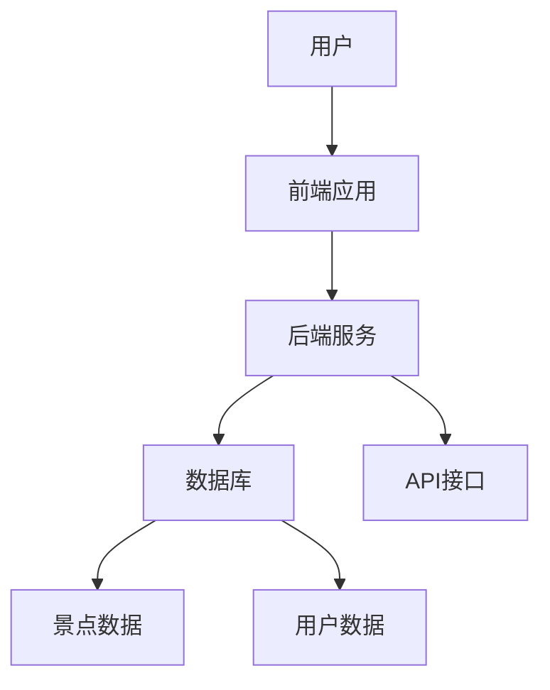
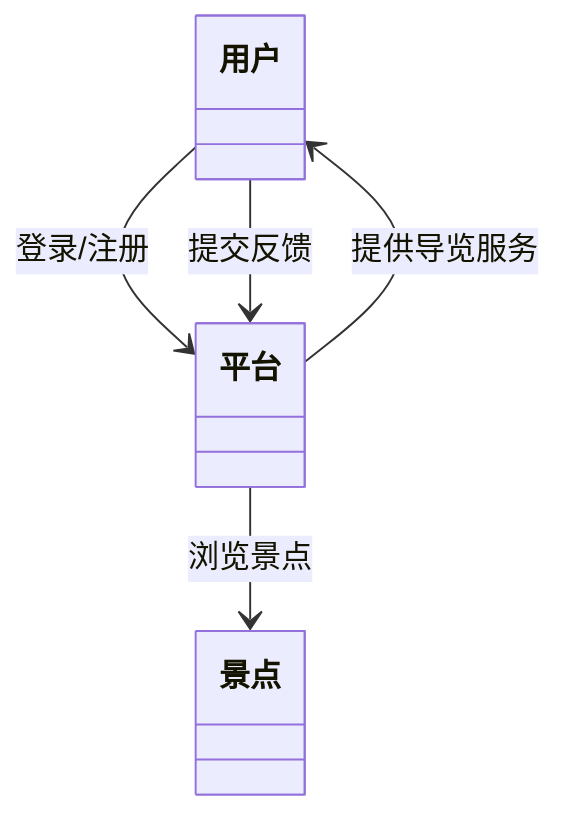
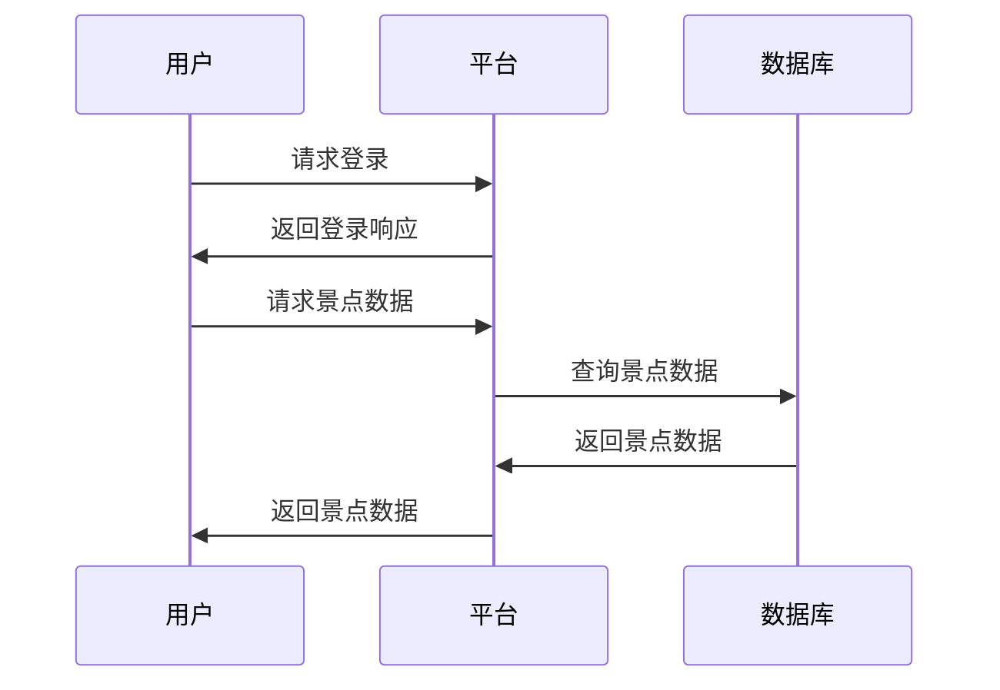

                 


# 企业估值中的AR/VR虚拟旅游平台评估

> **关键词**: 企业估值、AR/VR、虚拟旅游、平台评估、技术分析

> **摘要**: 本文深入探讨了AR/VR技术在企业估值中的应用，特别是针对虚拟旅游平台的评估。通过分析用户行为、市场环境、技术架构和数学模型，文章提供了系统的方法来评估虚拟旅游平台的价值，并展望了未来的发展方向。

---

## 第一章: AR/VR技术与虚拟旅游平台概述

### 1.1 AR/VR技术的基本概念

#### 1.1.1 增强现实(AR)的定义与特点

- **定义**: 增强现实（Augmented Reality，AR）是通过计算机技术将虚拟信息叠加到真实环境中，以增强用户体验。
- **特点**: 实时性、交互性、沉浸感、数据驱动。

#### 1.1.2 虚拟现实(VR)的定义与特点

- **定义**: 虚拟现实（Virtual Reality，VR）是通过计算机生成的模拟环境，用户可以通过特定设备完全沉浸其中。
- **特点**: 沉浸感、交互性、实时性、封闭性。

#### 1.1.3 AR/VR技术的核心技术组成

- **视觉呈现**: 使用头显设备（HMD）或手机屏幕。
- **交互技术**: 手势识别、语音识别、触觉反馈。
- **定位与追踪**: 基于摄像头、惯性传感器和激光定位。

### 1.2 虚拟旅游平台的定义与特点

#### 1.2.1 虚拟旅游平台的定义

- 虚拟旅游平台是利用AR/VR技术提供虚拟旅行体验的在线平台，用户可以在线游览虚拟景点。

#### 1.2.2 虚拟旅游平台的主要功能

- 景点展示: 3D建模、虚拟导览。
- 互动体验: 交互式场景、实时语音导览。
- 数据收集: 用户行为分析、反馈收集。

#### 1.2.3 虚拟旅游平台的市场现状

- 市场增长迅速: 年复合增长率超过30%。
- 主要应用领域: 教育、旅游、房地产。
- 竞争格局: 多家科技公司进入市场，竞争激烈。

### 1.3 AR/VR技术在企业估值中的应用价值

#### 1.3.1 提供沉浸式体验

- 提高用户参与度，增强品牌忠诚度。
- 通过虚拟展示降低企业营销成本。

#### 1.3.2 降低企业估值成本

- 减少实地考察的费用和时间。
- 提高评估效率，降低运营成本。

#### 1.3.3 提高估值准确性

- 利用大数据分析提供更精准的市场预测。
- 通过用户行为分析优化评估模型。

### 1.4 本章小结

- AR/VR技术为虚拟旅游平台带来了革命性的变化，不仅提升了用户体验，还为企业估值提供了新的工具和方法。

---

## 第二章: AR/VR技术的核心概念与原理

### 2.1 AR/VR技术的核心原理

#### 2.1.1 AR/VR的视觉呈现原理

- 使用图形处理器（GPU）渲染3D场景。
- 通过透视投影将虚拟内容叠加到真实环境。

#### 2.1.2 AR/VR的交互技术原理

- 手势识别: 通过摄像头捕捉手势动作。
- 语音识别: 利用语音命令进行交互。
- 触觉反馈: 使用振动或力反馈提升用户体验。

#### 2.1.3 AR/VR的定位与追踪技术

- **摄像头追踪**: 通过摄像头捕捉环境变化。
- **惯性传感器**: 使用加速度计和陀螺仪进行定位。
- **激光定位**: 通过激光扫描环境生成高精度地图。

### 2.2 AR/VR技术与虚拟旅游平台的结合

#### 2.2.1 AR/VR技术在虚拟旅游中的应用场景

- 景点导览: 用户可以虚拟参观著名景点。
- 互动体验: 用户可以与虚拟环境中的物体互动。
- 教育培训: 提供虚拟历史重现和文化体验。

#### 2.2.2 AR/VR技术对用户行为的影响

- 提高用户参与度，增强沉浸感。
- 改善用户体验，提高用户满意度。
- 收集用户行为数据，优化平台功能。

#### 2.2.3 AR/VR技术对平台功能的增强

- 提供更丰富的互动功能。
- 支持多用户同时在线互动。
- 提供实时语音和视频通信。

### 2.3 AR/VR技术的优缺点分析

#### 2.3.1 AR/VR技术的优势

- 提供沉浸式体验，提升用户满意度。
- 降低企业运营成本，提高效率。
- 通过虚拟展示减少实地考察的需求。

#### 2.3.2 AR/VR技术的局限性

- 技术门槛高，开发成本大。
- 设备价格昂贵，用户普及率低。
- 内容制作复杂，需要专业团队支持。

#### 2.3.3 AR/VR技术的未来发展

- 技术进一步成熟，设备价格下降。
- 内容生态不断完善，应用范围扩大。
- 与其他技术（如人工智能）结合，推动行业创新。

### 2.4 本章小结

- AR/VR技术在虚拟旅游平台中的应用具有巨大潜力，但也面临技术挑战和市场推广的难题。

---

## 第三章: 虚拟旅游平台的用户行为分析

### 3.1 用户行为分析的基本概念

#### 3.1.1 用户行为分析的定义

- 用户行为分析是通过收集和分析用户在平台上的行为数据，了解用户需求和偏好。

#### 3.1.2 用户行为分析的方法

- 日志分析: 分析用户操作日志，识别用户行为模式。
- A/B测试: 对不同用户群体进行测试，比较行为差异。
- 调查问卷: 通过问卷收集用户反馈。

#### 3.1.3 用户行为分析的工具

- Google Analytics: 分析网站用户行为。
- Mixpanel: 提供用户行为路径分析。
- Hotjar: 提供用户热图和行为记录。

### 3.2 AR/VR技术对用户行为的影响

#### 3.2.1 沉浸式体验对用户决策的影响

- 提供更直观的体验，影响用户购买决策。
- 通过沉浸式体验增强用户品牌忠诚度。

#### 3.2.2 交互设计对用户行为的影响

- 优化交互设计，提高用户操作便捷性。
- 通过反馈机制增强用户参与感。

#### 3.2.3 用户行为数据的采集与分析

- 数据采集: 通过AR/VR设备采集用户的交互数据。
- 数据分析: 利用机器学习算法分析用户行为模式。

### 3.3 虚拟旅游平台用户行为分析的案例

#### 3.3.1 案例背景介绍

- 某虚拟旅游平台推出VR导览功能，分析用户使用情况。

#### 3.3.2 数据采集与处理

- 采集用户浏览时间、点击率、停留时间等数据。
- 使用数据分析工具处理数据，识别用户行为模式。

#### 3.3.3 数据分析与结果解读

- 分析结果显示，VR导览功能显著提高了用户参与度。
- 用户更倾向于使用交互式功能，如虚拟导游和场景互动。

### 3.4 本章小结

- 用户行为分析是评估虚拟旅游平台的重要环节，AR/VR技术的应用显著影响了用户行为模式。

---

## 第四章: 虚拟旅游平台的市场环境与竞争分析

### 4.1 市场环境分析的基本概念

#### 4.1.1 市场环境分析的定义

- 市场环境分析是研究市场现状、竞争格局和未来发展趋势的过程。

#### 4.1.2 市场环境分析的方法

- 宏观分析: 分析宏观经济、政策法规等因素。
- 行业分析: 研究行业规模、增长趋势、竞争格局。
- 用户分析: 了解用户需求、偏好和行为模式。

#### 4.1.3 市场环境分析的工具

- SWOT分析: 评估企业内部优势和劣势，外部机会和威胁。
- PEST分析: 分析政治、经济、社会和技术因素对市场的影响。

### 4.2 AR/VR技术对市场环境的影响

#### 4.2.1 AR/VR技术对市场格局的影响

- 提高市场进入壁垒，技术驱动市场整合。
- 创造新的市场机会，推动行业创新。

#### 4.2.2 AR/VR技术对用户需求的影响

- 满足用户对沉浸式体验的需求。
- 改变用户的消费习惯和决策过程。

#### 4.2.3 AR/VR技术对竞争格局的影响

- 技术成为核心竞争优势。
- 促使企业加快技术应用和创新。

### 4.3 市场环境与竞争分析的案例

#### 4.3.1 案例背景介绍

- 某企业推出AR/VR虚拟旅游平台，分析其市场表现。

#### 4.3.2 市场环境分析

- 行业规模: 全球虚拟旅游市场规模持续增长。
- 竞争格局: 主要竞争对手的技术应用和市场策略。

#### 4.3.3 竞争分析结果

- 技术创新是市场竞争的关键。
- 用户需求驱动产品功能和体验优化。

### 4.4 本章小结

- 市场环境和竞争分析是评估虚拟旅游平台的重要维度，AR/VR技术的应用对企业估值具有重要影响。

---

## 第五章: 虚拟旅游平台的技术评估

### 5.1 技术评估的基本概念

#### 5.1.1 技术评估的定义

- 技术评估是对平台技术性能、架构和实现方式进行分析和评价。

#### 5.1.2 技术评估的方法

- 技术架构分析: 分析系统组件和模块。
- 性能测试: 评估系统在高并发情况下的表现。
- 可扩展性评估: 评估系统扩展能力。

#### 5.1.3 技术评估的指标

- 系统性能: 响应时间、吞吐量、资源利用率。
- 可扩展性: 系统能否支持用户增长。
- 可靠性: 系统故障率、恢复时间。

### 5.2 虚拟旅游平台的技术架构

#### 5.2.1 系统架构设计

- **前端部分**: 用户端的AR/VR设备和应用程序。
- **后端部分**: 服务器、数据库和API接口。
- **数据层**: 用户行为数据、景点数据和系统配置。

#### 5.2.2 数据建模与分析

- **用户数据模型**: 用户ID、行为记录、偏好设置。
- **景点数据模型**: 景点ID、3D模型、地理位置。

#### 5.2.3 系统架构图



### 5.3 技术评估的实现

#### 5.3.1 数据建模

- 使用Python进行数据清洗和预处理。
- 构建用户行为分析模型，使用机器学习算法预测用户偏好。

#### 5.3.2 算法实现

- 使用K-means算法进行用户聚类。
- 使用随机森林算法进行用户行为预测。

#### 5.3.3 系统优化

- 优化数据库查询性能，减少响应时间。
- 使用缓存技术提高系统吞吐量。

### 5.4 本章小结

- 技术评估是确保虚拟旅游平台稳定运行和优化性能的关键步骤。

---

## 第六章: 虚拟旅游平台的项目实战

### 6.1 项目背景介绍

- 某旅游企业计划开发AR/VR虚拟旅游平台，评估其市场价值和竞争优势。

### 6.2 系统功能设计

#### 6.2.1 系统功能模块

- 用户注册与登录。
- 景点浏览与导览。
- 用户互动与反馈。
- 系统管理与维护。

#### 6.2.2 功能设计图



### 6.3 系统架构设计

#### 6.3.1 架构设计图

```mermaid
container 容器 {
    service 后端服务
    database 数据库
}
frontend 前端应用
frontend --> 容器: 调用API
容器 --> service: 处理请求
service --> database: 查询数据
```

### 6.4 系统接口设计

#### 6.4.1 接口定义

- `/login`: 用户登录接口。
- `/get_pois`: 获取景点数据接口。
- `/submit_feedback`: 提交用户反馈接口。

#### 6.4.2 接口实现

- 使用RESTful API设计接口。
- 使用JWT进行用户认证。

### 6.5 系统交互设计

#### 6.5.1 交互流程图



### 6.6 本章小结

- 项目实战是理论知识的具体应用，通过实际操作加深对虚拟旅游平台评估的理解。

---

## 第七章: 总结与展望

### 7.1 总结

- AR/VR技术为虚拟旅游平台的评估提供了新的工具和方法。
- 用户行为分析、市场环境分析和技术评估是评估平台价值的重要环节。

### 7.2 未来展望

- 技术进一步成熟，设备成本下降，推动市场普及。
- 与人工智能技术结合，提升平台智能化水平。
- 应用场景不断扩展，推动行业创新和增长。

### 7.3 注意事项

- 企业应根据自身需求选择合适的技术方案。
- 注重用户隐私保护，确保数据安全。
- 加强技术研发和人才培养，提升核心竞争力。

### 7.4 拓展阅读

- 推荐阅读《虚拟现实技术与应用》。
- 关注行业动态，了解最新技术发展。

---

**结语**: 企业估值中的AR/VR虚拟旅游平台评估是一个复杂但充满潜力的领域，通过深入分析和技术应用，企业可以更好地利用AR/VR技术提升竞争力和市场价值。

--- 

**本文内容为示例，具体内容可根据实际需求进行调整和补充。**

