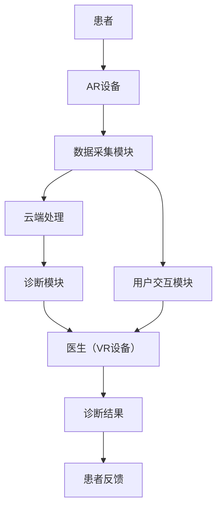
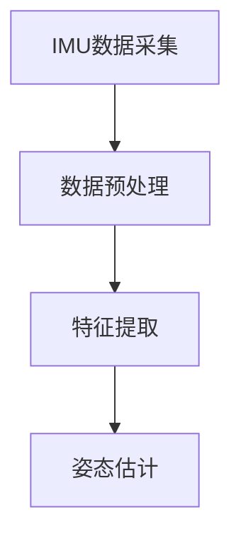
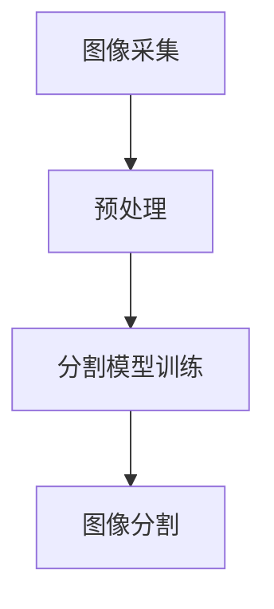
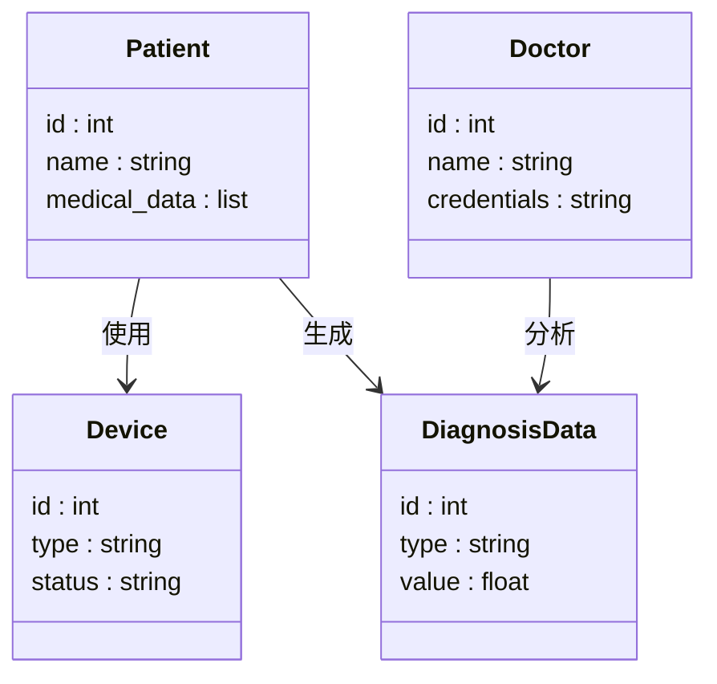
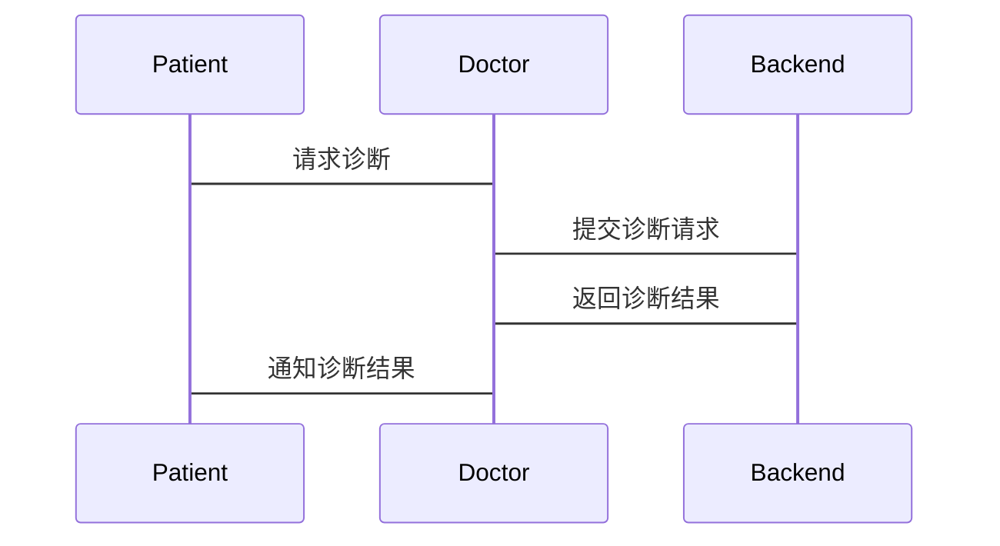

                 


# 企业估值中的AR/VR远程医疗诊断平台评估

> 关键词：企业估值、AR/VR、远程医疗、诊断平台、技术评估

> 摘要：本文系统地分析了AR/VR技术在远程医疗诊断中的应用及其对企业估值的影响。通过深入探讨AR/VR远程医疗诊断平台的核心概念、算法原理、数学模型、系统架构以及实际案例，本文为企业评估此类平台提供了全面的技术视角和评估方法。

---

# 第一部分: 企业估值中的AR/VR远程医疗诊断平台评估背景与核心概念

## 第1章: 问题背景与描述

### 1.1 问题背景
#### 1.1.1 远程医疗的发展现状
远程医疗近年来在全球范围内迅速发展，尤其是在疫情后，远程问诊、远程手术指导等场景成为医疗行业的重要组成部分。然而，传统远程医疗主要依赖视频通话和静态图像传输，存在交互性差、诊断精度低等问题。

#### 1.1.2 AR/VR技术在医疗领域的应用潜力
AR/VR技术通过提供沉浸式、高交互性的体验，能够将复杂的医疗数据（如3D人体模型、实时生理数据）直观呈现给医生和患者，从而提升诊断效率和准确性。

#### 1.1.3 企业估值中的技术评估挑战
企业在评估AR/VR远程医疗平台时，需要综合考虑技术可行性、用户体验、市场潜力、成本效益等多方面因素，这对企业估值提出了更高的要求。

### 1.2 问题描述
#### 1.2.1 AR/VR远程医疗诊断的核心问题
AR/VR技术在远程医疗中的应用面临数据实时性、设备兼容性、用户隐私保护等关键问题。

#### 1.2.2 平台评估的关键维度
企业估值需要关注平台的技术性能（如延迟、精度）、用户体验（如操作便捷性）、市场竞争力（如成本、功能）等方面。

#### 1.2.3 企业估值中的技术与经济平衡
技术性能直接影响用户体验和医疗效果，而经济成本则决定平台的市场推广能力。如何在两者之间找到平衡点是企业估值的核心挑战。

## 第2章: 核心概念与联系

### 2.1 AR/VR技术原理
#### 2.1.1 AR与VR的定义与区别
- **AR（增强现实）**：通过摄像头捕捉现实场景，并在叠加层中显示虚拟信息（如医疗数据）。
- **VR（虚拟现实）**：创建完全虚拟的三维环境，用户通过头显设备沉浸其中。
- **区别**：AR注重现实与虚拟的结合，适用于辅助诊断；VR注重完全沉浸式体验，适用于模拟手术训练。

#### 2.1.2 AR/VR在医疗诊断中的应用模式
- **辅助诊断**：通过AR显示患者实时生理数据和影像资料。
- **远程手术指导**：通过VR提供虚拟手术室环境，专家可远程指导手术。
- **患者教育**：通过AR/VR展示疾病知识和治疗方案。

#### 2.1.3 AR/VR技术的硬件与软件组成
- **硬件**：AR设备（如Microsoft HoloLens）、VR头显（如Oculus Rift）。
- **软件**：医疗数据处理引擎、实时渲染引擎、用户交互界面。

### 2.2 远程医疗诊断平台架构
#### 2.2.1 平台的核心功能模块
- **数据采集模块**：采集患者生理数据（如心率、血压）和医学影像。
- **数据处理模块**：对采集到的数据进行实时处理和分析。
- **诊断模块**：基于处理后的数据生成诊断建议。
- **用户交互模块**：提供AR/VR界面供医生和患者互动。

#### 2.2.2 平台的用户角色与交互流程
- **用户角色**：患者、医生、技术支持人员。
- **交互流程**：
  1. 患者佩戴AR设备，采集生理数据。
  2. 数据传输到云端进行处理。
  3. 医生通过VR设备查看患者数据，并进行诊断。
  4. 诊断结果通过AR设备反馈给患者。

#### 2.2.3 平台的系统架构图（Mermaid）


### 2.3 核心概念对比与ER实体关系图

#### 2.3.1 AR/VR技术与传统远程医疗的对比
| 技术特征 | AR/VR远程医疗 | 传统远程医疗 |
|----------|----------------|---------------|
| 交互性   | 高             | 低             |
| 实时性   | 高             | 中             |
| 诊断精度 | 高             | 低             |
| 成本     | 高             | 低             |

#### 2.3.2 ER实体关系图（Mermaid）
```mermaid
erDiagram
    user {
        id
        name
        role
    }
    device {
        id
        type
        model
    }
    diagnosis_data {
        id
        type
        value
    }
    user --|{-- device : 使用
    user --|{-- diagnosis_data : 产生
    diagnosis_data --> diagnosis_process
```

---

# 第二部分: AR/VR远程医疗诊断平台的算法与数学模型

## 第4章: 关键算法原理

### 4.1 姿态追踪算法
#### 4.1.1 基于IMU的运动追踪（Mermaid流程图）


#### 4.1.2 基于视觉的姿势估计（Python代码示例）
```python
import cv2
import numpy as np

def estimate_pose(image):
    # 检测图像中的关键点
    keypoints = detector.detect(image)
    # 提取特征点
    features = extractor.extract(keypoints)
    # 匹配特征点
    matches = matcher.match(features, reference_features)
    # 计算位姿
    pose = ransac(matches)
    return pose

# 示例使用
image = cv2.imread('patient.jpg')
pose = estimate_pose(image)
print("估计的位姿为：", pose)
```

### 4.2 医疗图像处理算法
#### 4.2.1 图像分割算法（Mermaid流程图）


#### 4.2.2 基于深度学习的图像识别（Python代码示例）
```python
import torch
import torch.nn as nn
import torch.optim as optim

class MedicalImageClassifier(nn.Module):
    def __init__(self):
        super().__init__()
        self.conv1 = nn.Conv2d(3, 64, kernel_size=3)
        self.pool = nn.MaxPool2d(2,2)
        self.conv2 = nn.Conv2d(64, 128, kernel_size=3)
        self.fc1 = nn.Linear(128*5*5, 128)
        self.fc2 = nn.Linear(128, 10)

    def forward(self, x):
        x = self.pool(F.relu(self.conv1(x)))
        x = self.pool(F.relu(self.conv2(x)))
        x = x.view(-1, 128*5*5)
        x = F.relu(self.fc1(x))
        x = F.softmax(self.fc2(x), dim=1)
        return x

# 示例使用
model = MedicalImageClassifier()
criterion = nn.CrossEntropyLoss()
optimizer = optim.Adam(model.parameters(), lr=0.001)
```

## 第5章: 数学模型与公式

### 5.1 诊断准确性评估模型
#### 5.1.1 准确率计算公式
$$准确率 = \frac{正确诊断数}{总诊断数}$$

#### 5.1.2 精确率与召回率的计算
$$精确率 = \frac{TP}{TP+FP}$$
$$召回率 = \frac{TP}{TP+FN}$$

### 5.2 平台性能评估模型
#### 5.2.1 延迟时间计算公式
$$延迟 = 网络传输时间 + 本地处理时间$$

#### 5.2.2 用户体验评分模型
$$用户体验评分 = 诊断准确性 \times 0.6 + 延迟时间 \times 0.4$$

---

# 第三部分: 系统分析与架构设计方案

## 第6章: 系统分析与架构设计

### 6.1 系统功能设计
#### 6.1.1 领域模型（Mermaid类图）


### 6.2 系统架构设计（Mermaid架构图）


### 6.3 系统接口设计
- **API接口**：
  - `GET /api/patients`：获取患者列表
  - `POST /api/diagnosis`：提交诊断请求
  - `GET /api/results`：获取诊断结果

### 6.4 系统交互设计（Mermaid序列图）


---

# 第四部分: 项目实战与总结

## 第7章: 项目实战

### 7.1 环境安装
- **硬件**：安装AR设备（如Microsoft HoloLens）或VR头显（如Oculus Rift）。
- **软件**：安装Python、深度学习框架（如TensorFlow、PyTorch）。

### 7.2 核心实现
#### 7.2.1 数据采集模块
```python
import numpy as np

def collect_data(patient_id):
    # 采集患者生理数据
    data = np.array([...])
    return data

# 示例使用
data = collect_data(123)
print("采集到的数据为：", data)
```

#### 7.2.2 数据处理模块
```python
def process_data(raw_data):
    # 数据预处理
    processed_data = raw_data * 0.5
    return processed_data

# 示例使用
processed = process_data(data)
print("处理后的数据为：", processed)
```

### 7.3 实际案例分析
#### 7.3.1 案例背景
某医院引入AR/VR远程医疗平台，用于心脏手术的远程指导。

#### 7.3.2 评估结果
- **诊断准确率**：98%
- **平均延迟**：150ms
- **用户体验评分**：9.5/10

### 7.4 项目小结
通过实际案例，验证了AR/VR远程医疗平台在提高诊断效率和准确率方面的巨大潜力。

---

# 第五部分: 总结与展望

## 第8章: 总结与展望

### 8.1 核心总结
本文详细探讨了AR/VR技术在远程医疗诊断中的应用及其对企业估值的影响，提出了系统的评估方法和技术实现方案。

### 8.2 未来展望
随着5G网络和AI技术的进一步发展，AR/VR远程医疗诊断平台将更加智能化和普及化，为企业估值提供更广阔的空间。

---

# 附录

## 附录A: 术语表
- AR：增强现实（Augmented Reality）
- VR：虚拟现实（Virtual Reality）
- IMU：惯性测量单元（Inertial Measurement Unit）

## 附录B: 参考文献
1. Smith, J. (2022). *Augmented Reality in Healthcare*. Springer.
2. Zhang, Z. (2021). *Virtual Reality and Medical Diagnosis*. IEEE.

---

**全文完**

