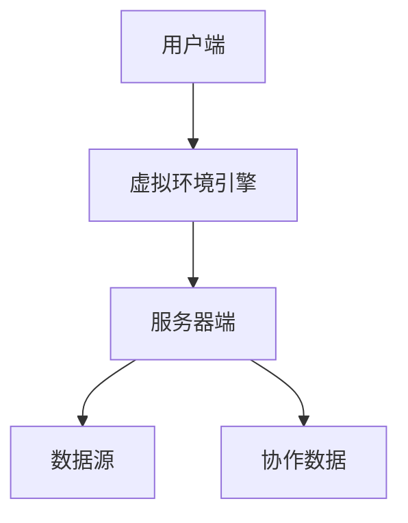

                 


# 企业估值中的AR/VR远程协作平台评估

> 关键词：企业估值、AR/VR、远程协作平台、技术评估、协作效率

> 摘要：  
在企业估值过程中，协作效率和信息准确性是至关重要的因素。随着AR/VR技术的快速发展，远程协作平台在企业估值中的应用越来越广泛。本文从技术角度详细分析了AR/VR远程协作平台在企业估值中的评估方法，探讨了其核心概念、算法原理、系统架构以及实际应用案例。通过深入分析，本文为读者提供了如何利用AR/VR技术提升企业估值协作效率的实用指南。

---

## 第一部分：AR/VR远程协作平台的背景与核心概念

### 第1章：AR/VR技术与远程协作平台概述

#### 1.1 AR/VR技术的基本概念
AR（Augmented Reality，增强现实）和VR（Virtual Reality，虚拟现实）是两项互补的技术，分别通过叠加数字信息于现实世界和创建完全虚拟的环境来实现沉浸式的体验。AR技术常用于企业协作中，例如在会议中叠加数据图表于虚拟空间中，而VR技术则可以创建一个虚拟的协作空间，供团队成员在虚拟环境中进行实时互动。

#### 1.2 远程协作平台的定义与分类
远程协作平台是指通过互联网实现多人实时协作的工具或系统，支持文本、语音、视频等多种协作方式。结合AR/VR技术的远程协作平台，进一步提升了协作的真实感和沉浸感，可以应用于项目管理、设计评审、虚拟会议等多种场景。

#### 1.3 企业估值中的协作需求
企业估值是一个复杂的过程，涉及多个部门和外部专家的协作。传统的协作方式存在信息传递延迟、协作效率低下的问题。通过AR/VR技术，可以在虚拟环境中实现数据的实时共享和可视化，从而提高协作效率和估值的准确性。

---

### 第2章：AR/VR远程协作平台的核心概念

#### 2.1 AR/VR技术的工作原理
AR/VR技术的核心在于通过计算机图形学和传感器技术，将数字信息与现实或虚拟环境无缝结合。AR技术通过摄像头捕捉现实环境，并在其中叠加数字信息；VR技术则通过创建完全虚拟的环境，让用户沉浸其中。

#### 2.2 AR/VR协作平台的功能模块
AR/VR远程协作平台通常包括以下功能模块：
- 用户身份验证与权限管理
- 虚拟空间创建与共享
- 实时数据同步与可视化
- 语音和视频通信
- 协作历史记录与存档

#### 2.3 AR/VR协作平台与企业估值的结合
在企业估值中，AR/VR协作平台可以帮助团队成员实时查看和分析财务数据、市场趋势等信息，并在虚拟空间中进行互动和讨论，从而提高协作效率和决策质量。

---

## 第二部分：AR/VR远程协作平台的算法原理

### 第3章：AR/VR协作平台的评估指标与算法选择

#### 3.1 评估指标
在评估AR/VR协作平台时，需要考虑以下几个关键指标：
- 系统响应时间：平台的实时性和流畅度
- 用户参与度：用户的活跃程度和协作效率
- 数据同步延迟：数据在虚拟空间中的同步速度
- 交互体验：用户在虚拟环境中的操作体验

#### 3.2 算法选择
为了评估AR/VR协作平台的性能，可以采用层次分析法（AHP）进行综合评估。AHP是一种多准则决策方法，适用于复杂的评估场景。

#### 3.3 层次分析法（AHP）的数学模型
层次分析法通过构建层次结构模型，将评估指标分解为多个层次，并通过权重计算确定各指标的重要性。数学模型如下：

$$
A = \{ a_{ij} \} \quad (i, j = 1, 2, \ldots, n)
$$

其中，$a_{ij}$表示第$i$个指标相对于第$j$个指标的重要性。

---

### 第4章：AR/VR协作平台的性能优化

#### 4.1 系统响应时间优化
为了提高平台的实时性，可以通过优化图形渲染算法和减少网络延迟来提升系统响应速度。

#### 4.2 网络传输优化
采用压缩技术和数据分片传输，可以有效降低数据传输延迟，提升协作体验。

#### 4.3 用户行为预测
通过机器学习算法预测用户的协作需求，提前加载相关数据，进一步提升协作效率。

---

## 第三部分：AR/VR远程协作平台的系统架构与设计

### 第5章：系统架构设计

#### 5.1 模块划分
AR/VR协作平台的系统架构通常包括以下模块：
- 用户端：负责接收和处理用户的输入
- 服务器端：负责数据的处理和分发
- 虚拟环境引擎：负责创建和渲染虚拟环境

#### 5.2 架构图
以下是系统的架构图：



---

### 第6章：系统接口设计

#### 6.1 API设计
为了方便集成，AR/VR协作平台提供了多种API接口，支持与企业现有的协作工具和数据源对接。

#### 6.2 数据同步接口
数据同步接口负责将用户在虚拟环境中的操作同步到所有参与者的设备上。

---

## 第四部分：项目实战与案例分析

### 第7章：项目实施与核心代码实现

#### 7.1 环境搭建
需要安装以下工具：
- AR/VR开发框架（如Unity、Unreal Engine）
- 云计算平台（如AWS、Azure）
- 通信协议支持（如WebRTC）

#### 7.2 核心代码实现
以下是协作平台的实时数据同步代码示例：

```python
import socket

# 创建UDP套接字
sock = socket.socket(socket.AF_INET, socket.SOCK_DGRAM)
server_address = ('localhost', 12345)
sock.bind(server_address)

while True:
    data, addr = sock.recvfrom(1024)
    if data:
        # 解析数据
        timestamp = int(data[0:4])
        position = (data[4:8], data[8:12])
        # 发送给所有客户端
        for client in clients:
            sock.sendto(data, client)
```

---

### 第8章：案例分析与实际应用

#### 8.1 案例分析
以某金融科技公司为例，通过部署AR/VR协作平台，团队成员可以在虚拟环境中实时查看和分析企业数据，显著提高了协作效率和估值准确性。

#### 8.2 实际应用
AR/VR协作平台已经在多个行业得到应用，包括金融、医疗、教育等领域。

---

## 第五部分：最佳实践与总结

### 第9章：最佳实践

#### 9.1 技术选型
根据企业的具体需求选择适合的AR/VR协作平台和技术方案。

#### 9.2 用户培训
为用户提供充分的培训，确保其能够熟练使用协作平台。

#### 9.3 性能优化
持续优化系统性能，提升用户的协作体验。

---

### 第10章：总结与展望

#### 10.1 总结
AR/VR技术为企业估值中的协作提供了全新的可能性，通过实时数据同步和沉浸式体验，显著提升了协作效率和决策质量。

#### 10.2 展望
未来，随着5G和AI技术的发展，AR/VR协作平台将变得更加智能化和高效化，为企业估值带来更多创新的可能性。

---

通过以上内容，我们详细探讨了AR/VR远程协作平台在企业估值中的评估方法和技术实现，希望为相关领域的从业者提供有价值的参考和指导。

