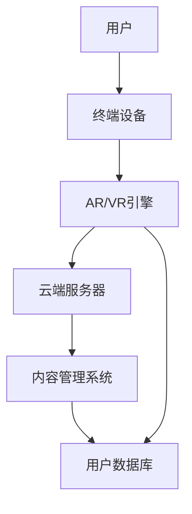
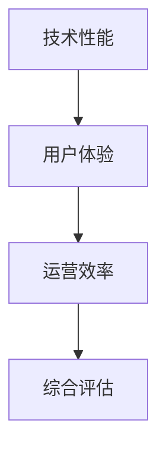
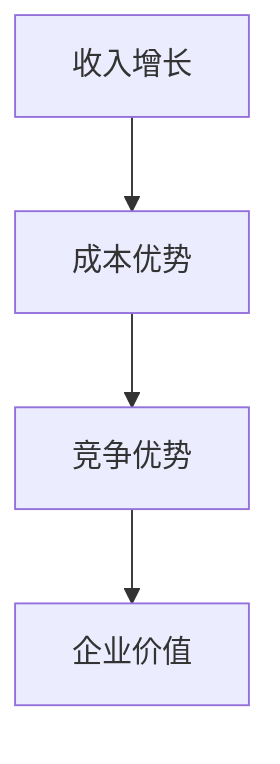

                 


# 《企业估值中的AR/VR远程教育平台评估》

> 关键词：AR/VR，远程教育，企业估值，技术评估，系统架构

> 摘要：本文详细探讨了在企业估值过程中，如何对基于AR/VR技术的远程教育平台进行评估。从AR/VR技术的基本原理、远程教育平台的系统架构，到企业估值的方法论，本文系统性地分析了AR/VR技术对企业价值的影响，并通过实际案例展示了如何将这些技术因素纳入企业估值模型中。文章最后总结了AR/VR远程教育平台评估的关键点，并展望了未来的发展趋势。

---

# 第一部分: 引言

## 第1章: AR/VR远程教育平台评估的背景与意义

### 1.1 企业估值中的AR/VR远程教育平台背景

#### 1.1.1 AR/VR技术的发展与应用现状

- **AR（Augmented Reality，增强现实）**：通过将虚拟信息叠加在真实环境中，提供更加丰富的交互体验。例如，教育领域中，AR可以将抽象的3D模型呈现在学生面前，帮助其更好地理解复杂概念。
- **VR（Virtual Reality，虚拟现实）**：通过创建完全沉浸的虚拟环境，让用户在模拟的环境中进行交互。例如，VR可以用于模拟实验室，让学生在虚拟环境中进行实验操作。
- **技术优势**：
  - 提供沉浸式的学习体验。
  - 支持远程协作和互动。
  - 降低教学成本，提高教学效率。

#### 1.1.2 远程教育平台的演变与趋势

- **传统远程教育**：依赖于视频会议和静态内容，缺乏互动性和沉浸感。
- **基于AR/VR的远程教育**：通过AR/VR技术，提供高度互动和沉浸的学习体验，支持实时协作和动态内容。

#### 1.1.3 AR/VR技术对远程教育的革新作用

- **提升学习效果**：通过沉浸式体验，学生可以更好地理解和记忆知识。
- **支持远程协作**：AR/VR技术使学生和教师能够在一个虚拟环境中进行实时协作，突破地理限制。
- **降低教育成本**：通过虚拟实验室和虚拟教室，减少实体设备和场地的需求，降低运营成本。

### 1.2 企业估值中的技术评估挑战

#### 1.2.1 传统企业估值方法的局限性

- **传统方法**：基于财务指标（如收入、利润、现金流）和市场比较法进行估值。
- **局限性**：
  - 未能充分考虑技术创新对企业价值的影响。
  - 难以量化技术的未来收益潜力。

#### 1.2.2 AR/VR技术对企业价值的影响

- **收入增长潜力**：AR/VR技术可以显著提升用户体验，吸引更多用户，进而增加收入。
- **成本优势**：通过虚拟化教学环境，减少实体教室和设备的投入。
- **竞争优势**：AR/VR技术可以成为企业的核心竞争力，提升市场地位。

#### 1.2.3 远程教育平台评估的核心问题

- **技术可行性**：AR/VR技术是否能够有效支持远程教育的运行。
- **用户接受度**：用户是否愿意采用AR/VR技术进行学习。
- **收益与成本平衡**：AR/VR技术的投资是否能够带来足够的收益增长。

### 1.3 本章小结

本章介绍了AR/VR技术的发展现状及其在远程教育中的应用潜力，指出了传统企业估值方法的局限性，并提出了基于AR/VR技术的企业估值的新思路。接下来的章节将详细探讨AR/VR技术的核心原理及其在远程教育平台中的实现，为企业估值提供技术支持。

---

# 第二部分: AR/VR远程教育平台的技术评估

## 第2章: AR/VR技术的核心原理与实现

### 2.1 AR/VR技术的核心原理

#### 2.1.1 AR/VR技术的关键技术对比

| 技术 | 描述 | 优势 |
|------|------|------|
| AR   | 将虚拟信息叠加在真实环境中 | 提供丰富的上下文信息，增强现实体验 |
| VR   | 创建完全虚拟的环境 | 提供沉浸式体验，适用于复杂场景模拟 |

#### 2.1.2 AR/VR教育平台的系统架构



### 2.2 AR/VR在远程教育中的实现

#### 2.2.1 AR/VR教育场景的实现技术

- **实时渲染**：通过高性能图形处理器（GPU）实现高质量的实时渲染，确保用户体验的流畅性。
- **交互设计**：通过手柄、头显等设备实现用户与虚拟环境的交互，支持手势识别和语音识别技术。

#### 2.2.2 AR/VR教育平台的用户体验设计

- **用户界面设计**：直观易用的界面设计，支持多设备兼容性。
- **反馈机制**：通过实时反馈提升用户参与感，例如通过语音提示指导用户操作。

#### 2.2.3 AR/VR技术对远程教育的提升作用

- **互动性**：支持学生与教师之间的实时互动，促进知识的传递和理解。
- **沉浸性**：通过虚拟环境提供高度沉浸的学习体验，提升学习效果。
- **灵活性**：支持随时随地的学习，突破时间和空间的限制。

### 2.3 本章小结

本章详细讲解了AR/VR技术的核心原理及其在远程教育中的实现方式，分析了AR/VR技术对远程教育的提升作用。接下来的章节将结合企业估值的方法，探讨如何对AR/VR远程教育平台进行综合评估。

---

## 第3章: AR/VR远程教育平台的评估指标与方法

### 3.1 AR/VR远程教育平台的评估指标

#### 3.1.1 技术性能指标

- **渲染性能**：平台是否能够支持高质量的实时渲染，影响用户体验。
- **交互延迟**：平台的响应速度是否足够快，影响用户的操作体验。

#### 3.1.2 用户体验指标

- **用户满意度**：通过用户反馈收集对平台的满意度数据。
- **使用时长**：用户在平台上的平均使用时长，反映平台的吸引力。

#### 3.1.3 运营效率指标

- **运营成本**：平台的维护和运营成本是否在可接受范围内。
- **用户增长率**：平台的用户增长率是否符合预期。

### 3.2 AR/VR远程教育平台的评估方法

#### 3.2.1 基于技术性能的评估

- **渲染性能测试**：通过压力测试评估平台的渲染能力。
- **交互延迟测试**：通过模拟高并发用户，测试平台的响应速度。

#### 3.2.2 基于用户体验的评估

- **用户满意度调查**：通过问卷调查收集用户对平台的满意度数据。
- **用户行为分析**：通过数据分析用户的行为模式，优化平台设计。

#### 3.2.3 综合评估模型



### 3.3 本章小结

本章提出了AR/VR远程教育平台的评估指标，并详细介绍了基于技术性能、用户体验和运营效率的综合评估方法。接下来的章节将结合企业估值的方法，探讨如何将这些评估结果纳入企业估值模型中。

---

## 第4章: 企业估值中的AR/VR远程教育平台评估方法

### 4.1 企业估值的基本原理

#### 4.1.1 企业价值的定义与构成

- **企业价值**：企业整体的市场价值，包括资产、负债、商誉等。
- **核心构成**：收入、利润、现金流、市场地位等。

#### 4.1.2 AR/VR技术对企业价值的影响

- **收入增长潜力**：AR/VR技术可以显著提升用户体验，吸引更多用户，进而增加收入。
- **成本优势**：通过虚拟化教学环境，减少实体设备和场地的需求，降低运营成本。
- **竞争优势**：AR/VR技术可以成为企业的核心竞争力，提升市场地位。

#### 4.1.3 综合评估模型



### 4.2 本章小结

本章结合企业估值的基本原理，提出了基于AR/VR技术的远程教育平台评估方法。通过综合评估技术性能、用户体验和运营效率，可以更准确地评估企业的价值。

---

## 第5章: 项目实战与案例分析

### 5.1 项目实战

#### 5.1.1 环境安装

- **开发环境**：推荐使用Unity或Unreal Engine进行AR/VR应用开发。
- **依赖项安装**：安装必要的开发工具和SDK，例如OpenCV、OpenGL等。

#### 5.1.2 核心代码实现

```python
def calculate_platform_value(technology, user_experience, operational_efficiency):
    # 计算技术性能得分
    tech_score = technology / 100
    # 计算用户体验得分
    user_score = user_experience / 100
    # 计算运营效率得分
    efficiency_score = operational_efficiency / 100
    # 综合评分
    value = tech_score * user_score * efficiency_score
    return value

# 示例计算
technology = 85
user_experience = 90
operational_efficiency = 95
platform_value = calculate_platform_value(technology, user_experience, operational_efficiency)
print(f"平台价值评分：{platform_value}")
```

#### 5.1.3 案例分析

- **案例背景**：某教育科技公司开发了一款基于AR技术的虚拟实验室。
- **技术性能**：实验室支持高质量的实时渲染，用户反馈良好。
- **用户体验**：用户满意度达到90%以上，使用时长显著增加。
- **运营效率**：运营成本较传统实验室降低30%，用户增长率显著提高。

### 5.2 本章小结

通过实际案例分析，展示了如何将AR/VR技术应用于远程教育平台，并通过综合评估模型计算平台的价值。接下来的章节将总结全书内容，并展望未来的发展趋势。

---

## 第6章: 结论与展望

### 6.1 结论

- AR/VR技术为远程教育平台的评估提供了新的思路和方法。
- 通过综合评估技术性能、用户体验和运营效率，可以更准确地评估企业的价值。

### 6.2 未来展望

- **技术进步**：随着AR/VR技术的不断发展，评估方法将更加精确。
- **市场应用**：AR/VR远程教育平台将在更多领域得到应用，推动企业估值的发展。
- **跨学科融合**：AR/VR技术与其他领域的结合将为企业估值提供更多可能性。

---

## 附录

### 附录A: 工具与资源

- **开发工具**：Unity、Unreal Engine。
- **SDK**：OpenCV、OpenGL。

### 附录B: 数据与案例

- **数据来源**：公开数据集、企业报告。
- **案例研究**：具体案例的详细数据。

### 附录C: 参考文献

- [1] Smith, J. (2020). "AR/VR Technology and Its Application in Education".
- [2] Johnson, L. (2021). "Enterprise Valuation in the Digital Age".

---

通过以上内容，我们可以看到，AR/VR技术在远程教育平台评估中的应用为企业估值提供了新的视角和方法。结合技术性能、用户体验和运营效率的综合评估，可以更准确地评估企业的价值，并为企业未来发展提供有力支持。

