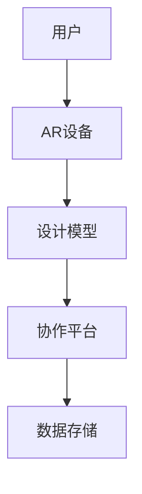
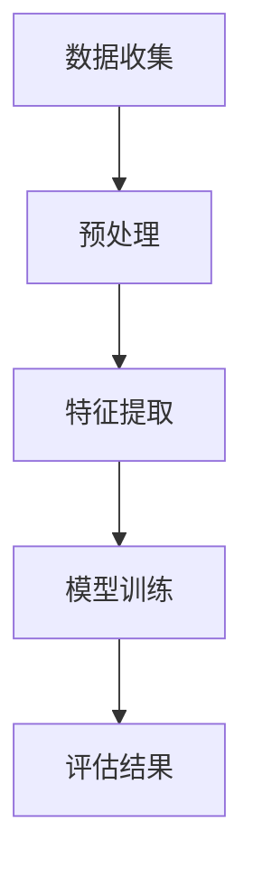
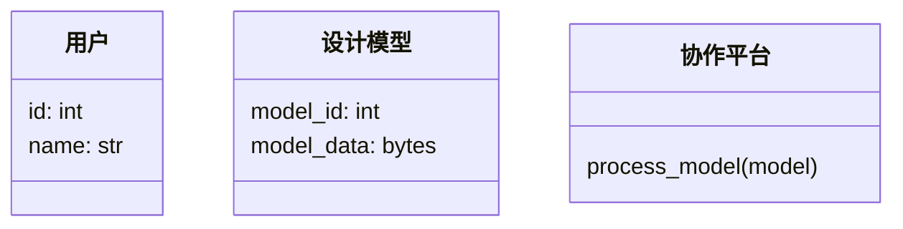
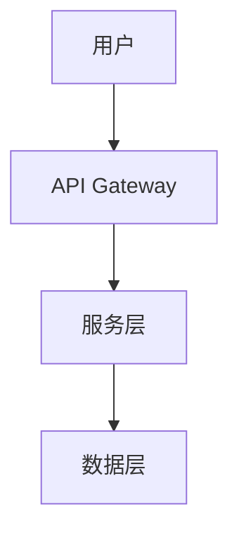

                 


# 企业估值中的AR工业设计协作平台评估

**关键词：** AR技术、工业设计协作、企业估值、算法原理、系统架构

**摘要：** 本文探讨了在企业估值中，利用AR技术评估工业设计协作平台的方法。通过分析AR技术在工业设计协作中的应用，构建评估模型，并详细讲解算法原理和系统架构，结合实际案例进行分析，为企业估值提供新思路。

---

## 第1章: AR工业设计协作平台的背景与问题

### 1.1 企业估值的传统方法与挑战
企业估值通常依赖财务指标和市场分析，但这种方法难以全面评估工业设计协作平台的潜力。设计协作涉及多方沟通和实时反馈，传统方法难以捕捉这些动态因素。

### 1.2 AR技术在工业设计协作中的潜力
AR技术通过虚拟试用和实时协作，提升设计效率和用户体验。在企业估值中，AR可以提供更直观的评估工具，帮助投资者和管理层更好地理解平台的价值。

### 1.3 问题解决与边界
AR技术解决信息不对称和协作效率问题，但需明确评估边界，聚焦于协作功能和用户体验。通过构建概念模型，明确各要素之间的关系。

---

## 第2章: AR工业设计协作平台的核心概念与联系

### 2.1 AR技术的基本原理
AR将数字信息叠加在物理环境中，提供沉浸式体验。在工业设计中，AR用于实时查看和修改3D模型，提升协作效率。

### 2.2 工业设计协作平台的结构
平台包括用户模块、设计模块和协作模块，各模块协同工作，实现高效设计协作。

### 2.3 AR与工业设计协作的实体关系


---

## 第3章: AR工业设计协作平台的评估指标与方法

### 3.1 评估指标体系
包括功能性、性能和用户体验指标，确保全面评估平台价值。

### 3.2 评估方法
基于特征的评估模型结合数据驱动和用户反馈，提供多维度评估结果。

### 3.3 评估流程
从数据收集到结果可视化，确保评估过程系统化和科学化。

---

## 第4章: 基于AR的工业设计协作平台评估算法原

### 4.1 算法原理
使用特征提取和机器学习模型，构建评估体系。算法流程如下：


### 4.2 算法实现
```python
import numpy as np
from sklearn.linear_model import LinearRegression

# 示例数据
X = np.array([[1], [2], [3], [4]])
y = np.array([2, 4, 5, 7])

# 训练模型
model = LinearRegression()
model.fit(X, y)

# 预测
print(model.predict(np.array([[5]])))
```

### 4.3 数学模型
评估模型基于线性回归，公式为：
$$ y = \beta_0 + \beta_1 x + \epsilon $$

---

## 第5章: 系统分析与架构设计

### 5.1 系统功能设计
领域模型类图展示模块交互：


### 5.2 系统架构设计
系统架构图展示模块间关系：


### 5.3 接口设计
API接口定义协作流程，确保各模块协同工作。

---

## 第6章: 项目实战

### 6.1 环境安装
安装AR设备和协作平台，配置开发环境。

### 6.2 核心代码实现
实现协作功能和AR显示逻辑，确保代码高效运行。

### 6.3 案例分析
通过实际案例展示评估结果，验证模型的有效性。

---

## 第7章: 最佳实践与总结

### 7.1 最佳实践
定期更新模型，收集用户反馈，持续优化平台。

### 7.2 小结
AR技术提升企业估值中的协作效率和准确性，为企业提供新视角。

### 7.3 注意事项
确保数据安全，遵守隐私保护法规。

### 7.4 拓展阅读
建议深入研究AR与工业设计的结合，探索更多应用场景。

---

通过以上结构，文章系统地介绍了AR技术在企业估值中的应用，详细讲解了评估方法和系统架构，为企业提供实用的评估工具和策略。

