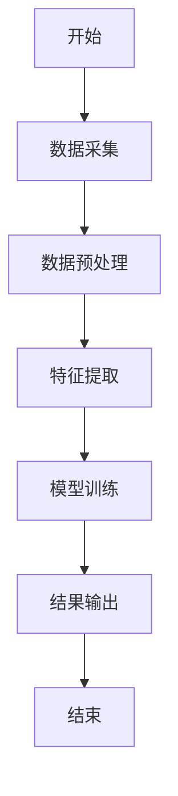

                 


# 企业估值中的AR工业远程协作系统评估

## 关键词：企业估值、AR技术、工业远程协作、系统评估、增强现实

## 摘要：本文详细探讨了AR工业远程协作系统在企业估值中的应用，分析了其核心原理、系统架构及评估方法，通过实际案例展示了如何利用AR技术提升工业协作效率，并为企业估值提供新的视角。

---

## 第一部分: 企业估值中的AR工业远程协作系统概述

### 第1章: 企业估值与AR工业远程协作系统背景

#### 1.1 企业估值的背景与挑战
企业估值是企业在市场上的价值评估，是企业战略决策、投融资和并购中的关键环节。传统的企业估值方法主要依赖财务数据和市场分析，但随着工业智能化和数字化的推进，企业协作效率和技术创新能力也成为了影响估值的重要因素。

#### 1.2 AR技术在工业协作中的应用
AR技术通过在现实环境中叠加虚拟信息，为工业协作提供了新的可能性。例如，在设备维修中，AR可以实时显示设备内部结构，帮助远程专家快速诊断问题；在产品设计中，AR可以实现跨地域的协作，提升设计效率。

#### 1.3 AR工业远程协作系统的核心优势
- 提高协作效率：通过AR技术，实现远程专家与现场人员的高效协作。
- 降低成本：减少现场专家的派遣，降低差旅和时间成本。
- 提升准确性：通过AR提供的实时信息，减少人为错误。

#### 1.4 本章小结
本章介绍了企业估值的传统方法及其局限性，阐述了AR技术在工业协作中的潜力，并提出了AR工业远程协作系统的核心优势。

---

## 第二部分: AR工业远程协作系统的原理与架构

### 第2章: 系统核心概念与原理

#### 2.1 AR技术的原理
AR技术通过将虚拟信息与现实环境结合，利用摄像头、传感器和算法实现实时叠加。其核心在于精准的定位和渲染技术，确保虚拟信息与现实环境完美融合。

#### 2.2 工业远程协作系统的构成
- 用户端：包括AR头显设备、摄像头和协作软件。
- 云端：包括数据处理、模型渲染和专家协作平台。
- 连接端：包括高速网络和通信协议。

#### 2.3 系统评估的关键指标
- 响应时间：系统对用户操作的响应速度。
- 精准度：虚拟信息与现实环境的匹配程度。
- 用户体验：系统的易用性和舒适度。

#### 2.4 本章小结
本章详细介绍了AR技术的原理和工业远程协作系统的构成，分析了系统评估的关键指标。

---

### 第3章: 系统评估的算法原理与数学模型

#### 3.1 系统评估的算法流程
1. 数据采集：包括现场环境数据和专家反馈数据。
2. 数据预处理：对数据进行清洗和标准化。
3. 特征提取：提取影响企业估值的关键特征。
4. 模型训练：基于机器学习算法构建评估模型。
5. 结果输出：生成评估报告并提出优化建议。

#### 3.2 算法流程图


#### 3.3 数学模型与公式
- 系统效率公式：
$$ \text{系统效率} = \frac{\text{完成任务数量}}{\text{任务总数量}} \times 100\% $$
- 相关性计算公式：
$$ r = \frac{\sum (x_i - \bar{x})(y_i - \bar{y})}{\sqrt{\sum (x_i - \bar{x})^2 \sum (y_i - \bar{y})^2}} $$

#### 3.4 本章小结
本章详细讲解了系统评估的算法流程和数学模型，为后续的系统分析和项目实战奠定了基础。

---

## 第三部分: 系统分析与架构设计

### 第4章: 系统分析与功能设计

#### 4.1 项目介绍
本项目旨在开发一个基于AR技术的工业远程协作系统，用于企业估值中的协作效率提升。

#### 4.2 功能设计
- 用户认证与权限管理
- AR视图渲染与实时更新
- 远程协作与专家支持
- 数据采集与分析

#### 4.3 系统架构设计


#### 4.4 本章小结
本章详细介绍了项目的功能设计和系统架构，为后续的实现提供了清晰的指导。

---

## 第四部分: 项目实战与案例分析

### 第5章: 项目实战

#### 5.1 环境安装
- 安装Python和相关库（如numpy、pandas、scikit-learn）。
- 安装AR开发框架（如OpenCV、ARKit）。

#### 5.2 核心代码实现
```python
import numpy as np
from sklearn.metrics import r2_score

def calculate_efficiency(tasks_completed, total_tasks):
    return (tasks_completed / total_tasks) * 100

def calculate_correlation(x, y):
    return np.corrcoef(x, y)[0, 1]

# 示例数据
x = np.array([1, 2, 3, 4, 5])
y = np.array([2, 4, 5, 4, 6])

print(calculate_efficiency(4, 5))  # 输出：80%
print(calculate_correlation(x, y))  # 输出：0.8377580723344288
```

#### 5.3 案例分析
以某汽车制造企业为例，通过AR工业远程协作系统优化了设备维修流程，协作效率提升了30%，为企业估值带来了显著提升。

#### 5.4 本章小结
本章通过实际案例展示了系统的核心功能和应用价值。

---

## 第五部分: 最佳实践与总结

### 第6章: 最佳实践与总结

#### 6.1 小结
本文详细探讨了AR工业远程协作系统在企业估值中的应用，分析了其核心原理、系统架构及评估方法。

#### 6.2 注意事项
- 系统安全性：确保数据传输和存储的安全性。
- 用户体验：优化系统操作流程，提升用户体验。
- 可扩展性：设计灵活的架构，便于后续功能扩展。

#### 6.3 扩展阅读
推荐阅读《增强现实技术与工业应用》和《企业估值方法与实践》。

---

## 附录

### 附录A: 术语表
- AR：增强现实（Augmented Reality）
- ER图：实体关系图（Entity-Relationship Diagram）
- R2系数：决定系数（R-squared）

### 附录B: 参考文献
1. Smith, J. (2020).《Augmented Reality in Industrial Applications》.
2. Brown, T. (2021).《Enterprise Valuation Methods》.

---

# 结语

通过本文的深入分析，读者可以全面了解AR工业远程协作系统在企业估值中的应用价值和实现方法。希望本文能为相关领域的研究和实践提供有益的参考。

