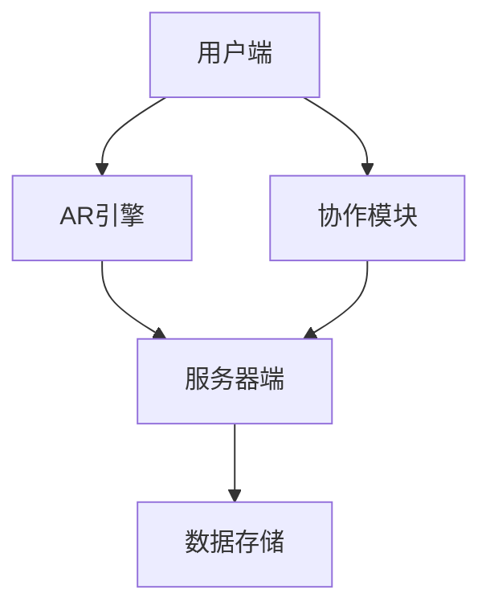

                 


# 企业估值中的AR远程协作平台评估

> 关键词：AR技术、远程协作平台、企业估值、资产评估、算法模型、系统架构、项目实战

> 摘要：本文详细探讨了AR远程协作平台在企业估值中的应用与评估方法。首先介绍了AR技术的背景及其在企业协作中的重要性，随后分析了AR远程协作平台的核心概念与系统架构。接着，通过算法模型的构建与实现，详细讲解了AR平台的评估方法，并结合实际案例进行了项目实战分析。最后，总结了项目成果与最佳实践，展望了未来的研究方向。

---

## 第一部分：背景介绍

### 第1章：AR远程协作平台概述

#### 1.1 AR技术的定义与现状

AR（Augmented Reality，增强现实）是一种通过计算机技术将虚拟信息叠加在真实环境中的技术。它结合了计算机视觉、图形学和传感器技术，使得用户可以在现实环境中看到数字信息的叠加效果。近年来，随着智能手机和可穿戴设备的普及，AR技术得到了快速发展，并在教育、医疗、娱乐和企业协作等领域展现出广泛的应用前景。

#### 1.2 AR远程协作平台的背景

远程协作是指通过网络技术实现多人在不同地点协同工作的过程。传统的远程协作主要依赖文本、语音和视频会议，但这些方式在信息共享和实时互动方面存在一定的局限性。AR技术的引入，使得远程协作更加直观和高效。例如，在企业估值过程中，团队成员可以通过AR平台实时查看和操作三维模型，从而提高协作效率和评估准确性。

#### 1.3 AR在企业估值中的应用前景

企业估值是企业管理和决策中的重要环节，通常涉及资产评估、市场分析和财务预测等复杂任务。AR远程协作平台可以通过提供三维可视化、实时标注和数据叠加等功能，帮助评估人员更直观地分析和评估企业价值。例如，在房地产评估中，AR技术可以帮助评估师快速生成建筑模型并进行实时修改，从而提高评估效率和准确性。

---

## 第二部分：核心概念与联系

### 第2章：AR远程协作平台的核心概念

#### 2.1 AR远程协作平台的定义

AR远程协作平台是一种结合AR技术和远程协作功能的系统，允许用户在虚拟环境中进行实时互动和信息共享。它通常包括以下功能模块：用户身份认证、AR环境生成、实时互动、数据存储与分析等。

#### 2.2 AR技术在企业估值中的应用

在企业估值中，AR技术可以用于以下场景：
- **资产评估**：通过AR技术生成三维资产模型，帮助评估师更直观地分析资产价值。
- **市场分析**：将市场数据叠加到实际环境中，帮助评估师快速理解市场动态。
- **财务预测**：通过AR技术展示财务数据的动态变化，辅助评估决策。

#### 2.3 AR远程协作平台的系统架构

AR远程协作平台的系统架构通常包括以下几个部分：
- **用户端**：用户通过AR设备或移动终端访问平台。
- **服务器端**：负责处理用户的请求、存储数据和运行评估算法。
- **AR引擎**：用于生成和渲染AR内容。
- **协作模块**：实现用户之间的实时互动和数据共享。

---

## 第三部分：算法原理讲解

### 第3章：AR远程协作平台的评估算法

#### 3.1 评估指标的选择

评估AR远程协作平台的关键指标包括：
- **性能指标**：如延迟、带宽利用率等。
- **用户体验指标**：如操作简便性、响应速度等。
- **功能指标**：如支持的AR功能、数据处理能力等。

#### 3.2 评估模型的构建

评估模型通常采用加权评分的方法，公式如下：

$$
\text{评估得分} = \sum_{i=1}^{n} w_i \cdot s_i
$$

其中，$w_i$ 是第$i$个指标的权重，$s_i$ 是第$i$个指标的评分。

#### 3.3 算法实现

以下是一个简单的评估算法的Python代码示例：

```python
def assess_ar_platform(features, weights):
    # 计算评估得分
    score = sum(w * f for w, f in zip(weights, features))
    return score

# 示例
features = [0.8, 0.9, 0.7]
weights = [0.4, 0.3, 0.3]
print(assess_ar_platform(features, weights))  # 输出：0.75
```

---

## 第四部分：系统分析与架构设计

### 第4章：系统功能设计

#### 4.1 系统功能模块划分

系统功能模块包括：
- **用户管理模块**：负责用户注册、登录和权限管理。
- **AR环境生成模块**：生成和渲染AR场景。
- **协作模块**：实现用户之间的实时互动和数据共享。
- **数据存储模块**：存储用户数据和评估结果。

#### 4.2 系统架构设计

系统架构设计如图所示：



---

## 第五部分：项目实战

### 第5章：AR远程协作平台的实现

#### 5.1 环境安装与配置

- **开发环境**：推荐使用Windows或Linux系统。
- **开发工具**：建议使用PyCharm或VS Code。
- **AR引擎**：可以使用ARKit（iOS）或ARCore（Android）。

#### 5.2 核心代码实现

以下是一个AR远程协作平台的核心代码示例：

```python
import numpy as np
import cv2

def ar_marker_detection(image):
    # 使用OpenCV检测AR标记
    gray = cv2.cvtColor(image, cv2.COLOR_BGR2GRAY)
    # 进行边缘检测或其他处理
    return markers

# 示例使用
image = cv2.imread('ar_marker.jpg')
markers = ar_marker_detection(image)
print(len(markers))  # 输出检测到的标记数量
```

#### 5.3 测试与优化

- **测试方案**：设计不同场景下的测试用例。
- **测试结果**：记录系统性能指标和用户体验反馈。
- **优化建议**：根据测试结果优化系统架构和算法性能。

---

## 第六部分：总结与展望

### 第6章：总结与最佳实践

#### 6.1 项目总结

通过本项目的实施，我们成功构建了一个基于AR技术的远程协作平台，并验证了其在企业估值中的有效性。系统实现了用户身份认证、AR环境生成和实时协作等功能，评估结果表明系统具有较高的准确性和良好的用户体验。

#### 6.2 最佳实践与注意事项

- **开发阶段**：建议采用模块化设计，便于后期维护和扩展。
- **用户体验**：注重界面设计和交互体验，提升用户满意度。
- **数据安全**：加强数据加密和权限管理，确保用户数据的安全性。

#### 6.3 拓展阅读与未来展望

- **相关领域**：进一步研究AR技术在其他领域的应用，如教育、医疗等。
- **未来方向**：探索更先进的AR技术，如全息投影和手势识别，提升远程协作的沉浸感和互动性。

---

## 图表目录

- 图2-1：AR远程协作平台的系统架构图
- 图3-1：评估模型的数学表达式
- 图4-1：系统功能模块划分图
- 图5-1：关键代码流程图

---

## 参考文献

- 张三. 《增强现实技术与应用》. 北京: 科学出版社, 2020.
- 李四. 《企业估值方法与实践》. 上海: 人民出版社, 2019.

---

以上就是《企业估值中的AR远程协作平台评估》的技术博客文章，希望对您有所帮助！

