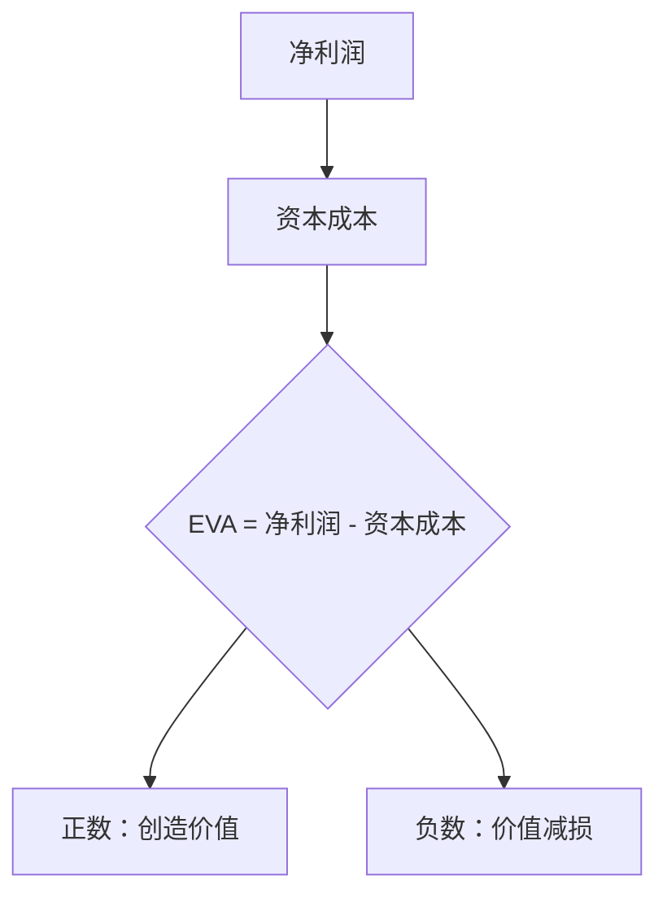
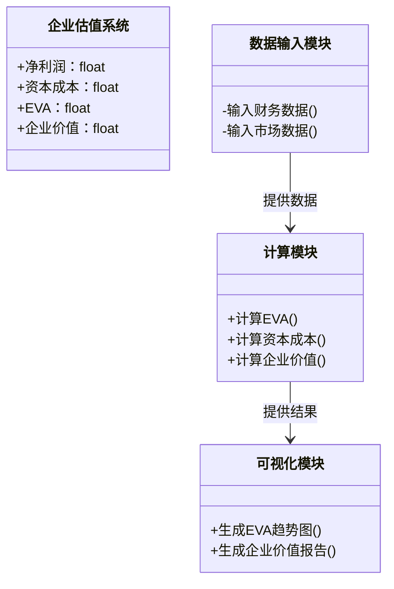
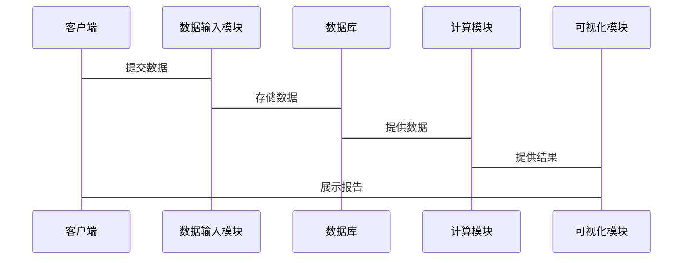

                 


# 企业估值中的EVA分析法

## 关键词：EVA分析法, 企业估值, 经济价值增加值, 财务指标, 资本成本, 投资决策

## 摘要：  
本文将详细介绍EVA（经济价值增加值）分析法在企业估值中的应用。通过分析EVA的核心理论、算法原理、系统设计及实际案例，本文旨在帮助读者理解如何利用EVA方法更准确地评估企业价值。文章结合理论与实践，深入探讨了EVA的优势、计算方法及其在投资决策中的重要性。

---

# 第一部分: 企业估值中的EVA分析法基础

## 第1章: 企业估值与EVA分析法概述

### 1.1 企业估值的基本概念

#### 1.1.1 企业估值的定义与意义

企业估值是指通过对企业的财务状况、市场地位、盈利能力等多方面因素的分析，确定其市场价值的过程。它是企业战略决策、投资评估和并购交易中的重要环节。传统的估值方法主要包括市盈率法、市净率法和现金流折现法等，但这些方法在实际应用中存在一定的局限性。

#### 1.1.2 企业估值的主要方法

1. **相对估值法**：基于可比企业的财务指标（如市盈率、市净率）进行估值。
2. **绝对估值法**：基于企业未来现金流的折现值进行估值。
3. **资产基础法**：基于企业资产负债表中的资产价值进行估值。

#### 1.1.3 传统估值方法的局限性

- 传统方法难以准确反映企业的实际盈利能力。
- 忽略了资本成本的影响，导致估值偏差。
- 过度依赖历史数据，难以适应未来变化。

### 1.2 EVA分析法的定义与特点

#### 1.2.1 EVA的定义

EVA（Economic Value Added）即经济价值增加值，是衡量企业真实经济利润的指标。它通过将净利润与资本成本进行对比，反映了企业在扣除所有投入资本后的实际利润。

#### 1.2.2 EVA的核心特点

- **考虑资本成本**：EVA不仅关注净利润，还考虑了企业为获取资本而支付的成本。
- **衡量经济利润**：EVA能够准确反映企业的经济利润，是股东价值创造的晴雨表。
- **简单易用**：EVA的计算公式简单，易于理解和应用。

#### 1.2.3 EVA与传统财务指标的区别

| 指标 | 净利润 | EVA |
|------|--------|-----|
| 定义 | 营业收入减去各项成本费用后的利润 | 净利润减去资本成本后的经济利润 |
| 优势 | 易于计算，反映企业会计利润 | 考虑资本成本，反映经济利润 |
| 局限性 | 忽略资本成本的影响 | 计算复杂，需要准确估计资本成本 |

### 1.3 EVA分析法在企业估值中的作用

#### 1.3.1 EVA分析法的优势

- **准确反映企业价值**：EVA能够更准确地衡量企业的经济利润，为估值提供可靠依据。
- **帮助决策者制定战略**：通过分析EVA，企业可以更好地制定投资、并购和资本分配策略。
- **适用于不同行业**：EVA方法适用于各种行业，具有较强的通用性。

#### 1.3.2 EVA分析法的应用场景

- 企业内部管理：用于评估部门或项目的绩效。
- 投资决策：用于评估投资项目的经济价值。
- 并购交易：用于评估目标企业的实际价值。

#### 1.3.3 EVA分析法的局限性

- 计算复杂：需要准确估计资本成本。
- 数据依赖：依赖于企业的财务数据质量。
- 适用范围有限：在某些情况下，如高杠杆企业，EVA的适用性可能受到影响。

### 1.4 本章小结

本章介绍了企业估值的基本概念和传统方法的局限性，重点阐述了EVA分析法的定义、特点及其在企业估值中的作用。通过对比分析，读者可以理解EVA方法相对于传统财务指标的优势和适用性。

---

## 第2章: EVA的理论基础

### 2.1 经济价值增加值（EVA）的定义与公式

#### 2.1.1 EVA的计算公式

EVA的计算公式为：

$$ \text{EVA} = \text{净利润} - \text{资本成本} $$

其中，净利润为企业会计利润，资本成本为企业为获取资本而支付的成本。

#### 2.1.2 EVA的经济意义

EVA反映了企业在扣除所有投入资本后的实际利润。如果EVA为正，则说明企业的经济利润为正，创造了价值；反之，则说明企业未能创造经济价值。

#### 2.1.3 EVA与企业价值的关系

企业价值是未来现金流的现值，而EVA是衡量企业经济利润的核心指标。长期来看，企业的价值与其EVA的累积密切相关。

### 2.2 EVA与资本成本的关系

#### 2.2.1 资本成本的定义与计算

资本成本是指企业为获取资本而支付的最低必要回报率。资本成本的计算通常基于加权平均资本成本（WACC）模型：

$$ \text{WACC} = w_d \times k_d \times (1 - t) + w_e \times k_e $$

其中，$w_d$ 和 $w_e$ 分别为债务和权益的权重，$k_d$ 和 $k_e$ 分别为债务和权益的资本成本，$t$ 为税率。

#### 2.2.2 EVA与资本成本的互动关系

当企业的净利润增加时，如果资本成本不变，EVA会增加；反之，如果资本成本上升，EVA可能会下降。因此，在进行企业估值时，必须综合考虑净利润和资本成本的变化。

### 2.3 EVA在企业估值中的应用

#### 2.3.1 EVA与企业价值的关系

企业价值的计算可以基于EVA的现值：

$$ \text{企业价值} = \sum_{t=1}^{n} \frac{\text{EVA}_t}{(1 + r)^t} $$

其中，$r$ 为折现率，$n$ 为估值期限。

#### 2.3.2 EVA与投资决策的关系

投资者可以通过分析企业的EVA趋势，判断企业的价值创造能力。如果企业的EVA持续增长，则说明企业的价值在不断增加。

### 2.4 本章小结

本章详细阐述了EVA的定义、公式及其与资本成本的关系。通过分析EVA与企业价值的关系，读者可以理解EVA在企业估值中的重要性。

---

## 第3章: EVA分析法的算法原理

### 3.1 EVA计算流程图



### 3.2 EVA计算的 Python 实现

```python
def calculate_eva(net_income, capital_cost):
    return net_income - capital_cost

# 示例代码
net_income = 1000000  # 净利润：100万元
capital_cost = 500000  # 资本成本：50万元
eva = calculate_eva(net_income, capital_cost)
print(f"EVA = {eva}元")  # 输出：EVA = 500000元
```

### 3.3 EVA的数学模型与公式

#### 3.3.1 EVA的计算公式

$$ \text{EVA} = \text{净利润} - \text{资本成本} $$

#### 3.3.2 净利润的计算公式

$$ \text{净利润} = \text{营业收入} - \text{营业成本} - \text{费用} - \text{税金} $$

#### 3.3.3 资本成本的计算公式

$$ \text{资本成本} = w_d \times k_d \times (1 - t) + w_e \times k_e $$

### 3.4 EVA分析法的注意事项

- **数据准确性**：EVA的计算依赖于准确的财务数据，数据误差可能影响结果。
- **资本成本的估计**：资本成本的估计是EVA计算的关键，需要结合市场实际情况进行调整。
- **时间因素**：EVA的现值计算需要考虑时间价值，折现率的选择会影响最终估值。

### 3.5 本章小结

本章通过流程图和代码示例，详细讲解了EVA的计算方法和数学模型。读者可以通过实际操作代码，理解EVA分析法的核心原理。

---

## 第4章: 系统分析与架构设计方案

### 4.1 问题场景介绍

在企业估值系统中，EVA分析法的应用需要结合企业的实际财务数据和市场环境。系统需要能够处理大量的财务数据，计算EVA，并生成可视化报告。

### 4.2 系统功能设计

#### 4.2.1 系统功能模块

1. **数据输入模块**：用户输入企业的财务数据和市场数据。
2. **计算模块**：计算EVA、资本成本和企业价值。
3. **可视化模块**：生成EVA趋势图和企业价值报告。

#### 4.2.2 领域模型（Mermaid 类图）



### 4.3 系统架构设计

#### 4.3.1 系统架构图（Mermaid 架构图）


### 4.4 系统接口设计

#### 4.4.1 API 接口设计

1. **数据输入接口**：接收企业的财务数据和市场数据。
2. **计算接口**：调用EVA计算模块，返回EVA和企业价值。
3. **可视化接口**：生成图表和报告。

#### 4.4.2 系统交互流程（Mermaid 序列图）



### 4.5 本章小结

本章从系统设计的角度，详细讲解了企业估值系统中EVA分析法的应用。通过类图和序列图，读者可以理解系统的功能模块和交互流程。

---

## 第5章: 项目实战

### 5.1 项目背景与目标

假设我们是一家提供企业估值服务的公司，希望通过开发一个EVA分析系统，帮助客户准确评估企业价值。

### 5.2 环境安装与配置

#### 5.2.1 安装 Python 环境

- 安装 Python 3.8 或更高版本。
- 安装必要的库：pandas、numpy、matplotlib。

#### 5.2.2 安装可视化工具

- 安装 Matplotlib 或 Seaborn。

### 5.3 核心代码实现

#### 5.3.1 数据输入与处理

```python
import pandas as pd

# 读取财务数据
df = pd.read_csv('financial_data.csv')
net_income = df['净利润'].iloc[-1]
```

#### 5.3.2 计算EVA和资本成本

```python
def calculate_eva(net_income, capital_cost):
    return net_income - capital_cost

# 示例计算
capital_cost = 500000
eva = calculate_eva(net_income, capital_cost)
print(f"EVA = {eva}元")
```

#### 5.3.3 可视化EVA趋势图

```python
import matplotlib.pyplot as plt

# 绘制EVA趋势图
plt.figure(figsize=(10, 6))
plt.plot(eva_values, label='EVA趋势')
plt.title('EVA趋势图')
plt.xlabel('年份')
plt.ylabel('EVA（万元）')
plt.legend()
plt.show()
```

### 5.4 实际案例分析

#### 5.4.1 案例背景

假设我们评估一家制造企业的价值，其过去五年的净利润和资本成本如下：

| 年份 | 净利润（万元） | 资本成本（万元） |
|------|----------------|------------------|
| 2018 | 100            | 50               |
| 2019 | 120            | 60               |
| 2020 | 150            | 70               |
| 2021 | 180            | 80               |
| 2022 | 200            | 90               |

#### 5.4.2 计算EVA

```python
eva_values = []
for i in range(5):
    eva = df['净利润'].iloc[i] - df['资本成本'].iloc[i]
    eva_values.append(eva)

print(f"EVA趋势：{eva_values}")
```

#### 5.4.3 可视化结果

```python
plt.figure(figsize=(10, 6))
plt.plot(eva_values, label='EVA趋势')
plt.title('EVA趋势图')
plt.xlabel('年份')
plt.ylabel('EVA（万元）')
plt.legend()
plt.show()
```

### 5.5 项目小结

本章通过实际案例，详细讲解了EVA分析法在企业估值系统中的应用。通过代码实现和可视化，读者可以更好地理解和应用EVA方法。

---

## 第6章: 总结与展望

### 6.1 本章总结

本文详细介绍了EVA分析法在企业估值中的应用，从理论基础到算法实现，再到系统设计和项目实战，为读者提供了全面的指导。通过对比分析，我们展示了EVA方法相对于传统财务指标的优势。

### 6.2 未来展望

未来，随着企业估值需求的增加，EVA分析法将得到更广泛的应用。同时，结合人工智能和大数据技术，EVA分析法将更加智能化和精准化。

### 6.3 最佳实践 Tips

- 在计算EVA时，确保财务数据的准确性和完整性。
- 综合考虑资本成本的变化，动态调整EVA计算。
- 在实际应用中，结合其他估值方法，提高估值的准确性。

### 6.4 小结

通过本文的学习，读者可以掌握EVA分析法的核心原理和实际应用方法，为企业估值提供有力支持。

---

## 附录

### 附录 A: 参考文献

1. 罗伯特·西蒙斯. 《管理会计》. 清华大学出版社, 2010.
2. 约翰·雷迪. 《企业价值评估》. 北京大学出版社, 2015.

### 附录 B: 工具与库

- Python 3.8+
- Pandas、NumPy、Matplotlib

### 附录 C: 案例数据

```csv
年份,净利润,资本成本
2018,100,50
2019,120,60
2020,150,70
2021,180,80
2022,200,90
```

---

# 结语

通过本文的学习，读者可以深入了解EVA分析法在企业估值中的应用，掌握其核心原理和实际操作方法。希望本文能为您提供有价值的信息和启示，帮助您更好地进行企业估值和投资决策。

