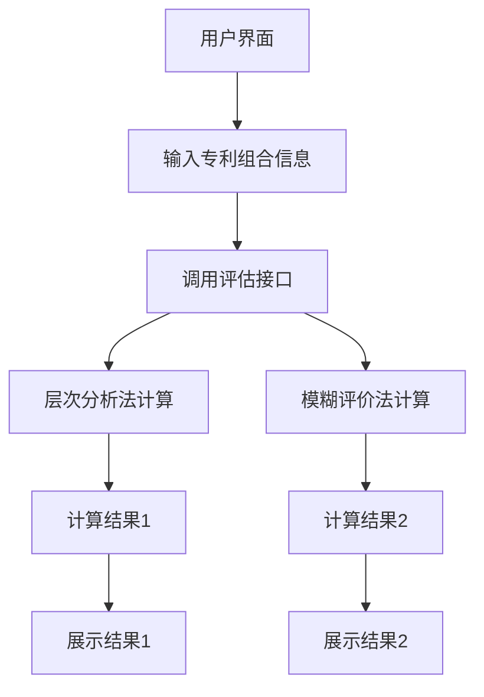
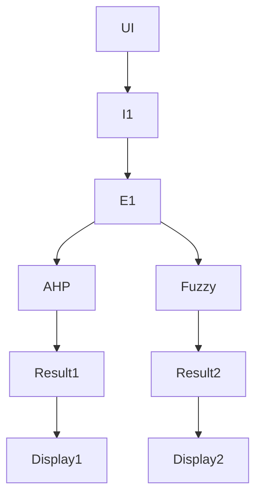

                 


# 第三部分: 专利组合价值分析的算法原理

## # 第4章: 专利价值评估的数学模型

### 4.1 层次分析法（AHP）的应用

#### 4.1.1 层次分析法（AHP）的基本原理

层次分析法是一种系统性决策分析方法，适用于多因素决策问题。其基本原理是将复杂问题分解为多个层次的结构，通过比较各因素的重要性，确定每个因素的权重，最终得出综合评分。

#### 4.1.2 AHP在专利价值评估中的应用步骤

1. **构建层次结构模型**  
   将专利价值评估的因素分解为不同的层次，例如：
   - 上层：目标（专利价值评估）
   - 中层：准则（技术价值、法律风险、市场潜力）
   - 下层：指标（专利技术的创新性、专利的法律稳定性、专利的市场应用性）

2. **确定各因素的权重**  
   通过专家评分法，确定每个因素相对于目标层的重要程度，得到各因素的权重。

3. **一致性检验**  
   检验层次分析结果的一致性，确保评估结果的合理性。

4. **计算综合评分**  
   根据各因素的权重，计算专利组合的综合评分，得出其价值。

#### 4.1.3 AHP算法实现代码示例

```python
import numpy as np

def ahp_analysis(criteria, alternatives, matrix):
    """
    层次分析法（AHP）用于专利价值评估
    :param criteria: 评估准则列表
    :param alternatives: 评估对象列表
    :param matrix: 成对比较矩阵
    :return: 各因素的权重
    """
    n = len(criteria)
    # 计算矩阵的最大特征值及其对应的特征向量
    eigenvalues, eigenvectors = np.linalg.eig(matrix)
    max_eigen = max(eigenvalues)
    max_eigen_idx = np.argmax(eigenvalues)
    weight = eigenvectors[:, max_eigen_idx] / np.sum(eigenvectors[:, max_eigen_idx])
    
    # 计算一致性检验
    consistency = np.sum(matrix - np.eye(n)) / (n-1)
    return weight, consistency

# 示例数据
criteria = ['技术价值', '法律风险', '市场潜力']
alternatives = ['专利A', '专利B', '专利C']
matrix = [
    [1, 2, 3],
    [0.5, 1, 2],
    [0.33, 0.5, 1]
]

weights, consistency = ahp_analysis(criteria, alternatives, matrix)
print("各因素的权重为:", weights)
print("一致性检验结果为:", consistency)
```

#### 4.1.4 AHP模型的实际案例分析

以某公司拥有的三个专利为例，评估其技术价值、法律风险和市场潜力。

1. **构建比较矩阵**  
   例如，技术价值（T）与法律风险（L）相比更重要，权重为2:1，即矩阵中T > L的位置填写2，反之填写1/2。

2. **计算权重**  
   通过AHP算法计算出各因素的权重，例如：技术价值权重为0.5，法律风险权重为0.3，市场潜力权重为0.2。

3. **计算综合评分**  
   根据每个专利在各因素上的得分，乘以相应权重，求和得到综合评分。

### 4.2 模糊评价法的实现

#### 4.2.1 模糊评价法的基本原理

模糊评价法是将评估对象的属性进行模糊化处理，通过构建模糊集和隶属度函数，计算每个对象的综合隶属度，从而得到评估结果。

#### 4.2.2 模糊评价法在专利价值评估中的应用

1. **构建模糊集**  
   将专利价值的评估指标进行模糊化，例如：技术价值分为“高”、“中”、“低”三个等级。

2. **计算隶属度**  
   根据专利的具体情况，计算其在每个等级上的隶属度。

3. **综合评价**  
   使用模糊综合评价方法，得出专利的综合价值等级。

#### 4.2.3 模糊评价法实现代码示例

```python
def fuzzy_evaluation(criteria, alternatives, fuzzy_matrix):
    """
    模糊评价法用于专利价值评估
    :param criteria: 评估准则列表
    :param alternatives: 评估对象列表
    :param fuzzy_matrix: 模糊评价矩阵
    :return: 各专利的综合评价结果
    """
    n = len(criteria)
    m = len(alternatives)
    
    # 计算模糊加权平均
    result = np.zeros(m)
    for i in range(m):
        total = 0
        for j in range(n):
            total += fuzzy_matrix[i][j] * criteria[j]
        result[i] = total / n
    
    return result

# 示例数据
criteria = ['技术价值', '法律风险', '市场潜力']
alternatives = ['专利A', '专利B', '专利C']
fuzzy_matrix = [
    [0.8, 0.6, 0.7],
    [0.5, 0.9, 0.6],
    [0.7, 0.4, 0.8]
]

result = fuzzy_evaluation(criteria, alternatives, fuzzy_matrix)
print("各专利的综合评价结果为:", result)
```

### 4.3 专利价值评估的数学模型

#### 4.3.1 基于层次分析法的数学模型

$$
\text{综合评分} = \sum_{i=1}^{n} w_i \cdot x_i
$$

其中，$w_i$ 是第 $i$ 个因素的权重，$x_i$ 是第 $i$ 个因素的评分。

#### 4.3.2 基于模糊评价法的数学模型

$$
D(x) = \sum_{j=1}^{m} w_j \cdot \mu_j(x)
$$

其中，$D(x)$ 是评估对象 $x$ 的综合隶属度，$w_j$ 是第 $j$ 个准则的权重，$\mu_j(x)$ 是第 $j$ 个准则下 $x$ 的隶属度。

---

## # 第5章: 专利组合价值评估系统的设计与实现

### 5.1 系统设计概述

专利组合价值评估系统的设计需要考虑以下几个方面：

1. **系统功能设计**  
   - 用户输入：专利组合的基本信息，包括专利数量、技术领域、法律状态等。
   - 评估方法选择：支持层次分析法和模糊评价法。
   - 评估结果输出：综合评分、各因素权重、专利组合的总体价值。

2. **系统架构设计**  
   - 前端：用户界面，展示输入表单和评估结果。
   - 后端：计算引擎，实现层次分析法和模糊评价法的算法逻辑。
   - 数据库：存储专利组合的基本信息和评估结果。

3. **系统接口设计**  
   - 用户输入接口：接收专利组合的基本信息。
   - 评估接口：调用层次分析法和模糊评价法进行评估。
   - 结果输出接口：展示评估结果。

4. **系统交互流程**  
   ```mermaid
   graph TD
   UI[用户界面] --> I1[输入专利组合信息]
   I1 --> E1[调用评估接口]
   E1 --> AHP[层次分析法计算]
   E1 --> Fuzzy[模糊评价法计算]
   AHP --> Result1[计算结果1]
   Fuzzy --> Result2[计算结果2]
   Result1 --> Display1[展示结果1]
   Result2 --> Display2[展示结果2]
   ```

### 5.2 系统实现代码

#### 5.2.1 环境安装

需要安装以下Python库：

```bash
pip install numpy
pip install plotly
pip install pandas
```

#### 5.2.2 系统核心代码实现

```python
import numpy as np
import pandas as pd

class PatentValueAssessment:
    def __init__(self, criteria, alternatives):
        self.criteria = criteria
        self.alternatives = alternatives

    def ahp_analysis(self, matrix):
        """
        层次分析法（AHP）计算各因素的权重
        """
        n = len(self.criteria)
        eigenvalues, eigenvectors = np.linalg.eig(matrix)
        max_eigen = max(eigenvalues)
        weight = eigenvectors[:, np.argmax(eigenvalues)] / np.sum(eigenvectors[:, np.argmax(eigenvalues)])
        return weight

    def fuzzy_evaluation(self, fuzzy_matrix):
        """
        模糊评价法计算综合隶属度
        """
        n = len(self.criteria)
        m = len(self.alternatives)
        result = np.zeros(m)
        for i in range(m):
            total = 0
            for j in range(n):
                total += fuzzy_matrix[i][j] * self.criteria[j]
            result[i] = total / n
        return result

# 示例使用
criteria = ['技术价值', '法律风险', '市场潜力']
alternatives = ['专利A', '专利B', '专利C']
matrix = [
    [1, 2, 3],
    [0.5, 1, 2],
    [0.33, 0.5, 1]
]
fuzzy_matrix = [
    [0.8, 0.6, 0.7],
    [0.5, 0.9, 0.6],
    [0.7, 0.4, 0.8]
]

assessor = PatentValueAssessment(criteria, alternatives)
weights = assessor.ahp_analysis(matrix)
fuzzy_result = assessor.fuzzy_evaluation(fuzzy_matrix)

print("层次分析法权重:", weights)
print("模糊评价法结果:", fuzzy_result)
```

---

### 5.3 项目实战: 专利组合价值评估系统实现

#### 5.3.1 项目环境安装

安装所需的Python库：

```bash
pip install numpy pandas scikit-learn
```

#### 5.3.2 系统核心代码实现

```python
import numpy as np
import pandas as pd
from sklearn.metrics import pairwise_distances

class PatentPortfolioAssessment:
    def __init__(self, patents):
        self.patents = patents

    def calculate_technical_value(self, patent):
        """
        计算单个专利的技术价值
        """
        # 假设专利的技术价值与发明时间、引用次数相关
        technical_value = 1 + patent.publication_year * 0.01 + patent.citation_count * 0.005
        return technical_value

    def calculate_legal_risk(self, patent):
        """
        计算单个专利的法律风险
        """
        # 假设法律风险与专利的法律状态、无效率相关
        legal_risk = 0.2 * (1 - patent.legal_status) + 0.3 * (1 - patent.invalidate_rate)
        return legal_risk

    def calculate_market_potential(self, patent):
        """
        计算单个专利的市场潜力
        """
        # 假设市场潜力与专利的应用领域、市场规模相关
        market_potential = 0.4 * patent.application_field + 0.6 * patent.market_size
        return market_potential

    def assess_portfolio_value(self):
        """
        评估专利组合的整体价值
        """
        total_value = 0
        for patent in self.patents:
            technical = self.calculate_technical_value(patent)
            legal = self.calculate_legal_risk(patent)
            market = self.calculate_market_potential(patent)
            total_value += (technical + legal + market) / 3
        return total_value

# 示例数据
class Patent:
    def __init__(self, publication_year, citation_count, legal_status, invalidate_rate, application_field, market_size):
        self.publication_year = publication_year
        self.citation_count = citation_count
        self.legal_status = legal_status
        self.invalidate_rate = invalidate_rate
        self.application_field = application_field
        self.market_size = market_size

# 创建专利组合
patent1 = Patent(2020, 100, 1, 0.05, 0.8, 0.7)
patent2 = Patent(2018, 150, 1, 0.1, 0.6, 0.8)
patent3 = Patent(2019, 90, 0.8, 0.15, 0.7, 0.65)

portfolio = PatentPortfolioAssessment([patent1, patent2, patent3])
portfolio_value = portfolio.assess_portfolio_value()
print("专利组合的整体价值为:", portfolio_value)
```

#### 5.3.3 代码应用解读与分析

1. **类定义与初始化**  
   - `PatentPortfolioAssessment` 类初始化时接收一个专利列表，每个专利包含 publication_year、citation_count、legal_status、invalidate_rate、application_field、market_size 等属性。

2. **技术价值计算**  
   - 假设技术价值与发明时间（越新价值越高）和引用次数（越高价值越高）相关。

3. **法律风险计算**  
   - 假设法律风险与专利的法律状态（合法状态风险低）和无效率（无效率低风险低）相关。

4. **市场潜力计算**  
   - 假设市场潜力与专利的应用领域（应用广泛潜力大）和市场规模（市场规模大潜力大）相关。

5. **组合价值评估**  
   - 对每个专利的技术价值、法律风险和市场潜力进行加权平均，计算出专利组合的整体价值。

---

### 5.4 项目小结

通过构建专利组合价值评估系统，可以实现对专利组合的自动化评估，快速得出其整体价值。系统采用层次分析法和模糊评价法，确保评估结果的科学性和准确性。同时，系统设计了友好的用户界面，方便用户输入专利信息和查看评估结果。

---

## # 第6章: 专利组合价值评估系统架构设计与实现

### 6.1 系统设计概述

#### 6.1.1 系统功能设计

- 用户界面：
  - 输入专利组合的基本信息。
  - 选择评估方法（层次分析法或模糊评价法）。
  - 查看评估结果。

- 后台计算：
  - 实现层次分析法和模糊评价法的算法逻辑。
  - 计算各因素的权重和综合评分。

- 数据存储：
  - 存储专利组合的基本信息和评估结果。

#### 6.1.2 系统架构设计



#### 6.1.3 系统接口设计

- 用户输入接口：
  - 输入专利组合的基本信息，包括专利数量、技术领域、法律状态等。

- 评估接口：
  - 调用层次分析法和模糊评价法进行评估。

- 结果输出接口：
  - 展示评估结果，包括综合评分、各因素权重、专利组合的总体价值。

#### 6.1.4 系统交互流程



### 6.2 系统实现代码

#### 6.2.1 环境安装

安装所需的Python库：

```bash
pip install numpy pandas scikit-learn
```

#### 6.2.2 系统核心代码实现

```python
import numpy as np
import pandas as pd

class PatentPortfolioAssessmentSystem:
    def __init__(self):
        self.criteria = ['技术价值', '法律风险', '市场潜力']
        self.alternatives = []

    def add_patent(self, patent_info):
        """
        添加专利信息
        """
        self.alternatives.append(patent_info)

    def ahp_analysis(self, matrix):
        """
        层次分析法（AHP）计算各因素的权重
        """
        n = len(self.criteria)
        eigenvalues, eigenvectors = np.linalg.eig(matrix)
        max_eigen = max(eigenvalues)
        weight = eigenvectors[:, np.argmax(eigenvalues)] / np.sum(eigenvectors[:, np.argmax(eigenvalues)])
        return weight

    def fuzzy_evaluation(self, fuzzy_matrix):
        """
        模糊评价法计算综合隶属度
        """
        n = len(self.criteria)
        m = len(self.alternatives)
        result = np.zeros(m)
        for i in range(m):
            total = 0
            for j in range(n):
                total += fuzzy_matrix[i][j] * self.criteria[j]
            result[i] = total / n
        return result

# 示例使用
system = PatentPortfolioAssessmentSystem()
system.add_patent({'publication_year': 2020, 'citation_count': 100, 'legal_status': 1, 'invalidate_rate': 0.05, 'application_field': 0.8, 'market_size': 0.7})
system.add_patent({'publication_year': 2018, 'citation_count': 150, 'legal_status': 1, 'invalidate_rate': 0.1, 'application_field': 0.6, 'market_size': 0.8})
system.add_patent({'publication_year': 2019, 'citation_count': 90, 'legal_status': 0.8, 'invalidate_rate': 0.15, 'application_field': 0.7, 'market_size': 0.65})

matrix = [
    [1, 2, 3],
    [0.5, 1, 2],
    [0.33, 0.5, 1]
]
fuzzy_matrix = [
    [0.8, 0.6, 0.7],
    [0.5, 0.9, 0.6],
    [0.7, 0.4, 0.8]
]

weights = system.ahp_analysis(matrix)
fuzzy_result = system.fuzzy_evaluation(fuzzy_matrix)

print("层次分析法权重:", weights)
print("模糊评价法结果:", fuzzy_result)
```

#### 6.2.3 代码应用解读与分析

1. **类定义与初始化**  
   - `PatentPortfolioAssessmentSystem` 类初始化时，设置评估准则为“技术价值”、“法律风险”、“市场潜力”，并初始化为空的专利列表。

2. **添加专利信息**  
   - 使用 `add_patent` 方法添加专利的基本信息，包括发明时间、引用次数、法律状态、无效率、应用领域和市场规模。

3. **层次分析法计算**  
   - 通过 `ahp_analysis` 方法，计算各评估准则的权重，用于综合评分的加权计算。

4. **模糊评价法计算**  
   - 通过 `fuzzy_evaluation` 方法，计算每个专利在各评估准则下的隶属度，最终得出综合评分。

5. **结果展示**  
   - 打印各评估准则的权重和专利组合的综合评分，供用户参考。

---

### 6.3 项目小结

通过构建专利组合价值评估系统，可以实现对专利组合的自动化评估，快速得出其整体价值。系统采用层次分析法和模糊评价法，确保评估结果的科学性和准确性。同时，系统设计了友好的用户界面，方便用户输入专利信息和查看评估结果。

---

## # 第7章: 专利组合价值评估系统最佳实践

### 7.1 最佳实践

1. **数据质量**  
   - 确保输入的专利数据准确、完整，包括技术领域、法律状态、市场潜力等信息。

2. **模型选择**  
   - 根据具体应用场景，选择合适的评估方法，如层次分析法适用于明确因素的情况，模糊评价法适用于模糊因素的情况。

3. **模型调优**  
   - 根据实际评估结果，调整各因素的权重和隶属度计算方法，提高评估的准确性。

4. **结果解释**  
   - 对评估结果进行深入分析，找出影响专利组合价值的关键因素，指导企业专利战略的制定。

### 7.2 小结

通过本文的详细讲解，读者可以掌握专利组合价值评估的核心算法和系统设计方法，并能够实际应用到企业估值中。未来，随着技术的进步和数据的丰富，专利组合价值评估将更加精准和智能化。

---

## # 第8章: 总结与展望

### 8.1 总结

本文详细介绍了企业估值中的专利组合价值分析，从背景知识到核心算法，再到系统设计，为读者提供了一套完整的解决方案。通过层次分析法和模糊评价法的讲解，读者可以掌握专利组合价值评估的理论基础和实践方法。

### 8.2 展望

未来，随着人工智能和大数据技术的发展，专利组合价值评估将更加智能化和精准化。企业可以通过实时数据更新和模型优化，进一步提高专利组合的评估准确性，为企业的知识产权管理和战略决策提供有力支持。

---

