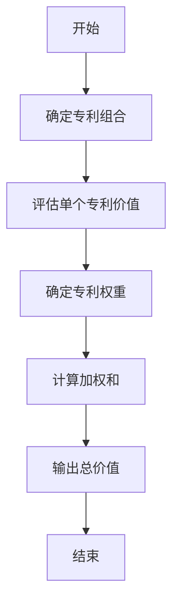
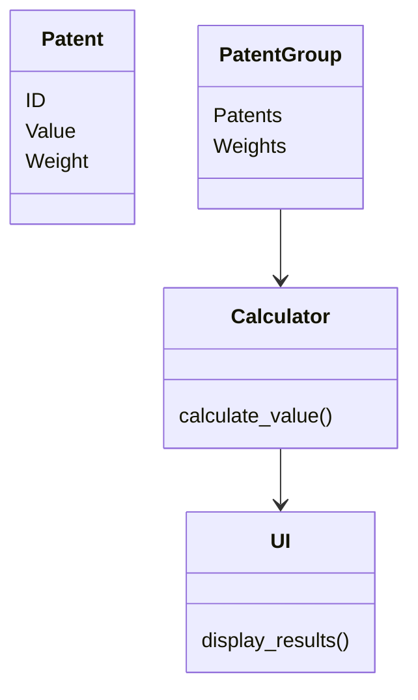

                 


# 《企业估值中的专利组合价值评估》

---

## 关键词

企业估值、专利组合、价值评估、法律因素、市场因素、加权平均模型

---

## 摘要

企业估值中的专利组合价值评估是一个复杂而重要的过程，涉及专利的法律保护、市场价值以及企业战略等多个方面。本文从专利的基本概念出发，详细阐述专利组合价值评估的核心原理、算法模型、系统架构以及实际应用。通过对比分析专利的法律与市场影响因素，结合数学模型和实际案例，为读者提供全面的理论支持和实践指导。

---

## 正文

### 第1章：专利的基本概念与企业估值的重要性

#### 1.1 专利的基本概念

专利是法律保护的知识产权形式之一，用于保护发明创造的独占性。专利的类型主要包括发明专利、实用新型专利和外观设计专利。专利的价值不仅体现在其法律保护上，还体现在其市场应用和经济收益上。

- **发明专利**：保护技术方案的核心创新点，通常具有较高的技术壁垒和市场价值。
- **实用新型专利**：保护技术方案的具体实现方式，通常适用于特定的技术领域。
- **外观设计专利**：保护产品的外观设计，主要用于区分同类产品的外观差异。

#### 1.2 企业估值的基本概念

企业估值是通过对企业的财务状况、市场表现、技术储备等多个维度的综合评估，确定企业的整体价值。在企业估值中，无形资产（如专利、商标等）的价值评估尤为重要，因为它们往往决定了企业的核心竞争力和市场地位。

#### 1.3 专利组合评估的必要性

专利组合是指一组相互关联的专利，通常围绕企业的核心技术和业务领域展开。专利组合的价值不仅取决于单个专利的价值，还取决于专利之间的协同效应和互补性。因此，对专利组合进行价值评估，可以帮助企业更好地管理和优化其知识产权资产。

---

### 第2章：专利组合价值评估的核心原理

#### 2.1 专利组合价值评估的模型与方法

专利组合价值评估的方法多种多样，主要包括以下几种：

- **市场法**：基于市场上类似专利的交易价格，评估专利组合的市场价值。
- **成本法**：基于专利的研发成本，评估专利组合的账面价值。
- **收益法**：基于专利组合为企业带来的未来收益，评估其经济价值。

#### 2.2 专利组合价值评估的关键影响因素

专利组合的价值评估需要综合考虑多个因素，包括：

- **法律因素**：专利的法律稳定性，包括专利的有效性、权利范围等。
- **市场因素**：专利的市场需求、竞争状况、技术成熟度等。
- **经济因素**：专利的经济收益能力，包括 licensing 收入、侵权赔偿等。

#### 2.3 专利组合价值评估的法律与市场因素对比

通过对比分析专利的法律和市场影响因素，可以更好地理解专利组合价值评估的复杂性。下表对专利的法律因素和市场因素进行了对比：

| **因素类型** | **法律因素**                     | **市场因素**                     |
|--------------|---------------------------------|---------------------------------|
| **核心内容** | 专利的法律保护、权利范围       | 专利的市场需求、竞争状况       |
| **影响程度** | 决定专利的法律地位               | 决定专利的市场价值               |
| **评估重点** | 专利的法律风险、权利稳定性       | 专利的市场潜力、经济收益能力     |

---

### 第3章：专利组合价值评估的数学模型与算法

#### 3.1 专利组合价值评估的数学模型

专利组合价值评估的数学模型通常采用加权平均法，即将多个专利的价值按权重进行加权求和。公式如下：

$$
V_{\text{total}} = \sum_{i=1}^{n} w_i \times V_i
$$

其中，$V_{\text{total}}$ 表示专利组合的总价值，$w_i$ 表示第 $i$ 个专利的权重，$V_i$ 表示第 $i$ 个专利的单值。

#### 3.2 专利组合价值评估的算法流程

以下是专利组合价值评估的算法流程图：



#### 3.3 专利组合价值评估的Python实现

以下是一个简单的Python代码示例，用于计算专利组合的总价值：

```python
def calculate_patent_value(patents, weights):
    total_value = 0
    for i in range(len(patents)):
        total_value += patents[i] * weights[i]
    return total_value

# 示例数据
patents = [100, 200, 150]  # 单个专利的价值
weights = [0.3, 0.5, 0.2]   # 专利权重

# 计算总价值
total_value = calculate_patent_value(patents, weights)
print(f"专利组合总价值为：{total_value}")
```

---

### 第4章：系统分析与架构设计方案

#### 4.1 问题场景介绍

企业需要对其拥有的专利组合进行价值评估，以支持企业估值和知识产权管理。通过系统化的分析和设计，可以帮助企业更好地管理和优化其专利组合。

#### 4.2 系统功能设计

以下是专利组合价值评估系统的功能模块：



---

### 第5章：项目实战

#### 5.1 环境安装

为了运行专利组合价值评估系统，需要安装以下工具和库：

- Python 3.8+
- Mermaid 图表工具
- matplotlib 或其他可视化库

#### 5.2 核心代码实现

以下是系统的核心代码实现：

```python
import matplotlib.pyplot as plt

def calculate_patent_value(patents, weights):
    total_value = 0
    for i in range(len(patents)):
        total_value += patents[i] * weights[i]
    return total_value

def visualize_results(patents, weights):
    plt.bar(range(len(patents)), patents, align='edge', color='skyblue')
    plt.xticks(range(len(patents)), ['Patent 1', 'Patent 2', 'Patent 3'])
    plt.ylabel('Value')
    plt.title('Patent Value Visualization')
    plt.show()

# 示例数据
patents = [100, 200, 150]
weights = [0.3, 0.5, 0.2]

# 计算总价值
total_value = calculate_patent_value(patents, weights)

# 可视化结果
visualize_results(patents, weights)

print(f"专利组合总价值为：{total_value}")
```

---

### 第6章：最佳实践与总结

#### 6.1 最佳实践

- 在进行专利组合价值评估时，应综合考虑专利的法律、市场和经济因素。
- 使用多种评估方法（如市场法、成本法、收益法）进行交叉验证，确保评估结果的准确性。

#### 6.2 小结

企业估值中的专利组合价值评估是一个复杂而重要的过程，需要综合考虑多方面的因素。通过本文的详细讲解和实际案例分析，可以帮助读者更好地理解和应用专利组合价值评估的方法和模型。

#### 6.3 注意事项

- 专利组合的价值评估应结合企业的实际业务需求和战略目标。
- 在实际应用中，应根据具体情况进行参数调整和模型优化。

#### 6.4 拓展阅读

- 推荐阅读《专利管理与战略》（作者：XXX）。
- 参考相关学术论文，深入理解专利组合价值评估的理论与实践。

---

通过以上内容，我们全面介绍了企业估值中的专利组合价值评估的背景、核心概念、算法原理、系统设计以及实际应用。希望本文能为读者提供有价值的参考和启示。

