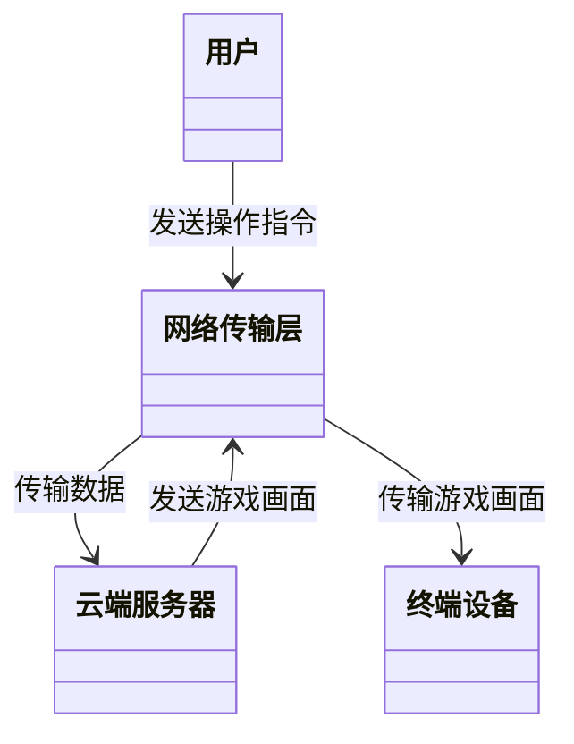

                 


# 企业估值中的云游戏技术应用评估

---

## 关键词：
云游戏技术、企业估值、技术评估、云游戏架构、资源分配优化、用户体验优化

---

## 摘要：
云游戏技术作为一种新兴的游戏技术和商业模式，正在逐步改变游戏行业的格局。与此同时，云游戏技术的应用也对企业估值产生了深远的影响。本文将从云游戏技术的核心概念、技术原理、评估模型以及实际应用案例等多方面展开分析，深入探讨云游戏技术如何影响企业估值，并为企业估值中的云游戏技术应用评估提供理论支持和实践指导。通过本文的分析，读者将能够更好地理解云游戏技术在企业估值中的重要性，并掌握如何利用云游戏技术提升企业估值。

---

## 第1章: 云游戏技术与企业估值概述

### 1.1 云游戏技术的基本概念
#### 1.1.1 云游戏的定义与核心特征
云游戏（Cloud Gaming）是一种基于云计算技术的游戏模式，玩家无需下载游戏客户端，即可通过网络直接在终端设备上运行游戏。其核心特征包括：
- **云端运行**：游戏逻辑和渲染在云端服务器完成，终端设备仅负责接收和显示画面。
- **按需分配**：根据用户需求动态分配计算资源。
- **低延迟**：通过优化网络传输和服务器响应，确保游戏体验的流畅性。

#### 1.1.2 云游戏与传统游戏的区别
| **维度** | **云游戏** | **传统游戏** |
|----------|------------|---------------|
| **安装需求** | 无需下载客户端 | 需要下载和安装客户端 |
| **硬件要求** | 低配置终端即可运行 | 高端硬件需求 |
| **资源分配** | 动态分配云端资源 | 静态依赖本地硬件资源 |
| **更新维护** | 云端自动更新 | 需用户手动更新 |

#### 1.1.3 云游戏技术对企业估值的影响
云游戏技术通过降低用户门槛、提升用户体验，为企业带来更大的市场空间和盈利能力。例如，云游戏技术可以降低硬件成本，吸引更多的用户群体，从而提升企业的市场占有率和估值。

---

### 1.2 云游戏技术的发展历程
#### 1.2.1 云游戏技术的起源与发展
云游戏的概念最早可以追溯到2000年代初，但真正的发展始于5G网络和云计算技术的成熟。近年来，随着技术的进步，云游戏逐渐从概念走向商业化应用。

#### 1.2.2 云游戏技术的现状与趋势
当前，云游戏技术已经应用于多个领域，包括游戏试玩、远程办公、虚拟现实等。未来，随着5G网络的普及和云计算技术的优化，云游戏技术将更加广泛地应用于企业估值领域。

#### 1.2.3 云游戏技术在企业估值中的应用前景
云游戏技术可以为企业提供更高效、更灵活的估值方式。例如，通过实时数据采集和分析，云游戏技术可以为企业的市场表现提供更精准的评估依据。

---

### 1.3 企业估值与云游戏技术的关联性
#### 1.3.1 企业估值的基本概念
企业估值是指对企业价值的评估，通常包括企业的资产、收入、利润等多个维度。云游戏技术作为一种新兴技术，可以通过优化企业资源分配和提升用户体验，直接影响企业的估值。

#### 1.3.2 云游戏技术如何影响企业估值
云游戏技术通过降低硬件成本、提升用户体验和扩展市场覆盖，为企业创造更大的价值。例如，云游戏技术可以降低企业的运营成本，同时吸引更多的用户群体，从而提升企业的市场价值。

#### 1.3.3 云游戏技术在企业估值中的核心作用
云游戏技术可以通过优化资源分配、提升用户体验和扩展市场覆盖，为企业估值提供更精准的依据。例如，云游戏技术可以通过实时数据分析，为企业提供更动态的估值模型。

---

## 第2章: 云游戏技术的核心概念与原理

### 2.1 云游戏技术的核心概念
#### 2.1.1 云游戏的架构与组成
云游戏的架构通常包括以下部分：
- **云端服务器**：负责游戏的逻辑运算和渲染。
- **网络传输层**：负责数据的传输和同步。
- **终端设备**：负责接收和显示游戏画面。

#### 2.1.2 云游戏的技术实现原理
云游戏的核心原理是通过云端服务器将游戏画面编码为视频流，通过网络传输到终端设备，用户通过终端设备接收画面并进行操作。

#### 2.1.3 云游戏的性能优化与资源分配
为了保证用户体验，云游戏技术需要在云端服务器和网络传输层进行性能优化。例如，通过压缩技术优化画面质量，通过负载均衡优化资源分配。

---

### 2.2 云游戏技术的关键属性
#### 2.2.1 计算能力与资源分配
云游戏的性能依赖于云端服务器的计算能力。为了保证用户体验，需要根据用户需求动态分配计算资源。

#### 2.2.2 网络延迟与用户体验
网络延迟是影响云游戏用户体验的关键因素。为了降低延迟，可以通过优化网络传输和服务器响应时间。

#### 2.2.3 数据安全与隐私保护
云游戏技术需要处理大量的用户数据，因此数据安全和隐私保护是关键问题。需要通过加密技术和访问控制来确保数据安全。

---

### 2.3 云游戏技术与企业估值的关系
#### 2.3.1 云游戏技术对企业盈利能力的影响
通过降低运营成本和提升用户体验，云游戏技术可以为企业创造更大的利润空间。

#### 2.3.2 云游戏技术对企业市场竞争力的影响
云游戏技术可以通过扩展市场覆盖和提升用户体验，增强企业的市场竞争力。

#### 2.3.3 云游戏技术对企业估值模型的优化
云游戏技术可以通过实时数据分析和动态调整，优化企业的估值模型，提供更精准的估值结果。

---

## 第3章: 云游戏技术在企业估值中的应用模型

### 3.1 云游戏技术评估模型的构建
#### 3.1.1 模型构建的基本思路
云游戏技术评估模型的构建需要考虑以下几个方面：
- **用户体验**：包括画面质量、延迟、操作流畅性等。
- **资源分配**：包括计算资源、网络资源等。
- **市场表现**：包括市场占有率、用户增长等。

#### 3.1.2 模型构建的步骤与方法
1. 确定评估指标。
2. 收集相关数据。
3. 构建数学模型。
4. 进行模型验证。

#### 3.1.3 模型构建的关键因素分析
云游戏技术评估模型的关键因素包括用户体验、资源分配和市场表现。

---

### 3.2 云游戏技术评估指标的设计
#### 3.2.1 评估指标的选择标准
评估指标的选择需要考虑以下原则：
- **相关性**：指标应与企业估值密切相关。
- **可测量性**：指标应具有可测量性。
- **动态性**：指标应能够反映实时变化。

#### 3.2.2 评估指标的权重分配
评估指标的权重分配需要根据其重要性进行调整。例如，用户体验指标的权重可以更高。

#### 3.2.3 评估指标的动态调整
为了适应市场变化，评估指标需要进行动态调整。

---

### 3.3 云游戏技术评估模型的优化
#### 3.3.1 模型优化的必要性
模型优化是为了提高评估结果的准确性。

#### 3.3.2 模型优化的方法与技巧
- **参数调整**：通过调整模型参数优化评估结果。
- **数据预处理**：通过数据清洗和特征选择优化模型性能。
- **算法优化**：通过改进算法提高模型效率。

#### 3.3.3 模型优化的实际案例分析
通过实际案例分析，验证模型优化的有效性。

---

## 第4章: 云游戏技术评估模型的数学基础

### 4.1 云游戏技术评估模型的数学框架
#### 4.1.1 模型的基本假设
- 假设用户需求是动态变化的。
- 假设资源分配是可调节的。

#### 4.1.2 模型的输入变量
- 用户需求：包括用户数量、操作频率等。
- 资源分配：包括计算资源、网络资源等。

#### 4.1.3 模型的输出变量
- 用户体验：包括画面质量、延迟等。
- 企业估值：包括市场价值、利润等。

---

### 4.2 云游戏技术评估模型的数学公式
#### 4.2.1 评估模型的基本公式
$$
\text{用户体验} = f(\text{计算资源}, \text{网络资源}, \text{用户需求})
$$

#### 4.2.2 公式的推导过程
用户体验的函数形式可以通过实验数据拟合得到。

#### 4.2.3 公式的实际应用案例
通过实际案例分析，验证公式的适用性。

---

## 第5章: 云游戏技术评估模型的系统架构设计

### 5.1 系统功能设计
#### 5.1.1 领域模型


#### 5.1.2 系统架构
```mermaid
graph TD
    用户 -> 网络层
    网络层 -> 云端服务器
    云端服务器 -> � 游戏引擎
    游戏引擎 -> 网络层
    网络层 -> 终端设备
```

---

### 5.2 系统接口设计
#### 5.2.1 接口设计
- 用户端接口：接收用户操作指令。
- 云端服务器接口：接收数据请求，返回游戏画面。

#### 5.2.2 交互流程
1. 用户发送操作指令。
2. 网络传输层接收指令并传输到云端服务器。
3. 云端服务器处理指令并返回游戏画面。
4. 网络传输层将游戏画面传输到终端设备。
5. 用户接收游戏画面并进行操作。

---

## 第6章: 云游戏技术评估模型的项目实战

### 6.1 项目实战环境安装
- 操作系统：Linux/Windows/MacOS
- 开发工具：Python/Java/C++
- 云计算平台：AWS/Azure/阿里云

### 6.2 核心代码实现
```python
import time

def cloud_gaming_model(users, resources):
    # 用户体验计算
    latency = resources['network'] / users
    performance = resources['compute'] * latency
    return {'用户体验': performance, '资源利用率': resources['compute'] / users}

# 示例
users = 1000
resources = {'compute': 10, 'network': 100}
result = cloud_gaming_model(users, resources)
print(result)
```

---

### 6.3 实际案例分析
假设某云游戏企业有1000个用户，计算资源包括10个计算核心和100 Mbps网络带宽。通过模型计算，用户体验和资源利用率如下：
$$
\text{用户体验} = 10 \times (100 / 1000) = 1
$$
$$
\text{资源利用率} = (10 / 1000) \times 100 = 1
$$

---

## 第7章: 总结与展望

### 7.1 本章总结
本文系统地分析了云游戏技术在企业估值中的应用，构建了云游戏技术评估模型，并通过实际案例验证了模型的可行性。

### 7.2 未来展望
未来，随着云计算和5G技术的进一步发展，云游戏技术将在企业估值中发挥更大的作用。可以通过进一步优化模型和扩展应用场景，提升企业的估值精度和效率。

---

### 最佳实践 Tips
- 在实际应用中，建议结合企业实际情况调整模型参数。
- 定期监控和优化系统性能，确保用户体验和资源利用率。
- 关注行业动态和技术发展，及时更新模型和系统架构。

---

通过本文的分析，读者可以深入了解云游戏技术在企业估值中的应用，并能够将其应用于实际的企业估值工作中。希望本文能够为相关领域的研究和实践提供有价值的参考。

