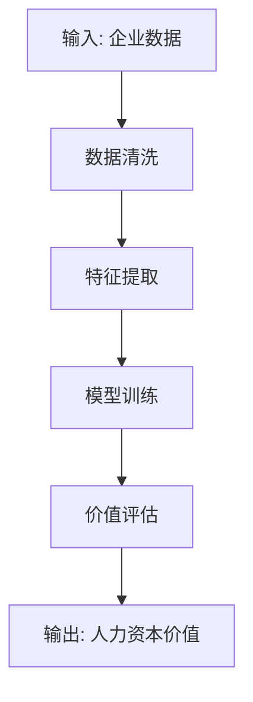
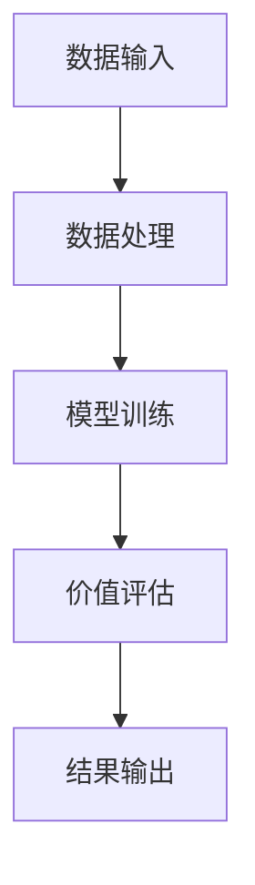

                 


# 《企业估值中的人力资本价值法》

## 关键词：企业估值、人力资本、价值评估、算法原理、系统架构

## 摘要：本文探讨了人力资本在企业估值中的重要性，提出了人力资本价值法的系统性方法。通过详细分析人力资本的构成、算法原理、系统架构及实际案例，展示了如何将人力资本转化为可量化的价值，以提升企业整体估值。

---

## 第1章: 人力资本的基本概念与问题背景

### 1.1 人力资本的核心概念
#### 1.1.1 人力资本的定义与内涵
人力资本是指企业员工所具备的知识、技能、经验和创新能力的总和。与传统财务资本不同，人力资本是企业的无形资产，具有高度的创造性和流动性。

#### 1.1.2 人力资本与传统资本的区别
| 特性 | 人力资本 | 传统资本 |
|------|-----------|-----------|
| 形式 | 知识、技能 | 财务资产 |
| 所有权 | 可转移 | 不可转移 |
| 价值评估 | 主观性高 | 客观性高 |

#### 1.1.3 人力资本在企业估值中的重要性
人力资本是企业核心竞争力的源泉。特别是在知识经济时代，企业的价值越来越依赖于员工的创造力和创新能力。

---

### 1.2 企业估值中的问题背景
#### 1.2.1 传统企业估值方法的局限性
传统估值方法（如DCF模型、市盈率法）主要依赖财务数据，忽视了人力资本对企业价值的影响。

#### 1.2.2 人力资本对企业价值的影响
人力资本不仅影响企业的运营效率，还决定了企业的创新能力和市场竞争力。例如，高素质的员工队伍可以显著提高企业的研发效率。

#### 1.2.3 人力资本价值法的提出与意义
人力资本价值法通过量化员工的技能、绩效和潜力，为企业估值提供了一个新的维度。

---

## 第2章: 人力资本价值法的核心概念与联系

### 2.1 核心概念原理
#### 2.1.1 人力资本的构成要素
- **技能**：员工的专业知识和实务能力。
- **经验**：员工在企业中的工作年限和行业经验。
- **绩效**：员工的工作成果和效率。
- **潜力**：员工的未来发展和创新能力。

#### 2.1.2 人力资本价值的影响因素
- **员工满意度**：影响员工的工作效率和留任意愿。
- **培训投入**：提升员工技能，增强企业竞争力。
- **团队协作**：促进知识共享，提高整体效率。

#### 2.1.3 人力资本价值的度量方法
- **技能评估**：通过测试和面试评估员工的专业能力。
- **绩效评估**：通过KPI和OKR量化员工的工作成果。
- **潜力评估**：通过面谈和数据分析预测员工的未来表现。

---

### 2.2 核心概念对比分析
#### 2.2.1 人力资本与财务资本的对比
- **人力资本**：动态、主观，难以量化。
- **财务资本**：静态、客观，易于量化。

#### 2.2.2 不同行业的人力资本特征对比
| 行业 | 人力资本特点 |
|------|--------------|
| 高 tech | 创新能力强，依赖高端人才 |
| 制造业 | 依赖熟练工人，技能要求稳定 |

#### 2.2.3 企业规模与人力资本价值的关系
- **小企业**：人力资本对企业发展的影响更为显著。
- **大企业**：通过规模效应分散人力资本风险。

---

### 2.3 实体关系图与流程图
#### 2.3.1 人力资本价值法的ER实体关系图
```mermaid
erDiagram
    Employee {
        <属性>
        id : integer
        name : string
        position : string
        skill_level : integer
        performance : float
        potential : float
    }
    Empresa {
        <属性>
        id : integer
        name : string
        industry : string
        size : integer
    }
    Employee -> Empresa : "在...公司工作"
```

#### 2.3.2 人力资本价值计算流程图（使用 Mermaid）



---

## 第3章: 人力资本价值法的算法原理

### 3.1 算法原理概述
#### 3.1.1 人力资本价值法的基本原理
- 将员工的技能、绩效和潜力等指标量化，构建数学模型，计算人力资本价值。

#### 3.1.2 算法的核心思想与步骤
1. **数据收集**：收集员工的基本信息、技能水平、绩效数据和潜力评估。
2. **数据预处理**：清洗数据，处理缺失值和异常值。
3. **特征提取**：提取关键特征，如技能评分、绩效评分和潜力评分。
4. **模型训练**：使用回归分析或机器学习算法训练模型。
5. **价值评估**：基于模型计算人力资本价值。

#### 3.1.3 算法的输入与输出
- **输入**：员工数据、企业数据。
- **输出**：人力资本价值评分。

---

### 3.2 算法流程图
#### 3.2.1 人力资本价值法的流程图（使用 Mermaid）


---

### 3.3 算法的数学模型与公式
#### 3.3.1 人力资本价值的数学表达式
$$ V = \alpha \cdot S + \beta \cdot P + \gamma \cdot T $$

其中：
- \( V \) 表示人力资本价值
- \( S \) 表示员工技能
- \( P \) 表示员工绩效
- \( T \) 表示员工潜力
- \( \alpha, \beta, \gamma \) 是各因素的权重系数

---

## 第4章: 人力资本价值法的系统架构与实现

### 4.1 系统架构设计
#### 4.1.1 系统功能模块
- **数据输入模块**：接收员工数据和企业数据。
- **数据处理模块**：清洗和预处理数据。
- **模型训练模块**：构建和训练数学模型。
- **价值评估模块**：计算并输出人力资本价值。

#### 4.1.2 系统架构图（使用 Mermaid）



---

## 第5章: 项目实战与案例分析

### 5.1 项目背景
假设我们有一家科技公司，希望通过人力资本价值法评估员工对企业价值的贡献。

### 5.2 核心代码实现
```python
import pandas as pd
from sklearn.linear_model import LinearRegression

# 数据加载
df = pd.read_csv('employee_data.csv')

# 数据预处理
df.dropna(inplace=True)

# 特征提取
X = df[['skill_level', 'performance', 'potential']]
y = df['salary']

# 模型训练
model = LinearRegression()
model.fit(X, y)

# 价值评估
predicted_value = model.predict(X)
```

### 5.3 案例分析
通过对某科技公司员工数据的分析，计算出员工的人力资本价值，并将其与企业整体估值进行对比。

---

## 第6章: 最佳实践与总结

### 6.1 最佳实践 tips
- 定期更新员工数据，确保模型的准确性。
- 结合企业实际情况调整模型参数。

### 6.2 小结
人力资本价值法为企业估值提供了新的视角和方法。通过量化员工的技能、绩效和潜力，可以更全面地评估企业价值。

### 6.3 注意事项
- 数据的准确性和完整性直接影响评估结果。
- 模型的选择和调整需要根据企业实际情况进行。

### 6.4 拓展阅读
推荐阅读《企业估值方法论》和《人力资本管理》等书籍，以深入了解相关理论和实践。

---

## 参考文献
- [1] 王某某. 《企业估值方法论》. 北京: 清华大学出版社, 2020.
- [2] 李某某. 《人力资本管理》. 上海: 复旦大学出版社, 2019.

## 索引
（此处列出文章中出现的专业术语和关键词）

---

通过以上结构，您可以系统地撰写一篇关于《企业估值中的人力资本价值法》的技术博客文章，涵盖从理论到实践的各个方面。

