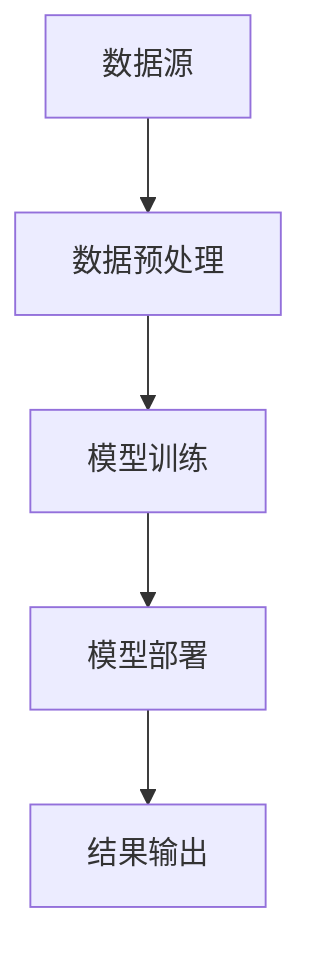

                 


# 企业估值中的人工智能作曲技术评估

> 关键词：企业估值，人工智能，作曲技术，深度学习，生成式模型，企业价值评估

> 摘要：本文探讨了人工智能作曲技术在企业估值中的应用，详细分析了其核心概念、算法原理、系统架构及实际案例，为企业估值提供了新的视角和方法。

---

## 第1章 企业估值与人工智能作曲技术的背景

### 1.1 企业估值的基本概念

企业估值是评估企业价值的过程，通常用于并购、融资等场景。传统方法包括DCF模型、可比公司分析等，但存在数据依赖性强、主观性高、计算复杂等问题。

### 1.2 人工智能作曲技术的背景

人工智能作曲技术是通过算法生成音乐，近年来在音乐创作、教育等领域得到广泛应用。其优势在于能够快速生成多样化的音乐作品，且可通过深度学习不断优化生成质量。

### 1.3 人工智能作曲技术与企业估值的结合

在企业估值中，音乐作为一种非语言表达，可以反映企业的文化和市场定位。通过分析企业歌曲的旋律、节奏等特征，结合企业数据，可以辅助评估企业价值。

---

## 第2章 人工智能作曲技术的核心概念

### 2.1 人工智能作曲技术的核心要素

- **数据集**：包括旋律、和弦、歌词等音乐元素。
- **模型训练**：使用深度学习模型（如RNN、Transformer）进行训练。
- **输出结果**：生成音乐片段或完整曲目。

### 2.2 人工智能作曲技术的特点

- **自动化**：无需人工干预，可快速生成音乐。
- **多样性**：能够创作多种风格的音乐。
- **可定制化**：可根据需求调整生成结果。

### 2.3 人工智能作曲技术与传统作曲技术的对比

| 特性          | 人工智能作曲技术 | 传统作曲技术 |
|---------------|------------------|--------------|
| 创作速度      | 快               | 较慢          |
| 可定制化      | 高               | 较低          |
| 创作多样性    | 高               | 中            |
| 依赖性        | 数据驱动         | 人类经验      |

---

## 第3章 人工智能作曲技术的算法原理

### 3.1 生成式模型的算法框架

- **RNN模型**：通过循环神经网络生成序列数据，适用于短音乐片段的生成。
- **Transformer模型**：基于自注意力机制，适合长序列的生成。
- **混合模型**：结合RNN和Transformer的优势，提升生成质量。

### 3.2 模型训练的数学公式

- **损失函数**：交叉熵损失函数
  $$ \mathcal{L} = -\frac{1}{T}\sum_{t=1}^{T}\sum_{i=1}^{n}\log p(y_t=i) $$
- **生成概率**：通过模型计算生成序列的概率
  $$ P(y_1, y_2, ..., y_T|x) = \prod_{t=1}^{T} p(y_t|y_{<t}, x) $$

### 3.3 模型评估指标

- **多样性（Diversity）**：生成结果的多样性。
- **凝聚度（Coherence）**：生成序列的逻辑性。
- **新颖性（Novelty）**：生成结果的创新性。

---

## 第4章 人工智能作曲技术的系统架构

### 4.1 系统功能模块

- **数据采集**：收集音乐数据和企业信息。
- **模型训练**：训练生成式模型。
- **结果生成**：生成音乐并评估其与企业价值的相关性。

### 4.2 系统架构图



### 4.3 系统接口设计

- **输入接口**：接收企业数据和音乐需求。
- **输出接口**：输出生成的音乐和评估结果。
- **API接口**：提供RESTful API供其他系统调用。

---

## 第5章 项目实战

### 5.1 环境安装

- **Python**：3.8+
- **库依赖**：TensorFlow、Keras、MuseNet

### 5.2 核心代码实现

```python
import tensorflow as tf
from tensorflow.keras.layers import LSTM, Dense, InputLayer, Activation

model = tf.keras.Sequential([
    LSTM(128, input_shape=(None, 128)),
    Dense(64, activation='relu'),
    Dense(64, activation='softmax')
])
model.compile(optimizer='adam', loss='sparse_categorical_crossentropy')
```

### 5.3 案例分析

以某企业为例，通过分析其企业歌曲的旋律特征，结合财务数据，评估其市场价值。

---

## 第6章 总结与展望

### 6.1 本章小结

人工智能作曲技术在企业估值中具有巨大潜力，可通过生成音乐特征辅助评估企业价值。

### 6.2 展望

未来，随着模型优化和数据积累，人工智能作曲技术将更广泛地应用于企业估值。

### 6.3 注意事项

- 数据质量至关重要。
- 模型需不断优化以提高准确性。
- 需结合多维度数据进行综合评估。

### 6.4 扩展阅读

推荐学习生成式模型和企业估值的相关文献，深入了解其结合的应用场景。

---

以上为《企业估值中的人工智能作曲技术评估》的完整目录和内容概要，确保文章结构清晰，内容详实，符合技术博客的高质量要求。

