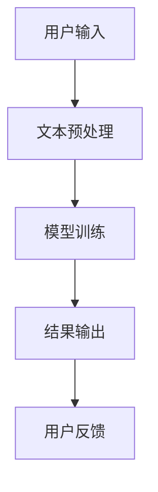
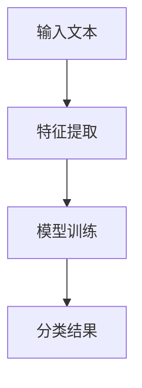
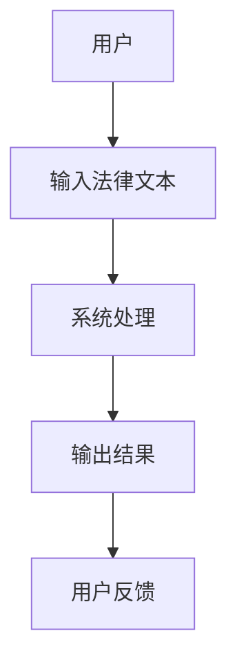

                 


# 企业估值中的人工智能法律助手评估

> 关键词：企业估值、人工智能、法律助手、法律文本分析、自然语言处理、机器学习

> 摘要：本文探讨了人工智能技术在企业估值中的应用，特别是在法律风险评估方面的作用。通过分析法律文本和数据，人工智能法律助手能够辅助评估师快速识别和量化法律风险，从而提高估值的准确性和效率。本文详细介绍了人工智能法律助手的核心技术框架，包括自然语言处理（NLP）和机器学习算法的应用，以及系统的架构设计和实际案例分析。

---

## 目录大纲

1. **企业估值与人工智能法律助手概述**
   1.1 企业估值的基本概念与重要性
   1.2 法律风险在企业估值中的影响
   1.3 人工智能技术在法律领域的应用现状

2. **人工智能法律助手的核心技术框架**
   2.1 自然语言处理（NLP）在法律文本分析中的应用
   2.2 机器学习在法律数据分析中的应用
   2.3 法律知识图谱的构建与应用
   2.4 人工智能法律助手的系统架构

3. **基于NLP的法律文本分析算法**
   3.1 文本预处理与特征提取
   3.2 基于机器学习的法律文本分类
   3.3 基于规则的法律文本分析
   3.4 算法实现与优化

4. **人工智能法律助手的系统架构设计**
   4.1 系统功能模块划分
   4.2 系统输入与输出的定义
   4.3 系统性能指标与评估方法
   4.4 系统架构图与交互流程图

5. **人工智能法律助手在企业估值中的应用案例**
   5.1 案例背景与目标
   5.2 系统环境与工具安装
   5.3 系统核心实现代码与解读
   5.4 实际案例分析与结果解读

6. **总结与未来展望**
   6.1 人工智能法律助手的优势与不足
   6.2 未来的研究方向与改进措施
   6.3 对企业估值领域的建议与展望

---

## 正文内容

### 1. 企业估值与人工智能法律助手概述

#### 1.1 企业估值的基本概念与重要性
企业估值是企业在市场上的价值评估，通常用于企业融资、并购、上市等重要决策。传统的估值方法依赖于财务数据和人工分析，但随着数据量的增加和复杂性的提升，人工分析的效率和准确性受到限制。

#### 1.2 法律风险在企业估值中的影响
法律风险是企业估值中不可忽视的重要因素。合同纠纷、知识产权问题、诉讼风险等都会影响企业的实际价值。传统的法律分析需要大量人工审查，耗时且容易出错。

#### 1.3 人工智能技术在法律领域的应用现状
人工智能技术在法律领域的应用主要集中在自然语言处理（NLP）和机器学习领域。通过NLP技术，可以快速分析法律文本；通过机器学习，可以预测法律风险并提供决策支持。

---

### 2. 人工智能法律助手的核心技术框架

#### 2.1 自然语言处理（NLP）在法律文本分析中的应用
NLP技术可以提取法律文本中的关键词、主题和实体关系。例如，通过分词、句法分析和情感分析，可以快速识别合同中的关键条款。

#### 2.2 机器学习在法律数据分析中的应用
机器学习算法可以对法律数据进行分类、聚类和预测。例如，使用支持向量机（SVM）对合同违约风险进行分类。

#### 2.3 法律知识图谱的构建与应用
法律知识图谱通过构建实体关系图，可以将法律文本中的信息结构化。例如，将合同中的条款映射到法律知识图谱中，以便快速检索和分析。

#### 2.4 人工智能法律助手的系统架构
系统架构包括文本预处理、模型训练、结果输出等模块。以下是系统的架构图：



---

### 3. 基于NLP的法律文本分析算法

#### 3.1 文本预处理与特征提取
文本预处理包括分词、去停用词和词干提取。特征提取可以使用词袋模型或词嵌入（如Word2Vec）。

#### 3.2 基于机器学习的法律文本分类
使用支持向量机（SVM）对法律文本进行分类。以下是SVM算法的流程图：



#### 3.3 基于规则的法律文本分析
规则匹配可以用于识别合同中的特定条款。例如，使用正则表达式匹配“违约责任”相关条款。

#### 3.4 算法实现与优化
以下是基于SVM的法律文本分类的Python代码示例：

```python
from sklearn.feature_extraction.text import TfidfVectorizer
from sklearn import svm

# 文本预处理
def preprocess(text):
    return text.lower().strip()

# 特征提取
vectorizer = TfidfVectorizer()
X = vectorizer.fit_transform([preprocess(text) for text in texts])

# 模型训练
model = svm.SVC()
model.fit(X, labels)

# 预测
new_text = preprocess("违约责任")
new_X = vectorizer.transform([new_text])
print(model.predict(new_X))
```

---

### 4. 人工智能法律助手的系统架构设计

#### 4.1 系统功能模块划分
系统功能模块包括文本输入、模型训练、结果输出和用户反馈。

#### 4.2 系统输入与输出的定义
输入：法律文本
输出：分类结果或风险评估报告

#### 4.3 系统性能指标与评估方法
性能指标包括准确率、召回率和F1值。

#### 4.4 系统架构图与交互流程图
以下是系统的交互流程图：



---

### 5. 人工智能法律助手在企业估值中的应用案例

#### 5.1 案例背景与目标
某企业计划并购一家公司，需要评估其法律风险。

#### 5.2 系统环境与工具安装
安装Python和相关库（如scikit-learn、NLTK）。

#### 5.3 系统核心实现代码与解读
以下是法律文本分类的代码示例：

```python
from sklearn.model_selection import train_test_split
from sklearn.metrics import accuracy_score

# 数据分割
X_train, X_test, y_train, y_test = train_test_split(X, labels, test_size=0.2)

# 模型训练
model.fit(X_train, y_train)

# 模型评估
y_pred = model.predict(X_test)
print(accuracy_score(y_test, y_pred))
```

#### 5.4 实际案例分析与结果解读
通过分析合同文本，系统能够快速识别违约风险，帮助评估师做出更准确的估值决策。

---

### 6. 总结与未来展望

人工智能法律助手在企业估值中的应用显著提高了法律风险评估的效率和准确性。未来，可以通过优化算法和增加更多法律数据来进一步提升系统的性能。

---

通过以上内容，我们可以看到人工智能技术在企业估值中的潜力。随着技术的不断发展，人工智能法律助手将在更多领域发挥重要作用。

