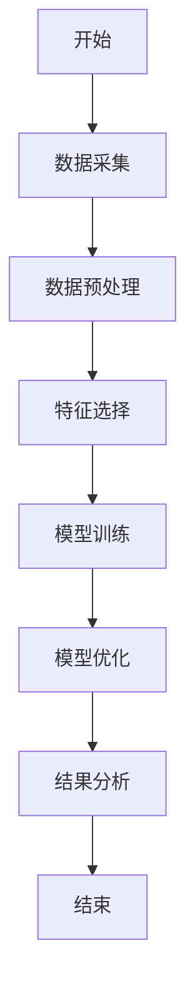
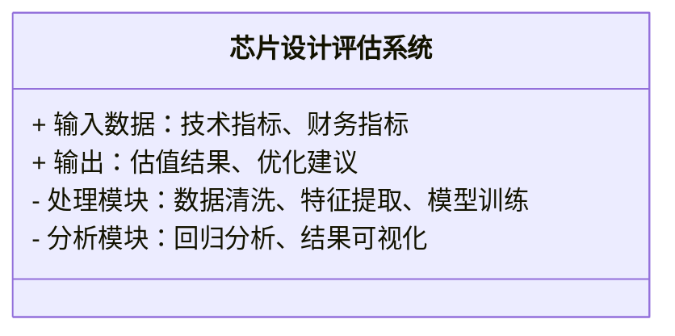
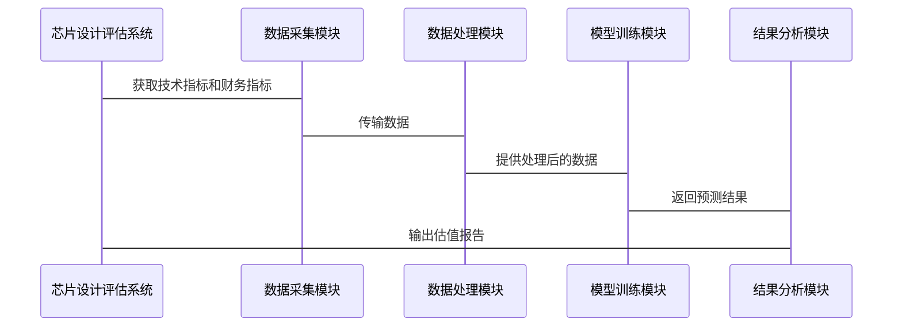

                 


# 企业估值中的人工智能芯片设计评估

> 关键词：企业估值、人工智能芯片、设计评估、技术指标、财务分析

> 摘要：本文详细探讨了在企业估值过程中，如何评估人工智能芯片的设计对整体价值的影响。通过分析芯片性能、成本、效率等技术指标，结合企业的财务表现和市场竞争力，提出了系统的评估方法和框架，帮助投资者和企业管理者做出更准确的决策。

---

# 《企业估值中的人工智能芯片设计评估》

## 第1章：企业估值与AI芯片设计评估的背景介绍

### 1.1 问题背景
#### 1.1.1 企业估值的传统方法与局限性
传统的企业估值方法如DCF模型和市盈率法在面对科技企业，尤其是人工智能芯片企业时，往往无法充分考虑技术复杂性和创新性对价值的影响。

#### 1.1.2 AI芯片设计对估值的影响
AI芯片的设计直接影响企业的成本、性能和市场竞争力，进而影响企业的盈利能力和发展潜力。

#### 1.1.3 当前行业面临的挑战与机遇
随着AI技术的快速发展，AI芯片设计的复杂性和重要性日益增加，企业估值需要更精细的方法来捕捉技术优势带来的价值。

### 1.2 问题描述
#### 1.2.1 传统芯片设计的评估指标
传统的芯片设计评估主要关注制程工艺、面积和功耗，但未能充分考虑AI算法优化和并行计算能力。

#### 1.2.2 AI芯片的独特性与复杂性
AI芯片需要同时优化算力、能效和可编程性，其设计目标与传统芯片不同。

#### 1.2.3 企业估值中的关键问题
如何将AI芯片的设计优势转化为可量化的财务指标，是当前企业估值中的核心问题。

### 1.3 问题解决
#### 1.3.1 AI芯片设计评估的核心目标
通过量化芯片设计的技术指标，结合企业财务数据，评估设计对估值的影响。

#### 1.3.2 企业估值与芯片设计的结合点
从芯片性能、成本、效率等技术指标出发，结合企业营收、利润率、市场占有率等财务指标，建立综合评估模型。

#### 1.3.3 解决方案的框架与思路
通过建立技术与财务的映射关系，将AI芯片的设计优势转化为可量化的财务价值。

### 1.4 边界与外延
#### 1.4.1 芯片设计评估的边界条件
仅考虑芯片本身的性能，不涉及外部市场和技术生态的影响。

#### 1.4.2 企业估值的适用范围
适用于以AI芯片为主营业务的企业，其他行业的应用需结合具体业务调整。

#### 1.4.3 相关领域的相互作用
AI芯片的设计影响企业的研发投入、生产成本和市场竞争力，这些因素又反作用于估值。

### 1.5 核心要素组成
#### 1.5.1 芯片性能指标
- 算力（FLOPS）
- 能耗效率（W/FLOPS）
- 制程工艺（nm）
- 并行计算能力（核数、线程数）

#### 1.5.2 企业财务指标
- 营收（Revenue）
- 净利润（Net Profit）
- 毛利率（Gross Margin）
- 研发投入（R&D）

#### 1.5.3 技术与市场的结合
- 技术领先性
- 市场占有率
- 产品生命周期

---

## 第2章：AI芯片设计评估的核心概念与联系

### 2.1 核心概念原理
#### 2.1.1 芯片设计的关键参数
AI芯片的设计需要同时优化算力、能效和可编程性，这些参数直接影响企业的成本和收益。

#### 2.1.2 企业估值的核心指标
企业的估值不仅要看当前的财务表现，还要考虑技术优势带来的未来收益。

#### 2.1.3 AI芯片的独特属性
AI芯片的性能与算法高度相关，其设计需要针对特定的AI任务进行优化。

### 2.2 概念属性特征对比表格
```markdown
| 概念       | 芯片设计属性 | 企业估值属性 |
|------------|--------------|--------------|
| 性能       | 算力         | 利润率       |
| 成本       | 制程工艺     | 投资回报率   |
| 效率       | 能耗         | 市场增长率   |
| 可扩展性   | 架构         | 未来潜力     |
```

### 2.3 ER实体关系图
```mermaid
er
    entity 芯片设计 {
        key 属性: 性能, 成本, 效率
    }
    entity 企业估值 {
        key 属性: 利润率, 投资回报率, 市场占有率
    }
    relationship 芯片设计与企业估值 {
        芯片设计 -> 企业估值 : 影响
    }
```

---

## 第3章：AI芯片设计评估的算法原理

### 3.1 算法原理概述
#### 3.1.1 评估模型的基本框架
建立技术指标和财务指标的映射关系，通过回归分析预测技术优势对估值的影响。

#### 3.1.2 数据预处理方法
- 数据清洗：处理缺失值、异常值。
- 标准化：对技术指标和财务指标进行标准化处理。

#### 3.1.3 模型训练与优化
使用机器学习算法（如线性回归、随机森林）训练模型，优化参数以提高预测精度。

### 3.2 算法流程图


### 3.3 数学模型与公式
#### 3.3.1 线性回归模型
$$ y = \beta_0 + \beta_1x_1 + \beta_2x_2 + ... + \beta_nx_n + \epsilon $$

其中：
- $y$：企业估值（如市盈率）
- $x_i$：技术指标（如算力、能耗）
- $\beta_i$：回归系数
- $\epsilon$：误差项

#### 3.3.2 正则化处理
$$ \text{损失函数} = \sum_{i=1}^{m}(y_i - \hat{y}_i)^2 + \lambda\sum_{j=1}^{n}\beta_j^2 $$

---

## 第4章：AI芯片设计评估的系统分析与架构设计方案

### 4.1 系统功能设计


### 4.2 系统架构设计


### 4.3 系统交互设计


---

## 第5章：AI芯片设计评估的项目实战

### 5.1 环境安装
- 操作系统：Linux/Windows/MacOS
- 开发工具：Python、Jupyter Notebook
- 依赖库：NumPy、Pandas、Scikit-learn

### 5.2 核心实现代码
```python
import numpy as np
from sklearn.linear_model import LinearRegression
from sklearn.metrics import mean_squared_error

# 示例数据
X = np.array([[1, 2], [2, 4], [3, 6], [4, 8], [5, 10]])
y = np.array([2, 4, 6, 8, 10])

# 模型训练
model = LinearRegression()
model.fit(X, y)

# 预测
y_pred = model.predict(X)
print("预测值:", y_pred)
print("均方误差:", mean_squared_error(y, y_pred))
```

### 5.3 代码应用解读与分析
- 数据预处理：对技术指标和财务指标进行标准化。
- 模型训练：使用线性回归模型建立技术指标与企业估值的关系。
- 结果分析：通过均方误差评估模型的准确性。

### 5.4 实际案例分析
以某AI芯片企业为例，分析其芯片设计技术指标和财务数据，预测其估值并提出优化建议。

### 5.5 项目小结
通过实际案例验证模型的有效性，总结经验教训，为后续优化提供参考。

---

## 第6章：AI芯片设计评估的最佳实践与总结

### 6.1 小结
AI芯片设计评估需要结合技术指标和财务指标，建立系统的评估模型。

### 6.2 注意事项
- 数据质量：确保数据的准确性和完整性。
- 模型选择：根据实际情况选择合适的算法。
- 结果解释：关注模型的可解释性和实际意义。

### 6.3 拓展阅读
推荐相关书籍和论文，深入学习AI芯片设计和企业估值的理论与实践。

---

## 参考文献
[此处列出相关的书籍、论文和资源]

---

通过以上目录大纲，您可以逐步展开文章内容，确保每个章节和小节都详细、具体且符合逻辑。

