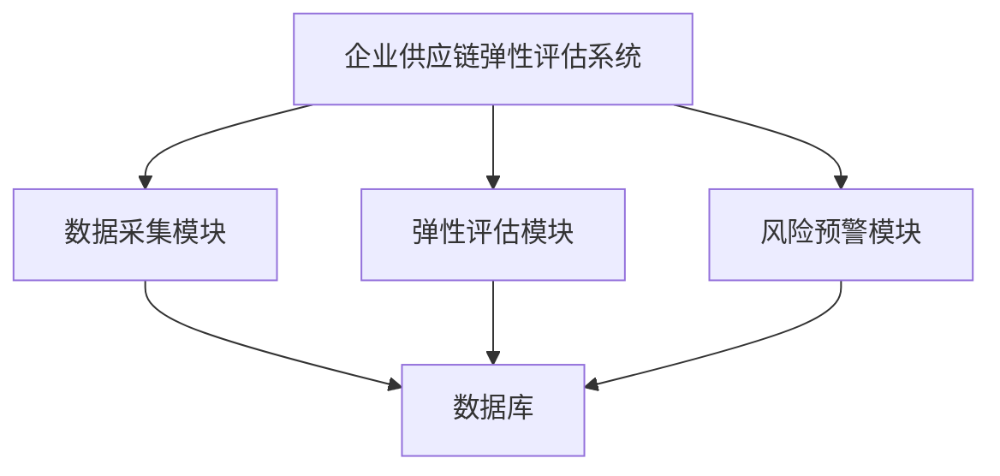

                 


# 企业估值中的供应链弹性价值评估

## 关键词：
供应链弹性，企业估值，供应链管理，弹性评估模型，风险控制，企业价值优化

## 摘要：
供应链弹性在企业估值中的重要性日益凸显，尤其是在全球化和数字化转型的背景下。企业供应链的弹性不仅影响企业的运营效率，还直接影响企业的市场价值。本文通过分析供应链弹性的核心概念、数学模型、系统架构设计和项目实战，详细探讨供应链弹性价值评估的方法与应用，为企业提供一套系统的评估框架和实践指导。

---

## 第1章：供应链弹性价值评估的背景与重要性

### 1.1 供应链弹性的重要性

#### 1.1.1 供应链弹性在企业中的作用
供应链弹性是指企业在面对市场波动、供应链中断或其他外部冲击时，能够灵活调整供应链策略，快速恢复并优化供应链的能力。在当今全球化和数字化的商业环境中，供应链弹性已成为企业竞争力的重要组成部分。例如，全球疫情爆发期间，许多企业因供应链中断而面临巨大的经济损失，而具有强大供应链弹性能力的企业则能够迅速调整供应链策略，减少损失并抓住市场机会。

#### 1.1.2 供应链弹性与企业估值的关系
供应链弹性不仅影响企业的运营效率，还直接影响企业的市场价值。投资者在评估企业价值时，越来越关注企业的供应链弹性能力。具有强大供应链弹性能力的企业通常能够更好地应对市场风险，提高利润率，并在竞争中占据优势地位。

#### 1.1.3 供应链弹性的重要性与趋势
随着全球化的深入和供应链复杂性的增加，企业对供应链弹性的需求日益增长。供应链弹性不仅是企业应对风险的关键能力，也是企业在数字化转型中实现业务持续性和创新的重要支撑。

---

### 1.2 供应链弹性的核心概念

#### 1.2.1 供应链弹性的定义与特点
供应链弹性是指企业在面对外部环境变化时，能够迅速调整供应链策略，确保供应链稳定性和高效性的能力。其特点包括：

- **灵活性**：能够快速响应市场变化和供应链中断。
- **恢复性**：在供应链中断后能够迅速恢复运营。
- **适应性**：能够根据市场需求和环境变化调整供应链策略。
- **预见性**：能够预测潜在风险并提前制定应对措施。

#### 1.2.2 供应链弹性与传统供应链的区别
传统供应链管理注重效率和成本控制，而供应链弹性更注重应对风险和变化的能力。以下是传统供应链和弹性供应链的主要区别：

| 特性               | 传统供应链                 | 弹性供应链                 |
|--------------------|---------------------------|---------------------------|
| 灵活性             | 较低                      | 高                       |
| 风险应对能力       | 有限                      | 强大                     |
| 反应速度           | 较慢                      | 快                       |
| 技术依赖性         | 较低                      | 高                       |

#### 1.2.3 供应链弹性在企业估值中的应用
供应链弹性能力的强弱直接影响企业的市场竞争力和抗风险能力。在企业估值中，投资者和分析师通常会考虑以下因素：

- 企业的供应链弹性能力是否能够应对市场波动。
- 供应链弹性能力是否能够支持企业的长期增长。
- 供应链弹性能力是否能够提高企业的利润率和市场份额。

---

## 第2章：供应链弹性价值评估的核心概念

### 2.1 供应链弹性价值评估的数学模型

#### 2.1.1 层次分析法（AHP）的应用
层次分析法（AHP）是一种常用的决策分析方法，适用于多因素决策问题。在供应链弹性价值评估中，我们可以使用AHP方法来确定各因素的权重。

#### 2.1.2 模型构建步骤
1. **确定评估指标**：例如，供应链弹性能力包括灵活性、恢复性和适应性。
2. **构建层次结构**：将指标分为上层目标（企业估值）、中间层（供应链弹性能力）和下层（具体指标）。
3. **计算权重**：通过比较矩阵计算各指标的权重。

#### 2.1.3 数学公式与步骤
- **比较矩阵**：构建各指标的比较矩阵，例如：
  ```plaintext
  A = [1, 3, 2;
       1/3, 1, 4;
       1/2, 1/4, 1]
  ```
- **计算权重**：通过特征值法计算权重向量。

---

## 第3章：供应链弹性价值评估的系统架构设计

### 3.1 系统分析与架构设计

#### 3.1.1 问题场景介绍
假设我们正在为一家制造企业设计一个供应链弹性价值评估系统。该系统需要实时监控供应链的弹性能力，并提供优化建议。

#### 3.1.2 系统功能设计
- **数据采集模块**：采集供应链的相关数据，例如供应商可靠性、库存水平、物流效率。
- **弹性评估模块**：基于数据计算供应链弹性能力。
- **风险预警模块**：实时监控潜在风险并发出预警。

#### 3.1.3 系统架构设计
使用Mermaid图展示系统架构：



---

## 第4章：项目实战

### 4.1 某制造企业的供应链弹性评估项目

#### 4.1.1 项目背景
某制造企业因供应链中断导致生产延迟，影响了企业的市场价值。为了提高供应链弹性能力，企业决定实施供应链弹性评估项目。

#### 4.1.2 实施步骤
1. **数据采集**：收集供应商信息、库存数据和物流信息。
2. **模型构建**：使用层次分析法计算供应链弹性能力。
3. **风险评估**：识别潜在风险并制定应对策略。
4. **优化建议**：基于评估结果提出优化建议。

#### 4.1.3 代码实现
以下是一个简单的Python代码示例，用于计算供应链弹性能力：

```python
import numpy as np

def calculate_elasticity_weight(data):
    matrix = np.array(data)
    eigenvalues, eigenvectors = np.linalg.eig(matrix)
    weights = eigenvectors[:, 0] / np.sum(eigenvectors[:, 0])
    return weights

data = [
    [1, 3, 2],
    [1/3, 1, 4],
    [1/2, 1/4, 1]
]

weights = calculate_elasticity_weight(data)
print("权重向量为：", weights)
```

---

## 第5章：最佳实践与小结

### 5.1 最佳实践
- **数据准确性**：确保数据的准确性和完整性。
- **模型选择**：根据实际情况选择合适的评估模型。
- **持续优化**：定期评估和优化供应链弹性能力。

### 5.2 小结
供应链弹性价值评估是企业估值的重要组成部分。通过构建数学模型和优化系统架构，企业可以更好地应对市场风险，提高供应链弹性能力。

### 5.3 注意事项
- **数据隐私**：确保数据的安全性和隐私性。
- **模型适用性**：根据企业的实际情况选择合适的模型。
- **持续监控**：定期监控供应链弹性能力，及时调整策略。

---

## 总结
供应链弹性价值评估是企业在数字化转型中必须重视的能力。通过本文的分析和实践，企业可以更好地应对市场风险，提高供应链弹性能力，从而在竞争中占据优势地位。

