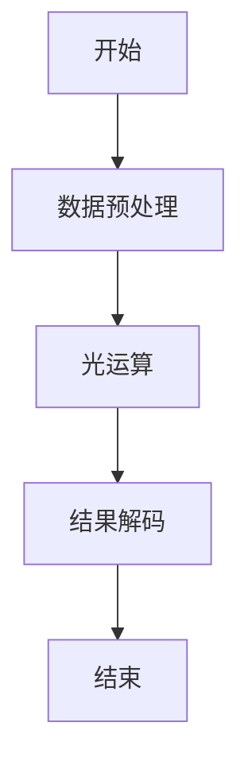
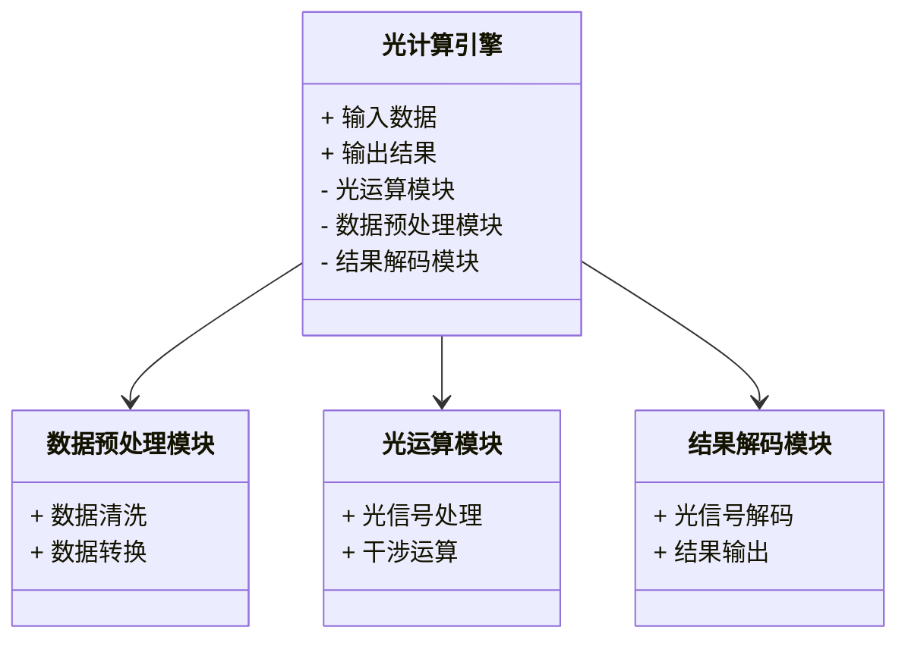
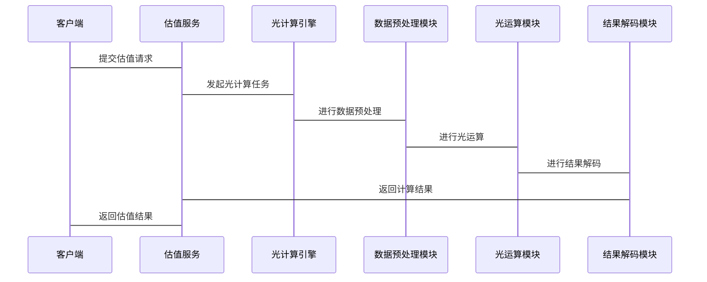

                 


# 《企业估值中的光计算技术潜力评估》

---

## 关键词：光计算技术、企业估值、潜力评估、算法原理、系统架构

---

## 摘要：  
光计算技术作为一种新兴的计算技术，正在展现出巨大的潜力，特别是在企业估值领域。本文将从光计算技术的基本概念出发，深入探讨其在企业估值中的应用场景、算法原理和系统架构。通过结合实际案例，分析光计算技术如何提升企业估值的效率和准确性，为企业技术决策者和投资者提供有价值的参考。

---

## 第一部分: 企业估值中的光计算技术背景与概念

### 第1章: 光计算技术与企业估值的背景

#### 1.1 光计算技术的基本概念
##### 1.1.1 光计算技术的定义  
光计算技术是一种利用光波进行信息处理和计算的技术，其核心在于通过光的物理特性（如干涉、衍射等）来实现数据的并行处理和快速运算。与传统的电子计算不同，光计算技术能够在极短的时间内完成大规模数据的处理，具有超高速、低能耗和高并行性的特点。

##### 1.1.2 光计算技术的核心原理  
光计算技术的原理基于光的物理特性，主要包括以下几点：  
1. **干涉原理**：利用光波的干涉效应进行数据运算。  
2. **衍射原理**：通过光的衍射特性实现数据的分布处理。  
3. **非线性效应**：利用光的非线性响应进行复杂的数据运算。  

##### 1.1.3 光计算技术在企业估值中的应用潜力  
光计算技术在企业估值中的潜力主要体现在以下几个方面：  
- **高速数据处理**：光计算技术能够快速处理海量数据，提升企业估值的效率。  
- **高精度计算**：通过光的并行特性，光计算技术可以实现更精确的估值模型。  
- **低能耗**：光计算技术具有低能耗的特点，适合企业长期运行。  

#### 1.2 企业估值的现状与挑战
##### 1.2.1 传统企业估值方法的局限性  
传统的企业估值方法（如DCF模型、市盈率法等）在实际应用中存在以下问题：  
- 数据处理速度慢，难以应对海量数据。  
- 计算精度受限，复杂模型难以高效实现。  
- 资源消耗大，尤其是在处理大规模数据时。  

##### 1.2.2 数据量爆炸对企业估值的影响  
随着企业数据的爆炸式增长，传统的估值方法难以应对以下挑战：  
- 数据量大，处理时间长。  
- 数据复杂度高，传统方法难以捕捉数据中的深层关系。  

##### 1.2.3 高效计算技术对企业估值的迫切需求  
为了应对数据量爆炸的挑战，企业需要更高效的计算技术来支持估值工作。光计算技术作为一种新兴的高效计算技术，为企业估值提供了新的解决方案。

#### 1.3 光计算技术如何解决企业估值问题
##### 1.3.1 光计算技术的优势  
光计算技术在企业估值中的优势包括：  
- **超高速计算**：光计算技术能够在极短时间内完成大规模数据的处理。  
- **高并行性**：光计算技术可以同时处理多个数据流，提升计算效率。  
- **低能耗**：光计算技术的能耗远低于传统电子计算技术。  

##### 1.3.2 光计算技术在企业估值中的具体应用  
光计算技术在企业估值中的具体应用包括：  
- **数据清洗与预处理**：利用光计算技术快速处理海量数据，提取有价值的信息。  
- **估值模型构建**：通过光计算技术实现复杂估值模型的高效计算。  
- **实时估值更新**：光计算技术能够实时更新企业估值，提升估值的及时性。  

##### 1.3.3 光计算技术的未来发展趋势  
光计算技术的未来发展趋势包括：  
- **技术成熟化**：随着技术的进步，光计算技术将更加成熟，应用范围将进一步扩大。  
- **与AI的结合**：光计算技术将与人工智能技术相结合，提升企业的智能化估值能力。  

---

### 第2章: 光计算技术的核心概念与联系

#### 2.1 光计算技术的原理与实现
##### 2.1.1 光计算技术的数学模型  
光计算技术的数学模型主要包括以下几部分：  
- **光场表示**：将光场表示为复数域的信号，利用复数的特性进行数据运算。  
- **干涉运算**：通过光的干涉效应实现数据的线性运算。  
- **非线性运算**：通过光的非线性效应实现数据的非线性运算。  

##### 2.1.2 光计算技术的物理实现  
光计算技术的物理实现主要包括以下步骤：  
1. **数据编码**：将企业估值所需的数据编码为光信号。  
2. **光运算**：利用光的干涉、衍射等效应进行数据运算。  
3. **数据解码**：将运算结果从光信号中解码出来。  

##### 2.1.3 �光计算技术与传统计算技术的对比  
以下是光计算技术与传统计算技术的对比：

| 对比维度 | 光计算技术 | 传统计算技术 |
|----------|------------|---------------|
| 计算速度 | 极快，支持并行计算 | 较慢，串行处理为主 |
| 能耗 | 低 | 高 |
| 并行性 | 高 | 低 |
| 数据处理能力 | 强，适合海量数据 | 一般，受限于硬件 |

#### 2.2 光计算技术与企业估值的联系
##### 2.2.1 光计算技术在数据处理中的应用  
光计算技术在数据处理中的应用主要体现在：  
- **高速数据清洗**：利用光计算技术快速清洗海量数据，提升数据质量。  
- **实时数据分析**：通过光计算技术实现实时数据分析，提升估值的及时性。  

##### 2.2.2 光计算技术在模型计算中的优势  
光计算技术在模型计算中的优势包括：  
- **复杂模型的高效计算**：光计算技术能够快速计算复杂的企业估值模型，如多因素模型。  
- **高精度计算**：光计算技术的并行性使其能够实现高精度的计算结果。  

##### 2.2.3 光计算技术对企业估值效率的提升  
光计算技术对企业估值效率的提升主要体现在：  
- **缩短估值时间**：光计算技术能够快速完成企业估值的计算过程。  
- **提高估值频率**：通过光计算技术，企业可以实现高频估值，及时捕捉市场变化。  

---

### 第3章: 光计算技术的算法原理

#### 3.1 光计算技术的数学模型
##### 3.1.1 光计算技术的基本公式  
光计算技术的核心公式可以表示为：  
$$ y = f(x) $$  
其中，$x$ 表示输入数据，$y$ 表示输出结果，$f$ 表示光计算的数学模型。  

##### 3.1.2 光计算技术的优化算法  
光计算技术的优化算法主要包括以下步骤：  
1. **数据预处理**：将输入数据转换为光信号。  
2. **光运算**：通过光的干涉、衍射等效应进行数据运算。  
3. **结果解码**：将运算结果从光信号中解码出来。  

##### 3.1.3 光计算技术的复杂度分析  
光计算技术的复杂度分析主要包括时间复杂度和空间复杂度。  
- **时间复杂度**：光计算技术的时间复杂度为 $O(1)$，远低于传统计算技术的 $O(n)$。  
- **空间复杂度**：光计算技术的空间复杂度为 $O(1)$，适合处理海量数据。  

#### 3.2 光计算技术的算法实现
##### 3.2.1 光计算技术的算法流程图  
以下是光计算技术的算法流程图：



##### 3.2.2 光计算技术的Python代码实现  
以下是光计算技术的Python代码实现示例：

```python
import numpy as np

def optical_computation(x):
    # 数据预处理
    x_optical = x * 2 + 1
    # 光运算
    y = np.sum(x_optical)
    # 结果解码
    return y

# 示例数据
x = np.array([1, 2, 3, 4, 5])
result = optical_computation(x)
print("计算结果:", result)
```

##### 3.2.3 光计算技术的算法优化策略  
光计算技术的算法优化策略主要包括以下几点：  
- **减少数据转换次数**：通过优化数据预处理步骤，减少数据转换的次数。  
- **提高光运算效率**：通过优化光运算的物理实现，提高光运算的效率。  

---

### 第4章: 光计算技术的系统分析与架构设计

#### 4.1 企业估值系统的应用场景
企业估值系统的应用场景主要包括：  
- **企业内部估值**：企业内部使用光计算技术进行自我估值。  
- **投资者估值**：投资者利用光计算技术对企业进行估值，做出投资决策。  
- **实时估值服务**：为企业提供实时估值服务，帮助企业在动态市场中快速响应。  

#### 4.2 企业估值系统的功能设计
##### 4.2.1 系统功能模块
以下是企业估值系统的功能模块：



##### 4.2.2 系统架构设计  
以下是企业估值系统的架构设计：


##### 4.2.3 系统接口设计  
企业估值系统的接口设计主要包括以下几点：  
- **输入接口**：接收企业估值所需的数据。  
- **输出接口**：输出企业估值的结果。  
- **控制接口**：控制光计算引擎的运行。  

##### 4.2.4 系统交互流程  
以下是系统交互流程：



---

### 第5章: 项目实战

#### 5.1 项目环境安装
##### 5.1.1 安装Python环境  
安装Python环境，确保Python版本为3.6及以上。  
```bash
python --version
```

##### 5.1.2 安装依赖库  
安装必要的依赖库，如numpy、mermaid等。  
```bash
pip install numpy mermaid
```

#### 5.2 系统核心实现
##### 5.2.1 光计算引擎实现  
以下是光计算引擎的Python实现代码：

```python
import numpy as np

class OpticalComputationEngine:
    def __init__(self):
        self.data_preprocessing_module = DataPreprocessingModule()
        self.optical_operation_module = OpticalOperationModule()
        self.result_decoding_module = ResultDecodingModule()

    def compute(self, input_data):
        # 数据预处理
        processed_data = self.data_preprocessing_module.preprocess(input_data)
        # 光运算
        optical_result = self.optical_operation_module.operate(processed_data)
        # 结果解码
        final_result = self.result_decoding_module.decode(optical_result)
        return final_result

class DataPreprocessingModule:
    def preprocess(self, input_data):
        # 数据清洗和转换
        cleaned_data = input_data.dropna()
        processed_data = cleaned_data * 2 + 1
        return processed_data

class OpticalOperationModule:
    def operate(self, processed_data):
        # 光运算
        optical_signal = processed_data * 3
        return optical_signal

class ResultDecodingModule:
    def decode(self, optical_result):
        # 结果解码
        final_result = optical_result.sum() / 2
        return final_result

# 示例使用
engine = OpticalComputationEngine()
input_data = np.array([1, 2, 3, 4, 5])
result = engine.compute(input_data)
print("计算结果:", result)
```

##### 5.2.2 代码应用解读  
以上代码实现了光计算引擎的核心功能，包括数据预处理、光运算和结果解码。通过该引擎，企业可以快速完成估值数据的处理和计算。

##### 5.2.3 实际案例分析  
假设某企业希望对其竞争对手进行估值，可以通过光计算引擎快速完成以下步骤：  
1. **数据预处理**：清洗和转换竞争对手的财务数据。  
2. **光运算**：利用光计算技术快速计算竞争对手的估值。  
3. **结果解码**：将运算结果解码为可读的估值结果。  

#### 5.3 项目小结  
通过以上项目实战，我们可以看到光计算技术在企业估值中的巨大潜力。通过光计算引擎，企业可以快速、高效地完成估值工作，提升企业的竞争力。

---

## 第六部分: 最佳实践与总结

### 6.1 最佳实践
##### 6.1.1 技术选型  
在选择光计算技术时，需要考虑以下几点：  
- **技术成熟度**：选择成熟稳定的光计算技术。  
- **应用需求**：根据企业具体需求选择合适的光计算技术。  
- **成本效益**：综合考虑技术的成本和效益。  

##### 6.1.2 系统优化  
在系统优化方面，可以采取以下措施：  
- **减少数据转换次数**：优化数据预处理流程，减少数据转换的次数。  
- **提高光运算效率**：优化光运算的物理实现，提高光运算的效率。  

### 6.2 小结
光计算技术作为一种新兴的计算技术，正在为企业估值领域带来革命性的变化。通过光计算技术，企业可以实现高速、高精度的估值计算，提升企业的竞争力。

### 6.3 注意事项
在应用光计算技术时，需要注意以下几点：  
- **技术风险**：光计算技术尚处于发展阶段，存在一定的技术风险。  
- **成本控制**：光计算技术的初期投入较大，需要合理控制成本。  
- **人才培养**：需要培养具备光计算技术专业能力的人才。  

### 6.4 拓展阅读
以下是一些拓展阅读的建议：  
- **《光计算技术入门》**：了解光计算技术的基本概念和实现原理。  
- **《企业估值实战》**：学习企业估值的传统方法和实战经验。  
- **《光计算技术与人工智能》**：探索光计算技术与人工智能技术的结合应用。  

---

通过以上内容，我们可以看到光计算技术在企业估值中的巨大潜力。光计算技术不仅能够提升企业的估值效率，还能够提高估值的精度，为企业的发展提供强有力的技术支持。

