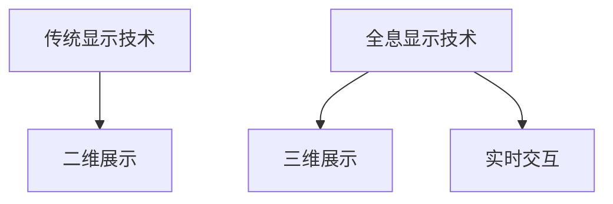
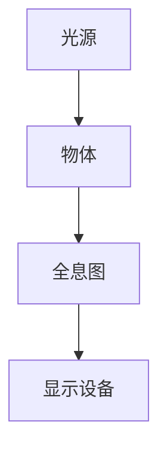
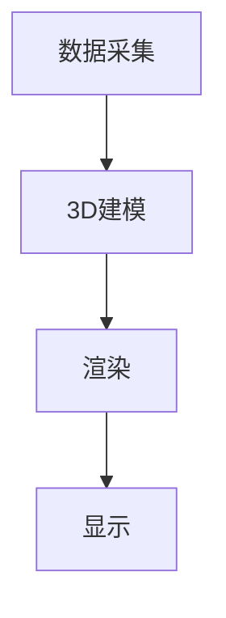

                 

# 《企业估值中的全息显示技术应用评估》

---

## 关键词：
全息显示技术、企业估值、数据可视化、系统架构、算法优化

---

## 摘要：
随着全息显示技术的快速发展，其在企业估值中的应用潜力逐渐显现。本文从全息显示技术的基本原理出发，探讨其在企业估值中的应用背景、核心概念以及系统架构设计。通过详细分析全息显示技术在数据可视化、系统实现和项目实战中的具体应用，本文旨在为企业估值提供一种高效、直观的全息显示解决方案。同时，本文还结合实际案例，展示了全息显示技术在企业估值中的优势和潜力，为未来的研究和实践提供了重要参考。

---

# 第一部分: 企业估值中的全息显示技术应用背景

---

# 第1章: 全息显示技术与企业估值概述

## 1.1 全息显示技术的基本概念

### 1.1.1 全息显示技术的定义

全息显示技术是一种利用光的干涉和衍射原理，将物体的三维信息记录在介质中，并通过特定光源照射后复现物体的三维图像的技术。与传统的二维显示技术不同，全息显示技术能够提供更加真实的三维视觉体验。

公式表示：
$$
\text{全息显示技术} = \text{三维信息记录} + \text{光干涉与衍射}
$$

### 1.1.2 全息显示技术的核心特点

| 特性 | 描述 |
|------|------|
| 三维效果 | 提供真实的三维视觉体验 |
| 实时渲染 | 支持动态数据的实时更新和展示 |
| 高交互性 | 用户可以通过手势或视线与全息图像进行交互 |

### 1.1.3 全息显示技术与传统技术的对比

## 1.2 企业估值的基本概念

### 1.2.1 企业估值的定义

企业估值是指对企业整体价值的评估，通常基于财务数据、市场表现、行业地位等多种因素进行综合分析。

公式表示：
$$
\text{企业估值} = \text{财务数据} + \text{市场数据} + \text{其他因素}
$$

### 1.2.2 企业估值的主要方法

| 方法 | 描述 |
|------|------|
| 市盈率法 | 通过市盈率与行业平均值进行比较 |
| 现金流折现法 | 将未来现金流折现至当前价值 |
| 股权自由现金流法 | 基于股权的自由现金流进行评估 |

### 1.2.3 企业估值在商业决策中的作用

企业估值在并购、融资、上市等商业决策中具有重要作用，能够为企业提供合理的价值参考。

## 1.3 全息显示技术在企业估值中的应用背景

### 1.3.1 全息显示技术的快速发展

近年来，全息显示技术在硬件和算法上的进步使其逐渐从实验室走向实际应用。

### 1.3.2 企业估值中的信息展示需求

企业估值需要将大量数据直观地展示给决策者，传统的二维图表难以满足复杂数据的展示需求。

### 1.3.3 全息显示技术与企业估值的结合

通过全息显示技术，企业可以在三维空间中直观展示财务数据、市场趋势等信息，提升决策效率。

## 1.4 本章小结

本章介绍了全息显示技术的基本概念及其在企业估值中的应用背景，为后续章节的深入分析奠定了基础。

---

# 第2章: 全息显示技术的核心原理

## 2.1 全息显示技术的光学原理

### 2.1.1 光的干涉与衍射

光的干涉和衍射是全息显示技术的核心原理，通过这些现象可以生成和记录三维信息。

公式表示：
$$
\text{干涉} = \text{光源} + \text{介质} + \text{波的叠加}
$$

### 2.1.2 全息图的生成与记录

全息图的生成过程包括物体的三维信息记录和全息图的形成。

### 2.1.3 全息显示的实现过程

全息显示的实现过程包括数据采集、3D建模、渲染和显示。

流程图：

## 2.2 全息显示技术的数字实现

### 2.2.1 3D建模与渲染

3D建模是全息显示技术的核心步骤之一，通过计算机图形学技术生成三维模型。

### 2.2.2 实时渲染技术

实时渲染技术能够快速更新和显示三维图像，适用于动态数据的展示。

### 2.2.3 全息显示的算法优化

为了提高全息显示的性能，需要对算法进行优化，例如减少计算复杂度和提高渲染效率。

## 2.3 全息显示技术与企业估值的结合

### 2.3.1 全息显示技术在数据可视化中的应用

全息显示技术可以将复杂的财务数据和市场数据以三维形式展示，提升信息的直观性。

### 2.3.2 企业估值中的多维度数据展示

通过全息显示技术，可以同时展示企业的财务数据、市场趋势和竞争对手信息。

### 2.3.3 全息显示技术对企业估值决策的支持

全息显示技术能够提供直观的三维数据展示，帮助决策者更好地理解和分析企业价值。

## 2.4 本章小结

本章详细讲解了全息显示技术的核心原理及其在企业估值中的应用，为后续章节的系统设计奠定了基础。

---

# 第3章: 企业估值中的数据可视化需求

## 3.1 企业估值中的关键数据类型

### 3.1.1 财务数据

包括收入、利润、资产负债表等数据。

### 3.1.2 市场数据

包括市场份额、行业趋势、竞争对手分析等。

### 3.1.3 竞争数据

包括竞争对手的估值、市场地位等。

## 3.2 数据可视化在企业估值中的重要性

### 3.2.1 数据可视化的基本概念

数据可视化是将数据转化为图形或图像的过程，有助于更好地理解和分析数据。

### 3.2.2 数据可视化在企业估值中的作用

通过数据可视化，可以将复杂的财务数据和市场数据以直观的形式展示，帮助决策者快速获取关键信息。

### 3.2.3 数据可视化的需求分析

企业估值中的数据可视化需要满足多维度、实时更新、高交互性的需求。

## 3.3 全息显示技术在数据可视化中的优势

### 3.3.1 多维度数据的直观展示

全息显示技术可以同时展示多个维度的数据，提升信息的丰富性。

### 3.3.2 交互式数据探索

用户可以通过手势或视线与全息图像进行交互，实现数据的动态探索。

### 3.3.3 高效信息传递

全息显示技术能够将复杂的数据快速转化为直观的三维图像，提高信息传递效率。

## 3.4 本章小结

本章分析了企业估值中的数据可视化需求，并探讨了全息显示技术在其中的优势。

---

# 第4章: 全息显示技术在企业估值中的系统架构设计

## 4.1 系统功能模块划分

### 4.1.1 数据采集模块

负责采集企业的财务数据、市场数据等。

### 4.1.2 数据处理模块

对采集到的数据进行清洗、转换和标准化处理。

### 4.1.3 数据分析模块

基于处理后的数据进行估值分析。

### 4.1.4 全息显示模块

将分析结果以全息形式展示。

## 4.2 系统架构设计

### 4.2.1 分层架构设计

系统分为数据采集层、数据处理层、数据分析层和全息显示层。

### 4.2.2 模块间接口设计

各模块之间的接口需要定义清晰的数据格式和通信协议。

### 4.2.3 系统交互流程设计

从数据采集到最终的全息展示，整个流程需要高效协同。

## 4.3 系统实现的技术选型

### 4.3.1 开发工具与框架

选择适合的开发工具和框架，例如Unity、Unreal Engine等。

### 4.3.2 数据库选择

选择适合存储企业数据的数据库，例如MySQL、MongoDB等。

### 4.3.3 显卡与硬件要求

全息显示技术对硬件要求较高，需要高性能的GPU和显示屏。

## 4.4 本章小结

本章详细设计了全息显示技术在企业估值中的系统架构，为后续的项目实施提供了指导。

---

# 第5章: 项目环境搭建与数据采集

## 5.1 开发环境的安装与配置

### 5.1.1 操作系统与开发工具安装

安装适合的开发环境，例如Windows、Linux或macOS系统。

### 5.1.2 GPU驱动与显卡配置

安装合适的GPU驱动，并选择支持全息显示技术的硬件。

### 5.1.3 其他软件配置

安装必要的开发工具和库，例如Python、NumPy、Pandas等。

## 5.2 数据采集模块的实现

### 5.2.1 数据源的选择

选择适合的企业数据源，例如公开的财务报表、行业报告等。

### 5.2.2 数据采集的实现

编写代码采集数据，并进行初步处理。

## 5.3 数据处理与分析

### 5.3.1 数据清洗

对采集到的数据进行清洗，去除噪声数据。

### 5.3.2 数据转换

将数据转换为适合分析的形式，例如标准化、归一化等。

### 5.3.3 数据分析

使用数据分析方法对数据进行建模和分析，例如聚类分析、回归分析等。

## 5.4 全息显示模块的实现

### 5.4.1 全息显示效果的实现

通过计算机图形学技术生成三维模型，并进行实时渲染。

### 5.4.2 用户交互设计

设计用户友好的交互界面，支持手势或视线交互。

## 5.5 项目小结

本章详细介绍了项目环境的搭建和数据采集的过程，并展示了如何将数据处理和分析结果以全息形式展示。

---

# 第六部分: 总结与展望

---

# 第6章: 总结与展望

## 6.1 全息显示技术在企业估值中的优势

### 6.1.1 直观的数据展示

全息显示技术能够将复杂的数据以三维形式直观展示。

### 6.1.2 高效的信息传递

通过全息显示技术，用户可以快速获取关键信息。

### 6.1.3 提高的决策效率

直观的数据展示能够提升企业的决策效率。

## 6.2 未来的发展方向

### 6.2.1 技术优化

进一步优化全息显示技术的算法和硬件，提高显示效果和性能。

### 6.2.2 应用拓展

探索全息显示技术在更多领域的应用，例如医疗、教育、娱乐等。

### 6.2.3 标准化建设

推动全息显示技术的标准化，促进其广泛应用。

## 6.3 本章小结

本章总结了全息显示技术在企业估值中的优势，并展望了未来的发展方向。

---

# 结语

全息显示技术作为一项新兴技术，正在逐步改变企业估值的方式。通过本文的详细分析，我们可以看到全息显示技术在数据可视化、系统架构和项目实战中的广泛应用和潜力。未来，随着技术的不断进步，全息显示技术将在企业估值中发挥更大的作用，为商业决策提供更加高效和直观的支持。

--- 

# 参考文献

（此处可以列出相关的参考文献，例如学术论文、技术报告等。）

---

# 致谢

感谢所有参与本项目研究和写作的人员，感谢读者的关注和支持。

---

