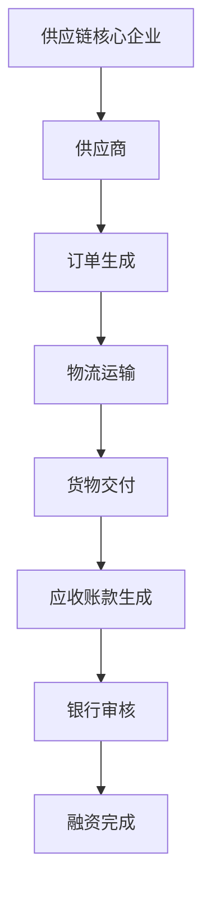
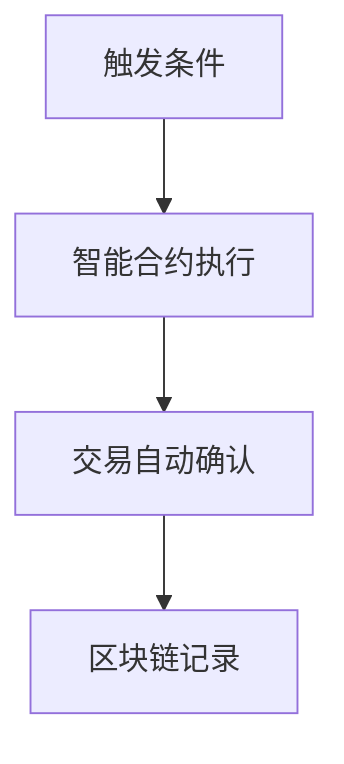
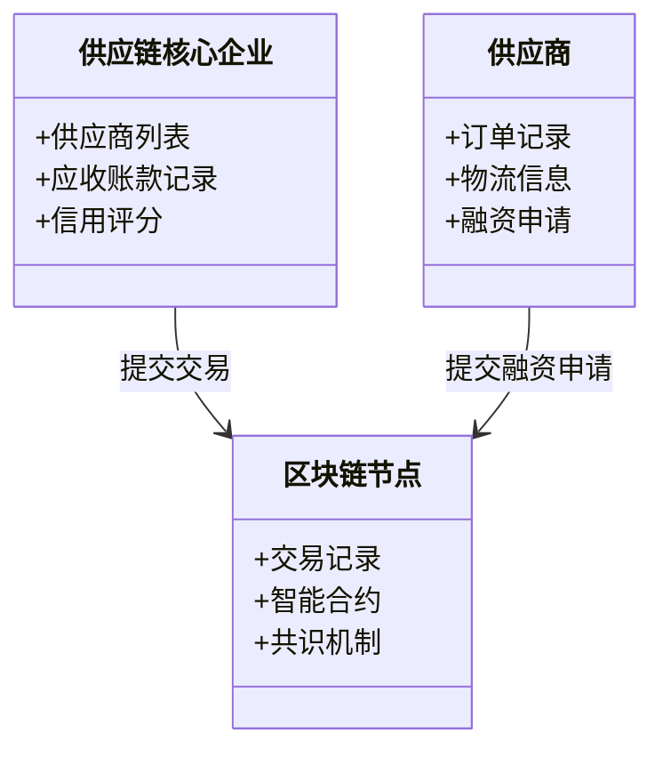

                 


# 企业估值中的区块链供应链金融评估

---

## 关键词：
- 区块链
- 供应链金融
- 企业估值
- 区块链算法
- 数学模型

---

## 摘要：
本文深入探讨了区块链技术在供应链金融评估中的应用，从理论到实践，详细分析了区块链如何解决传统供应链金融的痛点，并通过数学模型和算法实现，展示了如何利用区块链技术提升企业估值的准确性和效率。文章结合实际案例，详细讲解了系统架构设计、算法原理、数学模型以及项目实战，为读者提供了一套完整的解决方案。

---

## 目录

### 第一部分: 企业估值中的区块链供应链金融评估基础

### 第2章: 区块链供应链金融评估的核心概念

---

## 第2章: 区块链供应链金融评估的核心概念

### 2.2 区块链与供应链金融的实体关系分析

#### 2.2.3 供应链金融交易的流程分析

供应链金融交易的流程分析可以通过一个简单的流程图来展示。以下是使用Mermaid语法绘制的流程图：



在这个流程图中：
1. 供应链核心企业向供应商发出订单。
2. 供应商收到订单后开始生产。
3. 生产完成后，生成订单，并通过物流运输将货物交付给核心企业。
4. 货物交付后，供应商生成应收账款。
5. 银行审核应收账款后，供应商获得融资。

---

### 2.3 区块链供应链金融评估的属性特征对比

以下是区块链技术和供应链金融属性特征的对比表格：

| 特性                | 区块链技术                              | 供应链金融                              |
|---------------------|---------------------------------------|----------------------------------------|
| 信任机制            | 基于去中心化的共识机制                | 基于中心化的信用评估                    |
| 透明度              | 高透明，所有交易记录在区块链上可查    | 低透明，依赖于信任关系                  |
| 数据安全性          | 数据加密存储，难以篡改                | 数据易被篡改，存在信息不对称            |
| 交易效率            | 交易速度快，自动化流程减少人工干预    | 交易效率低，依赖人工审核                |
| 成本                | 交易成本低，自动化流程减少中间环节    | 成本高，涉及多个中间环节                |

---

### 第三部分: 区块链供应链金融评估的算法原理

### 第3章: 区块链供应链金融评估的算法原理

#### 3.1 区块链共识机制在供应链金融中的应用

以下是不同共识机制的特点对比表格：

| 共识机制 | 特点 | 适用场景 | 优缺点 |
|----------|------|----------|--------|
| 工作量证明（PoW） | 安全性高，但能耗高 | 适用于比特币等加密货币 | 能耗高，不适合企业级应用 |
| 权益证明（PoS） | 安全性较高，能耗低 | 适用于需要快速确认的金融场景 | 存在“富者愈富”的风险 |
| 拜占庭容错（BFT） | 适用于小规模网络，效率高 | 适用于企业级应用 | 依赖于网络中的节点数量 |
| 实际应用中，企业级供应链金融通常采用改进的BFT算法，结合企业内部的 trusted nodes 进行快速确认。 |

---

#### 3.2 智能合约在供应链金融评估中的应用

以下是智能合约的工作流程图：



智能合约在供应链金融中的实现代码示例：

```python
# 智能合约：自动确认应收账款
def confirm_receivable(supplier, amount):
    # 获取当前区块高度
    current_block = blockchain.height
    # 检查是否满足条件
    if current_block >= agreed_block:
        # 更新应收账款状态
        update_receivable(supplier, amount, 'confirmed')
        print(f"应收账款 {amount} 已确认")
    else:
        print(f"尚未达到确认条件，当前区块高度为 {current_block}")
```

---

### 第四部分: 区块链供应链金融评估的数学模型与公式

### 第4章: 区块链供应链金融评估的数学模型

#### 4.2 区块链供应链金融评估的数学模型

以下是供应链金融评估模型的数学表达式：

$$
\text{企业估值} = \sum_{i=1}^{n} (\text{应收账款}_i \times \text{信用评分}_i)
$$

其中：
- $\text{应收账款}_i$ 表示第 $i$ 个供应商的应收账款金额
- $\text{信用评分}_i$ 表示第 $i$ 个供应商的信用评分

以下是改进的区块链供应链金融评估模型：

$$
\text{企业估值} = \sum_{i=1}^{n} (\text{应收账款}_i \times \text{信用评分}_i \times \text{区块链信任因子})
$$

其中：
- $\text{区块链信任因子}$ 是基于区块链技术的信任评分，通过共识机制计算得出。

---

### 第五部分: 区块链供应链金融评估的系统分析与架构设计

### 第5章: 区块链供应链金融评估的系统架构设计

#### 5.1 系统功能设计

以下是供应链金融评估系统的领域模型图：



---

### 第六部分: 区块链供应链金融评估的项目实战

### 第6章: 区块链供应链金融评估的项目实战

#### 6.1 项目实战: 区块链供应链金融评估系统实现

以下是项目实现的代码示例：

```python
# 供应链核心企业类
class CoreEnterprise:
    def __init__(self):
        self.suppliers = []
        self.receivables = []
        self.credit_scores = {}

    def add_supplier(self, supplier):
        self.suppliers.append(supplier)

    def generate_receivable(self, supplier, amount):
        self.receivables.append(amount)
        self.credit_scores[supplier] = self.calculate_credit_score(supplier)

    def calculate_credit_score(self, supplier):
        # 简单的信用评分计算
        return sum([amount * 0.8 for amount in self.receivables]) / len(self.receivables)

# 供应商类
class Supplier:
    def __init__(self):
        self.orders = []
        self.logistics_info = []

    def add_order(self, order_amount):
        self.orders.append(order_amount)

    def update_logistics(self, status):
        self.logistics_info.append(status)

# 区块链节点类
class BlockchainNode:
    def __init__(self):
        self.transactions = []
        self.smart_contracts = []
        self.consensus Mechanism = []

    def add_transaction(self, transaction):
        self.transactions.append(transaction)

    def execute_smart_contract(self, contract):
        self.smart_contracts.append(contract)
        contract.execute()
```

---

### 第七部分: 总结与展望

### 7.1 总结

区块链技术为供应链金融评估提供了高效、透明和安全的解决方案。通过区块链技术，企业可以实现应收账款的自动化确认、信用评分的实时更新以及融资申请的快速处理，从而显著提升企业估值的准确性和效率。

---

### 7.2 展望

未来，随着区块链技术的不断发展和创新，供应链金融评估将更加智能化和自动化。企业可以利用区块链技术构建更加完善的供应链金融生态系统，实现供应链上下游企业间的高效协同和价值共创。

---

### 7.3 最佳实践 Tips

- 在实施区块链供应链金融评估系统前，建议先进行小范围的试点，验证系统的可行性和稳定性。
- 选择合适的共识机制和智能合约方案，确保系统的高效运行和数据的安全性。
- 定期更新数学模型和算法，以适应供应链金融市场的变化和企业需求的动态调整。

---

通过本文的详细讲解，读者可以全面了解区块链供应链金融评估的核心概念、算法原理、系统架构以及实际应用案例，为企业的估值和供应链管理提供有力的技术支持。

