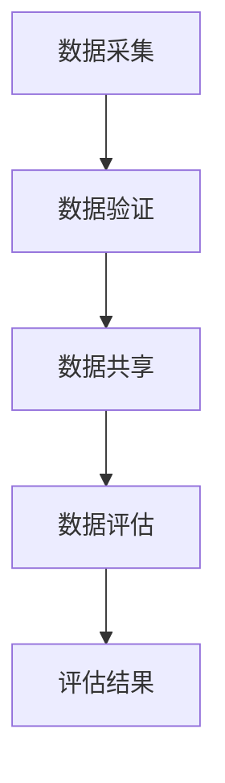
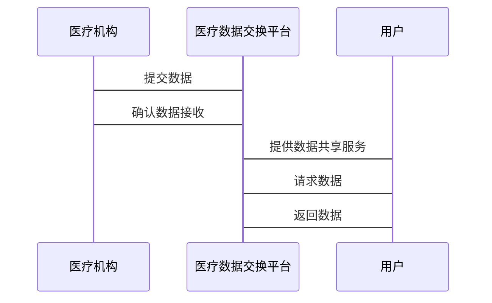

                 


# 《企业估值中的区块链医疗数据交换平台评估》

> 关键词：企业估值，区块链，医疗数据，数据交换平台，平台评估

> 摘要：随着医疗数据的重要性日益增加，区块链技术在医疗数据交换中的应用也逐渐成为企业估值的重要因素。本文将从背景介绍、核心概念、算法原理、系统分析、项目实战等多方面深入探讨如何利用区块链技术对医疗数据交换平台进行评估，帮助企业更好地进行估值和决策。

---

## 第一部分：背景与核心概念

### 第1章：问题背景与概念解析

#### 1.1 问题背景
- 医疗数据的重要性与挑战
  - 医疗数据是现代医疗体系的核心资产，涉及患者隐私、诊断准确性、治疗效果等多个方面。
  - 数据孤岛问题：不同医疗机构之间的数据难以共享，导致医疗资源浪费和重复诊断。
  - 数据安全问题：医疗数据的敏感性使得数据泄露风险极高，企业需要确保数据的隐私性和安全性。
  
- 区块链技术的潜力
  - 区块链技术通过去中心化、不可篡改和可追溯的特点，为医疗数据的高效共享和安全存储提供了新的解决方案。
  - 区块链可以实现医疗数据的可信共享，减少数据孤岛，提升医疗效率。

- 企业估值与平台评估
  - 医疗数据交换平台的构建和运营直接影响企业的价值。通过评估平台的性能、安全性、用户数量等因素，可以帮助企业更好地进行估值。
  - 区块链技术的应用可以提升平台的信任度和透明度，从而影响企业的市场价值。

#### 1.2 问题描述
- 医疗数据交换的痛点
  - 数据孤岛：不同医疗机构之间的数据难以整合，导致医疗资源浪费和效率低下。
  - 数据安全：医疗数据的泄露可能导致严重的隐私问题和法律责任。
  - 数据信任：医疗机构之间缺乏信任，导致数据共享的积极性不高。

- 区块链技术如何解决这些问题
  - 通过区块链技术实现医疗数据的可信共享，减少数据孤岛。
  - 利用区块链的去中心化特性，提升数据的安全性和隐私性。
  - 通过智能合约实现自动化的数据共享和权限管理。

- 企业估值的核心目标
  - 评估医疗数据交换平台的性能、安全性、用户数量和市场影响力。
  - 通过平台的评估，帮助企业确定其市场价值和竞争优势。

#### 1.3 问题解决
- 区块链技术的特点与优势
  - 去中心化：区块链不依赖于中心化机构，能够实现数据的分布式存储和共享。
  - 不可篡改：区块链上的数据一旦记录，无法被修改，保证数据的真实性和可信度。
  - 可追溯：区块链的可追溯性可以实现数据的来源追踪，确保数据的透明性和可信赖性。

- 医疗数据交换平台的构建逻辑
  - 数据采集：通过区块链节点采集各个医疗机构的数据。
  - 数据存储：利用区块链的分布式存储技术，确保数据的安全性和隐私性。
  - 数据共享：通过智能合约实现数据的自动共享和权限管理。

- 企业估值的关键指标
  - 平台用户数量：用户数量越多，平台的影响力越大。
  - 数据处理能力：平台能够处理的医疗数据量越大，说明平台的性能越好。
  - 平台的市场认可度：平台在市场上的认可度越高，企业的估值越高。

#### 1.4 边界与外延
- 医疗数据交换平台的边界
  - 平台只负责医疗数据的存储和共享，不涉及具体的医疗诊断和治疗。
  - 平台的数据来源仅限于医疗机构，不包括其他类型的数据。

- 平台与其他系统的交互
  - 与医疗机构的交互：平台需要与医院、诊所等医疗机构进行数据对接。
  - 与第三方服务的交互：平台可能需要与数据分析公司、保险公司等第三方服务进行数据共享。

- 企业估值的适用范围与限制
  - 适用于已经构建或计划构建医疗数据交换平台的企业。
  - 由于医疗数据的敏感性，企业估值需要考虑数据隐私和合规性问题。

#### 1.5 概念结构与核心要素
- 医疗数据交换平台的核心要素
  - 数据采集：通过区块链节点采集医疗机构的数据。
  - 数据存储：利用区块链的分布式存储技术，确保数据的安全性和隐私性。
  - 数据共享：通过智能合约实现数据的自动共享和权限管理。

- 区块链技术的实现方式
  - 区块链的共识机制：确保数据的准确性和一致性。
  - 智能合约：实现数据共享的自动化和可信性。

- 企业估值的关键因素
  - 平台的用户数量和市场影响力。
  - 平台的技术性能和数据处理能力。
  - 平台的合规性和数据隐私保护能力。

---

## 第二部分：核心概念与联系

### 第2章：区块链与医疗数据交换平台的核心原理

#### 2.1 区块链技术原理
- 区块链的基本概念
  - 区块链是一种分布式账本技术，通过去中心化的方式记录数据。
  - 每个区块包含一批交易数据，并通过链式结构连接起来。
  - 区块链通过共识机制确保数据的准确性和一致性。

- 区块链的核心特性
  - 去中心化：区块链不依赖于中心化机构，数据由多个节点共同维护。
  - 不可篡改：区块链上的数据一旦记录，无法被修改，保证数据的真实性和可信度。
  - 可追溯：区块链的可追溯性可以实现数据的来源追踪，确保数据的透明性和可信赖性。

- 区块链的共识机制与智能合约
  - 共识机制：确保区块链网络中的数据一致性和安全性。
  - 智能合约：通过预设的程序自动执行数据共享和权限管理。

#### 2.2 医疗数据交换平台的构建逻辑
- 医疗数据的分类与存储
  - 医疗数据可以分为患者数据、诊疗数据、药品数据等。
  - 数据存储在区块链的各个节点上，确保数据的分布式存储和安全性。

- 数据交换的流程与安全机制
  - 数据请求：用户或医疗机构提出数据共享请求。
  - 数据验证：通过区块链的共识机制验证数据的合法性和真实性。
  - 数据共享：通过智能合约实现数据的自动共享和权限管理。

- 平台的用户角色与权限管理
  - 用户角色：包括医生、患者、医院管理员等。
  - 权限管理：通过智能合约实现不同角色的数据访问权限。

#### 2.3 区块链与医疗数据交换的结合
- 区块链技术的特点与优势
  - 通过区块链实现医疗数据的可信共享，减少数据孤岛。
  - 利用区块链的去中心化特性，提升数据的安全性和隐私性。
  - 通过智能合约实现数据共享的自动化和可信性。

- 医疗数据交换平台的核心功能
  - 数据采集：通过区块链节点采集医疗机构的数据。
  - 数据存储：利用区块链的分布式存储技术，确保数据的安全性和隐私性。
  - 数据共享：通过智能合约实现数据的自动共享和权限管理。

- 区块链技术对医疗数据交换的影响
  - 提高数据共享的效率和安全性。
  - 降低数据孤岛问题，提升医疗效率。
  - 提升医疗机构之间的信任度，促进医疗数据的共享和利用。

---

## 第三部分：算法原理讲解

### 第3章：医疗数据交换平台评估算法

#### 3.1 算法原理
- 算法目标：通过区块链技术实现医疗数据的可信共享和高效评估。
- 算法步骤：
  1. 数据采集：通过区块链节点采集医疗机构的数据。
  2. 数据验证：通过区块链的共识机制验证数据的合法性和真实性。
  3. 数据共享：通过智能合约实现数据的自动共享和权限管理。
  4. 数据评估：根据平台的性能、安全性、用户数量等因素进行综合评估。

#### 3.2 算法流程图


#### 3.3 Python代码实现
```python
import hashlib

def calculate_hash(data):
    return hashlib.sha256(data.encode()).hexdigest()

def validate_data(data):
    hash_value = calculate_hash(data)
    return hash_value

def share_data(data, permission):
    if permission == "granted":
        return "Data shared successfully"
    else:
        return "Permission denied"

def assess_platform(user_count, performance, security):
    score = 0.3 * user_count + 0.3 * performance + 0.4 * security
    return score
```

#### 3.4 数学模型与公式
- 数据验证的数学模型
  $$ \text{验证结果} = \begin{cases} 
  \text{有效} & \text{if } \text{数据哈希} = \text{预期哈希} \\
  \text{无效} & \text{otherwise}
  \end{cases} $$

- 数据评估的综合评分公式
  $$ \text{综合评分} = 0.3 \times \text{用户数量} + 0.3 \times \text{系统性能} + 0.4 \times \text{数据安全性} $$

---

## 第四部分：系统分析与架构设计

### 第4章：医疗数据交换平台的系统分析

#### 4.1 问题场景介绍
- 医疗数据的高效共享和安全存储是医疗数据交换平台的核心目标。
- 平台需要支持多机构的数据共享，同时保证数据的隐私性和安全性。

#### 4.2 系统功能设计
- 用户角色：医生、患者、医院管理员。
- 数据管理模块：数据采集、数据存储、数据共享。
- 评估模块：数据评估、平台评分、用户反馈。

#### 4.3 系统架构设计


#### 4.4 系统接口设计
- 数据采集接口：接收医疗机构的数据。
- 数据验证接口：验证数据的合法性和真实性。
- 数据共享接口：实现数据的自动共享和权限管理。

#### 4.5 系统交互流程


---

## 第五部分：项目实战

### 第5章：医疗数据交换平台评估的项目实战

#### 5.1 环境安装
- 安装Python和必要的库。
- 安装区块链开发框架（如Ethereum、Hyperledger等）。

#### 5.2 核心代码实现
```python
from web3 import Web3

def connect_to Blockchain():
    web3 = Web3(Web3.HTTPProvider("http://localhost:8545"))
    return web3

def deploy_contract(web3, contract_code):
    # 跃迁智能合约部署
    contract = web3.eth.contract(abi=contract_abi)
    tx_hash = contract.deploy(...)
    return tx_hash

def assess_platform(web3, contract_address):
    # 调用智能合约进行平台评估
    contract = web3.eth.contract(address=contract_address, abi=contract_abi)
    tx_hash = contract.functions.assessPlatform().transact()
    return tx_hash
```

#### 5.3 案例分析
- 项目背景：某医院需要与其他医疗机构共享患者数据。
- 项目实施：通过区块链技术实现数据的可信共享。
- 实施效果：数据共享效率提升，患者重复诊断减少。

#### 5.4 项目小结
- 通过区块链技术实现医疗数据的可信共享，提升了医疗效率和数据安全性。
- 平台的评估模型帮助企业更好地进行估值和决策。

---

## 第六部分：最佳实践与小结

### 第6章：最佳实践与总结

#### 6.1 小结
- 区块链技术为医疗数据的可信共享提供了新的解决方案。
- 医疗数据交换平台的评估需要综合考虑平台的性能、安全性、用户数量等因素。
- 通过区块链技术的应用，可以显著提升医疗数据共享的效率和安全性。

#### 6.2 注意事项
- 数据隐私保护是医疗数据交换平台的核心问题。
- 平台的合规性是企业估值的重要因素。
- 区块链技术的应用需要考虑技术实现的可行性和成本。

#### 6.3 拓展阅读
- 区块链技术在医疗领域的其他应用。
- 医疗数据共享的法律和合规性问题。
- 区块链技术的未来发展与趋势。

---

## 结语
通过本文的详细分析，读者可以深入了解区块链技术在医疗数据交换平台评估中的应用，掌握如何利用区块链技术提升医疗数据的共享效率和安全性。希望本文能够为企业在医疗数据交换平台的评估和估值方面提供有价值的参考和指导。

