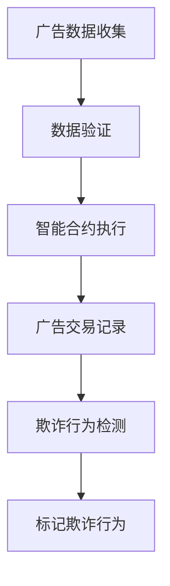

                 


# 企业估值中的区块链数字广告反欺诈平台评估

> 关键词：区块链、数字广告、反欺诈、企业估值、智能合约

> 摘要：本文探讨如何利用区块链技术评估数字广告反欺诈平台的价值。通过分析广告欺诈的现状、区块链技术的特点，提出基于区块链的反欺诈方案，并详细讲解算法原理、系统架构及实现案例，最后总结平台的价值和未来展望。

---

## 引言

### 1.1 问题背景

数字广告行业正面临严重的欺诈问题，包括点击劫持、流量造假等，这些行为导致企业广告支出的浪费，影响企业估值。区块链技术因其去中心化、不可篡改的特性，被认为是解决广告欺诈的有效手段。

### 1.2 区块链技术的引入

区块链技术通过智能合约和分布式账本，确保广告数据的真实性和透明性，有效追踪和检测欺诈行为，从而提升企业估值。

---

## 第2章：核心概念与联系

### 2.1 核心概念原理

- **区块链**：去中心化、不可篡改，确保数据真实性。
- **智能合约**：自动执行合同，实现自动化的广告交易和欺诈检测。
- **数据不可篡改性**：保证广告数据的真实，便于追踪和验证。

### 2.2 实体关系图（ER图）

```mermaid
erDiagram
    participant 用户
    participant 广告发布者
    participant 广告商
    participant 区块链节点
    用户 --> 广告发布者: 请求广告
    广告发布者 --> 广告商: 提供广告
    广告商 --> 区块链节点: 上链记录
    区块链节点 --> 用户: 返回广告数据
```

---

## 第3章：算法原理讲解

### 3.1 算法流程



### 3.2 智能合约实现

```solidity
contract AdvertiserFraud {
    event AdEvent(address indexed advertiser, uint value);
    
    function reportFraud(address advertiser) public {
        emit AdEvent(advertiser, msg.value);
        // 处理欺诈行为
    }
}
```

---

## 第4章：系统分析与架构设计

### 4.1 系统功能设计

- **广告数据采集模块**：收集广告数据并进行初步验证。
- **智能合约执行模块**：处理广告交易并记录区块链。
- **欺诈行为检测模块**：分析数据，标记欺诈行为。
- **数据可视化与分析模块**：提供数据可视化和欺诈报告。

### 4.2 系统架构图


---

## 第5章：项目实战

### 5.1 环境搭建

- 安装区块链开发框架（如Solidity、Web3.js）。
- 配置测试网络环境。

### 5.2 核心功能实现

```javascript
const Web3 = require('web3');
const web3 = new Web3(new Web3.providers.HttpProvider('http://localhost:8545'));

async function deployContract() {
    const AdvertiserFraud = artifacts.require('AdvertiserFraud');
    const instance = await AdvertiserFraud.deploy();
    console.log(instance.address);
}
```

### 5.3 项目测试与优化

- 功能测试：确保所有模块正常运行。
- 性能优化：优化区块链节点的响应速度。
- 安全性测试：确保系统免受攻击。

---

## 第6章：总结与展望

### 6.1 平台的价值

- 提高广告数据的透明性和真实性。
- 降低广告欺诈风险，提升企业估值。

### 6.2 未来展望

- 技术优化：优化智能合约的执行效率。
- 行业影响：推动数字广告行业的信任机制建设。

---

## 小结

通过区块链技术，数字广告反欺诈平台能够有效提升企业估值。本文详细介绍了平台的架构、算法和实现，为企业提供了可靠的解决方案，未来将推动行业的健康发展。

