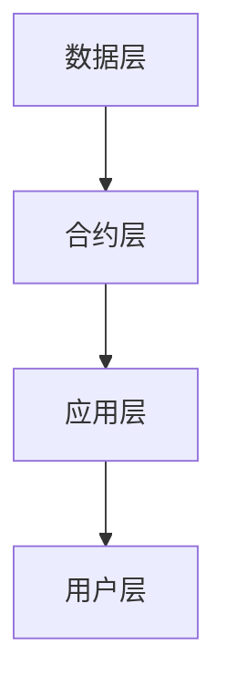

                 


```markdown
# 企业估值中的区块链数字广告平台评估

> 关键词：企业估值, 区块链, 数字广告, 广告平台, 价值评估

> 摘要：本文系统地探讨了区块链技术在数字广告平台评估中的应用，分析了区块链如何解决传统广告行业中的信任问题，提出了基于区块链的广告价值评估模型，并通过实际案例展示了该模型的实现与应用。

---

# 第1章: 区块链与数字广告平台的背景与概念

## 1.1 区块链技术的起源与发展
### 1.1.1 区块链的基本概念
- 区块链是一种去中心化的分布式账本技术。
- 核心特征：去中心化、不可篡改、可追溯。
- 区块链的三种类型：公有链、私有链、联盟链。

### 1.1.2 区块链的核心技术特点
- 数据存储：区块链通过区块结构存储数据，每个区块包含交易数据和时间戳。
- 共识机制：通过共识算法（如PoW、PoS、RAFT等）保证数据一致性。
- 智能合约：通过智能合约实现自动化执行的业务逻辑。

### 1.1.3 区块链在广告行业的应用潜力
- 广告数据确权：通过区块链技术实现广告数据的唯一性和所有权归属。
- 广告投放透明化：通过区块链记录广告投放的全过程，确保数据不可篡改。
- 数据共享与隐私保护：通过区块链技术实现数据共享的同时保护用户隐私。

## 1.2 数字广告平台的现状与挑战
### 1.2.1 数字广告行业的现状分析
- 数字广告行业市场规模持续增长。
- 广告形式多样化：包括横幅广告、视频广告、社交媒体广告等。
- 广告投放渠道多样化：包括搜索引擎、社交媒体、应用程序等。

### 1.2.2 数字广告平台中的信任问题
- 广告数据不透明：广告平台可能夸大广告效果，导致广告主信任缺失。
- 数据造假：部分广告平台存在点击量造假、安装量造假等问题。
- 数据孤岛：不同广告平台之间的数据难以互通，导致数据无法充分利用。

### 1.2.3 区块链技术如何解决广告行业的痛点
- 通过区块链技术实现广告数据的透明化，增强广告主的信任。
- 通过区块链技术实现广告效果的可追溯性，减少数据造假问题。
- 通过区块链技术实现数据共享，打破数据孤岛，提高数据利用率。

## 1.3 企业估值中的广告平台评估需求
### 1.3.1 企业估值的基本概念
- 企业估值：通过对企业的财务状况、市场表现、竞争优势等因素进行综合评估，确定企业的价值。
- 广告平台在企业估值中的重要性：广告平台的收入、用户量、广告点击率等指标是企业估值的重要参考因素。

### 1.3.2 广告平台在企业估值中的重要性
- 广告收入是广告平台的主要收入来源，广告效果的好坏直接影响广告平台的价值。
- 用户量是广告平台的重要指标，用户量越多，广告平台的价值越大。
- 广告点击率是广告效果的重要指标，点击率越高，广告平台的价值越高。

### 1.3.3 区块链技术如何提升广告平台的评估效率
- 通过区块链技术实现广告数据的透明化，提高广告效果评估的准确性。
- 通过区块链技术实现广告数据的不可篡改性，增强评估结果的可信度。
- 通过区块链技术实现广告数据的实时监控，提高评估效率。

---

# 第2章: 区块链在数字广告中的核心应用

## 2.1 区块链技术在广告数据的确权与追踪中的应用
### 2.1.1 数据确权的必要性
- 数据确权：明确数据的归属权，确保数据的合法性和真实性。
- 数据确权的重要性：数据确权是广告效果评估的基础，只有确权的数据才能被信任。

### 2.1.2 区块链如何实现广告数据的确权
- 通过区块链技术记录数据的来源和归属，确保数据的唯一性和真实性。
- 通过智能合约实现数据的自动确权和分配，减少人为干预。

### 2.1.3 数据追踪的实现机制
- 通过区块链技术记录数据的每一次转移和使用，实现数据的全生命周期追踪。
- 通过区块链的不可篡改性，确保数据追踪的准确性和可靠性。

## 2.2 区块链在广告投放透明化中的应用
### 2.2.1 广告投放过程中的信任问题
- 广告投放过程中的数据不透明：广告平台可能夸大广告效果，导致广告主信任缺失。
- 广告投放过程中的数据造假：部分广告平台存在点击量造假、安装量造假等问题。

### 2.2.2 区块链如何实现广告投放的透明化
- 通过区块链技术记录广告投放的全过程，包括广告投放的时间、地点、目标用户等信息。
- 通过智能合约实现广告投放的自动化执行，确保广告投放的透明性和公正性。

### 2.2.3 实时数据监控与分析
- 通过区块链技术实现广告投放数据的实时监控和分析，确保广告效果的可追踪性和可验证性。
- 通过区块链技术实现广告效果的实时反馈，帮助广告主及时调整广告策略。

## 2.3 区块链在广告数据共享与隐私保护中的应用
### 2.3.1 数据共享的挑战与解决方案
- 数据共享的挑战：不同广告平台之间的数据难以互通，导致数据无法充分利用。
- 数据共享的解决方案：通过区块链技术实现数据的跨平台共享，打破数据孤岛。

### 2.3.2 区块链如何实现数据隐私保护
- 通过区块链技术实现数据的加密存储和传输，确保数据的安全性和隐私性。
- 通过零知识证明等技术实现数据的隐私保护，确保数据在共享过程中的安全性。

### 2.3.3 数据共享的合规性与安全性
- 数据共享的合规性：确保数据共享符合相关法律法规和隐私保护要求。
- 数据共享的安全性：通过区块链技术实现数据的加密存储和传输，确保数据的安全性。

---

# 第3章: 广告价值评估的区块链模型与方法

## 3.1 传统广告价值评估的局限性
### 3.1.1 传统广告评估的指标与方法
- 广告点击率：广告被点击的次数与广告展示次数的比率。
- 广告转化率：广告点击后用户完成特定行为（如购买、注册等）的比率。
- 广告收入：广告带来的收入，通常按点击次数或展示次数计费。

### 3.1.2 传统评估方法的不足之处
- 数据不透明：广告平台可能夸大广告效果，导致评估结果不准确。
- 数据孤岛：不同广告平台之间的数据难以互通，导致数据无法充分利用。
- 数据造假：部分广告平台存在点击量造假、安装量造假等问题，影响评估结果的准确性。

### 3.1.3 区块链技术如何弥补这些不足
- 通过区块链技术实现广告数据的透明化，提高评估结果的准确性。
- 通过区块链技术实现广告数据的不可篡改性，增强评估结果的可信度。
- 通过区块链技术实现数据共享，打破数据孤岛，提高数据利用率。

## 3.2 区块链广告价值评估模型的构建
### 3.2.1 模型构建的基本思路
- 基于区块链技术，构建一个去中心化的广告价值评估系统。
- 通过智能合约实现广告数据的自动记录和评估。
- 通过区块链的不可篡改性，确保评估结果的准确性和可信度。

### 3.2.2 模型的核心算法与实现
- 使用区块链技术实现广告数据的记录和存储。
- 使用智能合约实现广告数据的自动评估和结果计算。
- 使用加密算法实现数据的安全存储和传输。

### 3.2.3 模型的验证与优化
- 通过实际数据验证模型的准确性和可靠性。
- 根据验证结果优化模型的算法和参数，提高评估效率和准确性。

---

# 第4章: 区块链数字广告平台的系统设计与实现

## 4.1 系统功能设计
### 4.1.1 广告数据记录与存储
- 通过区块链技术实现广告数据的记录和存储。
- 每个广告数据记录包括广告ID、广告内容、广告投放时间、目标用户等信息。

### 4.1.2 广告数据确权与追踪
- 通过区块链技术实现广告数据的唯一性和所有权归属。
- 通过区块链的不可篡改性，确保数据的可追踪性和真实性。

### 4.1.3 广告效果评估
- 通过区块链技术实现广告效果的实时监控和评估。
- 通过智能合约实现广告效果的自动评估和结果计算。

## 4.2 系统架构设计
### 4.2.1 系统架构概述
- 采用分层架构，包括数据层、合约层、应用层和用户层。
- 数据层负责数据的记录和存储。
- 合约层负责智能合约的部署和执行。
- 应用层负责广告数据的处理和展示。
- 用户层负责用户的交互和操作。

### 4.2.2 系统架构图


## 4.3 系统接口设计
### 4.3.1 广告数据接口
- 提供API接口用于广告数据的上传和查询。
- 接口支持JSON格式的数据传输。

### 4.3.2 广告效果评估接口
- 提供API接口用于广告效果的实时评估。
- 接口支持JSON格式的数据传输和结果返回。

## 4.4 系统交互设计
### 4.4.1 广告数据上传流程
1. 用户通过API接口上传广告数据。
2. 系统将广告数据记录到区块链中。
3. 系统返回数据记录成功确认。

### 4.4.2 广告效果评估流程
1. 用户通过API接口发起广告效果评估请求。
2. 系统通过智能合约自动评估广告效果。
3. 系统返回评估结果。

---

# 第5章: 区块链数字广告平台的项目实战

## 5.1 项目背景与需求分析
### 5.1.1 项目背景
- 随着数字广告行业的快速发展，广告平台的评估需求日益增长。
- 传统广告评估方法存在数据不透明、数据孤岛等问题，亟需技术创新。

### 5.1.2 项目需求
- 实现一个基于区块链的数字广告平台评估系统。
- 系统需要支持广告数据的记录、确权、评估和共享。

## 5.2 项目技术选型
### 5.2.1 区块链平台选择
- 使用Ethereum作为区块链平台。
- 选择Solidity作为智能合约开发语言。

### 5.2.2 开发工具与框架
- 使用 Remix 进行智能合约开发和部署。
- 使用 MetaMask 进行区块链钱包管理和操作。

## 5.3 系统核心实现
### 5.3.1 智能合约实现
```solidity
// SPDX-License-Identifier: MIT
pragma solidity ^0.8.0;

contract Advertiser {
    struct Ad {
        bytes32 adId;
        string adContent;
        uint256 timestamp;
        address[] targetUsers;
    }

    mapping(bytes32 => Ad) ads;

    function addAd(bytes32 adId, string memory adContent, uint256 timestamp, address[] memory targetUsers) public {
        ads[adId] = Ad(adId, adContent, timestamp, targetUsers);
    }

    function getAd(bytes32 adId) public view returns (Ad memory) {
        return ads[adId];
    }
}
```

### 5.3.2 数据结构与算法实现
- 使用区块链技术实现广告数据的记录和存储。
- 使用智能合约实现广告数据的自动评估和结果计算。

## 5.4 项目测试与优化
### 5.4.1 功能测试
- 测试广告数据的上传和查询功能。
- 测试广告效果的评估和结果显示功能。

### 5.4.2 性能优化
- 优化智能合约的执行效率，减少交易费用。
- 优化区块链节点的性能，提高系统的吞吐量。

---

# 第6章: 区块链数字广告平台的最佳实践与未来展望

## 6.1 最佳实践
### 6.1.1 数据隐私保护
- 使用零知识证明等技术实现数据的隐私保护。
- 确保数据在共享过程中的安全性。

### 6.1.2 系统性能优化
- 优化智能合约的执行效率，减少交易费用。
- 优化区块链节点的性能，提高系统的吞吐量。

## 6.2 未来展望
### 6.2.1 区块链技术的未来发展
- 区块链技术将更加成熟，应用场景将更加广泛。
- 区块链技术将与人工智能、大数据等技术深度融合。

### 6.2.2 数字广告行业的未来趋势
- 数字广告行业将更加注重数据的透明化和隐私保护。
- 数字广告平台将更加智能化，广告投放将更加精准。

---

# 第7章: 总结与致谢

## 7.1 本文总结
- 本文系统地探讨了区块链技术在数字广告平台评估中的应用。
- 提出了基于区块链的广告价值评估模型，并通过实际案例展示了该模型的实现与应用。

## 7.2 致谢
- 感谢所有参与本项目研究和开发的团队成员。
- 感谢所有支持和帮助本项目完成的机构和人员。

---

# 参考文献

1. 区块链技术入门与实战
2. 智能合约开发指南
3. 数字广告行业白皮书
4. 区块链与数字广告平台的结合研究

---

# 附录

## 附录A: 项目源代码
```python
# 区块链数字广告平台评估系统实现
from web3 import Web3
from eth_account import Account

# 初始化区块链节点
w3 = Web3(Web3.HTTPProvider("http://localhost:8545"))

# 创建钱包
account = Account.create()
print("新钱包地址:", account.address)
print("私钥:", account.key)
```

## 附录B: 智能合约部署与调用
```python
# 部署智能合约
contract = w3.eth.contract(address=advertiser_address, abi=advertiser_abi)
```

## 附录C: 系统架构图


---

通过以上目录结构，我们可以系统地学习和理解区块链技术在数字广告平台评估中的应用，从理论到实践，逐步深入，最终实现一个基于区块链的数字广告平台评估系统。
```

