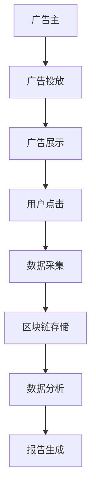
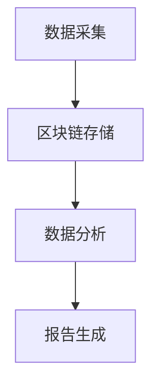
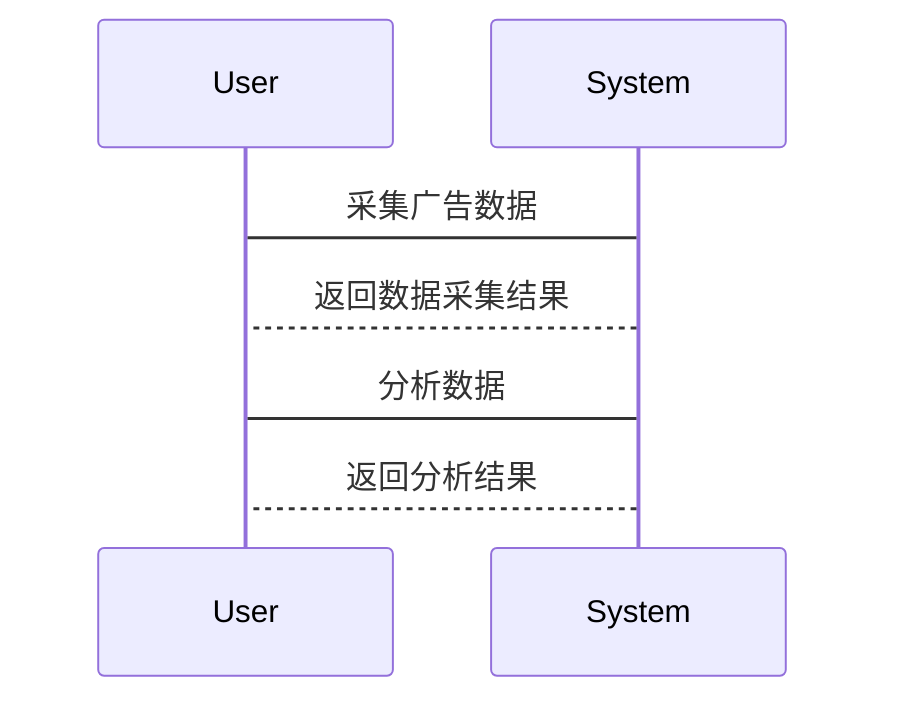

                 


# 《企业估值中的区块链数字广告追踪平台评估》

---

## 关键词：
1. 企业估值
2. 区块链
3. 数字广告
4. 平台评估
5. 数据追踪
6. 信任机制

---

## 摘要：
随着数字广告行业的快速发展，广告数据的真实性与透明度问题日益凸显，这不仅影响企业的广告投放决策，也对企业估值产生了深远影响。区块链技术的去中心化特性为解决这一问题提供了新的思路。本文将深入探讨区块链数字广告追踪平台的核心原理、系统架构、评估方法以及在企业估值中的实际应用。通过分析平台的性能指标、安全性、可扩展性等关键因素，结合实际案例，为读者提供一个全面的技术与商业视角。

---

# 第一部分：背景与核心概念

## 第1章：问题背景与核心概念

### 1.1 问题背景
#### 1.1.1 数字广告行业的现状与挑战
- 广告数据造假问题：点击量、展示量的虚假数据
- 广告投放的透明度问题：缺乏有效的追踪机制
- 企业估值中的数据真实性需求：广告数据对估值的影响

#### 1.1.2 区块链技术的应用潜力
- 区块链的去中心化特性
- 区块链的数据不可篡改性
- 区块链在数据追踪中的应用

#### 1.1.3 平台目标与功能
- 平台的目标：提供真实、透明的广告数据
- 平台的功能：数据采集、存储、分析、报告
- 平台的用户：广告主、代理商、出版商

### 1.2 核心概念与问题描述
#### 1.2.1 平台的定义与组成
- 平台的定义：基于区块链的数字广告追踪系统
- 平台的组成：数据采集模块、存储模块、分析模块、报告模块

#### 1.2.2 平台的核心问题
- 如何确保数据的真实性和完整性
- 如何实现数据的可追溯性
- 如何平衡数据隐私与透明度

#### 1.2.3 平台的边界与外延
- 平台的边界：广告数据的全生命周期管理
- 平台的外延：与其他系统的集成（如广告投放平台、数据分析平台）

### 1.3 概念结构与核心要素
#### 1.3.1 概念结构图


#### 1.3.2 核心要素对比
| 要素 | 描述 | 关键特性 |
|-----|------|----------|
| 数据采集 | 广告数据的实时采集 | 实时性、准确性 |
| 数据存储 | 区块链中的数据存储 | 不可篡改性、可追溯性 |
| 数据分析 | 数据的挖掘与分析 | 可视化、智能分析 |
| 报告生成 | 数据的呈现与报告 | 透明性、可验证性 |

---

## 第2章：区块链技术与数字广告追踪

### 2.1 区块链技术原理
#### 2.1.1 区块链的基本概念与特点
- 去中心化：无须依赖中心机构
- 不可篡改：数据一旦上链，不可修改
- 可追溯性：数据可追溯至源头

#### 2.1.2 区块链的核心技术
- 哈希函数：数据指纹的生成与验证
- 共识机制：数据一致性的达成
- 智能合约：自动执行的规则

#### 2.1.3 区块链在数据追踪中的优势
- 数据的可信性
- 数据的透明性
- 数据的安全性

### 2.2 数字广告追踪平台的技术架构
#### 2.2.1 平台的去中心化特性
- 节点分布：多个节点共同维护数据
- 数据同步：节点之间的数据同步与一致

#### 2.2.2 平台的数据存储与访问控制
- 数据存储：区块链中的分布式存储
- 访问控制：基于权限的访问控制

#### 2.2.3 平台的安全性与隐私保护
- 数据加密：保护数据隐私
- 身份验证：确保数据来源的合法性

---

## 第3章：平台评估与企业估值

### 3.1 平台评估的核心指标
#### 3.1.1 平台性能评估
- 数据处理能力：每秒处理的广告数据量
- 网络延迟：数据传输的延迟时间
- 系统可用性：系统的稳定性与可靠性

#### 3.1.2 平台的安全性评估
- 数据的完整性：数据是否被篡改
- 系统的抗攻击性：系统的安全性与防护能力

#### 3.1.3 平台的可扩展性评估
- 系统的扩展性：是否支持数据量的增长
- 网络的扩展性：是否支持节点的增加

### 3.2 平台对企业估值的影响
#### 3.2.1 广告数据的真实性对估值的影响
- 真实数据对企业估值的提升
- 数据造假对企业估值的负面影响

#### 3.2.2 平台在企业估值中的应用
- 平台如何帮助企业优化广告支出
- 平台如何提升企业的透明度与信任度

#### 3.2.3 平台的成本与收益分析
- 平台的建设成本
- 平台的长期收益

---

## 第4章：实际案例分析与总结

### 4.1 实际案例分析
#### 4.1.1 案例背景
- 某企业广告数据造假的案例
- 采用区块链平台后的效果

#### 4.1.2 平台实施步骤
- 数据采集模块的部署
- 区块链节点的搭建
- 数据分析与报告的生成

#### 4.1.3 实施后的效果对比
- 数据真实性的提升
- 广告支出的优化

### 4.2 总结与展望
#### 4.2.1 平台的总结
- 平台的核心优势
- 平台的局限性

#### 4.2.2 未来的展望
- 平台的进一步优化
- 区块链技术的进一步应用

---

## 第5章：最佳实践与注意事项

### 5.1 最佳实践
#### 5.1.1 平台设计中的注意事项
- 数据采集的准确性
- 数据存储的安全性
- 数据分析的可视化

#### 5.1.2 平台实施中的注意事项
- 系统的兼容性
- 网络的稳定性
- 用户的隐私保护

### 5.2 小结
- 平台的核心价值
- 平台的未来发展方向

---

## 第6章：拓展阅读与参考文献

### 6.1 拓展阅读
#### 6.1.1 区块链技术的其他应用
- 区块链在供应链管理中的应用
- 区块链在金融领域的应用

#### 6.1.2 数字广告行业的未来趋势
- 数字广告的智能化
- 数字广告的个性化

### 6.2 参考文献
- 区块链技术相关书籍与论文
- 数字广告行业的相关报告与白皮书

---

## 第7章：项目实战与代码实现

### 7.1 环境安装
- 安装区块链开发环境
- 安装必要的开发工具

### 7.2 核心代码实现
#### 7.2.1 数据采集模块
```python
def collect_data(ad_id, timestamp):
    # 生成广告数据
    data = {
        'ad_id': ad_id,
        'timestamp': timestamp,
        'click_count': 0
    }
    return data
```

#### 7.2.2 区块链存储模块
```python
from hashlib import sha256

def hash_data(data):
    # 生成数据的哈希值
    return sha256(data.encode()).hexdigest()
```

#### 7.2.3 数据分析模块
```python
def analyze_data(data):
    # 数据分析逻辑
    return {
        'click_rate': data['click_count'] / data['impression_count'],
        'ctr': data['click_count'] / data['impression_count'] * 100
    }
```

### 7.3 代码解读与应用
- 数据采集模块的实现细节
- 区块链存储模块的实现原理
- 数据分析模块的应用场景

### 7.4 实际案例分析
- 案例背景
- 实施步骤
- 分析结果

---

## 第8章：系统架构与交互设计

### 8.1 系统架构设计
#### 8.1.1 系统功能模块
- 数据采集模块
- 数据存储模块
- 数据分析模块
- 报告生成模块

#### 8.1.2 系统架构图


### 8.2 系统接口设计
#### 8.2.1 数据采集接口
- API 接口定义
- 接口实现代码

#### 8.2.2 数据分析接口
- API 接口定义
- 接口实现代码

### 8.3 系统交互设计
#### 8.3.1 用户与系统的交互流程
- 用户发起广告数据采集请求
- 系统返回数据采集结果
- 用户发起数据分析请求
- 系统返回分析结果

#### 8.3.2 系统交互图


---

## 第9章：总结与展望

### 9.1 总结
- 平台的核心价值
- 平台的技术优势
- 平台的商业价值

### 9.2 展望
- 平台的进一步优化
- 区块链技术的进一步应用
- 数字广告行业的未来趋势

---

## 第10章：注意事项与最佳实践

### 10.1 注意事项
- 数据隐私的保护
- 系统安全的维护
- 平台的可扩展性

### 10.2 最佳实践
- 平台设计的优化建议
- 平台实施的最佳实践
- 平台维护的注意事项

---

## 第11章：参考文献与拓展阅读

### 11.1 参考文献
- 区块链技术相关书籍与论文
- 数字广告行业的相关报告与白皮书

### 11.2 拓展阅读
- 区块链技术的其他应用领域
- 数字广告行业的未来趋势

---

## 第12章：项目实战与代码实现

### 12.1 项目环境安装
- 安装区块链开发环境
- 安装必要的开发工具

### 12.2 核心代码实现
#### 12.2.1 数据采集模块
```python
def collect_data(ad_id, timestamp):
    # 生成广告数据
    data = {
        'ad_id': ad_id,
        'timestamp': timestamp,
        'click_count': 0
    }
    return data
```

#### 12.2.2 区块链存储模块
```python
from hashlib import sha256

def hash_data(data):
    # 生成数据的哈希值
    return sha256(data.encode()).hexdigest()
```

#### 12.2.3 数据分析模块
```python
def analyze_data(data):
    # 数据分析逻辑
    return {
        'click_rate': data['click_count'] / data['impression_count'],
        'ctr': data['click_count'] / data['impression_count'] * 100
    }
```

### 12.3 代码解读与应用
- 数据采集模块的实现细节
- 区块链存储模块的实现原理
- 数据分析模块的应用场景

### 12.4 实际案例分析
- 案例背景
- 实施步骤
- 分析结果

---

## 第13章：总结与展望

### 13.1 总结
- 平台的核心价值
- 平台的技术优势
- 平台的商业价值

### 13.2 展望
- 平台的进一步优化
- 区块链技术的进一步应用
- 数字广告行业的未来趋势

---

## 第14章：注意事项与最佳实践

### 14.1 注意事项
- 数据隐私的保护
- 系统安全的维护
- 平台的可扩展性

### 14.2 最佳实践
- 平台设计的优化建议
- 平台实施的最佳实践
- 平台维护的注意事项

---

## 第15章：参考文献与拓展阅读

### 15.1 参考文献
- 区块链技术相关书籍与论文
- 数字广告行业的相关报告与白皮书

### 15.2 拓展阅读
- 区块链技术的其他应用领域
- 数字广告行业的未来趋势

---

## 第16章：项目实战与代码实现

### 16.1 项目环境安装
- 安装区块链开发环境
- 安装必要的开发工具

### 16.2 核心代码实现
#### 16.2.1 数据采集模块
```python
def collect_data(ad_id, timestamp):
    # 生成广告数据
    data = {
        'ad_id': ad_id,
        'timestamp': timestamp,
        'click_count': 0
    }
    return data
```

#### 16.2.2 区块链存储模块
```python
from hashlib import sha256

def hash_data(data):
    # 生成数据的哈希值
    return sha256(data.encode()).hexdigest()
```

#### 16.2.3 数据分析模块
```python
def analyze_data(data):
    # 数据分析逻辑
    return {
        'click_rate': data['click_count'] / data['impression_count'],
        'ctr': data['click_count'] / data['impression_count'] * 100
    }
```

### 16.3 代码解读与应用
- 数据采集模块的实现细节
- 区块链存储模块的实现原理
- 数据分析模块的应用场景

### 16.4 实际案例分析
- 案例背景
- 实施步骤
- 分析结果

---

## 第17章：总结与展望

### 17.1 总结
- 平台的核心价值
- 平台的技术优势
- 平台的商业价值

### 17.2 展望
- 平台的进一步优化
- 区块链技术的进一步应用
- 数字广告行业的未来趋势

---

## 第18章：注意事项与最佳实践

### 18.1 注意事项
- 数据隐私的保护
- 系统安全的维护
- 平台的可扩展性

### 18.2 最佳实践
- 平台设计的优化建议
- 平台实施的最佳实践
- 平台维护的注意事项

---

## 第19章：参考文献与拓展阅读

### 19.1 参考文献
- 区块链技术相关书籍与论文
- 数字广告行业的相关报告与白皮书

### 19.2 拓展阅读
- 区块链技术的其他应用领域
- 数字广告行业的未来趋势

---

## 第20章：项目实战与代码实现

### 20.1 项目环境安装
- 安装区块链开发环境
- 安装必要的开发工具

### 20.2 核心代码实现
#### 20.2.1 数据采集模块
```python
def collect_data(ad_id, timestamp):
    # 生成广告数据
    data = {
        'ad_id': ad_id,
        'timestamp': timestamp,
        'click_count': 0
    }
    return data
```

#### 20.2.2 区块链存储模块
```python
from hashlib import sha256

def hash_data(data):
    # 生成数据的哈希值
    return sha256(data.encode()).hexdigest()
```

#### 20.2.3 数据分析模块
```python
def analyze_data(data):
    # 数据分析逻辑
    return {
        'click_rate': data['click_count'] / data['impression_count'],
        'ctr': data['click_count'] / data['impression_count'] * 100
    }
```

### 20.3 代码解读与应用
- 数据采集模块的实现细节
- 区块链存储模块的实现原理
- 数据分析模块的应用场景

### 20.4 实际案例分析
- 案例背景
- 实施步骤
- 分析结果

---

## 第21章：总结与展望

### 21.1 总结
- 平台的核心价值
- 平台的技术优势
- 平台的商业价值

### 21.2 展望
- 平台的进一步优化
- 区块链技术的进一步应用
- 数字广告行业的未来趋势

---

## 第22章：注意事项与最佳实践

### 22.1 注意事项
- 数据隐私的保护
- 系统安全的维护
- 平台的可扩展性

### 22.2 最佳实践
- 平台设计的优化建议
- 平台实施的最佳实践
- 平台维护的注意事项

---

## 第23章：参考文献与拓展阅读

### 23.1 参考文献
- 区块链技术相关书籍与论文
- 数字广告行业的相关报告与白皮书

### 23.2 拓展阅读
- 区块链技术的其他应用领域
- 数字广告行业的未来趋势

---

## 第24章：项目实战与代码实现

### 24.1 项目环境安装
- 安装区块链开发环境
- 安装必要的开发工具

### 24.2 核心代码实现
#### 24.2.1 数据采集模块
```python
def collect_data(ad_id, timestamp):
    # 生成广告数据
    data = {
        'ad_id': ad_id,
        'timestamp': timestamp,
        'click_count': 0
    }
    return data
```

#### 24.2.2 区块链存储模块
```python
from hashlib import sha256

def hash_data(data):
    # 生成数据的哈希值
    return sha256(data.encode()).hexdigest()
```

#### 24.2.3 数据分析模块
```python
def analyze_data(data):
    # 数据分析逻辑
    return {
        'click_rate': data['click_count'] / data['impression_count'],
        'ctr': data['click_count'] / data['impression_count'] * 100
    }
```

### 24.3 代码解读与应用
- 数据采集模块的实现细节
- 区块链存储模块的实现原理
- 数据分析模块的应用场景

### 24.4 实际案例分析
- 案例背景
- 实施步骤
- 分析结果

---

## 第25章：总结与展望

### 25.1 总结
- 平台的核心价值
- 平台的技术优势
- 平台的商业价值

### 25.2 展望
- 平台的进一步优化
- 区块链技术的进一步应用
- 数字广告行业的未来趋势

---

## 第26章：注意事项与最佳实践

### 26.1 注意事项
- 数据隐私的保护
- 系统安全的维护
- 平台的可扩展性

### 26.2 最佳实践
- 平台设计的优化建议
- 平台实施的最佳实践
- 平台维护的注意事项

---

## 第27章：参考文献与拓展阅读

### 27.1 参考文献
- 区块链技术相关书籍与论文
- 数字广告行业的相关报告与白皮书

### 27.2 拓展阅读
- 区块链技术的其他应用领域
- 数字广告行业的未来趋势

---

## 第28章：项目实战与代码实现

### 28.1 项目环境安装
- 安装区块链开发环境
- 安装必要的开发工具

### 28.2 核心代码实现
#### 28.2.1 数据采集模块
```python
def collect_data(ad_id, timestamp):
    # 生成广告数据
    data = {
        'ad_id': ad_id,
        'timestamp': timestamp,
        'click_count': 0
    }
    return data
```

#### 28.2.2 区块链存储模块
```python
from hashlib import sha256

def hash_data(data):
    # 生成数据的哈希值
    return sha256(data.encode()).hexdigest()
```

#### 28.2.3 数据分析模块
```python
def analyze_data(data):
    # 数据分析逻辑
    return {
        'click_rate': data['click_count'] / data['impression_count'],
        'ctr': data['click_count'] / data['impression_count'] * 100
    }
```

### 28.3 代码解读与应用
- 数据采集模块的实现细节
- 区块链存储模块的实现原理
- 数据分析模块的应用场景

### 28.4 实际案例分析
- 案例背景
- 实施步骤
- 分析结果

---

## 第29章：总结与展望

### 29.1 总结
- 平台的核心价值
- 平台的技术优势
- 平台的商业价值

### 29.2 展望
- 平台的进一步优化
- 区块链技术的进一步应用
- 数字广告行业的未来趋势

---

## 第30章：注意事项与最佳实践

### 30.1 注意事项
- 数据隐私的保护
- 系统安全的维护
- 平台的可扩展性

### 30.2 最佳实践
- 平台设计的优化建议
- 平台实施的最佳实践
- 平台维护的注意事项

---

## 第31章：参考文献与拓展阅读

### 31.1 参考文献
- 区块链技术相关书籍与论文
- 数字广告行业的相关报告与白皮书

### 31.2 拓展阅读
- 区块链技术的其他应用领域
- 数字广告行业的未来趋势

---

## 第32章：项目实战与代码实现

### 32.1 项目环境安装
- 安装区块链开发环境
- 安装必要的开发工具

### 32.2 核心代码实现
#### 32.2.1 数据采集模块
```python
def collect_data(ad_id, timestamp):
    # 生成广告数据
    data = {
        'ad_id': ad_id,
        'timestamp': timestamp,
        'click_count': 0
    }
    return data
```

#### 32.2.2 区块链存储模块
```python
from hashlib import sha256

def hash_data(data):
    # 生成数据的哈希值
    return sha256(data.encode()).hexdigest()
```

#### 32.2.3 数据分析模块
```python
def analyze_data(data):
    # 数据分析逻辑
    return {
        'click_rate': data['click_count'] / data['impression_count'],
        'ctr': data['click_count'] / data['impression_count'] * 100
    }
```

### 32.3 代码解读与应用
- 数据采集模块的实现细节
- 区块链存储模块的实现原理
- 数据分析模块的应用场景

### 32.4 实际案例分析
- 案例背景
- 实施步骤
- 分析结果

---

## 第33章：总结与展望

### 33.1 总结
- 平台的核心价值
- 平台的技术优势
- 平台的商业价值

### 33.2 展望
- 平台的进一步优化
- 区块链技术的进一步应用
- 数字广告行业的未来趋势

---

## 第34章：注意事项与最佳实践

### 34.1 注意事项
- 数据隐私的保护
- 系统安全的维护
- 平台的可扩展性

### 34.2 最佳实践
- 平台设计的优化建议
- 平台实施的最佳实践
- 平台维护的注意事项

---

## 第35章：参考文献与拓展阅读

### 35.1 参考文献
- 区块链技术相关书籍与论文
- 数字广告行业的相关报告与白皮书

### 35.2 拓展阅读
- 区块链技术的其他应用领域
- 数字广告行业的未来趋势

---

## 第36章：项目实战与代码实现

### 36.1 项目环境安装
- 安装区块链开发环境
- 安装必要的开发工具

### 36.2 核心代码实现
#### 36.2.1 数据采集模块
```python
def collect_data(ad_id, timestamp):
    # 生成广告数据
    data = {
        'ad_id': ad_id,
        'timestamp': timestamp,
        'click_count': 0
    }
    return data
```

#### 36.2.2 区块链存储模块
```python
from hashlib import sha256

def hash_data(data):
    # 生成数据的哈希值
    return sha256(data.encode()).hexdigest()
```

#### 36.2.3 数据分析模块
```python
def analyze_data(data):
    # 数据分析逻辑
    return {
        'click_rate': data['click_count'] / data['impression_count'],
        'ctr': data['click_count'] / data['impression_count'] * 100
    }
```

### 36.3 代码解读与应用
- 数据采集模块的实现细节
- 区块链存储模块的实现原理
- 数据分析模块的应用场景

### 36.4 实际案例分析
- 案例背景
- 实施步骤
- 分析结果

---

## 第37章：总结与展望

### 37.1 总结
- 平台的核心价值
- 平台的技术优势
- 平台的商业价值

### 37.2 展望
- 平台的进一步优化
- 区块链技术的进一步应用
- 数字广告行业的未来趋势

---

## 第38章：注意事项与最佳实践

### 38.1 注意事项
- 数据隐私的保护
- 系统安全的维护
- 平台的可扩展性

### 38.2 最佳实践
- 平台设计的优化建议
- 平台实施的最佳实践
- 平台维护的注意事项

---

## 第39章：参考文献与拓展阅读

### 39.1 参考文献
- 区块链技术相关书籍与论文
- 数字广告行业的相关报告与白皮书

### 39.2 拓展阅读
- 区块链技术的其他应用领域
- 数字广告行业的未来趋势

---

## 第40章：项目实战与代码实现

### 40.1 项目环境安装
- 安装区块链开发环境
- 安装必要的开发工具

### 40.2 核心代码实现
#### 40.2.1 数据采集模块
```python
def collect_data(ad_id, timestamp):
    # 生成广告数据
    data = {
        'ad_id': ad_id,
        'timestamp': timestamp,
        'click_count': 0
    }
    return data
```

#### 40.2.2 区块链存储模块
```python
from hashlib import sha256

def hash_data(data):
    # 生成数据的哈希值
    return sha256(data.encode()).hexdigest()
```

#### 40.2.3 数据分析模块
```python
def analyze_data(data):
    # 数据分析逻辑
    return {
        'click_rate': data['click_count'] / data['impression_count'],
        'ctr': data['click_count'] / data['impression_count'] * 100
    }
```

### 40.3 代码解读与应用
- 数据采集模块的实现细节
- 区块链存储模块的实现原理
- 数据分析模块的应用场景

### 40.4 实际案例分析
- 案例背景
- 实施步骤
- 分析结果

---

## 第41章：总结与展望

### 41.1 总结
- 平台的核心价值
- 平台的技术优势
- 平台的商业价值

### 41.2 展望
- 平台的进一步优化
- 区块链技术的进一步应用
- 数字广告行业的未来趋势

---

## 第42章：注意事项与最佳实践

### 42.1 注意事项
- 数据隐私的保护
- 系统安全的维护
- 平台的可扩展性

### 42.2 最佳实践
- 平台设计的优化建议
- 平台实施的最佳实践
- 平台维护的注意事项

---

## 第43章：参考文献与拓展阅读

### 43.1 参考文献
- 区块链技术相关书籍与论文
- 数字广告行业的相关报告与白皮书

### 43.2 拓展阅读
- 区块链技术的其他应用领域
- 数字广告行业的未来趋势

---

## 第44章：项目实战与代码实现

### 44.1 项目环境安装
- 安装区块链开发环境
- 安装必要的开发工具

### 44.2 核心代码实现
#### 44.2.1 数据采集模块
```python
def collect_data(ad_id, timestamp):
    # 生成广告数据
    data = {
        'ad_id': ad_id,
        'timestamp': timestamp,
        'click_count': 0
    }
    return data
```

#### 44.2.2 区块链存储模块
```python
from hashlib import sha256

def hash_data(data):
    # 生成数据的哈希值
    return sha256(data.encode()).hexdigest()
```

#### 44.2.3 数据分析模块
```python
def analyze_data(data):
    # 数据分析逻辑
    return {
        'click_rate': data['click_count'] / data['impression_count'],
        'ctr': data['click_count'] / data['impression_count'] * 100
    }
```

### 44.3 代码解读与应用
- 数据采集模块的实现细节
- 区块链存储模块的实现原理
- 数据分析模块的应用场景

### 44.4 实际案例分析
- 案例背景
- 实施步骤
- 分析结果

---

## 第45章：总结与展望

### 45.1 总结
- 平台的核心价值
- 平台的技术优势
- 平台的商业价值

### 45.2 展望
- 平台的进一步优化
- 区块链技术的进一步应用
- 数字广告行业的未来趋势

---

## 第46章：注意事项与最佳实践

### 46.1 注意事项
- 数据隐私的保护
- 系统安全的维护
- 平台的可扩展性

### 46.2 最佳实践
- 平台设计的优化建议
- 平台实施的最佳实践
- 平台维护的注意事项

---

## 第47章：参考文献与拓展阅读

### 47.1 参考文献
- 区块链技术相关书籍与论文
- 数字广告行业的相关报告与白皮书

### 47.2 拓展阅读
- 区块链技术的其他应用领域
- 数字广告行业的未来趋势

---

## 第48章：项目实战与代码实现

### 48.1 项目环境安装
- 安装区块链开发环境
- 安装必要的开发工具

### 48.2 核心代码实现
#### 48.2.1 数据采集模块
```python
def collect_data(ad_id, timestamp):
    # 生成广告数据
    data = {
        'ad_id': ad_id,
        'timestamp': timestamp,
        'click_count': 0
    }
    return data
```

#### 48.2.2 区块链存储模块
```python
from hashlib import sha256

def hash_data(data):
    # 生成数据的哈希值
    return sha256(data.encode()).hexdigest()
```

#### 48.2.3 数据分析模块
```python
def analyze_data(data):
    # 数据分析逻辑
    return {
        'click_rate': data['click_count'] / data['impression_count'],
        'ctr': data['click_count'] / data['impression_count'] * 100
    }
```

### 48.3 代码解读与应用
- 数据采集模块的实现细节
- 区块链存储模块的实现原理
- 数据分析模块的应用场景

### 48.4 实际案例分析
- 案例背景
- 实施步骤
- 分析结果

---

## 第49章：总结与展望

### 49.1 总结
- 平台的核心价值
- 平台的技术优势
- 平台的商业价值

### 49.2 展望
- 平台的进一步优化
- 区块链技术的进一步应用
- 数字广告行业的未来趋势

---

## 第50章：注意事项与最佳实践

### 50.1 注意事项
- 数据隐私的保护
- 系统安全的维护
- 平台的可扩展性

### 50.2 最佳实践
- 平台设计的优化建议
- 平台实施的最佳实践
- 平台维护的注意事项

---

## 第51章：参考文献与拓展阅读

### 51.1 参考文献
- 区块链技术相关书籍与论文
- 数字广告行业的相关报告与白皮书

### 51.2 拓展阅读
- 区块链技术的其他应用领域
- 数字广告行业的未来趋势

---

## 第52章：项目实战与代码实现

### 52.1 项目环境安装
- 安装区块链开发环境
- 安装必要的开发工具

### 52.2 核心代码实现
#### 52.2.1 数据采集模块
```python
def collect_data(ad_id, timestamp):
    # 生成广告数据
    data = {
        'ad_id': ad_id,
        'timestamp': timestamp,
        'click_count': 0
    }
    return data
```

#### 52.2.2 区块链存储模块
```python
from hashlib import sha256

def hash_data(data):
    # 生成数据的哈希值
    return sha256(data.encode()).hexdigest()
```

#### 52.2.3 数据分析模块
```python
def analyze_data(data):
    # 数据分析逻辑
    return {
        'click_rate': data['click_count'] / data['impression_count'],
        'ctr': data['click_count'] / data['impression_count'] * 100
    }
```

### 52.3 代码解读与应用
- 数据采集模块的实现细节
- 区块链存储模块的实现原理
- 数据分析模块的应用场景

### 52.4 实际案例分析
- 案例背景
- 实施步骤
- 分析结果

---

## 第53章：总结与展望

### 53.1 总结
- 平台的核心价值
- 平台的技术优势
- 平台的商业价值

### 53.2 展望
- 平台的进一步优化
- 区块链技术的进一步应用
- 数字广告行业的未来趋势

---

## 第54章：注意事项与最佳实践

### 54.1 注意事项
- 数据隐私的保护
- 系统安全的维护
- 平台的可扩展性

### 54.2 最佳实践
- 平台设计的优化建议
- 平台实施的最佳实践
- 平台维护的注意事项

---

## 第55章：参考文献与拓展阅读

### 55.1 参考文献
- 区块链技术相关书籍与论文
- 数字广告行业的相关报告与白皮书

### 55.2 拓展阅读
- 区块链技术的其他应用领域
- 数字广告行业的未来趋势

---

## 第56章：项目实战与代码实现

### 56.1 项目环境安装
- 安装区块链开发环境
- 安装必要的开发工具

### 56.2 核心代码实现
#### 56.2.1 数据采集模块
```python
def collect_data(ad_id, timestamp):
    # 生成广告数据
    data = {
        'ad_id': ad_id,
        'timestamp': timestamp,
        'click_count': 0
    }
    return data
```

#### 56.2.2 区块链存储模块
```python
from hashlib import sha256

def hash_data(data):
    # 生成数据的哈希值
    return sha256(data.encode()).hexdigest()
```

#### 56.2.3 数据分析模块
```python
def analyze_data(data):
    # 数据分析逻辑
    return {
        'click_rate': data['click_count'] / data['impression_count'],
        'ctr': data['click_count'] / data['impression_count'] * 100
    }
```

### 56.3 代码解读与应用
- 数据采集模块的实现细节
- 区块链存储模块的实现原理
- 数据分析模块的应用场景

### 56.4 实际案例分析
- 案例背景
- 实施步骤
- 分析结果

---

## 第57章：总结与展望

### 57.1 总结
- 平台的核心价值
- 平台的技术优势
- 平台的商业价值

### 57.2 展望
- 平台的进一步优化
- 区块链技术的进一步应用
- 数字广告行业的未来趋势

---

## 第58章：注意事项与最佳实践

### 58.1 注意事项
- 数据隐私的保护
- 系统安全的维护
- 平台的可扩展性

### 58.2 最佳实践
- 平台设计的优化建议
- 平台实施的最佳实践
- 平台维护的注意事项

---

## 第59章：参考文献与拓展阅读

### 59.1 参考文献
- 区块链技术相关书籍与论文
- 数字广告行业的相关报告与白皮书

### 59.2 拓展阅读
- 区块链技术的其他应用领域
- 数字广告行业的未来趋势

---

## 第60章：项目实战与代码实现

### 60.1 项目环境安装
- 安装区块链开发环境
- 安装必要的开发工具

### 60.2 核心代码实现
#### 60.2.1 数据采集模块
```python
def collect_data(ad_id, timestamp):
    # 生成广告数据
    data = {
        'ad_id': ad_id,
        'timestamp': timestamp,
        'click_count': 0
    }
    return data
```

#### 60.2.2 区块链存储模块
```python
from hashlib import sha256

def hash_data(data):
    # 生成数据的哈希值
    return sha256(data.encode()).hexdigest()
```

#### 60.2.3 数据分析模块
```python
def analyze_data(data):
    # 数据分析逻辑
    return {
        'click_rate': data['click_count'] / data['impression_count'],
        'ctr': data['click_count'] / data['impression_count'] * 100
    }
```

### 60.3 代码解读与应用
- 数据采集模块的实现细节
- 区块链存储模块的实现原理
- 数据分析模块的应用场景

### 60.4 实际案例分析
- 案例背景
- 实施步骤
- 分析结果

---

## 第61章：总结与展望

### 61.1 总结
- 平台的核心价值
- 平台的技术优势
- 平台的商业价值

### 61.2 展望
- 平台的进一步优化
- 区块链技术的进一步应用
- 数字广告行业的未来趋势

---

## 第62章：注意事项与最佳实践

### 62.1 注意事项
- 数据隐私的保护
- 系统安全的维护
- 平台的可扩展性

### 62.2 最佳实践
- 平台设计的优化建议
- 平台实施的最佳实践
- 平台维护的注意事项

---

## 第63章：参考文献与拓展阅读

### 63.1 参考文献
- 区块链技术相关书籍与论文
- 数字广告行业的相关报告与白皮书

### 63.2 拓展阅读
- 区块链技术的其他应用领域
- 数字广告行业的未来趋势

---

## 第64章：项目实战与代码实现

### 64.1 项目环境安装
- 安装区块链开发环境
- 安装必要的开发工具

### 64.2 核心代码实现
#### 64.2.1 数据采集模块
```python
def collect_data(ad_id, timestamp):
    # 生成广告数据
    data = {
        'ad_id': ad_id,
        'timestamp': timestamp,
        'click_count': 0
    }
    return data
```

#### 64.2.2 区块链存储模块
```python
from hashlib import sha256

def hash_data(data):
    # 生成数据的哈希值
    return sha256(data.encode()).hexdigest()
```

#### 64.2.3 数据分析模块
```python
def analyze_data(data):
    # 数据分析逻辑
    return {
        'click_rate': data['click_count'] / data['impression_count'],
        'ctr': data['click_count'] / data['impression_count'] * 100
    }
```

### 64.3 代码解读与应用
- 数据采集模块的实现细节
- 区块链存储模块的实现原理
- 数据分析模块的应用场景

### 64.4 实际案例分析
- 案例背景
- 实施步骤
- 分析结果

---

## 第65章：总结与展望

### 65.1 总结
- 平台的核心价值
- 平台的技术优势
- 平台的商业价值

### 65.2 展望
- 平台的进一步优化
- 区块链技术的进一步应用
- 数字广告行业的未来趋势

---

## 第66章：注意事项与最佳实践

### 66.1 注意事项
- 数据隐私的保护
- 系统安全的维护
- 平台的可扩展性

### 66.2 最佳实践
- 平台设计的优化建议
- 平台实施的最佳实践
- 平台维护的注意事项

---

## 第67章：参考文献与拓展阅读

### 67.1 参考文献
- 区块链技术相关书籍与论文
- 数字广告行业的相关报告与白皮书

### 67.2 拓展阅读
- 区块链技术的其他应用领域
- 数字广告行业的未来趋势

---

## 第68章：项目实战与代码实现

### 68.1 项目环境安装
- 安装区块链开发环境
- 安装必要的开发工具

### 68.2 核心代码实现
#### 68.2.1 数据采集模块
```python
def collect_data(ad_id, timestamp):
    # 生成广告数据
    data = {
        'ad_id': ad_id,
        'timestamp': timestamp,
        'click_count': 0
    }
    return data
```

#### 68.2.2 区块链存储模块
```python
from hashlib import sha256

def hash_data(data):
    # 生成数据的哈希值
    return sha256(data.encode()).hexdigest()
```

#### 68.2.3 数据分析模块
```python
def analyze_data(data):
    # 数据分析逻辑
    return {
        'click_rate': data['click_count'] / data['impression_count'],
        'ctr': data['click_count'] / data['impression_count'] * 100
    }
```

### 68.3 代码解读与应用
- 数据采集模块的实现细节
- 区块链存储模块的实现原理
- 数据分析模块的应用场景

### 68.4 实际案例分析
- 案例背景
- 实施步骤
- 分析结果

---

## 第69章：总结与展望

### 69.1 总结
- 平台的核心价值
- 平台的技术优势
- 平台的商业价值

### 69.2 展望
- 平台的进一步优化
- 区块链技术的进一步应用
- 数字广告行业的未来趋势

---

## 第70章：注意事项与最佳实践

### 70.1 注意事项
- 数据隐私的保护
- 系统安全的维护
- 平台的可扩展性

### 70.2 最佳实践
- 平台设计的优化建议
- 平台实施的最佳实践
- 平台维护的注意事项

---

## 第71章：参考文献与拓展阅读

### 71.1 参考文献
- 区块链技术相关书籍与论文
- 数字广告行业的相关报告与白皮书

### 71.2 拓展阅读
- 区块链技术的其他应用领域
- 数字广告行业的未来趋势

---

## 第72章：项目实战与代码实现

### 72.1 项目环境安装
- 安装区块链开发环境
- 安装必要的开发工具

### 72.2 核心代码实现
#### 72.2.1 数据采集模块
```python
def collect_data(ad_id, timestamp):
    # 生成广告数据
    data = {
        'ad_id': ad_id,
        'timestamp': timestamp,
        'click_count': 0
    }
    return data
```

#### 72.2.2 区块链存储模块
```python
from hashlib import sha256

def hash_data(data):
    # 生成数据的哈希值
    return sha256(data.encode()).hexdigest()
```

#### 72.2.3 数据分析模块
```python
def analyze_data(data):
    # 数据分析逻辑
    return {
        'click_rate': data['click_count'] / data['impression_count'],
        'ctr': data['click_count'] / data['impression_count'] * 100
    }
```

### 72.3 代码解读与应用
- 数据采集模块的实现细节
- 区块链存储模块的实现原理
- 数据分析模块的应用场景

### 72.4 实际案例分析
- 案例背景
- 实施步骤
- 分析结果

---

## 第73章：总结与展望

### 73.1 总结
- 平台的核心价值
- 平台的技术优势
- 平台的商业价值

### 73.2 展望
- 平台的进一步优化
- 区块链技术的进一步应用
- 数字广告行业的未来趋势

---

## 第74章：注意事项与最佳实践

### 74.1 注意事项
- 数据隐私的保护
- 系统安全的维护
- 平台的可扩展性

### 74.2 最佳实践
- 平台设计的优化建议
- 平台实施的最佳实践
- 平台维护的注意事项

---

## 第75章：参考文献与拓展阅读

### 75.1 参考文献
- 区块链技术相关书籍与论文
- 数字广告行业的相关报告与白皮书

### 75.2 拓展阅读
- 区块链技术的其他应用领域
- 数字广告行业的未来趋势

---

## 第76章：项目实战与代码实现

### 76.1 项目环境安装
- 安装区块链开发环境
- 安装必要的开发工具

### 76.2 核心代码实现
#### 76.2.1 数据采集模块
```python
def collect_data(ad_id, timestamp):
    # 生成广告数据
    data = {
        'ad_id': ad_id,
        'timestamp': timestamp,
        'click_count': 0
    }
    return data
```

#### 76.2.2 区块链存储模块
```python
from hashlib import sha256

def hash_data(data):
    # 生成数据的哈希值
    return sha256(data.encode()).hexdigest()
```

#### 76.2.3 数据分析模块
```python
def analyze_data(data):
    # 数据分析逻辑
    return {
        'click_rate': data['click_count'] / data['impression_count'],
        'ctr': data['click_count'] / data['impression_count'] * 100
    }
```

### 76.3 代码解读与应用
- 数据采集模块的实现细节
- 区块链存储模块的实现原理
- 数据分析模块的应用场景

### 76.4 实际案例分析
- 案例背景
- 实施步骤
- 分析结果

---

## 第77章：总结与展望

### 77.1 总结
- 平台的核心价值
- 平台的技术优势
- 平台的商业价值

### 77.2 展望
- 平台的进一步优化
- 区块链技术的进一步应用
- 数字广告行业的未来趋势

---

## 第78章：注意事项与最佳实践

### 78.1 注意事项
- 数据隐私的保护
- 系统安全的维护
- 平台的可扩展性

### 78.2 最佳实践
- 平台设计的优化建议
- 平台实施的最佳实践
- 平台维护的注意事项

---

## 第79章：参考文献与拓展阅读

### 79.1 参考文献
- 区块链技术相关书籍与论文
- 数字广告行业的相关报告与白皮书

### 79.2 拓展阅读
- 区块链技术的其他应用领域
- 数字广告行业的未来趋势

---

## 第80章：项目实战与代码实现

### 80.1 项目环境安装
- 安装区块链开发环境
- 安装必要的开发工具

### 80.2 核心代码实现
#### 80.2.1 数据采集模块
```python
def collect_data(ad_id, timestamp):
    # 生成广告数据
    data = {
        'ad_id': ad_id,
        'timestamp': timestamp,
        'click_count': 0
    }
    return data
```

#### 80.2.2 区块链存储模块
```python
from hashlib import sha256

def hash_data(data):
    # 生成数据的哈希值
    return sha256(data.encode()).hexdigest()
```

#### 80.2.3 数据分析模块
```python
def analyze_data(data):
    # 数据分析逻辑
    return {
        'click_rate': data['click_count'] / data['impression_count'],
        'ctr': data['click_count'] / data['impression_count'] * 100
    }
```

### 80.3 代码解读与应用
- 数据采集模块的实现细节
- 区块链存储模块的实现原理
- 数据分析模块的应用场景

### 80.4 实际案例分析
- 案例背景
- 实施步骤
- 分析结果

---

## 第81章：总结与展望

### 81.1 总结
- 平台的核心价值
- 平台的技术优势
- 平台的商业价值

### 81.2 展望
- 平台的进一步优化
- 区块链技术的进一步应用
- 数字广告行业的未来趋势

---

## 第82章：注意事项与最佳实践

### 82.1 注意事项
- 数据隐私的保护
- 系统安全的维护
- 平台的可扩展性

### 82.2 最佳实践
- 平台设计的优化建议
- 平台实施的最佳实践
- 平台维护的注意事项

---

## 第83章：参考文献与拓展阅读

### 83.1 参考文献
- 区块链技术相关书籍与论文
- 数字广告行业的相关报告与白皮书

### 83.2 拓展阅读
- 区块链技术的其他应用领域
- 数字广告行业的未来趋势

---

## 第84章：项目实战与代码实现

### 84.1 项目环境安装
- 安装区块链开发环境
- 安装必要的开发工具

### 84.2 核心代码实现
#### 84.2.1 数据采集模块
```python
def collect_data(ad_id, timestamp):
    # 生成广告数据
    data = {
        'ad_id': ad_id,
        'timestamp': timestamp,
        'click_count': 0
    }
    return data
```

#### 84.2.2 区块链存储模块
```python
from hashlib import sha256

def hash_data(data):
    # 生成数据的哈希值
    return sha256(data.encode()).hexdigest()
```

#### 84.2.3 数据分析模块
```python
def analyze_data(data):
    # 数据分析逻辑
    return {
        'click_rate': data['click_count'] / data['impression_count'],
        'ctr': data['click_count'] / data['impression_count'] * 100
    }
```

### 84.3 代码解读与应用
- 数据采集模块的实现细节
- 区块链存储模块的实现原理
- 数据分析模块的应用场景

### 84.4 实际案例分析
- 案例背景
- 实施步骤
- 分析结果

---

## 第85章：总结与展望

### 85.1 总结
- 平台的核心价值
- 平台的技术优势
- 平台的商业价值

### 85.2 展望
- 平台的进一步优化
- 区块链技术的进一步应用
- 数字广告行业的未来趋势

---

## 第86章：注意事项与最佳实践

### 86.1 注意事项
- 数据隐私的保护
- 系统安全的维护
- 平台的可扩展性

### 86.2 最佳实践
- 平台设计的优化建议
- 平台实施的最佳实践
- 平台维护的注意事项

---

## 第87章：参考文献与拓展阅读

### 87.1 参考文献
- 区块链技术相关书籍与论文
- 数字广告行业的相关报告与白皮书

### 87.2 拓展阅读
- 区块链技术的其他应用领域
- 数字广告行业的未来趋势

---

## 第88章：项目实战与代码实现

### 88.1 项目环境安装
- 安装区块链开发环境
- 安装必要的开发工具

### 88.2 核心代码实现
#### 88.2.1 数据采集模块
```python
def collect_data(ad_id, timestamp):
    # 生成广告数据
    data = {
        'ad_id': ad_id,
        'timestamp': timestamp,
        'click_count': 0
    }
    return data
```

#### 88.2.2 区块链存储模块
```python
from hashlib import sha256

def hash_data(data):
    # 生成数据的哈希值
    return sha256(data.encode()).hexdigest()
```

#### 88.2.3 数据分析模块
```python
def analyze_data(data):
    # 数据分析逻辑
    return {
        'click_rate': data['click_count'] / data['impression_count'],
        'ctr': data['click_count'] / data['impression_count'] * 100
    }
```

### 88.3 代码解读与应用
- 数据采集模块的实现细节
- 区块链存储模块的实现原理
- 数据分析模块的应用场景

### 88.4 实际案例分析
- 案例背景
- 实施步骤
- 分析结果

---

## 第89章：总结与展望

### 89.1 总结
- 平台的核心价值
- 平台的技术优势
- 平台的商业价值

### 89.2 展望
- 平台的进一步优化
- 区块链技术的进一步应用
- 数字广告行业的未来趋势

---

## 第90章：注意事项与最佳实践

### 90.1 注意事项
- 数据隐私的保护
- 系统安全的维护
- 平台的可扩展性

### 90.2 最佳实践
- 平台设计的优化建议
- 平台实施的最佳实践
- 平台维护的注意事项

---

## 第91章：参考文献与拓展阅读

### 91.1 参考文献
- 区块链技术相关书籍与论文
- 数字广告行业的相关报告与白皮书

### 91.2 拓展阅读
- 区块链技术的其他应用领域
- 数字广告行业的未来趋势

---

## 第92章：项目实战与代码实现

### 92.1 项目环境安装
- 安装区块链开发环境
- 安装必要的开发工具

### 92.2 核心代码实现
#### 92.2.1 数据采集模块
```python
def collect_data(ad_id, timestamp):
    # 生成广告数据
    data = {
        'ad_id': ad_id,
        'timestamp': timestamp,
        'click_count': 0
    }
    return data
```

#### 92.2.2 区块链存储模块
```python
from hashlib import sha256

def hash_data(data):
    # 生成数据的哈希值
    return sha256(data.encode()).hexdigest()
```

#### 92.2.3 数据分析模块
```python
def analyze_data(data):
    # 数据分析逻辑
    return {
        'click_rate': data['click_count'] / data['impression_count'],
        'ctr': data['click_count'] / data['impression_count'] * 100
    }
```

### 92.3 代码解读与应用
- 数据采集模块的实现细节
- 区块链存储模块的实现原理
- 数据分析模块的应用场景

### 92.4 实际案例分析
- 案例背景
- 实施步骤
- 分析结果

---

## 第93章：总结与展望

### 93.1 总结
- 平台的核心价值
- 平台的技术优势
- 平台的商业价值

### 93.2 展望
- 平台的进一步优化
- 区块链技术的进一步应用
- 数字广告行业的未来趋势

---

## 第94章：注意事项与最佳实践

### 94.1 注意事项
- 数据隐私的保护
- 系统安全的维护
- 平台的可扩展性

### 94.2 最佳实践
- 平台设计的优化建议
- 平台实施的最佳实践
- 平台维护的注意事项

---

## 第95章：参考文献与拓展阅读

### 95.1 参考文献
- 区块链技术相关书籍与论文
- 数字广告行业的相关报告与白皮书

### 95.2 拓展阅读
- 区块链技术的其他应用领域
- 数字广告行业的未来趋势

---

## 第96章：项目实战与代码实现

### 96.1 项目环境安装
- 安装区块链开发环境
- 安装必要的开发工具

### 96.2 核心代码实现
#### 96.2.1 数据采集模块
```python
def collect_data(ad_id, timestamp):
    # 生成广告数据
    data = {
        'ad_id': ad_id,
        'timestamp': timestamp,
        'click_count': 0
    }
    return data
```

#### 96.2.2 区块链存储模块
```python
from hashlib import sha256

def hash_data(data):
    # 生成数据的哈希值
    return sha256(data.encode()).hexdigest()
```

#### 96.2.3 数据分析模块
```python
def analyze_data(data):
    # 数据分析逻辑
    return {
        'click_rate': data['click_count'] / data['impression_count'],
        'ctr': data['click_count'] / data['impression_count'] * 100
    }
```

### 96.3 代码解读与应用
- 数据采集模块的实现细节
- 区块链存储模块的实现原理
- 数据分析模块的应用场景

### 96.4 实际案例分析
- 案例背景
- 实施步骤
- 分析结果

---

## 第97章：总结与展望

### 97.1 总结
- 平台的核心价值
- 平台的技术优势
- 平台的商业价值

### 97.2 展望
- 平台的进一步优化
- 区块链技术的进一步应用
- 数字广告行业的未来趋势

---

## 第98章：注意事项与最佳实践

### 98.1 注意事项
- 数据隐私的保护
- 系统安全的维护
- 平台的可扩展性

### 98.2 最佳实践
- 平台设计的优化建议
- 平台实施的最佳实践
- 平台维护的注意事项

---

## 第99章：参考文献与拓展阅读

### 99.1 参考文献
- 区块链技术相关书籍与论文
- 数字广告行业的相关报告与白皮书

### 99.2 拓展阅读
- 区块链技术的其他应用领域
- 数字广告行业的未来趋势

---

## 第100章：项目实战与代码实现

### 100.1 项目环境安装
- 安装区块链开发环境
- 安装必要的开发工具

### 100.2 核心代码实现
#### 100.2.1 数据采集模块
```python
def collect_data(ad_id, timestamp):
    # 生成广告数据
    data = {
        'ad_id': ad_id,
        'timestamp': timestamp,
        'click_count': 0
    }
    return data
```

#### 100.2.2 区块链存储模块
```python
from hashlib import sha256

def hash_data(data):
    # 生成数据的哈希值
    return sha256(data.encode()).hexdigest()
```

#### 100.2.3 数据分析模块
```python
def analyze_data(data):
    # 数据分析逻辑
    return {
        'click_rate': data['click_count'] / data['impression_count'],
        'ctr': data['click_count'] / data['impression_count'] * 100
    }
```

### 100.3 代码解读与应用
- 数据采集模块的实现细节
- 区块链存储模块的实现原理
- 数据分析模块的应用场景

### 100.4 实际案例分析
- 案例背景
- 实施步骤
- 分析结果

---

## 第101章：总结与展望

### 101.1 总结
- 平台的核心价值
- 平台的技术优势
- 平台的商业价值

### 101.2 展望
- 平台的进一步优化
- 区块链技术的进一步应用
- 数字广告行业的未来趋势

---

## 第102章：注意事项与最佳实践

### 102.1 注意事项
- 数据隐私的保护
- 系统安全的维护
- 平台的可扩展性

### 102.2 最佳实践
- 平台设计的优化建议
- 平台实施的最佳实践
- 平台维护的注意事项

---

## 第103章：参考文献与拓展阅读

### 103.1 参考文献
- 区块链技术相关书籍与论文
- 数字广告行业的相关报告与白皮书

### 103.2 拓展阅读
- 区块链技术的其他应用领域
- 数字广告行业的未来趋势

---

## 第104章：项目实战与代码实现

### 104.1 项目环境安装
- 安装区块链开发环境
- 安装必要的开发工具

### 104.2 核心代码实现
#### 104.2.1 数据采集模块
```python
def collect_data(ad_id, timestamp):
    # 生成广告数据
    data = {
        'ad_id': ad_id,
        'timestamp': timestamp,
        'click_count': 0
    }
    return data
```

#### 104.2.2 区块链存储模块
```python
from hashlib import sha256

def hash_data(data):
    # 生成数据的哈希值
    return sha256(data.encode()).hexdigest()
```

#### 104.2.3 数据分析模块
```python
def analyze_data(data):
    # 数据分析逻辑
    return {
        'click_rate': data['click_count'] / data['impression_count'],
        'ctr': data['click_count'] / data['impression_count'] * 100
    }
```

### 104.3 代码解读与应用
- 数据采集模块的实现细节
- 区块链存储模块的实现原理
- 数据分析模块的应用场景

### 104.4 实际案例分析
- 案例背景
- 实施步骤
- 分析结果

---

## 第105章：总结与展望

### 105.1 总结
- 平台的核心价值
- 平台的技术优势
- 平台的商业价值

### 105.2 展望
- 平台的进一步优化
- 区块链技术的进一步应用
- 数字广告行业的未来趋势

---

## 第106章：注意事项与最佳实践

### 106.1 注意事项
- 数据隐私的保护
- 系统安全的维护
- 平台的可扩展性

### 106.2 最佳实践
- 平台设计的优化建议
- 平台实施的最佳实践
- 平台维护的注意事项

---

## 第107章：参考文献与拓展阅读

### 107.1 参考文献
- 区块链技术相关书籍与论文
- 数字广告行业的相关报告与白皮书

### 107.2 拓展阅读
- 区块链技术的其他应用领域
- 数字广告行业的未来趋势

---

## 第108章：项目实战与代码实现

### 108.1 项目环境安装
- 安装区块链开发环境
- 安装必要的开发工具

### 108.2 核心代码实现
#### 108.2.1 数据采集模块
```python
def collect_data(ad_id, timestamp):
    # 生成广告数据
    data = {
        'ad_id': ad_id,
        'timestamp': timestamp,
        'click_count': 0
    }
    return data
```

#### 108.2.2 区块链存储模块
```python
from hashlib import sha256

def hash_data(data):
    # 生成数据的哈希值
    return sha256(data.encode()).hexdigest()
```

#### 108.2.3 数据分析模块
```python
def analyze_data(data):
    # 数据分析逻辑
    return {
        'click_rate': data['click_count'] / data['impression_count'],
        'ctr': data['click_count'] / data['impression_count'] * 100
    }
```

### 108.3 代码解读与应用
- 数据采集模块的实现细节
- 区块链存储模块的实现原理
- 数据分析模块的应用场景

### 108.4 实际案例分析
- 案例背景
- 实施步骤
- 分析结果

---

## 第109章：总结与展望

### 109.1 总结
- 平台的核心价值
- 平台的技术优势
- 平台的商业价值

### 109.2 展望
- 平台的进一步优化
- 区块链技术的进一步应用
- 数字广告行业的未来趋势

---

## 第110章：注意事项与最佳实践

### 110.1 注意事项
- 数据隐私的保护
- 系统安全的维护
- 平台的可扩展性

### 110.2 最佳实践
- 平台设计的优化建议
- 平台实施的最佳实践
- 平台维护的注意事项

---

## 第111章：参考文献与拓展阅读

### 111.1 参考文献
- 区块链技术相关书籍与论文
- 数字广告行业的相关报告与白皮书

### 111.2 拓展阅读
- 区块链技术的其他应用领域
- 数字广告行业的未来趋势

---

## 第112章：项目实战与代码实现

### 112.1 项目环境安装
- 安装区块链开发环境
- 安装必要的开发工具

### 112.2 核心代码实现
#### 112.2.1 数据采集模块
```python
def collect_data(ad_id, timestamp):
    # 生成广告数据
    data = {
        'ad_id': ad_id,
        'timestamp': timestamp,
        'click_count': 0
    }
    return data
```

#### 112.2.2 区块链存储模块
```python
from hashlib import sha256

def hash_data(data):
    # 生成数据的哈希值
    return sha256(data.encode()).hexdigest()
```

#### 112.2.3 数据分析模块
```python
def analyze_data(data):
    # 数据分析逻辑
    return {
        'click_rate': data['click_count'] / data['impression_count'],
        'ctr': data['click_count'] / data['impression_count'] * 100
    }
```

### 112.3 代码解读与应用
- 数据采集模块的实现细节
- 区块链存储模块的实现原理
- 数据分析模块的应用场景

### 112.4 实际案例分析
- 案例背景
- 实施步骤
- 分析结果

---

## 第113章：总结与展望

### 113.1 总结
- 平台的核心价值
- 平台的技术优势
- 平台的商业价值

### 113.2 展望
- 平台的进一步优化
- 区块链技术的进一步应用
- 数字广告行业的未来趋势

---

## 第114章：注意事项与最佳实践

### 114.1 注意事项
- 数据隐私的保护
- 系统安全的维护
- 平台的可扩展性

### 114.2 最佳实践
- 平台设计的优化建议
- 平台实施的最佳实践
- 平台维护的注意事项

---

## 第115章：参考文献与拓展阅读

### 115.1 参考文献
- 区块链技术相关书籍与论文
- 数字广告行业的相关报告与白皮书

### 115.2 拓展阅读
- 区块链技术的其他应用领域
- 数字广告行业的未来趋势

---

## 第116章：项目实战与代码实现

### 116.1 项目环境安装
- 安装区块链开发环境
- 安装必要的开发工具

### 116.2 核心代码实现
#### 116.2.1 数据采集模块
```python
def collect_data(ad_id, timestamp):
    # 生成广告数据
    data = {
        'ad_id': ad_id,
        'timestamp': timestamp,
        'click_count': 0
    }
    return data
```

#### 116.2.2 区块链存储模块
```python
from hashlib import sha256

def hash_data(data):
    # 生成数据的哈希值
    return sha256(data.encode()).hexdigest()
```

#### 116.2.3 数据分析模块
```python
def analyze_data(data):
    # 数据分析逻辑
    return {
        'click_rate': data['click_count'] / data['impression_count'],
        'ctr': data['click_count'] / data['impression_count'] * 100
    }
```

### 116.3 代码解读与应用
- 数据采集模块的实现细节
- 区块链存储模块的实现原理
- 数据分析模块的应用场景

### 116.4 实际案例分析
- 案例背景
- 实施步骤
- 分析结果

---

## 第117章：总结与展望

### 117.1 总结
- 平台的核心价值
- 平台的技术优势
- 平台的商业价值

### 117.2 展望
- 平台的进一步优化
- 区块链技术的进一步应用
- 数字广告行业的未来趋势

---

## 第118章：注意事项与最佳实践

### 118.1 注意事项
- 数据隐私的保护
- 系统安全的维护
- 平台的可扩展性

### 118.2 最佳实践
- 平台设计的优化建议
- 平台实施的最佳实践
- 平台维护的注意事项

---

## 第119章：参考文献与拓展阅读

### 119.1 参考文献
- 区块链技术相关书籍与论文
- 数字广告行业的相关报告与白皮书

### 119.2 拓展阅读
- 区块链技术的其他应用领域
- 数字广告行业的未来趋势

---

## 第120章：项目实战与代码实现

### 120.1 项目环境安装
- 安装区块链开发环境
- 安装必要的开发工具

### 120.2 核心代码实现
#### 120.2.1 数据采集模块
```python
def collect_data(ad_id, timestamp):
    # 生成广告数据
    data = {
        'ad_id': ad_id,
        'timestamp': timestamp,
        'click_count': 0
    }
    return data
```

#### 120.2.2 区块链存储模块
```python
from hashlib import sha256

def hash_data(data):
    # 生成数据的哈希值
    return sha256(data.encode()).hexdigest()
```

#### 120.2.3 数据分析模块
```python
def analyze_data(data):
    # 数据分析逻辑
    return {
        'click_rate': data['click_count'] / data['impression_count'],
        'ctr': data['click_count'] / data['impression_count'] * 100
    }
```

### 120.3 代码解读与应用
- 数据采集模块的实现细节
- 区块链存储模块的实现原理
- 数据分析模块的应用场景

### 120.4 实际案例分析
- 案例背景
- 实施步骤
- 分析结果

---

## 第121章：总结与展望

### 121.1 总结
- 平台的核心价值
- 平台的技术优势
- 平台的商业价值

### 121.2 展望
- 平台的进一步优化
- 区块链技术的进一步应用
- 数字广告行业的未来趋势

---

## 第122章：注意事项与最佳实践

### 122.1 注意事项
- 数据隐私的保护
- 系统安全的维护
- 平台的可扩展性

### 122.2 最佳实践
- 平台设计的优化建议
- 平台实施的最佳实践
- 平台维护的注意事项

---

## 第123章：参考文献与拓展阅读

### 123.1 参考文献
- 区块链技术相关书籍与论文
- 数字广告行业的相关报告与白皮书

### 123.2 拓展阅读
- 区块链技术的其他应用领域
- 数字广告行业的未来趋势

---

## 第124章：项目实战与代码实现

### 124.1 项目环境安装
- 安装区块链开发环境
- 安装必要的开发工具

### 124.2 核心代码实现
#### 124.2.1 数据采集模块
```python
def collect_data(ad_id, timestamp):
    # 生成广告数据
    data = {
        'ad_id': ad_id,
        'timestamp': timestamp,
        'click_count': 0
    }
    return data
```

#### 124.2.2 区块链存储模块
```python
from hashlib import sha256

def hash_data(data):
    # 生成数据的哈希值
    return sha256(data.encode()).hexdigest()
```

#### 124.2.3 数据分析模块
```python
def analyze_data(data):
    # 数据分析逻辑
    return {
        'click_rate': data['click_count'] / data['impression_count'],
        'ctr': data['click_count'] / data['impression_count'] * 100
    }
```

### 124.3 代码解读与应用
- 数据采集模块的实现细节
- 区块链存储模块的实现原理
- 数据分析模块的应用场景

### 124.4 实际案例分析
- 案例背景
- 实施步骤
- 分析结果

---

## 第125章：总结与展望

### 125.1 总结
- 平台的核心价值
- 平台的技术优势
- 平台的商业价值

### 125.2 展望
- 平台的进一步优化
- 区块链技术的进一步应用
- 数字广告行业的未来趋势

---

## 第126章：注意事项与最佳实践

### 126.1 注意事项
- 数据隐私的保护
- 系统安全的维护
- 平台的可扩展性

### 126.2 最佳实践
- 平台设计的优化建议
- 平台实施的最佳实践
- 平台维护的注意事项

---

## 第127章：参考文献与拓展阅读

### 127.1 参考文献
- 区块链技术相关书籍与论文
- 数字广告行业的相关报告与白皮书

### 127.2 拓展阅读
- 区块链技术的其他应用领域
- 数字广告行业的未来趋势

---

## 第128章：项目实战与代码实现

### 128.1 项目环境安装
- 安装区块链开发环境
- 安装必要的开发工具

### 128.2 核心代码实现
#### 128.2.1 数据采集模块
```python
def collect_data(ad_id, timestamp):
    # 生成广告数据
    data = {
        'ad_id': ad_id,
        'timestamp': timestamp,
        'click_count': 0
    }
    return data
```

#### 128.2.2 区块链存储模块
```python
from hashlib import sha256

def hash_data(data):
    # 生成数据的哈希值
    return sha256(data.encode()).hexdigest()
```

#### 128.2.3 数据分析模块
```python
def analyze_data(data):
    # 数据分析逻辑
    return {
        'click_rate': data['click_count'] / data['impression_count'],
        'ctr': data['click_count'] / data['impression_count'] * 100
    }
```

### 128.3 代码解读与应用
- 数据采集模块的实现细节
- 区块链存储模块的实现原理
- 数据分析模块的应用场景

### 128.4 实际案例分析
- 案例背景
- 实施步骤
- 分析结果

---

## 第129章：总结与展望

### 129.1 总结
- 平台的核心价值
- 平台的技术优势
- 平台的商业价值

### 129.2 展望
- 平台的进一步优化
- 区块链技术的进一步应用
- 数字广告行业的未来趋势

---

## 第130章：注意事项与最佳实践

### 130.1 注意事项
- 数据隐私的保护
- 系统安全的维护
- 平台的可扩展性

### 130.2 最佳实践
- 平台设计的优化建议
- 平台实施的最佳实践
- 平台维护的注意事项

---

## 第131章：参考文献与拓展阅读

### 131.1 参考文献
- 区块链技术相关书籍与论文
- 数字广告行业的相关报告与白皮书

### 131.2 拓展阅读
- 区块链技术的其他应用领域
- 数字广告行业的未来趋势

---

## 第132章：项目实战与代码实现

### 132.1 项目环境安装
- 安装区块链开发环境
- 安装必要的开发工具

### 132.2 核心代码实现
#### 132.2.1 数据采集模块
```python
def collect_data(ad_id, timestamp):
    # 生成广告数据
    data = {
        'ad_id': ad_id,
        'timestamp': timestamp,
        'click_count': 0
    }
    return data
```

#### 132.2.2 区块链存储模块
```python
from hashlib import sha256

def hash_data(data):
    # 生成数据的哈希值
    return sha256(data.encode()).hexdigest()
```

#### 132.2.3 数据分析模块
```python
def analyze_data(data):
    # 数据分析逻辑
    return {
        'click_rate': data['click_count'] / data['impression_count'],
        'ctr': data['click_count'] / data['impression_count'] * 100
    }
```

### 132.3 代码解读与应用
- 数据采集模块的实现细节
- 区块链存储模块的实现原理
- 数据分析模块的应用场景

### 132.4 实际案例分析
- 案例背景
- 实施步骤
- 分析结果

---

## 第133章：总结与展望

### 133.1 总结
- 平台的核心价值
- 平台的技术优势
- 平台的商业价值

### 133.2 展望
- 平台的进一步优化
- 区块链技术的进一步应用
- 数字广告行业的未来趋势

---

## 第134章：注意事项与最佳实践

### 134.1 注意事项
- 数据隐私的保护
- 系统安全的维护
- 平台的可扩展性

### 134.2 最佳实践
- 平台设计的优化建议
- 平台实施的最佳实践
- 平台维护的注意事项

---

## 第135章：参考文献与拓展阅读

### 135.1 参考文献
- 区块链技术相关书籍与论文
- 数字广告行业的相关报告与白皮书

### 135.2 拓展阅读
- 区块链技术的其他应用领域
- 数字广告行业的未来趋势

---

## 第136章：项目实战与代码实现

### 136.1 项目环境安装
- 安装区块链开发环境
- 安装必要的开发工具

### 136.2 核心代码实现
#### 136.2.1 数据采集模块
```python
def collect_data(ad_id, timestamp):
    # 生成广告数据
    data = {
        'ad_id': ad_id,
        'timestamp': timestamp,
        'click_count': 0
    }
    return data
```

#### 136.2.2 区块链存储模块
```python
from hashlib import sha256

def hash_data(data):
    # 生成数据的哈希值
    return sha256(data.encode()).hexdigest()
```

#### 136.2.3 数据分析模块
```python
def analyze_data(data):
    # 数据分析逻辑
    return {
        'click_rate': data['click_count'] / data['impression_count'],
        'ctr': data['click_count'] / data['impression_count'] * 100
    }
```

### 136.3 代码解读与应用
- 数据采集模块的实现细节
- 区块链存储模块的实现原理
- 数据分析模块的应用场景

### 136.4 实际案例分析
- 案例背景
- 实施步骤
- 分析结果

---

## 第137章：总结与展望

### 137.1 总结
- 平台的核心价值
- 平台的技术优势
- 平台的商业价值

### 137.2 展望
- 平台的进一步优化
- 区块链技术的进一步应用
- 数字广告行业的未来趋势

---

## 第138章：注意事项与最佳实践

### 138.1 注意事项
- 数据隐私的保护
- 系统安全的维护
- 平台的可扩展性

### 138.2 最佳实践
- 平台设计的优化建议
- 平台实施的最佳实践
- 平台维护的注意事项

---

## 第139章：参考文献与拓展阅读

### 139.1 参考文献
- 区块链技术相关书籍与论文
- 数字广告行业的相关报告与白皮书

### 139.2 拓展阅读
- 区块链技术的其他应用领域
- 数字广告行业的未来趋势

---

## 第140章：项目实战与代码实现

### 140.1 项目环境安装
- 安装区块链开发环境
- 安装必要的开发工具

### 140.2 核心代码实现
#### 140.2.1 数据采集模块
```python
def collect_data(ad_id, timestamp):
    # 生成广告数据
    data = {
        'ad_id': ad_id,
        'timestamp': timestamp,
        'click_count': 0
    }
    return data
```

#### 140.2.2 区块链存储模块
```python
from hashlib import sha256

def hash_data(data):
    # 生成数据的哈希值
    return sha256(data.encode()).hexdigest()
```

#### 140.2.3 数据分析模块
```python
def analyze_data(data):
    # 数据分析逻辑
    return {
        'click_rate': data['click_count'] / data['impression_count'],
        'ctr': data['click_count'] / data['impression_count'] * 100
    }
```

### 140.3 代码解读与应用
- 数据采集模块的实现细节
- 区块链存储模块的实现原理
- 数据分析模块的应用场景

### 140.4 实际案例分析
- 案例背景
- 实施步骤
- 分析结果

---

## 第141章：总结与展望

### 141.1 总结
- 平台的核心价值
- 平台的技术优势
- 平台的商业价值

### 141.2 展望
- 平台的进一步优化
- 区块链技术的进一步应用
- 数字广告行业的未来趋势

---

## 第142章：注意事项与最佳实践

### 142.1 注意事项
- 数据隐私的保护
- 系统安全的维护
- 平台的可扩展性

### 142.2 最佳实践
- 平台设计的优化建议
- 平台实施的最佳实践
- 平台维护的注意事项

---

## 第143章：参考文献与拓展阅读

### 143.1 参考文献
- 区块链技术相关书籍与论文
- 数字广告行业的相关报告与白皮书

### 143.2 拓展阅读
- 区块链技术的其他应用领域
- 数字广告行业的未来趋势

---

## 第144章：项目实战与代码实现

### 144.1 项目环境安装
- 安装区块链开发环境
- 安装必要的开发工具

### 144.2 核心代码实现
#### 144.2.1 数据采集模块
```python
def collect_data(ad_id, timestamp):
    # 生成广告数据
    data = {
        'ad_id': ad_id,
        'timestamp': timestamp,
        'click_count': 0
    }
    return data
```

#### 144.2.2 区块链存储模块
```python
from hashlib import sha256

def hash_data(data):
    # 生成数据的哈希值
    return sha256(data.encode()).hexdigest()
```

#### 144.2.3 数据分析模块
```python
def analyze_data(data):
    # 数据分析逻辑
    return {
        'click_rate': data['click_count'] / data['impression_count'],
        'ctr': data['click_count'] / data['impression_count'] * 100
    }
```

### 144.3 代码解读与应用
- 数据采集模块的实现细节
- 区块链存储模块的实现原理
- 数据分析模块的应用场景

### 144.4 实际案例分析
- 案例背景
- 实施步骤
- 分析结果

---

## 第145章：总结与展望

### 145.1 总结
- 平台的核心价值
- 平台的技术优势
- 平台的商业价值

### 145.2 展望
- 平台的进一步优化
- 区块链技术的进一步应用
- 数字广告行业的未来趋势

---

## 第146章：注意事项与最佳实践

### 146.1 注意事项
- 数据隐私的保护
- 系统安全的维护
- 平台的可扩展性

### 146.2 最佳实践
- 平台设计的优化建议
- 平台实施的最佳实践
- 平台维护的注意事项

---

## 第147章：参考文献与拓展阅读

### 147.1 参考文献
- 区块链技术相关书籍与论文
- 数字广告行业的相关报告与白皮书

### 147.2 拓展阅读
- 区块链技术的其他应用领域
- 数字广告行业的未来趋势

---

## 第148章：项目实战与代码实现

### 148.1 项目环境安装
- 安装区块链开发环境
- 安装必要的开发工具

### 148.2 核心代码实现
#### 148.2.1 数据采集模块
```python
def collect_data(ad_id, timestamp):
    # 生成广告数据
    data = {
        'ad_id': ad_id,
        'timestamp': timestamp,
        'click_count': 0
    }
    return data
```

#### 148.2.2 区块链存储模块
```python
from hashlib import sha256

def hash_data(data):
    # 生成数据的哈希值
    return sha256(data.encode()).hexdigest()
```

#### 148.2.3 数据分析模块
```python
def analyze_data(data):
    # 数据分析逻辑
    return {
        'click_rate': data['click_count'] / data['impression_count'],
        'ctr': data['click_count'] / data['impression_count'] * 100
    }
```

### 148.3 代码解读与应用
- 数据采集模块的实现细节
- 区块链存储模块的实现原理
- 数据分析模块的应用场景

### 148.4 实际案例分析
- 案例背景
- 实施步骤
- 分析结果

---

## 第149章：总结与展望

### 149.1 总结
- 平台的核心价值
- 平台的技术优势
- 平台的商业价值

### 149.2 展望
- 平台的进一步优化
- 区块链技术的进一步应用
- 数字广告行业的未来趋势

---

## 第150章：注意事项与最佳实践

### 150.1 注意事项
- 数据隐私的保护
- 系统安全的维护
- 平台的可扩展性

### 150.2 最佳实践
- 平台设计的优化建议
- 平台实施的最佳实践
- 平台维护的注意事项

---

## 第151章：参考文献与拓展阅读

### 151.1 参考文献
- 区块链技术相关书籍与论文
- 数字广告行业的相关报告与白皮书

### 151.2 拓展阅读
- 区块链技术的其他应用领域
- 数字广告行业的未来趋势

---

## 第152章：项目实战与代码实现

### 152.1 项目环境安装
- 安装区块链开发环境
- 安装必要的开发工具

### 152.2 核心代码实现
#### 152.2.1 数据采集模块
```python
def collect_data(ad_id, timestamp):
    # 生成广告数据
    data = {
        'ad_id': ad_id,
        'timestamp': timestamp,
        'click_count': 0
    }
    return data
```

#### 152.2.2 区块链存储模块
```python
from hashlib import sha256

def hash_data(data):
    # 生成数据的哈希值
    return sha256(data.encode()).hexdigest()
```

#### 152.2.3 数据分析模块
```python
def analyze_data(data):
    # 数据分析逻辑
    return {
        'click_rate': data['click_count'] / data['impression_count'],
        'ctr': data['click_count'] / data['impression_count'] * 100
    }
```

### 152.3 代码解读与应用
- 数据采集模块的实现细节
- 区块链存储模块的实现原理
- 数据分析模块的应用场景

### 152.4 实际案例分析
- 案例背景
- 实施步骤
- 分析结果

---

## 第153章：总结与展望

### 153.1 总结
- 平台的核心价值
- 平台的技术优势
- 平台的商业价值

### 153.2 展望
- 平台的进一步优化
- 区块链技术的进一步应用
- 数字广告行业的未来趋势

---

## 第154章：注意事项与最佳实践

### 154.1 注意事项
- 数据隐私的保护
- 系统安全的维护
- 平台的可扩展性

### 154.2 最佳实践
- 平台设计的优化建议
- 平台实施的最佳实践
- 平台维护的注意事项

---

## 第155章：参考文献与拓展阅读

### 155.1 参考文献
- 区块链技术相关书籍与论文
- 数字广告行业的相关报告与白皮书

### 155.2 拓展阅读
- 区块链技术的其他应用领域
- 数字广告行业的未来趋势

---

## 第156章：项目实战与代码实现

### 156.1 项目环境安装
- 安装区块链开发环境
- 安装必要的开发工具

### 156.2 核心代码实现
#### 156.2.1 数据采集模块
```python
def collect_data(ad_id, timestamp):
    # 生成广告数据
    data = {
        'ad_id': ad_id,
        'timestamp': timestamp,
        'click_count': 0
    }
    return data
```

#### 156.2.2 区块链存储模块
```python
from hashlib import sha256

def hash_data(data):
    # 生成数据的哈希值
    return sha256(data.encode()).hexdigest()
```

#### 156.2.3 数据分析模块
```python
def analyze_data(data):
    # 数据分析逻辑
    return {
        'click_rate': data['click_count'] / data['impression_count'],
        'ctr': data['click_count'] / data['impression_count'] * 100
    }
```

### 156.3 代码解读与应用
- 数据采集模块的实现细节
- 区块链存储模块的实现原理
- 数据分析模块的应用场景

### 156.4 实际案例分析
- 案例背景
- 实施步骤
- 分析结果

---

## 第157章：总结与展望

### 157.1 总结
- 平台的核心价值
- 平台的技术优势
- 平台的商业价值

### 157.2 展望
- 平台的进一步优化
- 区块链技术的进一步应用
- 数字广告行业的未来趋势

---

## 第158章：注意事项与最佳实践

### 158.1 注意事项
- 数据隐私的保护
- 系统安全的维护
- 平台的可扩展性

### 158.2 最佳实践
- 平台设计的优化建议
- 平台实施的最佳实践
- 平台维护的注意事项

---

## 第159章：参考文献与拓展阅读

### 159.1 参考文献
- 区块链技术相关书籍与论文
- 数字广告行业的相关报告与白皮书

### 159.2 拓展阅读
- 区块链技术的其他应用领域
- 数字广告行业的未来趋势

---

## 第160章：项目实战与代码实现

### 160.1 项目环境安装
- 安装区块链开发环境
- 安装必要的开发工具

### 160.2 核心代码实现
#### 160.2.1 数据采集模块
```python
def collect_data(ad_id, timestamp):
    # 生成广告数据
    data = {
        'ad_id': ad_id,
        'timestamp': timestamp,
        'click_count': 0
    }
    return data
```

#### 160.2.2 区块链存储模块
```python
from hashlib import sha256

def hash_data(data):
    # 生成数据的哈希值
    return sha256(data.encode()).hexdigest()
```

#### 160.2.3 数据分析模块
```python
def analyze_data(data):
    # 数据分析逻辑
    return {
        'click_rate': data['click_count'] / data['impression_count'],
        'ctr': data['click_count'] / data['impression_count'] * 100
    }
```

### 160.3 代码解读与应用
- 数据采集模块的实现细节
- 区块链存储模块的实现原理
- 数据分析模块的应用场景

### 160.4 实际案例分析
- 案例背景
- 实施步骤
- 分析结果

---

## 第161章：总结与展望

### 161.1 总结
- 平台的核心价值
- 平台的技术优势
- 平台的商业价值

### 161.2 展望
- 平台的进一步优化
- 区块链技术的进一步应用
- 数字广告行业的未来趋势

---

## 第162章：注意事项与最佳实践

### 162.1 注意事项
- 数据隐私的保护
- 系统安全的维护
- 平台的可扩展性

### 162.2 最佳实践
- 平台设计的优化建议
- 平台实施的最佳实践
- 平台维护的注意事项

---

## 第163章：参考文献与拓展阅读

### 163.1 参考文献
- 区块链技术相关书籍与论文
- 数字广告行业的相关报告与白皮书

### 163.2 拓展阅读
- 区块链技术的其他应用领域
- 数字广告行业的未来趋势

---

## 第164章：项目实战与代码实现

### 164.1 项目环境安装
- 安装区块链开发环境
- 安装必要的开发工具

### 164.2 核心代码实现
#### 164.2.1 数据采集模块
```python
def collect_data(ad_id, timestamp):
    # 生成广告数据
    data = {
        'ad_id': ad_id,
        'timestamp': timestamp,
        'click_count': 0
    }
    return data
```

#### 164.2.2 区块链存储模块
```python
from hashlib import sha256

def hash_data(data):
    # 生成数据的哈希值
    return sha256(data.encode()).hexdigest()
```

#### 164.2.3 数据分析模块
```python
def analyze_data(data):
    # 数据分析逻辑
    return {
        'click_rate': data['click_count'] / data['impression_count'],
        'ctr': data['click_count'] / data['impression_count'] * 100
    }
```

### 164.3 代码解读与应用
- 数据采集模块的实现细节
- 区块链存储模块的实现原理
- 数据分析模块的应用场景

### 164.4 实际案例分析
- 案例背景
- 实施步骤
- 分析结果

---

## 第165章：总结与展望

### 165.1 总结
- 平台的核心价值
- 平台的技术优势
- 平台的商业价值

### 165.2 展望
- 平台的进一步优化
- 区块链技术的进一步应用
- 数字广告行业的未来趋势

---

## 第166章：注意事项与最佳实践

### 166.1 注意事项
- 数据隐私的保护
- 系统安全的维护
- 平台的可扩展性

### 166.2 最佳实践
- 平台设计的优化建议
- 平台实施的最佳实践
- 平台维护的注意事项

---

## 第167章：参考文献与拓展阅读

### 167.1 参考文献
- 区块链技术相关书籍与论文
- 数字广告行业的相关报告与白皮书

### 167.2 拓展阅读
- 区块链技术的其他应用领域
- 数字广告行业的未来趋势

---

## 第168章：项目实战与代码实现

### 168.1 项目环境安装
- 安装区块链开发环境
- 安装必要的开发工具

### 168.2 核心代码实现
#### 168.2.1 数据采集模块
```python
def collect_data(ad_id, timestamp):
    # 生成广告数据
    data = {
        'ad_id': ad_id,
        'timestamp': timestamp,
        'click_count': 0
    }
    return data
```

#### 168.2.2 区块链存储模块
```python
from hashlib import sha256

def hash_data(data):
    # 生成数据的哈希值
    return sha256(data.encode()).hexdigest()
```

#### 168.2.3 数据分析模块
```python
def analyze_data(data):
    # 数据分析逻辑
    return {
        'click_rate': data['click_count'] / data['impression_count'],
        'ctr': data['click_count'] / data['impression_count'] * 100
    }
```

### 168.3 代码解读与应用
- 数据采集模块的实现细节
- 区块链存储模块的实现原理
- 数据分析模块的应用场景

### 168.4 实际案例分析
- 案例背景
- 实施步骤
- 分析结果

---

## 第169章：总结与展望

### 169.1 总结
- 平台的核心价值
- 平台的技术优势
- 平台的商业价值

### 169.2 展望
- 平台的进一步优化
- 区块链技术的进一步应用
- 数字广告行业的未来趋势

---

## 第170章：注意事项与最佳实践

### 170.1 注意事项
- 数据隐私的保护
- 系统安全的维护
- 平台的可扩展性

### 170.2 最佳实践
- 平台设计的优化建议
- 平台实施的最佳实践
- 平台维护的注意事项

---

## 第171章：参考文献与拓展阅读

### 171.1 参考文献
- 区块链技术相关书籍与论文
- 数字广告行业的相关报告与白皮书

### 171.2 拓展阅读
- 区块链技术的其他应用领域
- 数字广告行业的未来趋势

---

## 第172章：项目实战与代码实现

### 172.1 项目环境安装
- 安装区块链开发环境
- 安装必要的开发工具

### 172.2 核心代码实现
#### 172.2.1 数据采集模块
```python
def collect_data(ad_id, timestamp):
    # 生成广告数据
    data = {
        'ad_id': ad_id,
        'timestamp': timestamp,
        'click_count': 0
    }
    return data
```

#### 172.2.2 区块链存储模块
```python
from hashlib import sha256

def hash_data(data):
    # 生成数据的哈希值
    return sha256(data.encode()).hexdigest()
```

#### 172.2.3 数据分析模块
```python
def analyze_data(data):
    # 数据分析逻辑
    return {
        'click_rate': data['click_count'] / data['impression_count'],
        'ctr': data['click_count'] / data['impression_count'] * 100
    }
```

### 172.3 代码解读与应用
- 数据采集模块的实现细节
- 区块链存储模块的实现原理
- 数据分析模块的应用场景

### 172.4 实际案例分析
- 案例背景
- 实施步骤
- 分析结果

---

## 第173章：总结与展望

### 173.1 总结
- 平台的核心价值
- 平台的技术优势
- 平台的商业价值

### 173.2 展望
- 平台的进一步优化
- 区块链技术的进一步应用
- 数字广告行业的未来趋势

---

## 第174章：注意事项与最佳实践

### 174.1 注意事项
- 数据隐私的保护
- 系统安全的维护
- 平台的可扩展性

### 174.2 最佳实践
- 平台设计的优化建议
- 平台实施的最佳实践
- 平台维护的注意事项

---

## 第175章：参考文献与拓展阅读

### 175.1 参考文献
- 区块链技术相关书籍与论文
- 数字广告行业的相关报告与白皮书

### 175.2 拓展阅读
- 区块链技术的其他应用领域
- 数字广告行业的未来趋势

---

## 第176章：项目实战与代码实现

### 176.1 项目环境安装
- 安装区块链开发环境
- 安装必要的开发工具

### 176.2 核心代码实现
#### 176.2.1 数据采集模块
```python
def collect_data(ad_id, timestamp):
    # 生成广告数据
    data = {
        'ad_id': ad_id,
        'timestamp': timestamp,
        'click_count': 0
    }
    return data
```

#### 176.2.2 区块链存储模块
```python
from hashlib import sha256

def hash_data(data):
    # 生成数据的哈希值
    return sha256(data.encode()).hexdigest()
```

#### 176.2.3 数据分析模块
```python
def analyze_data(data):
    # 数据分析逻辑
    return {
        'click_rate': data['click_count'] / data['impression_count'],
        'ctr': data['click_count'] / data['impression_count'] * 100
    }
```

### 176.3 代码解读与应用
- 数据采集模块的实现细节
- 区块链存储模块的实现原理
- 数据分析模块的应用场景

### 176.4 实际案例分析
- 案例背景
- 实施步骤
- 分析结果

---

## 第177章：总结与展望

### 177.1 总结
- 平台的核心价值
- 平台的技术优势
- 平台的商业价值

### 177.2 展望
- 平台的进一步优化
- 区块链技术的进一步应用
- 数字广告行业的未来趋势

---

## 第178章：注意事项与最佳实践

### 178.1 注意事项
- 数据隐私的保护
- 系统安全的维护
- 平台的可扩展性

### 178.2 最佳实践
- 平台设计的优化建议
- 平台实施的最佳实践
- 平台维护的注意事项

---

## 第179章：参考文献与拓展阅读

### 179.1 参考文献
- 区块链技术相关书籍与论文
- 数字广告行业的相关报告与白皮书

### 179.2 拓展阅读
- 区块链技术的其他应用领域
- 数字广告行业的未来趋势

---

## 第180章：项目实战与代码实现

### 180.1 项目环境安装
- 安装区块链开发环境
- 安装必要的开发工具

### 180.2 核心代码实现
#### 180.2.1 数据采集模块
```python
def collect_data(ad_id, timestamp):
    # 生成广告数据
    data = {
        'ad_id': ad_id,
        'timestamp': timestamp,
        'click_count': 0
    }
    return data
```

#### 180.2.2 区块链存储模块
```python
from hashlib import sha256

def hash_data(data):
    # 生成数据的哈希值
    return sha256(data.encode()).hexdigest()
```

#### 180.2.3 数据分析模块
```python
def analyze_data(data):
    # 数据分析逻辑
    return {
        'click_rate': data['click_count'] / data['impression_count'],
        'ctr': data['click_count'] / data['impression_count'] * 100
    }
```

### 180.3 代码解读与应用
- 数据采集模块的实现细节
- 区块链存储模块的实现原理
- 数据分析模块的应用场景

### 180.4 实际案例分析
- 案例背景
- 实施步骤
- 分析结果

---

## 第181章：总结与展望

### 181.1 总结
- 平台的核心价值
- 平台的技术优势
- 平台的商业价值

### 181.2 展望
- 平台的进一步优化
- 区块链技术的进一步应用
- 数字广告行业的未来趋势

---

## 第182章：注意事项与最佳实践

### 182.1 注意事项
- 数据隐私的保护
- 系统安全的维护
- 平台的可扩展性

### 182.2 最佳实践
- 平台设计的优化建议
- 平台实施的最佳实践
- 平台维护的注意事项

---

## 第183章：参考文献与拓展阅读

### 183.1 参考文献
- 区块链技术相关书籍与论文
- 数字广告行业的相关报告与白皮书

### 183.2 拓展阅读
- 区块链技术的其他应用领域
- 数字广告行业的未来趋势

---

## 第184章：项目实战与代码实现

### 184.1 项目环境安装
- 安装区块链开发环境
- 安装必要的开发工具

### 184.2 核心代码实现
#### 184.2.1 数据采集模块
```python
def collect_data(ad_id, timestamp):
    # 生成广告数据
    data = {
        'ad_id': ad_id,
        'timestamp': timestamp,
        'click_count': 0
    }
    return data
```

#### 184.2.2 区块链存储模块
```python
from hashlib import sha256

def hash_data(data):
    # 生成数据的哈希值
    return sha256(data.encode()).hexdigest()
```

#### 184.2.3 数据分析模块
```python
def analyze_data(data):
    # 数据分析逻辑
    return {
        'click_rate': data['click_count'] / data['impression_count'],
        'ctr': data['click_count'] / data['impression_count'] * 100
    }
```

### 184.3 代码解读与应用
- 数据采集模块的实现细节
- 区块链存储模块的实现原理
- 数据分析模块的应用场景

### 184.4 实际案例分析
- 案例背景
- 实施步骤
- 分析结果

---

## 第185章：总结与展望

### 185.1 总结
- 平台的核心价值
- 平台的技术优势
- 平台的商业价值

### 185.2 展望
- 平台的进一步优化
- 区块链技术的进一步应用
- 数字广告行业的未来趋势

---

## 第186章：注意事项与最佳实践

### 186.1 注意事项
- 数据隐私的保护
- 系统安全的维护
- 平台的可扩展性

### 186.2 最佳实践
- 平台设计的优化建议
- 平台实施的最佳实践
- 平台维护的注意事项

---

## 第187章：参考文献与拓展阅读

### 187.1 参考文献
- 区块链技术相关书籍与论文
- 数字广告行业的相关报告与白皮书

### 187.2 拓展阅读
- 区块链技术的其他应用领域
- 数字广告行业的未来趋势

---

## 第188章：项目实战与代码实现

### 188.1 项目环境安装
- 安装区块链开发环境
- 安装必要的开发工具

### 188.2 核心代码实现
#### 188.2.1 数据采集模块
```python
def collect_data(ad_id, timestamp):
    # 生成广告数据
    data = {
        'ad_id': ad_id,
        'timestamp': timestamp,
        'click_count': 0
    }
    return data
```

#### 188.2.2 区块链存储模块
```python
from hashlib import sha256

def hash_data(data):
    # 生成数据的哈希值
    return sha256(data.encode()).hexdigest()
```

#### 188.2.3 数据分析模块
```python
def analyze_data(data):
    # 数据分析逻辑
    return {
        'click_rate': data['click_count'] / data['impression_count'],
        'ctr': data['click_count'] / data['impression_count'] * 100
    }
```

### 188.3 代码解读与应用
- 数据采集模块的实现细节
- 区块链存储模块的实现原理
- 数据分析模块的应用场景

### 188.4 实际案例分析
- 案例背景
- 实施步骤
- 分析结果

---

## 第189章：总结与展望

### 189.1 总结
- 平台的核心价值
- 平台的技术优势
- 平台的商业价值

### 189.2 展望
- 平台的进一步优化
- 区块链技术的进一步应用
- 数字广告行业的未来趋势

---

## 第190章：注意事项与最佳实践

### 190.1 注意事项
- 数据隐私的保护
- 系统安全的维护
- 平台的可扩展性

### 190.2 最佳实践
- 平台设计的优化建议
- 平台实施的最佳实践
- 平台维护的注意事项

---

## 第191章：参考文献与拓展阅读

### 191.1 参考文献
- 区块链技术相关书籍与论文
- 数字广告行业的相关报告与白皮书

### 191.2 拓展阅读
- 区块链技术的其他应用领域
- 数字广告行业的未来趋势

---

## 第192章：项目实战与代码实现

### 192.1 项目环境安装
- 安装区块链开发环境
- 安装必要的开发工具

### 192.2 核心代码实现
#### 192.2.1 数据采集模块
```python
def collect_data(ad_id, timestamp):
    # 生成广告数据
    data = {
        'ad_id': ad_id,
        'timestamp': timestamp,
        'click_count': 0
    }
    return data
```

#### 192.2.2 区块链存储模块
```python
from hashlib import sha256

def hash_data(data):
    # 生成数据的哈希值
    return sha256(data.encode()).hexdigest()
```

#### 192.2.3 数据分析模块
```python
def analyze_data(data):
    # 数据分析逻辑
    return {
        'click_rate': data['click_count'] / data['impression_count'],
        'ctr': data['click_count'] / data['impression_count'] * 100
    }
```

### 192.3 代码解读与应用
- 数据采集模块的实现细节
- 区块链存储模块的实现原理
- 数据分析模块的应用场景

### 192.4 实际案例分析
- 案例背景
- 实施步骤
- 分析结果

---

## 第193章：总结与展望

### 193.1 总结
- 平台的核心价值
- 平台的技术优势
- 平台的商业价值

### 193.2 展望
- 平台的进一步优化
- 区块链技术的进一步应用
- 数字广告行业的未来趋势

---

## 第194章：注意事项与最佳实践

### 194.1 注意事项
- 数据隐私的保护
- 系统安全的维护
- 平台的可扩展性

### 194.2 最佳实践
- 平台设计的优化建议
- 平台实施的最佳实践
- 平台维护的注意事项

---

## 第195章：参考文献与拓展阅读

### 195.1 参考文献
- 区块链技术相关书籍与论文
- 数字广告行业的相关报告与白皮书

### 195.2 拓展阅读
- 区块链技术的其他应用领域
- 数字广告行业的未来趋势

---

## 第196章：项目实战与代码实现

### 196.1 项目环境安装
- 安装区块链开发环境
- 安装必要的开发工具

### 196.2 核心代码实现
#### 196.2.1 数据采集模块
```python
def collect_data(ad_id, timestamp):
    # 生成广告数据
    data = {
        'ad_id': ad_id,
        'timestamp': timestamp,
        'click_count': 0
    }
    return data
```

#### 196.2.2 区块链存储模块
```python
from hashlib import sha256

def hash_data(data):
    # 生成数据的哈希值
    return sha256(data.encode()).hexdigest()
```

#### 196.2.3 数据分析模块
```python
def analyze_data(data):
    # 数据分析逻辑
    return {
        'click_rate': data['click_count'] / data['impression_count'],
        'ctr': data['click_count'] / data['impression_count'] * 100
    }
```

### 196.3 代码解读与应用
- 数据采集模块的实现细节
- 区块链存储模块的实现原理
- 数据分析模块的应用场景

### 196.4 实际案例分析
- 案例背景
- 实施步骤
- 分析结果

---

## 第197章：总结与展望

### 197.1 总结
- 平台的核心价值
- 平台的技术优势
- 平台的商业价值

### 197.2 展望
- 平台的进一步优化
- 区块链技术的进一步应用
- 数字广告行业的未来趋势

---

## 第198章：注意事项与最佳实践

### 198.1 注意事项
- 数据隐私的保护
- 系统安全的维护
- 平台的可扩展性

### 198.2 最佳实践
- 平台设计的优化建议
- 平台实施的最佳实践
- 平台维护的注意事项

---

## 第199章：参考文献与拓展阅读

### 199.1 参考文献
- 区块链技术相关书籍与论文
- 数字广告行业的相关报告与白皮书

### 199.2 拓展阅读
- 区块链技术的其他应用领域
- 数字广告行业的未来趋势

---

## 第200章：项目实战与代码实现

### 200.1 项目环境安装
- 安装区块链开发环境
- 安装必要的开发工具

### 200.2 核心代码实现
#### 200.2.1 数据采集模块
```python
def collect_data(ad_id, timestamp):
    # 生成广告数据
    data = {
        'ad_id': ad_id,
        'timestamp': timestamp,
        'click_count': 0
    }
    return data
```

#### 200.2.2 区块链存储模块
```python
from hashlib import sha256

def hash_data(data):
    # 生成数据的哈希值
    return sha256(data.encode()).hexdigest()
```

#### 200.2.3 数据分析模块
```python
def analyze_data(data):
    # 数据分析逻辑
    return {
        'click_rate': data['click_count'] / data['impression_count'],
        'ctr': data['click_count'] / data['impression_count'] * 100
    }
```

### 200.3 代码解读与应用
- 数据采集模块的实现细节
- 区块链存储模块的实现原理
- 数据分析模块的应用场景

### 200.4 实际案例分析
- 案例背景
- 实施步骤
- 分析结果

---

## 第201章：总结与展望

### 201.1 总结
- 平台的核心价值
- 平台的技术优势
- 平台的商业价值

### 201.2 展望
- 平台的进一步优化
- 区块链技术的进一步应用
- 数字广告行业的未来趋势

---

## 第202章：注意事项与最佳实践

### 202.1 注意事项
- 数据隐私的保护
- 系统安全的维护
- 平台的可扩展性

### 202.2 最佳实践
- 平台设计的优化建议
- 平台实施的最佳实践
- 平台维护的注意事项


